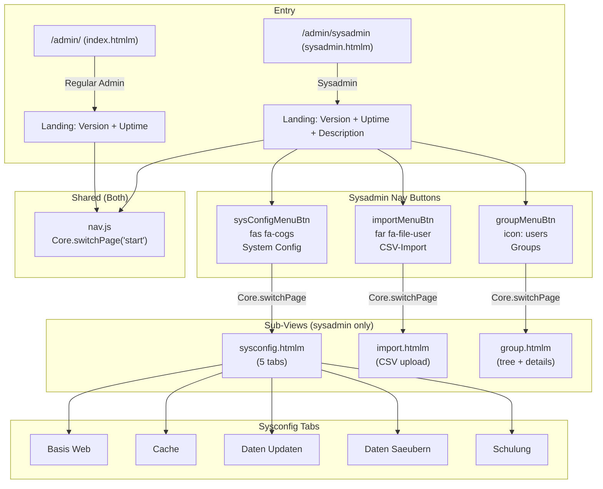

# Admin Landing Pages - UI Analysis

> **Source**: `videoclinic-prod/web/src/main/webapp/admin/`
> **Files analyzed**: `index.htmlm`, `sysadmin.htmlm`, `nav.js`, `changelog.htmlm`, `group.htmlm`, `sysconfig.htmlm`, `import.htmlm`, `messages.i18n.js`

---

## 1. Overview

The admin module has **two entry points** based on the user's role:

| Entry Point       | File              | Role            | Description                                    |
|--------------------|-------------------|-----------------|------------------------------------------------|
| Regular Admin      | `index.htmlm`     | ADMIN           | Minimal landing with version/uptime info only  |
| Sysadmin           | `sysadmin.htmlm`  | ADMIN (elevated) | Full landing with sub-views: Group, Import, Sysconfig |

Both pages share the same layout structure: a navbar, a jumbotron-style hero section with system info, and an offcanvas filter panel (appears to be a dev/demo scaffold).

---

## 2. Navigation Flow

---

## 3. Page: Regular Admin Landing (`index.htmlm`)

### 3.1 Header Metadata

| Field    | Method        | Parameters                                          |
|----------|---------------|-----------------------------------------------------|
| navBar   | template      | `../_include/navbar.mustache`                        |
| nav      | variable      | `{ filter: true, buttons: [{ spacer: true }] }`     |
| uptime   | serviceCall   | `InfoService.getUptime()`                            |

### 3.2 Form Elements (Display Only)

| Text-Reference              | Symbol | Datamodel | UI Element   | Options | Placeholder | Default | Required | Read-only | Condition |
|-----------------------------|--------|-----------|--------------|---------|-------------|---------|----------|-----------|-----------|
| `i18n.application.version`  | --     | --        | Static text  | --      | --          | --      | --       | Yes       | --        |
| `i18n.application.build`    | --     | --        | Static text  | --      | --          | --      | --       | Yes       | --        |
| `uptime`                    | --     | InfoService.getUptime | Static text | -- | -- | -- | -- | Yes | -- |

### 3.3 Offcanvas Filter Panel (Dev/Scaffold)

This filter panel appears identical on both pages and seems to be a development scaffold, not a production feature. It contains demo form controls:

| Name            | UI Element    | Options                                  | Placeholder  |
|-----------------|---------------|------------------------------------------|--------------|
| `data.lifetime` | Date input    | --                                       | --           |
| `data.start`    | Time input    | --                                       | --           |
| `data.ts`       | DateTime input| --                                       | --           |
| `data.company`  | Autocomplete  | --                                       | --           |
| `data.dd`       | Select        | `null: ---`, `true: Yes`, `false: This is a very long option` | -- |

### 3.4 Click Actions

| Action ID | Symbol | Title  | English            | Notes                    |
|-----------|--------|--------|--------------------|--------------------------|
| --        | --     | Reset  | Reset (HARDCODED)  | Offcanvas filter reset   |
| --        | --     | Apply  | Apply (HARDCODED)  | Offcanvas filter apply   |

---

## 4. Page: Sysadmin Landing (`sysadmin.htmlm`)

### 4.1 Header Metadata

| Field          | Method        | Parameters                                                       |
|----------------|---------------|------------------------------------------------------------------|
| navBar         | template      | `../_include/navbar.mustache`                                     |
| nav            | variable      | `{ filter: true, buttons: [sysConfigMenuBtn, spacer, importMenuBtn, groupMenuBtn] }` |
| group          | template      | `group.htmlm`                                                     |
| sysconfig      | template      | `sysconfig.htmlm`                                                 |
| import         | template      | `import.htmlm`                                                    |
| uptime         | serviceCall   | `InfoService.getUptime()`                                         |
| reminderStatus | serviceCall   | `AdminService.getReminderStatus()`                                |

### 4.2 Nav Buttons (Toolbar)

| Button ID          | Name (i18n key)            | Icon              | Target Page  |
|--------------------|----------------------------|--------------------|--------------|
| `sysConfigMenuBtn` | `administration.sysconfig` | `fas fa-cogs`      | `sysConfig`  |
| `importMenuBtn`    | CSV-Import (HARDCODED)     | `far fa-file-user`  | `import`     |
| `groupMenuBtn`     | `action.groups`            | `users`            | `group`      |

### 4.3 Landing Content (Display Only)

Same as regular admin plus two hardcoded description paragraphs (English):

| Text                                                                                       | Type          | Notes     |
|--------------------------------------------------------------------------------------------|---------------|-----------|
| "This area is for administrative purposes like user management and backup connection."      | Static `
`  | HARDCODED |
| "If you are unsure what to do please contact the support."                                  | Static `
`  | HARDCODED |

---

## 5. Sub-View: Group Management (`group.htmlm`)

### 5.1 Form Elements

| Text-Reference     | Symbol | Datamodel          | UI Element         | Options | Placeholder         | Default | Required | Read-only | Condition |
|--------------------|--------|--------------------|--------------------|---------|---------------------|---------|----------|-----------|-----------|
| `i18n.action.groups` | --   | --                 | Heading (h3)       | --      | --                  | --      | --       | Yes       | --        |
| --                 | --     | (tree data)        | jQuery tree widget | --      | --                  | --      | --       | --        | --        |
| `i18n.label.name`  | --     | `data.name`        | Text input         | --      | `{{i18n.label.name}}` | --    | Yes (class: mandatory) | No | -- |
| --                 | --     | `data.description` | Textarea           | --      | --                  | --      | No       | No        | --        |
| `i18n.group.right` | --     | (rights list)      | Multi-select       | Dynamic (rights list) | -- | --      | No       | No        | --        |

### 5.2 Click Actions

| Action ID       | Symbol              | Title            | English           | Notes                    |
|-----------------|---------------------|------------------|-------------------|--------------------------|
| `.deleteEntity` | btn-outline-secondary | `button.delete` | Delete            | Disabled by default      |
| `#saveGroup`    | btn-primary         | `button.save`    | Save              | Disabled by default      |

---

## 6. Sub-View: CSV Import (`import.htmlm`)

### 6.1 Form Elements

| Text-Reference | Symbol | Datamodel | UI Element  | Options | Placeholder | Default | Required | Read-only | Condition |
|----------------|--------|-----------|-------------|---------|-------------|---------|----------|-----------|-----------|
| --             | --     | file      | File input  | --      | --          | --      | Yes      | No        | --        |

### 6.2 Static Content (HARDCODED German)

| Text                                                                                          | Type       |
|-----------------------------------------------------------------------------------------------|------------|
| "CSV Datenimport"                                                                              | Card title |
| "Folgende Dokumente sind unterstuetzt: Personalliste... Kundenliste..."                        | Card body  |

### 6.3 Click Actions

None explicit -- file upload is handled by `import.js` on file selection.

---

## 7. Sub-View: System Config (`sysconfig.htmlm`)

This is the most complex sub-view, organized into 5 tabs.

### 7.1 Tabs Overview

| Tab ID              | Label (HARDCODED German) | English Equivalent     | Purpose                           |
|---------------------|--------------------------|------------------------|-----------------------------------|
| `tabBasisWeb`       | Basis Web                | Basis Web              | External system data sync         |
| `tabCache`          | Cache                    | Cache                  | Cache stats and management        |
| `tabDataUpdate`     | Daten Updaten            | Data Update            | Public holidays, sync, templates  |
| `tabDataCleanup`    | Daten Saeubern           | Data Cleanup           | Attachments, names, reminders     |
| `tabDataSchooling`  | Schulung                 | Training               | Move appointments for training    |

### 7.2 Tab: Basis Web - Form Elements

| Text-Reference | Symbol | Datamodel | UI Element | Placeholder | Default | Required | Read-only | Condition |
|----------------|--------|-----------|------------|-------------|---------|----------|-----------|-----------|
| --             | --     | --        | Text input | Jnummer     | --      | No       | No        | --        |
| --             | --     | --        | Text input | JVA         | --      | No       | No        | --        |
| --             | --     | --        | Text input | UID         | --      | No       | No        | --        |
| --             | --     | --        | Text input | pin         | --      | No       | No        | --        |
| --             | --     | --        | Text input | Behandlungs-Id | --  | No       | No        | --        |

### 7.2.1 Tab: Basis Web - Click Actions

| Action ID                    | Title (HARDCODED German)            | English Equivalent                  |
|------------------------------|-------------------------------------|-------------------------------------|
| `#updateBasisWeb`            | Basis Web Data laden                | Load Basis Web data                 |
| `#basisWebFetchAppointments` | Offene Anmeldungen laden            | Load open registrations             |
| `#basisWebSyncAppointments`  | Anmeldungsliste Angleichen          | Sync registration list              |
| `#basisWebFetchData`         | Notfallbogen laden                  | Load emergency form                 |
| `#basisWebDecryptData`       | Notfallbogen entschluesseln         | Decrypt emergency form              |
| `#basisWebGenerateResult`    | Behandlungs-Daten anzeigen (XML)    | Show treatment data (XML)           |

### 7.3 Tab: Cache - Form Elements

Cache statistics displayed in a table:

| Column    | Field (Datamodel)  | UI Element    |
|-----------|--------------------|---------------|
| Id        | `cache.id`         | Static text   |
| Size      | `cache.size`       | Static text   |
| TS        | `cache.ts`         | DateTime text |
| Hits      | `cache.hits`       | Static text   |
| Misses    | `cache.miss`       | Static text   |
| Resets    | `cache.resets`     | Static text   |
| DbChecks  | `cache.dbchecks`   | Static text   |

### 7.3.1 Tab: Cache - Click Actions

| Action ID        | Title (HARDCODED German)  | English Equivalent  |
|------------------|---------------------------|---------------------|
| `#verifyCaches`  | Caches Verifizieren       | Verify Caches       |
| `#clearCaches`   | Caches Leeren             | Clear Caches        |

### 7.4 Tab: Data Update - Form Elements

| Text-Reference | Datamodel          | UI Element    | Placeholder       | Default |
|----------------|--------------------|---------------|--------------------|---------|
| --             | --                 | Number input  | --                 | 2021    |
| --             | `data.idFormat`    | Text input    | Id Format          | --      |
| --             | `data.count`       | Number input  | Count              | --      |

### 7.4.1 Tab: Data Update - Click Actions

| Action ID                          | Title (HARDCODED German)        | English Equivalent               |
|------------------------------------|---------------------------------|----------------------------------|
| `#updatePublicHolidays`            | Feiertage laden                 | Load public holidays             |
| `#otoboSyncLocation`              | Orte mit Otobo Abgleichen       | Sync locations with Otobo        |
| `#updateCashRegister`              | Update Count/Format             | Update Count/Format (HARDCODED English) |
| `#loadMissingNotificationTemplates`| Fehlende Vorlagen laden         | Load missing templates           |
| `#readIncomingCdr`                 | Incoming CDR Daten laden        | Load incoming CDR data           |

### 7.5 Tab: Data Cleanup - Click Actions

| Action ID              | Title (HARDCODED German)               | English Equivalent                  |
|------------------------|----------------------------------------|-------------------------------------|
| `#checkAttachments`    | Attachment File Check                  | Attachment File Check (HARDCODED English) |
| `#clearFileCache`      | FileCache Leeren                       | Clear File Cache                    |
| `#fixDisplayName`      | Namen Anpassen                         | Fix Display Names                   |
| `#fixAppointmentTimes` | Termin Neu Berechnen                   | Recalculate Appointment Times       |
| `#triggerReminder`     | Termin-Erinnerung Manuell senden       | Manually Send Appointment Reminder  |

### 7.5.1 Tab: Data Cleanup - Form Elements

| Text-Reference | Datamodel | UI Element | Placeholder | Default | Notes |
|----------------|-----------|------------|-------------|---------|-------|
| --             | --        | Date input | --          | --      | Fix start date |
| --             | --        | Date input | --          | --      | Fix until date |
| `reminderStatus.lastRun` / `reminderStatus.lastStatus` | AdminService | Static text | -- | -- | Reminder status display |

### 7.6 Tab: Training (Schulung) - Form Elements

| Text-Reference | Datamodel | UI Element | Placeholder | Default | Notes |
|----------------|-----------|------------|-------------|---------|-------|
| --             | --        | Text input | --          | Comma-separated IDs | Appointment IDs to move |
| --             | --        | Date input | --          | --      | Target date |

### 7.6.1 Tab: Training - Click Actions

| Action ID           | Title (HARDCODED German)  | English Equivalent     |
|---------------------|---------------------------|------------------------|
| `#moveAppointments` | Termine Verschieben       | Move Appointments      |

---

## 8. Page: Changelog (`changelog.htmlm`)

### 8.1 Header Metadata

Empty metadata block (`[]`).

### 8.2 Content (HARDCODED)

| Text           | Type    | Notes            |
|----------------|---------|------------------|
| Changelog      | h1      | HARDCODED        |
| V1.0.0         | h2      | HARDCODED        |
| Initial Release| li      | HARDCODED        |

---

## 9. Navigation Configuration (`nav.js`)

The navigation script registers click handlers for toolbar buttons and uses `Core.switchPage()` to toggle between views.

| Handler              | Target Page  | Notes                               |
|----------------------|-------------|--------------------------------------|
| `Core.switchPage("start")` | start | Default page on load                 |
| `#groupMenuBtn`      | group       | Sysadmin only (button not in index)  |
| `#importMenuBtn`     | import      | Sysadmin only                        |
| `#userMenuBtn`       | user        | Registered but no button in either page header |
| `#sysConfigMenuBtn`  | sysConfig   | Sysadmin only                        |

> **Note**: `#userMenuBtn` is registered in `nav.js` but no corresponding button is defined in either `index.htmlm` or `sysadmin.htmlm` header metadata. The user management view is likely accessed via the shared navbar (`navbar.mustache`).

---

## 10. Permissions Table

| Permission/Condition     | Scope            | Description                                                    |
|--------------------------|------------------|----------------------------------------------------------------|
| Admin role               | Page-level       | `index.htmlm` is served to regular admin users                 |
| Sysadmin role (elevated) | Page-level       | `sysadmin.htmlm` is served to sysadmin users; includes group, import, sysconfig sub-views |
| No template-level gating | Sub-view         | All sub-views in sysadmin are unconditionally included (no `{{#condition}}` blocks) |

---

## 11. Translation Table

| Text-Reference                | German (source)                                  | English                          | Notes         |
|-------------------------------|--------------------------------------------------|----------------------------------|---------------|
| `i18n.application.version`    | (dynamic)                                        | (dynamic)                        | Version number|
| `i18n.application.build`      | (dynamic)                                        | (dynamic)                        | Build number  |
| `i18n.administration.sysconfig`| Systemkonfiguration                             | System Config                    | i18n key      |
| `i18n.action.groups`          | Gruppen                                          | Groups                           | i18n key      |
| `i18n.label.name`             | Name                                             | Name                             | i18n key      |
| `i18n.group.right`            | Berechtigung                                     | Right/Permission                 | i18n key      |
| `i18n.button.delete`          | Loeschen                                         | Delete                           | i18n key      |
| `i18n.button.save`            | Speichern                                        | Save                             | i18n key      |
| "Administration"              | Administration                                   | Administration                   | HARDCODED     |
| "Details"                     | Details                                          | Details                          | HARDCODED     |
| "Filter"                      | Filter                                           | Filter                           | HARDCODED     |
| "CSV-Import"                  | CSV-Import                                       | CSV-Import                       | HARDCODED     |
| "CSV Datenimport"             | CSV Datenimport                                  | CSV Data Import                  | HARDCODED     |
| "Basis Web"                   | Basis Web                                        | Basis Web                        | HARDCODED     |
| "Cache"                       | Cache                                            | Cache                            | HARDCODED     |
| "Daten Updaten"               | Daten Updaten                                    | Data Update                      | HARDCODED     |
| "Daten Saeubern"              | Daten Saeubern                                   | Data Cleanup                     | HARDCODED     |
| "Schulung"                    | Schulung                                         | Training                         | HARDCODED     |
| "Changelog"                   | Changelog                                        | Changelog                        | HARDCODED     |
| "Reset"                       | Reset                                            | Reset                            | HARDCODED     |
| "Apply"                       | Apply                                            | Apply                            | HARDCODED     |
| Various sysconfig button labels | (see sections 7.2-7.6)                          | (see sections 7.2-7.6)          | HARDCODED German |

---

## 12. Service Calls

| Service         | Method              | Used In          | Returns              |
|-----------------|---------------------|------------------|----------------------|
| `InfoService`   | `getUptime`         | Both pages       | Uptime string        |
| `AdminService`  | `getReminderStatus` | Sysadmin only    | `{ lastRun, lastStatus }` |

---

## Cross-References

### Source Includes

| Type | Direction | Detail | Linked Document | Condition / Context |
|------|-----------|--------|-----------------|---------------------|
| include | **Parent** | `sysadmin.htmlm` (parent shell) | [sysconfig-import.md](./sysconfig-import.md) | Sysconfig, Import, Group are sub-views toggled via `sysConfigMenuBtn`, `importMenuBtn`, `groupMenuBtn` |
| include | **Split to** | `sysconfig.htmlm` + `sysconfig.js` | [sysconfig-import.md](./sysconfig-import.md) | System configuration tabs (5 tabs) extracted to sibling file |
| include | **Split to** | `import.htmlm` + `import.js` | [sysconfig-import.md](./sysconfig-import.md) | CSV import view extracted to sibling file |
| include | **Split to** | `group.htmlm` + `group.js` | [sysconfig-import.md](./sysconfig-import.md) | Group management extracted to sibling file |
| include | **Sibling** | jQuery tree widget | [sysconfig-import.md](./sysconfig-import.md) | `jquery.tree.js` loaded from parent `sysadmin.htmlm` |

### Service Calls

| Service | Method | Parameters | Context |
|---------|--------|------------|---------|
| `InfoService` | `getUptime` | `[]` | Uptime display on both admin and sysadmin landing pages |
| `AdminService` | `getReminderStatus` | `[]` | Reminder status display on sysadmin landing page (Tab 4 of sysconfig) |

### Event Flows

| Type | Direction | Event | Linked Document | Condition |
|------|-----------|-------|-----------------|----------|
| event | **Parent→Child** | `sysConfigMenuBtn` click → `Core.switchPage('sysConfig')` | [sysconfig-import.md](./sysconfig-import.md) | Shows sysconfig sub-view (sysadmin only) |
| event | **Parent→Child** | `importMenuBtn` click → `Core.switchPage('import')` | [sysconfig-import.md](./sysconfig-import.md) | Shows CSV import sub-view (sysadmin only) |
| event | **Parent→Child** | `groupMenuBtn` click → `Core.switchPage('group')` | [sysconfig-import.md](./sysconfig-import.md) | Shows group management sub-view (sysadmin only) |
| event | **Nav→Page** | `#userMenuBtn` click → `Core.switchPage('user')` | — | Registered in nav.js but no button in index.htmlm or sysadmin.htmlm header |

### Key Observations for Rebuild

1. **Role-based page split**: The two landing pages should become a single route with conditional rendering based on the user's role (admin vs sysadmin). Sysadmin features should be permission-gated in the UI.

2. **Sub-views as navigation targets**: `group`, `import`, and `sysConfig` use `Core.switchPage()` to show/hide divs. In the rebuild, these should be separate routes or drawer-based panels.

3. **Sysconfig is domain-specific tooling**: The sysconfig tabs contain highly specialized operational tools (BasisWeb sync, cache management, CDR loading, etc.). These are sysadmin-only maintenance operations and should be evaluated for which ones carry over to the new system.

4. **Heavy hardcoded German content**: The sysconfig sub-view has almost no i18n -- nearly all labels and descriptions are hardcoded in German. The rebuild must extract all strings to translation files.

5. **Offcanvas filter is scaffolding**: The filter panel on both pages appears to be a developer scaffold/demo, not a production feature. It should not be carried forward.

6. **Group management uses jQuery tree**: The tree widget for group hierarchy needs a modern replacement (e.g., a recursive tree component or nested list).

7. **CSV import is minimal**: Just a file input with status display. Straightforward to rebuild as a drag-and-drop upload component.

8. **Changelog is static**: A simple static page that could be auto-generated from git history or a CMS in the rebuild.
