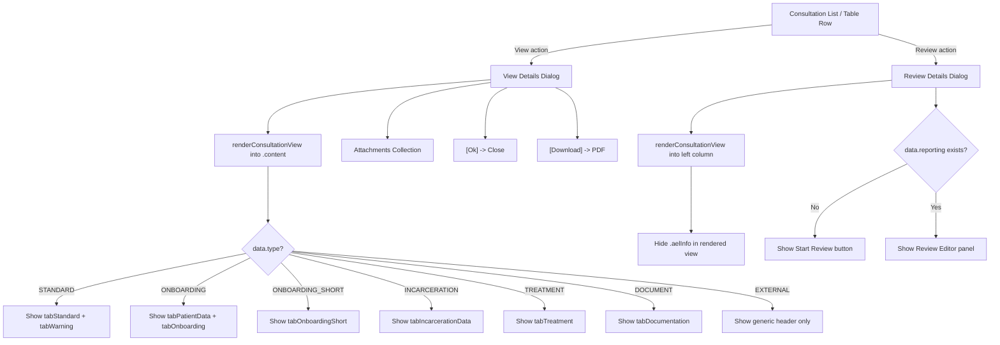
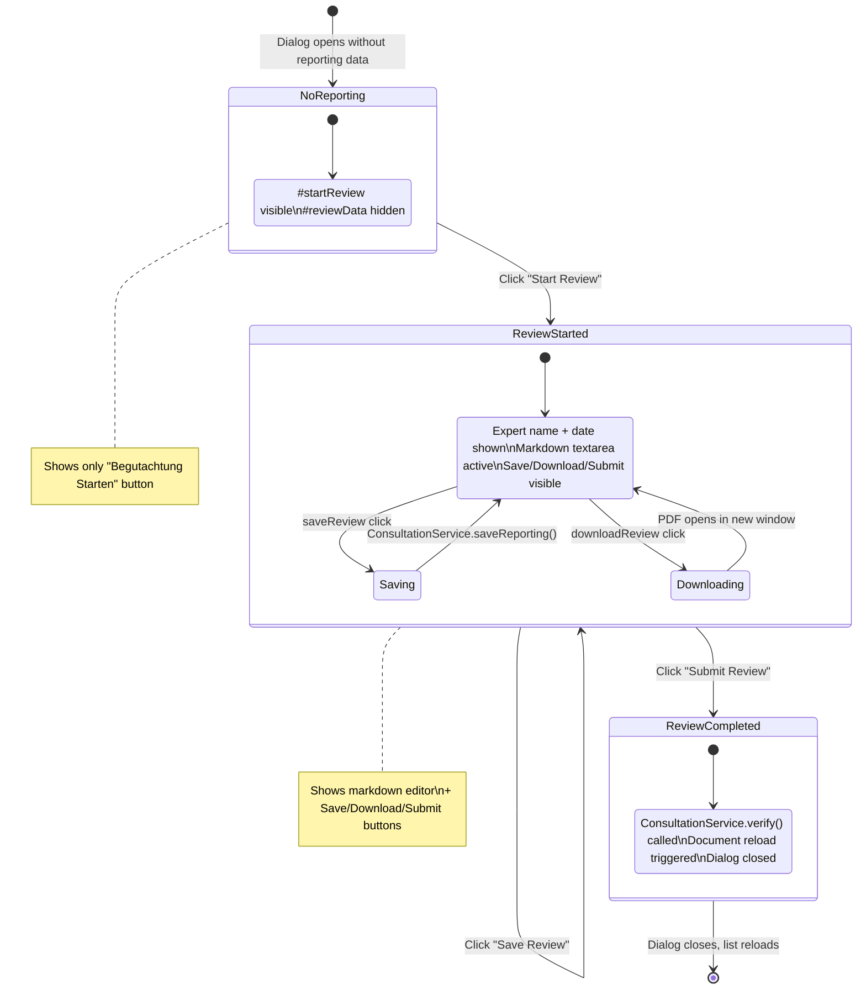
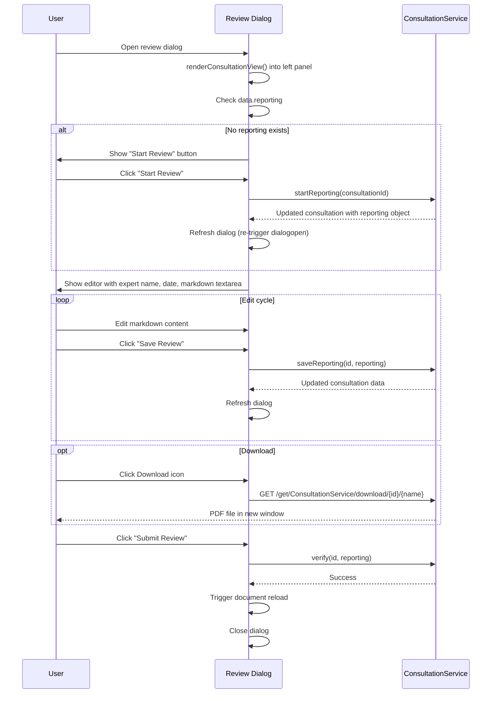

# 07 - Consultation View (Read-only) & Review Dialog

## Source Files

| File | Lines | Purpose |
|---|---|---|
| `consultation/view.mustache` | 777 | Main read-only template (Mustache/Handlebars) rendering consultation data |
| `consultation/view.i18n.js` | 444 | View-specific i18n keys, enum formatters, and `renderConsultationView()` |
| `consultation/viewDetails.html` | 52 | View Details dialog wrapper with attachments collection and buttons |
| `consultation/viewDetails.js` | 15 | View Details JS: dialog open handler, download, close |
| `consultation/reviewDetails.html` | 39 | Review dialog: two-column layout with markdown editor |
| `consultation/reviewDetails.js` | 67 | Review dialog JS: start/save/submit review workflow |
| `consultation/details.js` | ~750 | Shared utilities (download name generation, tab toggling, save, finalize) |

---

## Block 1: View Details Dialog (`consultationDetailsViewDlg`)

### Dialog Configuration

| Attribute | Value |
|---|---|
| `id` | `consultationDetailsViewDlg` |
| `data-overlay` | `#main` (renders as overlay on top of main content) |
| `data-width` | `1500` |
| `data-icon` | `fa fa-heartbeat` |
| `data-color` | `bg-color-consultation` |
| `data-crudbuttons` | `false` (no standard CRUD buttons) |
| `title` | `{{i18n.consultation}}` |

### Structure

```
consultationDetailsViewDlg
+-- .content.container-fluid          // Rendered by view.mustache via renderConsultationView()
+-- .row
|   +-- .col-md-2
|       +-- table#consultationFiles   // Attachments collection
+-- .buttonset
    +-- [Ok] button
    +-- [Download] button
```

### Attachments Collection

| Attribute | Value |
|---|---|
| Container | `table#consultationFiles` |
| Header | `{{i18n.consultation.attachments}}` |
| `tbody.collection` | `data-field="data.attachments"` (repeater pattern) |
| Link template | `class="templatefield" data-attr="href" data-template="/get/ConsultationService/attachment/[[data.id]]/[[cur.file.id]]"` |
| Display field | `attachments.file.name` |

### Buttons

| Button | CSS Class | `data-event` | Action |
|---|---|---|---|
| Ok | `btn btn-primary default` | `ok` | Closes the dialog |
| Download | `btn btn-secondary default data` | `downloadConsultation` | Opens PDF download: `/get/ConsultationService/download/{id}/{generatedName}` |

### Dialog Open Behavior (`viewDetails.js`)

1. On `dialogopen` event: reads data via `jsForm("getData")`, calls `renderConsultationView(data, $target)` to populate `.content`
2. Download event opens a new window with generated PDF name from `ConsultationDetails.generateDownloadName(data)`
3. Ok event closes the dialog

---

## Block 2: Review Details Dialog (`consultationDetailsReviewDlg`)

### Dialog Configuration

| Attribute | Value |
|---|---|
| `id` | `consultationDetailsReviewDlg` |
| `data-overlay` | `#main` |
| `data-width` | `1500` |
| `data-icon` | `fa fa-heartbeat` |
| `data-color` | `bg-color-consultation` |
| `title` | `{{i18n.consultation}}` |

### Layout Structure

```
consultationDetailsReviewDlg
+-- .row
    +-- .col-md-9 #consultationDetailsReviewRender   // Read-only consultation view
    +-- .col-md-3                                      // Review sidebar
        +-- h6 "{{i18n.consultation.review}}"
        +-- #startReview button                        // HARDCODED: "Begutachtung Starten"
        +-- #reviewData
            +-- field: data.reporting.expert.displayName
            +-- field: data.reporting.dateReportEnd
            +-- textarea (markdown editor, mandatory)
            +-- #saveReview button                     // HARDCODED: "Begutachtung Speichern"
            +-- #downloadReview button                 // Icon only: fa-download
            +-- #submitReview button                   // HARDCODED: "Begutachtung abschließen"
```

### Form Elements (Editable Fields)

| # | Field | Element | `name` / binding | Attributes | Notes |
|---|---|---|---|---|---|
| F1 | Report Documentation | `<textarea>` | `data.reporting.reportDocumentation` | `class="form-control markdownedit mandatory"`, `style="height:calc(70vh)"` | Markdown editor; mandatory validation; main editable field in review |

### Read-only Display Fields (Review Sidebar)

| # | Field | Binding | Format |
|---|---|---|---|
| D1 | Expert Name | `data.reporting.expert.displayName` | Text |
| D2 | Report End Date | `data.reporting.dateReportEnd` | Date |

### Buttons

| Button | ID | CSS Class | Label | Action |
|---|---|---|---|---|
| Start Review | `#startReview` | `btn btn-primary` | **HARDCODED DE**: "Begutachtung Starten" | Calls `ConsultationService.startReporting(id)`, refreshes dialog |
| Save Review | `#saveReview` | `btn btn-secondary` | **HARDCODED DE**: "Begutachtung Speichern" | Calls `ConsultationService.saveReporting(id, reporting)`, refreshes dialog |
| Download | `#downloadReview` | `btn btn-secondary` | Icon: `fa-download` | Opens PDF download URL |
| Submit Review | `#submitReview` | `btn btn-primary` | **HARDCODED DE**: "Begutachtung abschliessen" | Calls `ConsultationService.verify(id, reporting)`, triggers reload, closes dialog |

### Dialog Open Behavior (`reviewDetails.js`)

1. On `dialogopen`: reads data, hides `.jsfValue` elements, calls `renderConsultationView()` into left column
2. Hides `.aelInfo` section after rendering (expert review info in the view template)
3. Conditional display logic:
   - If `data.reporting` exists: show `#reviewData` (editing mode)
   - If `data.reporting` is null/undefined: show `#startReview` button (initiation mode)
4. On `dialogOpen` (capitalized O variant): opens dialog with data and auto-save callback on close

### Review Workflow State Machine

- **No reporting data** -> Show "Start Review" button only
- **After startReporting()** -> Reporting object created server-side, dialog refreshes, shows editor + save/download/submit buttons
- **Save** -> Persists current markdown content, refreshes dialog (stays open)
- **Submit** -> Finalizes review (verify), triggers page reload, closes dialog

---

## Block 3: View Template (`view.mustache`)

The template is rendered into the `.content` container of either dialog by `renderConsultationView()`. It contains multiple sections that are conditionally shown/hidden based on `data.type`.

### Section Visibility by Consultation Type

| `data.type` | Sections Shown |
|---|---|
| `STANDARD` | `.tabStandard` + `.tabWarning` |
| `ONBOARDING` | `.tabPatientData` + `.tabOnboarding` |
| `ONBOARDING_SHORT` | `.tabOnboardingShort` |
| `INCARCERATION` | `.tabIncarcerationData` |
| `TREATMENT` | `.tabTreatment` |
| `DOCUMENT` | `.tabDocumentation` |
| `EXTERNAL` | *(none -- generic header only)* |

All sections are rendered in the HTML but hidden by default; the JS in `renderConsultationView()` shows only the relevant sections.

### Section: Generic Header (Always Visible)

| # | Field | Binding | Display | Column |
|---|---|---|---|---|
| D1 | Book Number | `{{bookNumber}}` | Bold, with `fa-user-injured` icon | col-md-4 |
| D2 | Birthday | `{{date body.birthday}}` | Formatted date, with `fa-birthday-cake` icon | col-md-4 |
| D3 | Age | `{{body.age}}` | Suffixed with **HARDCODED DE** "Jahre" | col-md-4 |
| D4 | Customer/Location | `{{customer.name}} / {{{location.externalDescription}}}` | With `fa-hospital-user` icon | col-md-4 |
| D5 | JVA Location | `{{{location.name}}}` | Header "JVA" (**HARDCODED DE**), `fa-clinic-medical` icon | col-md-4 |
| D6 | Job Title & Type | `{{job.title}} {{itype}}` | itype in bold | col-md-3 |
| D7 | Date | `{{date date}}` | With `fa-calendar-day` icon | col-md-3 |
| D8 | Time Range | `{{start}} {{end}}` | Start/end times | col-md-3 |
| D9 | Contact | `{{base.contact}}` | With `fa-phone-plus` icon | col-md-3 |
| D10 | Doctor | `{{doctor.displayName}}` | With `fa-user-md` icon | col-md-2 |
| D11 | Communication Type | `{{base.communicationType}}` | Prefixed with **HARDCODED DE** "Verbindungsart:" | col-md-2 |
| D12 | Expert Review (conditional) | `{{expert.displayName}} - {{date dateReportEnd}}` | Only shown if `{{#reporting}}` exists; class `aelInfo`; header **HARDCODED DE** "AL Begutachtung" | col-md-3 |
| D13 | Report Documentation | `{{{reportDocumentationRendered}}}` | Markdown rendered to HTML | col-md-3 |

### Section: Patient Data (`tabPatientData`) - Shown for ONBOARDING

| # | Field | Binding | Notes |
|---|---|---|---|
| D14 | Medical Trained Personnel | `{{#base.medicalTrainedPersonel}}` | Conditional; checkbox-like display with `fa-check` icon; **HARDCODED DE** "vorhanden" |

#### Basis-web Sub-section (`.basiswebonly`)

**Medication Table** (header **HARDCODED DE**: "Medikation")

| Column | Binding |
|---|---|
| Date + Type + Active ingredient | `{{date date}}`, `{{type}}`, `{{active}}` |
| Entry + Content + Note | `{{entry}}`, `{{content}}`, `{{note}}` |
| Extra | `{{extra}}` |
| Valid Until (header **HARDCODED DE**: "Gultig bis") | `{{date until}}` |

Repeater: `{{#history.medication}}...{{/history.medication}}`

**Patient History Table** (header **HARDCODED DE**: "Patientengeschichte")

| Column | Binding |
|---|---|
| Date + Type + Active | `{{date date}}`, `{{type}}`, `{{active}}` |
| Entry + Content + Note | `{{entry}}`, `{{content}}`, `{{note}}` |
| Extra + Until | `{{extra}}`, `{{date until}}` |

Repeater: `{{#history.history}}...{{/history.history}}`

### Section: Comment (Always Visible)

| # | Field | Binding |
|---|---|---|
| D15 | Comment | `{{comment}}` | Label: `{{i18n.consultation_comment}}` |

### Section: Treatment (`tabTreatment`) - Shown for TREATMENT type

#### Anamnesis Sub-section

| # | Field | Binding | i18n Key |
|---|---|---|---|
| D16 | Social Anamnesis | `{{treatment.anamnesisSocial}}` | `Treatment.anamnesisSocial` |
| D17 | Education/Job Anamnesis | `{{treatment.anamnesisEducationJob}}` | `Treatment.anamnesisEducationJob` |
| D18 | Family Anamnesis | `{{treatment.anamnesisFamily}}` | `Treatment.anamnesisFamily` |
| D19 | Self Anamnesis | `{{treatment.anamnesisSelf}}` | `Treatment.anamnesisSelf` |
| D20 | Specific Disease Development | `{{treatment.specificDiseaseDevelopment}}` | `Treatment.specificDiseaseDevelopment` |
| D21 | Vegetative Anamnesis | `{{treatment.anamnesisVegetative}}` | `Treatment.anamnesisVegetative` |
| D22 | Substance Anamnesis | `{{treatment.anamnesisSubstance}}` | `Treatment.anamnesisSubstance` |
| D23 | Delinquency Anamnesis | `{{treatment.anamnesisDelinquency}}` | `Treatment.anamnesisDelinquency` |

#### Psych Diagnostic Sub-section

| # | Field | Binding | i18n Key |
|---|---|---|---|
| D24 | Psych Diagnostic Report | `{{treatment.reportPsychDiagnostic}}` | `Treatment.reportPsychDiagnostic` |
| D25 | Psychopathological Admission | `{{treatment.reportsPsychopathologicalAdmission}}` | `Treatment.reportsPsychopathologicalAdmission` |

#### Medical Admission Sub-section

| # | Field | Binding | i18n Key |
|---|---|---|---|
| D26 | Medical Admission Telepsychotherapy | `{{treatment.medicalAdmissiontelepsychotherapy}}` | `consultation.treatment.medicalAdmissiontelepsychotherapy` |

#### Treatment History (Repeater)

Repeater: `{{#treatment.history}}...{{/treatment.history}}`

| Field | Binding | Notes |
|---|---|---|
| Date | `{{date date}}` | Bold |
| Content | `{{{content}}}` | Triple-braces (HTML content) |

Separated by `<hr/>` elements.

#### Further Treatment Sub-section

| # | Field | Binding | i18n Key |
|---|---|---|---|
| D27 | Further Treatment Recommendations | `{{treatment.furtherTreatmentRecommendations}}` | `Treatment.furtherTreatmentRecommendations` |
| D28 | Further Goals | `{{treatment.furtherGoals}}` | `Treatment.furtherGoals` |

### Section: Onboarding (`tabOnboarding`) - Full Onboarding

#### Personal / Medical Info

| # | Field | Binding | i18n Key |
|---|---|---|---|
| D29 | Family Info | `{{standardHelper.anamnesisFamily}}` | `OnboardingData.familyInfo` |
| D30 | Previous Physician | `{{onboarding.previousPhysician}}` + `{{standard.anamnesisobj.PRETREATMENT}}` | `OnboardingData.previousPhysician` |
| D31 | Body Height | `{{body.bodyHeight}}` | **HARDCODED DE** "Korperlicher Befund:" label; `fa-ruler-vertical` icon; suffix "cm" |
| D32 | Body Weight | `{{body.bodyWeight}}` | `fa-weight` icon; suffix "kg" |
| D33 | State Info | `{{onboarding.stateInfo}}` | -- |
| D34 | General State | `{{onboarding.generalState}}` | `OnboardingData.generalState` |
| D35 | Weight State | `{{onboarding.weightState}}` | `OnboardingData.weightState` |
| D36 | Preexisting State | `{{onboarding.preexistingState}}` + `{{onboarding.preexistingCondition}}` | `OnboardingData.preexistingState` |
| D37 | Allergies | `{{onboarding.allergies}}` | `OnboardingData.allergies` |
| D38 | Current State | `{{onboarding.currentState}}` + `{{standard.anamnesisobj.OWN}}` | `OnboardingData.currentState` |

#### Infectious Diseases

| # | Field | Binding | i18n Key |
|---|---|---|---|
| D39 | Hepatitis | `{{onboarding.hepatitis}}` | `OnboardingData.hepatitis` |
| D40 | Lung Tuberculosis | `{{onboarding.lungTuberculosis}}` | `OnboardingData.lungTuberculosis` |
| D41 | STD | `{{onboarding.std}}` | `OnboardingData.std` |
| D42 | HIV | `{{onboarding.hiv}}` | `OnboardingData.hiv` |
| D43 | Transmittal Info | `{{onboarding.transmittalInfo}}` | -- |

#### Body Systems

| # | Field | Binding | i18n Key |
|---|---|---|---|
| D44 | Skin Condition | `{{onboarding.skinCondition}}` | `OnboardingData.skinCondition` |
| D45 | Sense Condition | `{{onboarding.senseCondition}}` | `OnboardingData.senseCondition` |
| D46 | Eye Condition | `{{onboarding.eyeCondition}}` | `OnboardingData.eyeCondition` |
| D47 | Ear Condition | `{{onboarding.earCondition}}` | `OnboardingData.earCondition` |
| D48 | Alcohol Usage | `{{onboarding.alcoholUsage}}` | `OnboardingData.alcoholUsage` |
| D49 | Tobacco Usage | `{{onboarding.tabaccoUsage}}` | `OnboardingData.tabaccoUsage` |
| D50 | Drug Usage | `{{onboarding.drugUsage}}` | `OnboardingData.drugUsage` |
| D51 | Prescriptions | `{{onboarding.prescriptions}}` | `OnboardingData.prescriptions` |
| D52 | Additional Prescription | `{{onboarding.additionalPrescription}}` | `OnboardingData.additionalPrescription` |
| D53 | Heart Condition | `{{onboarding.heartCondition}}` | `OnboardingData.heartCondition` |
| D54 | Lung Condition | `{{onboarding.lungCondition}}` | `OnboardingData.lungCondition` |
| D55 | RR | `{{body.rr}}` | `OnboardingData.rr` |
| D56 | Pulse | `{{body.pulse}}` | `OnboardingData.pulse` |
| D57 | Abdomen Condition | `{{onboarding.abdomenCondition}}` | `OnboardingData.abdomenCondition` |
| D58 | Kidney Condition | `{{onboarding.kidneyCondition}}` | `OnboardingData.kidneyCondition` |
| D59 | Extremities | `{{onboarding.extremitiesCondition}}` | `OnboardingData.extremitiesCondition` |
| D60 | CNS Condition | `{{onboarding.centralNerveSystemCondition}}` | `OnboardingData.centralNerveSystemCondition` |
| D61 | Psychological Condition | `{{onboarding.psychologicalCondition}}` | `OnboardingData.psychologicalCondition` |
| D62 | Other Conditions | `{{onboarding.otherConditions}}` | `OnboardingData.otherConditions` |

#### Assessment Section (header **HARDCODED DE**: "Beurteilung")

| # | Field | Binding | i18n Key | Formatter |
|---|---|---|---|---|
| D63 | Incarceration Suitability | `{{onboarding.incarcerationSuitability}}` | `OnboardingData.incarcerationSuitability` | `YesNo` |
| D64 | Single Room Suitability | `{{onboarding.singleRoomSuitability}}` | `OnboardingData.singleRoomSuitability` | `YesNo` |
| D65 | Work Suitability | `{{onboarding.workSuitability}}` | `OnboardingData.workSuitability` | `suitabilityFormatter` |
| D66 | Outdoor Work Suitability | `{{onboarding.outDoorWorkSuitability}}` | `OnboardingData.outDoorWorkSuitability` | `YesNo` |
| D67 | Sport Suitability | `{{onboarding.sportSuitability}}` | `OnboardingData.sportSuitability` | `suitabilityFormatter` |
| D68 | Require Treatment | `{{onboarding.requireTreatment}}` + `{{onboarding.treatmentInfo}}` | `OnboardingData.requireTreatment` | `YesNo` |
| D69 | Suicidal | `{{onboarding.suicidal}}` | `OnboardingData.suicidal` | `YesNo` |
| D70 | Dangerous | `{{onboarding.dangerous}}` + `{{onboarding.suitabilityInfo}}` | `OnboardingData.dangerous` | `YesNo` |

### Section: Onboarding Short (`tabOnboardingShort`)

Simplified version showing only: General State, Weight State, Assessment fields (same as above), Require Treatment (conditional), Suicidal (conditional), Suitability Info (conditional).

### Section: Incarceration (`tabIncarcerationData`)

Header **HARDCODED DE**: "Gewahrsamkeitstauglichkeit Arztliche Untersuchung"

#### Consumption Sub-section (label **HARDCODED DE**: "Konsum")

| # | Field | Binding | Condition | i18n Key |
|---|---|---|---|---|
| D71 | Date Retrieved | `{{date dateRetrieved}}` | -- | `consultation.incarceration.lastDateRetrived` |
| D72 | Consumed Alcohol | -- | `{{#incarceration.consumedAlcohol}}` | `OnboardingData.alcoholUsage` |
| D73 | Consumed Medication | -- | `{{#incarceration.consumedMedication}}` | `consultation.incarceration.medication` |
| D74 | Last Consumption Time | `{{date incarceration.consumedLastTime}}` | -- | `consultation.incarceration.lastTime` |
| D75 | Last Consumption Amount | `{{incarceration.consumedLastTimeAmount}}` | -- | `consultation.incarceration.amount` |
| D76 | General Condition Noticeable | -- | `{{#incarceration.generalConditionNoticeable}}` | `consultation.incarceration.generalStateNoticeable` |
| D77 | Intox | `{{incarceration.intox}}` | -- | `consultation.incarceration.intox` |
| D78 | Known Allergies | -- | `{{#incarceration.knownAllergiesIntolerances}}` | `consultation.incarceration.knownAllergies` |
| D79 | Known Addiction | `{{incarceration.knownAddictionDisorderDescription}}` | `{{#incarceration.knownAddictionDisorder}}` | `consultation.incarceration.knownAddiction` |
| D80 | Abnormal Pupils | `{{incarceration.abnormalPupilsDescription}}` | `{{#incarceration.incarceration.abnormalPupils}}` | `consultation.incarceration.abnormalityPupils` |

#### Intoxication Assessment Sub-section (label **HARDCODED DE**: "Einschatzung der Intoxikation")

| # | Field | Binding | i18n Key |
|---|---|---|---|
| D81 | Intoxication Level | `{{incarceration.intoxication}}` | `consultation.incarceration.intoxication` |
| D82 | Intoxication Description | `{{incarceration.intoxicationDescription}}` | `consultation.incarceration.intoxication.stageDescription` |
| D83 | Intoxication Comment | `{{incarceration.intoxicationComment}}` | `consultation.incarceration.intoxication.Comment` |
| D84 | Reflex Behavior | -- (conditional) | `consultation.incarceration.intoxication.reflexBehaviorNoticeable` |
| D85 | Abnormal Head/Neck | -- (conditional) | `consultation.incarceration.abnormalityHeadNeck` |
| D86 | Abnormal Chest Organs | -- (conditional) | `consultation.incarceration.intoxication.abnormalChestOrgans` |
| D87 | Abnormal Limbs/Joints | -- (conditional) | `consultation.incarceration.intoxication.abnormalLimbsJoints` |
| D88 | Abnormal Heart | -- (conditional) | `consultation.incarceration.intoxication.abnormalHeartAuscultatory` |
| D89 | Abnormal Circulation | -- (conditional) | `consultation.incarceration.intoxication.abnormalCirculation` |
| D90 | Pulse Frequency | `{{incarceration.pulseFrequency}}` | `consultation.incarceration.intoxication.pulseFrequency`; suffix "/Min" |
| D91 | Blood Pressure | `{{incarceration.bloodPressure}}` | `consultation.incarceration.intoxication.bloodPressure`; suffix "/Min" |
| D92 | Tachycard | -- (conditional) | `consultation.incarceration.intoxication.tachykard` |
| D93 | Bradycard | -- (conditional) | `consultation.incarceration.intoxication.bradycard` |
| D94 | Skin Color | `{{incarceration.skinColor}}` | `consultation.incarceration.intoxication.skinColor` |
| D95 | Respiratory Tract | `{{incarceration.respiratoryTract}}` | `consultation.incarceration.intoxication.respiratoryTract` |
| D96 | Respiratory Frequency | `{{incarceration.respiratoryFrequency}}` | `consultation.incarceration.intoxication.respiratoryFrequency` |
| D97 | Body Temperature | `{{incarceration.bodyTemperature}}` | `consultation.incarceration.intoxication.bodyTemperature`; suffix "C" |
| D98 | Saturation | `{{incarceration.saturation}}` | `consultation.incarceration.intoxication.saturation`; suffix "%" |
| D99 | Signs of Suicidality at Exam | -- (conditional) | `consultation.incarceration.doctorExamination` |
| D100 | Suicidality Description | `{{incarceration.signsOfSuicidalityDescription}}` | `consultation.incarceration.intoxication.signsOfSuicidality` |
| D101 | Body Check Comment | `{{incarceration.bodyCheckComment}}` | `consultation.incarceration.bodyCheck` |

### Section: Standard Examination (`tabStandard`)

#### Medication Anamnesis

| # | Field | Binding | i18n Key |
|---|---|---|---|
| D102 | Medication Documentation | `{{standard.medicationAnamnesis.documentation}}` | `AnamnesisType.MEDICATION` |

Conditional category flags (rendered as `<li>` list items when truthy):

| Flag | i18n Key (DE) |
|---|---|
| `categoryL04` | Immunsuppressiva |
| `categoryL01` | Krebsmedikamente |
| `categoryS01` | Augenmedikamente |
| `categoryA10` | Diabetesmedikamente |
| `categoryB01` | Mittel zur Hemmung der Blutgerinnung |
| `categoryJ05` | Antiviralia |
| `categoryN06` | Psychoanaleptika |
| `categoryC09` | Blutdruckmittel RAAS |
| `categoryC10` | Lipidsenker |
| `categoryN02` | Schmerzmittel |
| `categoryN05` | Psycholeptika |
| `categoryR03` | Atemwegserweiternde Mittel |
| `categoryA02` | Magensaureblocker |
| `categoryL02` | Endokrine Therapie |
| `categoryA12` | Mineralstoffe |

#### Anamnesis (Repeater)

Repeater: `{{#standard.anamnesis}}...{{/standard.anamnesis}}`

Uses `AnamnesisTypeFormatter` Handlebars helper to format `type`. Displays `documentation` text.

#### Patient Report (Repeater)

Repeater: `{{#standard.patientReport}}...{{/standard.patientReport}}`

Uses `PatientReportType` Handlebars helper to format `type`. Displays `documentation` text.

#### Further Treatment

| # | Field | Binding | i18n Key |
|---|---|---|---|
| D103 | Further Treatment | `{{base.furtherTreatment}}` | `consultation.furtherTreatment` |
| D104 | Further Treatment Date | `{{date base.dateFurtherTreatment}}` | -- |

#### Diagnosis (Repeater)

Repeater: `{{#standard.diagnosis}}...{{/standard.diagnosis}}`

| Field | Binding | Notes |
|---|---|---|
| Localization / Level | `{{localization}} / {{level}}` | Displayed as badge-like right-aligned |
| Title | `{{title}}` | Bold |
| ICD-10 Name | `{{icd10.name}}` | -- |
| ICD-10 Text | `{{{icd10.text}}}` | Markdown-rendered HTML |
| ICD-10 Inclusion | `{{{icd10.inclusion}}}` | Markdown-rendered HTML |
| ICD-10 Exclusion | `{{{icd10.exclusion}}}` | Markdown-rendered HTML |
| Diagnosis Comment | `{{diagnosis.comment}}` | -- |

Each diagnosis is wrapped in `.shadow.rounded.icd10renderCollection`.

#### Prescription (Repeater)

Repeater: `{{#standard.prescription}}...{{/standard.prescription}}`

| Field | Binding | Notes |
|---|---|---|
| Product Name | `{{product.name}}` | -- |
| Medication Name | `{{medication.name}}` | Bold |
| Medication Code | `{{medication.code}}` | -- |
| Start/End Date | `{{date start}}` / `{{date end}}` | Calendar icon |
| Initial Dosage Given | `{{#initialDosageGiven}}` | Conditional |
| Type | `{{type}}` | Formatted via `PrescriptionType_*` i18n |
| Comment | `{{comment}}` | -- |

**Dosage Display (conditional by type)**:
- `STANDARD`: Shows `dosageRequirement` and `dosageAmount`
- `LIMITED`: Shows 4-column table: Morning / Noon / Evening / Night with values `morning`, `lunch`, `evening`, `night`

#### Procedure Report

Header **HARDCODED DE**: "PC / Procedere"

| # | Field | Binding |
|---|---|---|
| D105 | Procedure Report | `{{standard.procedureReport}}` |

### Section: Documentation (`tabDocumentation`)

| # | Field | Binding | i18n Key |
|---|---|---|---|
| D106 | Documentation | `{{document.documentation}}` | `consultation.documentation.headline` |

### Section: Warnings (`tabWarning`)

Repeater: `{{#warnings}}...{{/warnings}}`

No-warnings case: **HARDCODED DE** "Keine Warnhinweise"

| Field | Binding | Notes |
|---|---|---|
| Warning Name | `{{warning.name}}` | -- |
| Warning Type | `{{warningType warning.type}}` | Uses `warningType` Handlebars helper |
| Applies | `{{#applies}}` | Conditional; i18n: `consultation.warning.applies` |
| Comment | `{{warnings.comment}}` | -- |
| Date Range | `{{date warnings.dateStart}}` - `{{date warnings.dateEnd}}` | -- |

### Section: Files (`tabFiles`)

Repeater: `{{#attachments}}...{{/attachments}}`

| Field | Binding | Notes |
|---|---|---|
| File Link | `<a href="/get/ConsultationService/attachment/{{id}}/{{name}}">{{name}}</a>` | Opens in new tab |
| Date Created | `{{date dateCreated}}` | -- |
| Transmit Result | `{{date dateTransmitted}}: {{transmitResult}}` | In `<pre>` block |

---

## Click Actions Summary

| # | Trigger | Source | Action | API Call | Post-Action |
|---|---|---|---|---|---|
| C1 | Ok button | View Dialog | Close dialog | -- | `Dialog.close()` |
| C2 | Download button | View Dialog | Open PDF download | `GET /get/ConsultationService/download/{id}/{name}` | New window |
| C3 | Start Review button | Review Dialog | Initialize review reporting | `ConsultationService.startReporting(id)` | Refresh dialog with returned data |
| C4 | Save Review button | Review Dialog | Save review markdown | `ConsultationService.saveReporting(id, reporting)` | Refresh dialog, stays open |
| C5 | Download Review button | Review Dialog | Open PDF download | `GET /get/ConsultationService/download/{id}/{name}` | New window |
| C6 | Submit Review button | Review Dialog | Finalize and verify review | `ConsultationService.verify(id, reporting)` | Trigger `reload` event, close dialog |
| C7 | Attachment link | View Dialog | Download attachment file | `GET /get/ConsultationService/attachment/{consultationId}/{fileId}` | -- |
| C8 | File link (tabFiles) | View Template | Download attachment | `GET /get/ConsultationService/attachment/{id}/{name}` | Opens in new tab |

---

## Data Transformation in `renderConsultationView()`

The function pre-processes raw data before template rendering:

| Data Path | Formatter | Output |
|---|---|---|
| `onboarding.preexistingState` | `onboardingStateFormatter` | HEALTHY/OTHER/NO_ANSWER -> localized string |
| `onboarding.currentState` | `onboardingStateFormatter` | **BUG**: uses `preexistingState` value instead of `currentState` |
| `onboarding.weightState` | `bodyStateFormatter` | WELL/MEDIUM/REDUCED/OBESE/CACHECTIC -> localized |
| `onboarding.generalState` | `bodyStateFormatter` | Same enum as weightState |
| `onboarding.sportSuitability` | `suitabilityFormatter` | YES/NO/PARTLY/UNKNOWN -> localized |
| `onboarding.workSuitability` | `suitabilityFormatter` | Same |
| `onboarding.incarcerationSuitability` | `YesNo` | Boolean -> Ja/Nein |
| `onboarding.singleRoomSuitability` | `YesNo` | Boolean -> Ja/Nein |
| `onboarding.outDoorWorkSuitability` | `YesNo` | Boolean -> Ja/Nein |
| `onboarding.requireTreatment` | `YesNo` | Boolean -> Ja/Nein |
| `onboarding.suicidal` | `YesNo` | Boolean -> Ja/Nein |
| `onboarding.dangerous` | `YesNo` | Boolean -> Ja/Nein |
| `onboarding.hepatitis` | `onboardingDiseaseStateFormatter` | EXCLUDED/SURE/UNKNOWN -> localized |
| `onboarding.lungTuberculosis` | `onboardingDiseaseStateFormatter` | Same |
| `onboarding.std` | `onboardingDiseaseStateFormatter` | Same |
| `onboarding.hiv` | `onboardingDiseaseStateFormatter` | Same |
| `onboarding.allergies` | `YesNo` | Boolean -> Ja/Nein |
| `base.furtherTreatment` | `furtherTreatmentFormatter` | REFERRAL/IF_REQUIRED/FOLLOW_UP/REFERRAL_OTHER |
| `standard.diagnosis[].icd10.text` | `marked()` | Markdown -> HTML |
| `standard.diagnosis[].icd10.inclusion` | `marked()` | Markdown -> HTML |
| `standard.diagnosis[].icd10.exclusion` | `marked()` | Markdown -> HTML |
| `standard.prescription[].type` | Sets `d[d.type] = true` + i18n lookup | Enables conditional template blocks by type |
| `reporting.reportDocumentation` | `marked()` | Markdown -> HTML (for display) |
| `incarceration.skinColor` | `incarcerationSkinColor` | ROSY/PALE -> localized |
| `incarceration.respiratoryTract` | `incarcerationRespiratoryTract` | FREE/OCCUPIED -> localized |
| `incarceration.respiratoryFrequency` | `incarcerationRespiratoryFrequency` | APNOE/BRADYPNOE/EUPNOE/TACHYPNOE -> localized |
| `incarceration.intoxication` | `incarcerationIntoxicationLevel` | NONE/STAGE_1..5 -> localized |

**Known Bug**: Line 349 in view.i18n.js: `data.onboarding.currentState = i18n.onboardingStateFormatter(data.onboarding.preexistingState)` uses `preexistingState` instead of `currentState`.

---

## Translation Table

### Hardcoded German Strings (require i18n keys in React reimplementation)

| Location | Hardcoded String (DE) | Suggested i18n Key | English |
|---|---|---|---|
| reviewDetails.html:27 | "Begutachtung Starten" | `consultation.review.start` | "Start Review" |
| reviewDetails.html:31 | "Begutachtung Speichern" | `consultation.review.save` | "Save Review" |
| reviewDetails.html:33 | "Begutachtung abschliessen" | `consultation.review.submit` | "Submit Review" |
| view.mustache:12 | "Jahre" | `common.years` | "years" |
| view.mustache:18 | "JVA" | `consultation.view.jva` | "JVA" |
| view.mustache:36 | "Verbindungsart:" | `consultation.view.connectionType` | "Connection type:" |
| view.mustache:40 | "AL Begutachtung" | `consultation.review` (exists) | "Expert Review" |
| view.mustache:54 | "vorhanden" | `common.present` | "present" |
| view.mustache:66 | "Medikation" | `consultation.view.medication` | "Medication" |
| view.mustache:68 | "Gultig bis" | `consultation.view.validUntil` | "Valid until" |
| view.mustache:97 | "Patientengeschichte" | `consultation.view.patientHistory` | "Patient history" |
| view.mustache:228 | "Korperlicher Befund:" | `OnboardingData.physicalFindings` (exists) | "Physical findings:" |
| view.mustache:289 | "Kopf/Hals:" | `consultation.headNeckLabel` (exists) | "Head/Neck:" |
| view.mustache:365 | "Beurteilung" | `consultation.view.assessment` | "Assessment" |
| view.mustache:431 | "Beurteilung" (short) | `consultation.view.assessment` | "Assessment" |
| view.mustache:482 | "Gewahrsamkeitstauglichkeit Arztliche Untersuchung" | `consultation.incarceration.examinationCapability` (exists) | "Fitness for custody - medical examination" |
| view.mustache:492 | "Konsum:" | `consultation.incarceration.consum` (exists) | "Consumption:" |
| view.mustache:532 | "Einschatzung der Intoxikation:" | `consultation.incarceration.intoxication.Assessment` (exists) | "Assessment of intoxication:" |
| view.mustache:661 | "Diagnose" | `consultation.view.diagnosis` | "Diagnosis" |
| view.mustache:724 | "PC / Procedere" | `consultation.view.procedure` | "PC / Procedure" |
| view.mustache:742 | "Keine Warnhinweise" | `consultation.warning.none` | "No warnings" |
| viewDetails.html:48 | "Ok" | `common.ok` | "Ok" |

### i18n Keys from view.i18n.js (Server-resolved `$[key]` pattern)

| JS Variable | Properties Key | DE | EN |
|---|---|---|---|
| `PrescriptionType` | `PrescriptionType` | Medikationsform | Prescriptiontype |
| `PrescriptionType_STANDARD` | `PrescriptionType.STANDARD` | Bedarfsmedikation | *(not in EN file)* |
| `PrescriptionType_LONGTERM` | `PrescriptionType.LONGTERM` | Dauermedikation | *(not in EN file)* |
| `PrescriptionType_LIMITED` | `PrescriptionType.LIMITED` | Begrenzte Medikation (befristet) | *(not in EN file)* |
| `Prescription_dosageRequirement` | `Prescription.dosageRequirement` | Bedarfsregel | Dosage Requirement |
| `Prescription_dosageAmount` | `Prescription.dosageAmount` | Dosierhinweise | Dosage Amount |
| `consultation_inTheMorning` | `consultation.inTheMorning` | Morgens | In the morning |
| `consultation_atNoon` | `consultation.atNoon` | Mittags | At noon |
| `consultation_inTheEvening` | `consultation.inTheEvening` | Abends | In the evening |
| `consultation_atNight` | `consultation.atNight` | Nachts | At night |
| `Prescription_initialDosageGiven` | `Prescription.initialDosageGiven` | Erste Ausgabe erledigt | Initial Dosage Given |
| `consultation_comment` | `consultation.comment` | Kommentar Experte | Comment Expert |
| `consultation_medication` | `consultation.medication` | *(DE key)* | *(EN key)* |
| `consultation_anamnesis` | `consultation.anamnesis` | AA/Anamnese | AA/anamnesis |
| `consultation_anamnesisType_medication` | `AnamnesisType.MEDICATION` | Medikamentenanamnese | Medication history |
| `consultation_patientReport` | `consultation.patientReport` | *(DE key)* | *(EN key)* |
| `consultation_furtherTreatment` | `consultation.furtherTreatment` | WB/Weitere Behandlung | further treatment |
| `consultation_medicalTrainedJVAPersonnel` | `consultation.medicalTrainedJVAPersonnel` | *(DE key)* | medical trained JVA personnel |
| `consultation_documentation_headline` | `consultation.documentation.headline` | Dokumentation | Documentation |
| `consultation_warning_applies` | `consultation.warning.applies` | Aktiv | applies |
| `consultation.review` | `consultation.review` | AL Begutachtung | *(no EN key)* |
| `consultation.attachments` | `consultation.attachments` | Anhange | Attachments |

### Enum Formatter Translations

#### `onboardingStateFormatter`

| Enum Value | DE | EN |
|---|---|---|
| `HEALTHY` | Angeblich nicht krank gewesen | Allegedly not having been ill |
| `OTHER` | Angeblich erkrankt an | Other illness |
| *(default)* | Keine Angaben | No Answer |

#### `bodyStateFormatter` (WeightState)

| Enum Value | DE | EN |
|---|---|---|
| `WELL` | gut | well |
| `MEDIUM` | durchschnittlich | average |
| `REDUCED` | reduziert | reduced |
| `OBESE` | adipo | obese |
| `CACHECTIC` | kachektisch | cachectic |
| *(default)* | ubergewichtig | overweight |

#### `suitabilityFormatter`

| Enum Value | DE | EN |
|---|---|---|
| `YES` | ja | *(not in EN)* |
| `NO` | nein | *(not in EN)* |
| `PARTLY` | eingeschrankt *) | *(not in EN)* |
| *(default)* | unbekannt | *(not in EN)* |

#### `furtherTreatmentFormatter`

| Enum Value | DE | EN |
|---|---|---|
| `REFERRAL` | Einweisung | hospital admission |
| `IF_REQUIRED` | Wiedervorstellung bei Verschlechterung oder Persistenz | new appointment in case of deterioration or persistence |
| `FOLLOW_UP` | Folgetermin | follow-up appointment |
| `REFERRAL_OTHER` | Uberweisung | referral |

#### `onboardingDiseaseStateFormatter`

| Enum Value | DE | EN |
|---|---|---|
| `EXCLUDED` | ausgeschlossen | excluded |
| `SURE` | gesichert | sure |
| `UNKNOWN` | nicht bekannt | unknown |

#### `incarcerationIntoxicationLevel`

| Enum Value | Properties Key |
|---|---|
| `NONE` | `consultation.incarceration.intoxication.NONE` |
| `STAGE_1` | `consultation.incarceration.intoxication.STAGE_1` |
| `STAGE_2` | `consultation.incarceration.intoxication.STAGE_2` |
| `STAGE_3` | `consultation.incarceration.intoxication.STAGE_3` |
| `STAGE_4` | `consultation.incarceration.intoxication.STAGE_4` |
| `STAGE_5` | `consultation.incarceration.intoxication.STAGE_5` |

#### `incarcerationSkinColor`

| Enum Value | DE | EN |
|---|---|---|
| `ROSY` | *(key-based)* | *(key-based)* |
| `PALE` | *(key-based)* | *(key-based)* |

#### `incarcerationRespiratoryTract`

| Enum Value | DE | EN |
|---|---|---|
| `FREE` | *(key-based)* | *(key-based)* |
| `OCCUPIED` | *(key-based)* | *(key-based)* |

#### `incarcerationRespiratoryFrequency`

| Enum Value | DE | EN |
|---|---|---|
| `APNOE` | *(key-based)* | *(key-based)* |
| `BRADYPNOE` | *(key-based)* | *(key-based)* |
| `EUPNOE` | *(key-based)* | *(key-based)* |
| `TACHYPNOE` | *(key-based)* | *(key-based)* |

### Handlebars Helpers Registered

| Helper Name | Purpose |
|---|---|
| `ConsultationState` | Format consultation state enum |
| `ConsultationType` | Format consultation type enum |
| `PatientReportType` | Format patient report type enum |
| `AnamnesisTypeFormatter` | Format anamnesis type enum |
| `warningType` | Format warning type enum |
| `onboardingStateFormatter` | Format onboarding condition state |
| `bodyStateFormatter` | Format weight/body state |
| `suitabilityFormatter` | Format suitability enum |
| `furtherTreatmentFormatter` | Format further treatment enum |
| `YesNo` | Boolean/string to Yes/No |

---

## Mermaid Diagrams

### Dialog Navigation Flow



### Review Workflow State Machine



### Review API Sequence



---

## Implementation Notes for React/Shadcn Reimplementation

1. **Section-based architecture**: The view template's tab-based section visibility maps well to the `SectionedScrollLayout` pattern described in AGENTS.md. Each consultation type shows different sections.

2. **Conditional rendering by type**: Replace jQuery show/hide with React conditional rendering based on `consultation.type`. The 7 consultation types (STANDARD, ONBOARDING, ONBOARDING_SHORT, INCARCERATION, TREATMENT, DOCUMENT, EXTERNAL) each render a distinct subset of sections.

3. **Markdown rendering**: Both the review editor (`reportDocumentation`) and ICD-10 diagnosis text use markdown. Use a React markdown renderer for display and a markdown editor component for the review textarea.

4. **Enum formatters**: All the `*Formatter` functions should become lookup maps or utility functions in the React codebase, driven by i18n keys.

5. **Bug to fix**: The `currentState` formatter on line 349 of view.i18n.js incorrectly uses `preexistingState` as input. The React reimplementation should use `onboarding.currentState` directly.

6. **Review dialog split layout**: The review dialog uses a 9/3 column split (75%/25%). The left panel is read-only consultation content; the right panel is the review editing sidebar with markdown editor.

7. **Download name generation**: The `ConsultationDetails.generateDownloadName()` function constructs a filename from consultation metadata (date, book number, birthday, job code, type). This logic needs to be reimplemented.

8. **Attachment handling**: Two patterns exist: (a) the `collection` repeater in the View dialog with `templatefield` URL construction, and (b) simple anchor links in the `tabFiles` section. Both resolve to `/get/ConsultationService/attachment/{id}/{name}`.

9. **All hardcoded German strings must be moved to i18n**: See the hardcoded strings table above. The review dialog buttons are the most critical as they are user-facing action labels.
