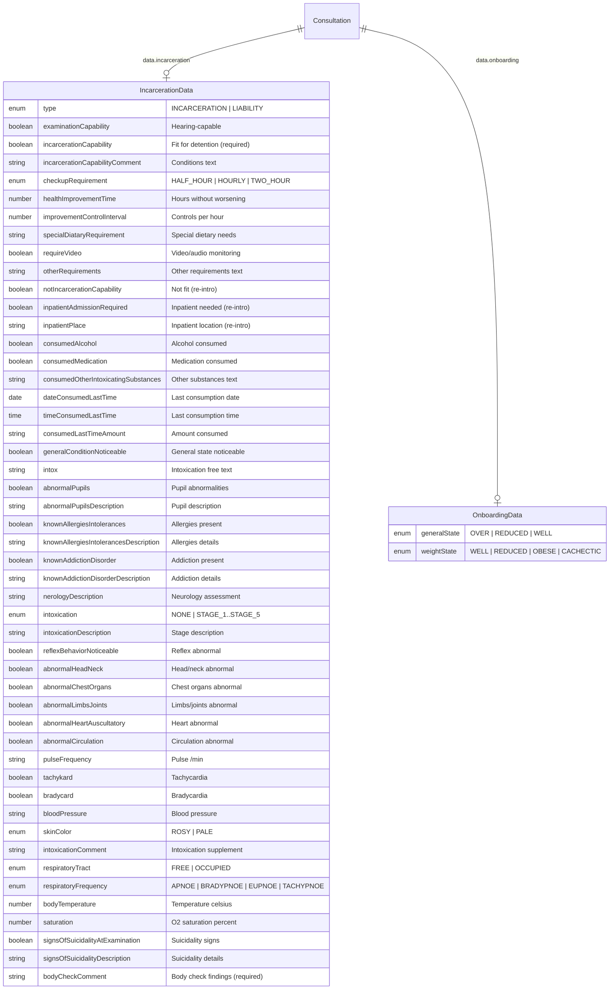

---
---

# 05 - Incarceration Consultation Detail Data Form

> **Source**: `videoclinic-prod/web/src/main/webapp/consultation/detailDataIncarceration.html` (386 lines)
> **Consultation type**: `INCARCERATION` (Gewahrsamstauglichkeit / Incarceration-suitability)
> **Purpose**: Partial HTML template embedded within the consultation detail view when `ConsultationType == INCARCERATION`. Contains the medical assessment fields specific to incarceration/custody suitability evaluations.

---

## Cross-References

### Source Includes

| Type | Direction | Detail | Linked Document | Condition / Context |
|------|-----------|--------|-----------------|---------------------|
| include | **Included by** | `{{> detailDataIncarceration}}` | [Consultation Details Header](consultation-details-header.md) | Incarceration form in consultation details |

---

## 1. Block: Incarceration Type

**Section title**: `{{i18n.IncarcerationType}}` -- "Gewahrsamkeits-Typ" / "Custody type"

Selects the sub-type of the incarceration consultation.

### Form Elements

| # | i18n Key / Label | `name` Binding | Type | Required | Disabled | Default | Options / Enum | Notes |
|---|---|---|---|---|---|---|---|---|
| 1 | `consultation.incarceration.type` | `data.incarceration.type` | select | `required` | -- | `""` (blank) | `INCARCERATION`, `LIABILITY` | Siren icon (`siren-on`) displayed |

#### Enum: `IncarcerationType`

| Value | DE | EN |
|---|---|---|
| `INCARCERATION` | Gewahrsamfahigkeit | Custodial capacity |
| `LIABILITY` | Haftfahigkeit | Adhesion |

---

## 2. Block: Examination Result (Medical Assessment / Result)

**Section title**: `{{i18n.consultation.incarceration.examinationResult}}` -- "Arztliche Beurteilung / Ergebnis" / "Medical assessment / result"

Three-column layout with: (1) examination capability and incarceration capability, (2) control interval settings, (3) other requirements.

### Column 1 -- Time of Examination

**Sub-label**: `{{i18n.consultation.incarceration.timeOfExamination}}` -- "Die untersuchte Person ist zum Zeitpunkt der Untersuchung" / "The person being examined is at the time of the examination"

| # | i18n Key / Label | `name` Binding | Type | Required | Disabled | Default | Options / Enum | Notes |
|---|---|---|---|---|---|---|---|---|
| 2 | `consultation.incarceration.ableToBeHeard` | `data.incarceration.examinationCapability` | select (boolean) | -- | -- | `""` | `true`/`false` | Siren icon (`siren-off`) |
| 3 | `consultation.incarceration.incarcerationCapability.yes` | `data.incarceration.incarcerationCapability` | select (boolean) | `required` | -- | `""` | `true`/`false` | Siren icon (`siren-on`) |
| 4 | placeholder: `consultation.incarceration.incarcerationCapability.desc` | `data.incarceration.incarcerationCapabilityComment` | textarea | -- | -- | -- | -- | `data-linktype="OWN"`, siren icon (`siren-off`) |

**Static hints** (labels displayed below inputs):
- `{{i18n.consultation.incarceration.tips}}:` (bold label)
- `{{i18n.consultation.incarceration.ControlDefinition}}` -- definition of what a control check entails
- `{{i18n.consultation.incarceration.vitalCheckImpossibleByPolice}}` -- warning about vital checks

### Column 2 -- Control Interval

**Sub-label**: `{{i18n.consultation.incarceration.control}}` -- "Kontrolle" / "Control"

| # | i18n Key / Label | `name` Binding | Type | Required | Disabled | Default | Options / Enum | Notes |
|---|---|---|---|---|---|---|---|---|
| 5 | `consultation.incarceration.checkupRequirement` | `data.incarceration.checkupRequirement` | select | -- | -- | `HOURLY` (selected) | `HALF_HOUR`, `HOURLY`, `TWO_HOUR` | No blank option (commented out), siren icon (`siren-off`) |
| 6 | `consultation.incarceration.intervallCheck.hoursWithoutWorsing` | `data.incarceration.healthImprovementTime` | input (number) | -- | -- | -- | maxlength=3 | placeholder: `consultation.incarceration.intervallCheck.hours`, siren (`siren-off`) |
| 7 | `consultation.incarceration.intervallCheck.perHour` | `data.incarceration.improvementControlInterval` | input (number) | -- | -- | -- | -- | placeholder same as label, siren (`siren-off`) |

**Static hints**:
- `{{i18n.consultation.incarceration.explanation}}:` (bold)
- `{{i18n.consultation.incarceration.intervallCheck.withoutWorsingCondition}}` -- explanation text

### Column 3 -- Other Requirements

**Sub-label**: `{{i18n.consultation.incarceration.otherRequirements}}` -- "sonstige Auflagen" / "other requirements"

| # | i18n Key / Label | `name` Binding | Type | Required | Disabled | Default | Options / Enum | Notes |
|---|---|---|---|---|---|---|---|---|
| 8 | `consultation.incarceration.specialDiataryRequirement` | `data.incarceration.specialDiataryRequirement` | input (text) | -- | -- | -- | -- | placeholder: `consultation.incarceration.specialDiataryRequirement.description`, siren (`siren-off`) |
| 9 | `consultation.incarceration.videoAudioRequired` | `data.incarceration.requireVideo` | select (boolean) | -- | -- | `true` (selected) | `true`/`false` | No blank option (commented out), siren (`siren-off`) |
| 10 | placeholder: `consultation.incarceration.otherRequirements` | `data.incarceration.otherRequirements` | textarea | -- | -- | -- | -- | `data-linktype="OWN"`, siren (`siren-off`) |

#### Enum: `CheckupRequirement`

| Value | DE | EN |
|---|---|---|
| `HALF_HOUR` | 2x pro Stunde | 2x per hour |
| `HOURLY` | 1x pro Stunde | 1x per hour |
| `TWO_HOUR` | 1x in 2 Stunden | 1x in 2 hours |

---

## 3. Block: Re-Introduction (Deterioration / Re-presentation)

**Label**: `*{{i18n.consultation.incarceration.reIntroduction}}` -- "Nur auszufullen bei Wiedervorstellung" / "Only to be filled out upon re-presentation"

**Sub-label**: `{{i18n.consultation.incarceration.deteriorationInHealth}}` -- warning about health deterioration.

> **Note**: The HTML comment says "Do not delete - Only currently not used - saved for later use". This section is present in the DOM but may be hidden or unused in production.

| # | i18n Key / Label | `name` Binding | Type | Required | Disabled | Default | Options / Enum | Notes |
|---|---|---|---|---|---|---|---|---|
| 11 | `consultation.incarceration.notIncarcerable` | `data.incarceration.notIncarcerationCapability` | select (boolean) | -- | -- | `""` | `true`/`false` | Siren (`siren-off`) |
| 12 | `consultation.incarceration.InpatientAdmissionRequired` | `data.incarceration.inpatientAdmissionRequired` | select (boolean) | -- | -- | `""` | `true`/`false` | -- |
| 13 | placeholder: `consultation.incarceration.InpatientAdmissionIn` | `data.incarceration.inpatientPlace` | textarea | -- | -- | -- | -- | `data-linktype="OWN"`, siren (`siren-off`) |

---

## 4. Block: Doctor Examination

**Section title**: `{{i18n.consultation.incarceration.doctorExamination}}` -- "Arztliche Untersuchung" / "Doctor Examination"

### Sub-block 4a: Consumption

**Sub-label**: `{{i18n.consultation.incarceration.consum}}` -- "Konsum" / "Consumption"

#### Column 1 -- Substance Consumption

| # | i18n Key / Label | `name` Binding | Type | Required | Disabled | Default | Options / Enum | Notes |
|---|---|---|---|---|---|---|---|---|
| 14 | `OnboardingData.alcoholUsage` | `data.incarceration.consumedAlcohol` | select (boolean) | -- | -- | `""` | `true`/`false` | Uses shared onboarding i18n key |
| 15 | `consultation.incarceration.medication` | `data.incarceration.consumedMedication` | select (boolean) | -- | -- | `""` | `true`/`false` | Siren (`siren-off`) |
| 16 | placeholder: `consultation.incarceration.consumedOtherIntox` | `data.incarceration.consumedOtherIntoxicatingSubstances` | textarea | -- | -- | -- | -- | `data-linktype="OWN"`, siren (`siren-off`) |
| 17 | `consultation.incarceration.lastDate` | `data.incarceration.dateConsumedLastTime` | input (date) | -- | -- | -- | -- | `class="form-control date"`, placeholder: **"Datum"** -- HARDCODED German |
| 18 | `consultation.incarceration.lastTime` | `data.incarceration.timeConsumedLastTime` | input (time) | -- | -- | -- | -- | `type="time"`, placeholder: "HH:MM", clockpicker widget |
| 19 | `consultation.incarceration.amount` | `data.incarceration.consumedLastTimeAmount` | input (text) | -- | -- | -- | -- | placeholder same as label |

#### Column 2 -- General Condition

| # | i18n Key / Label | `name` Binding | Type | Required | Disabled | Default | Options / Enum | Notes |
|---|---|---|---|---|---|---|---|---|
| 20 | `consultation.incarceration.generalStateNoticeable` | `data.incarceration.generalConditionNoticeable` | select (boolean) | -- | -- | `""` | `true`/`false` | -- |
| 21 | `OnboardingData.generalState` | `data.onboarding.generalState` | select | -- | -- | `""` | `OVER`, `REDUCED`, `WELL` | **Note**: binds to `data.onboarding.*`, not `data.incarceration.*` |
| 22 | `OnboardingData.weightState` | `data.onboarding.weightState` | select | -- | -- | `""` | `WELL`, `REDUCED`, `OBESE`, `CACHECTIC` | **Note**: binds to `data.onboarding.*`, not `data.incarceration.*` |
| 23 | `consultation.incarceration.intox` | `data.incarceration.intox` | input (text) | -- | -- | -- | -- | placeholder same as label |
| 24 | `consultation.incarceration.abnormalityPupils` | `data.incarceration.abnormalPupils` | select (boolean) | -- | -- | `""` | `true`/`false` | -- |
| 25 | placeholder: `consultation.incarceration.abnormalityPupils.Description` | `data.incarceration.abnormalPupilsDescription` | textarea | -- | -- | -- | -- | `data-linktype="OWN"` |

#### Enum: `BodyState` (General State)

| Value | DE | EN |
|---|---|---|
| `OVER` | schlecht | obese |
| `REDUCED` | reduziert | reduced |
| `WELL` | gut | Well |

#### Enum: `WeightState`

| Value | DE | EN |
|---|---|---|
| `WELL` | gut | well |
| `REDUCED` | reduziert | reduced |
| `OBESE` | adipos | obese |
| `CACHECTIC` | kachektisch | cachectic |

#### Column 3 -- Allergies & Addictions

| # | i18n Key / Label | `name` Binding | Type | Required | Disabled | Default | Options / Enum | Notes |
|---|---|---|---|---|---|---|---|---|
| 26 | `consultation.incarceration.knownAllergies` | `data.incarceration.knownAllergiesIntolerances` | select (boolean) | -- | -- | `""` | `true`/`false` | -- |
| 27 | placeholder: `consultation.incarceration.knownAllergies.yes` | `data.incarceration.knownAllergiesIntolerancesDescription` | textarea | -- | -- | -- | -- | `data-linktype="OWN"` |
| 28 | `consultation.incarceration.knownAddiction` | `data.incarceration.knownAddictionDisorder` | select (boolean) | -- | -- | `""` | `true`/`false` | -- |
| 29 | placeholder: `consultation.incarceration.knownAddiction.yes` | `data.incarceration.knownAddictionDisorderDescription` | textarea | -- | -- | -- | -- | `data-linktype="OWN"` |

### Sub-block 4b: Neurology

**Sub-label**: `{{i18n.consultation.incarceration.neurology}}` -- "Neurologie" / "Neurology"

| # | i18n Key / Label | `name` Binding | Type | Required | Disabled | Default | Options / Enum | Notes |
|---|---|---|---|---|---|---|---|---|
| 30 | placeholder: `consultation.incarceration.neurology.description` | `data.incarceration.nerologyDescription` | textarea | -- | -- | -- | -- | `data-linktype="OWN"`, rows=4, full width (col-md-12). **Note**: field name has typo `nerology` (missing 'u') |

---

## 5. Block: Intoxication Assessment

**Sub-label**: `{{i18n.consultation.incarceration.intoxication.Assessment}}` -- "Einschatzung der Intoxikation" / "Assessment of the intoxication"

### Row 1 -- Stadium Selection

| # | i18n Key / Label | `name` Binding | Type | Required | Disabled | Default | Options / Enum | Notes |
|---|---|---|---|---|---|---|---|---|
| 31 | `consultation.incarceration.intoxication.stadium` | `data.incarceration.intoxication` | select | -- | -- | `""` | `NONE`, `STAGE_1`..`STAGE_5` | Each option has `title` attr with `.desc` key |
| 32 | `consultation.incarceration.intoxication.stageDescription` | `data.incarceration.intoxicationDescription` | input (text) | -- | -- | -- | -- | col-md-8 |

#### Enum: `IntoxicationStage`

| Value | DE | EN | Description (DE) |
|---|---|---|---|
| `NONE` | Keine signifikante Intoxikation | no significant intoxication | keine Symptome |
| `STAGE_1` | Stadium I - Euphorie | Stage I - Euphoria | Enthemmung, Redseligkeit, Flapsigkeit; GCS 14-15 |
| `STAGE_2` | Stadium II - Erregung | Stage II - Excitation | emotional instabil, Storung der Wahrnehmung... GCS 14-15 |
| `STAGE_3` | Stadium III - Verwirrung | Stage III - Confusion | Abnahme von Orientierung Koordination [Ataxie]; GCS 7-15 |
| `STAGE_4` | Stadion IV - Stupor | Stage IV - Stupor | starke Vigilanzminderung... GCS 3-12 |
| `STAGE_5` | Stadium V - Koma | Stage V - Coma | Tiefe Bewusstlosigkeit, Reflexverlust, Hypothermie... GCS 3-12 |

### Row 2 -- Physical Examination Findings

#### Column 1 -- Boolean Abnormality Checks

| # | i18n Key / Label | `name` Binding | Type | Required | Disabled | Default | Options / Enum | Notes |
|---|---|---|---|---|---|---|---|---|
| 33 | `consultation.incarceration.intoxication.reflexBehaviorNoticeable` | `data.incarceration.reflexBehaviorNoticeable` | select (boolean) | -- | -- | `""` | `true`/`false` | -- |
| 34 | `consultation.incarceration.abnormalityHeadNeck` | `data.incarceration.abnormalHeadNeck` | select (boolean) | -- | -- | `""` | `true`/`false` | -- |
| 35 | `consultation.incarceration.intoxication.abnormalChestOrgans` | `data.incarceration.abnormalChestOrgans` | select (boolean) | -- | -- | `""` | `true`/`false` | -- |
| 36 | `consultation.incarceration.intoxication.abnormalLimbsJoints` | `data.incarceration.abnormalLimbsJoints` | select (boolean) | -- | -- | `""` | `true`/`false` | -- |
| 37 | `consultation.incarceration.intoxication.abnormalHeartAuscultatory` | `data.incarceration.abnormalHeartAuscultatory` | select (boolean) | -- | -- | `""` | `true`/`false` | -- |
| 38 | `consultation.incarceration.intoxication.abnormalCirculation` | `data.incarceration.abnormalCirculation` | select (boolean) | -- | -- | `""` | `true`/`false` | -- |

#### Column 2 -- Vitals & Skin

| # | i18n Key / Label | `name` Binding | Type | Required | Disabled | Default | Options / Enum | Notes |
|---|---|---|---|---|---|---|---|---|
| 39 | `consultation.incarceration.intoxication.pulseFrequency` | `data.incarceration.pulseFrequency` | input (text) | -- | -- | -- | -- | Suffix: **"/ Min"** -- HARDCODED |
| 40 | `consultation.incarceration.intoxication.tachykard` | `data.incarceration.tachykard` | select (boolean) | -- | -- | `""` | `true`/`false` | Shares row with bradycard |
| 41 | `consultation.incarceration.intoxication.bradycard` | `data.incarceration.bradycard` | select (boolean) | -- | -- | `""` | `true`/`false` | Shares row with tachykard |
| 42 | `consultation.incarceration.intoxication.bloodPressure` | `data.incarceration.bloodPressure` | input (text) | -- | -- | -- | -- | -- |
| 43 | `consultation.incarceration.intoxication.skinColor` | `data.incarceration.skinColor` | select | -- | -- | `""` | `ROSY`, `PALE` | -- |
| 44 | placeholder: `consultation.incarceration.intoxication.Comment` | `data.incarceration.intoxicationComment` | textarea | -- | -- | -- | -- | `data-linktype="OWN"` |

#### Enum: `SkinColor`

| Value | DE | EN |
|---|---|---|
| `ROSY` | rosig | pink |
| `PALE` | blass | Pale |

#### Column 3 -- Respiratory & Suicidality

| # | i18n Key / Label | `name` Binding | Type | Required | Disabled | Default | Options / Enum | Notes |
|---|---|---|---|---|---|---|---|---|
| 45 | `consultation.incarceration.intoxication.respiratoryTract` | `data.incarceration.respiratoryTract` | select | -- | -- | `""` | `FREE`, `OCCUPIED` | -- |
| 46 | `consultation.incarceration.intoxication.respiratoryFrequency` | `data.incarceration.respiratoryFrequency` | select | -- | -- | `""` | `APNOE`, `BRADYPNOE`, `EUPNOE`, `TACHYPNOE` | -- |
| 47 | `consultation.incarceration.intoxication.bodyTemperature` | `data.incarceration.bodyTemperature` | input (number) | -- | -- | -- | -- | Suffix: **"degrees C"** -- HARDCODED |
| 48 | `consultation.incarceration.intoxication.saturation` | `data.incarceration.saturation` | input (number) | -- | -- | -- | -- | Suffix: **"%"** -- HARDCODED |
| 49 | `consultation.incarceration.intoxication.signsOfSuicidality` | `data.incarceration.signsOfSuicidalityAtExamination` | select (boolean) | -- | -- | `""` | `true`/`false` | Siren (`siren-off`), asterisk `*` marker |
| 50 | placeholder: `consultation.incarceration.intoxication.signsOfSuicidality.description` | `data.incarceration.signsOfSuicidalityDescription` | textarea | -- | -- | -- | -- | `data-linktype="OWN"`, rows=4, siren (`siren-off`), asterisk `*` marker |

**Static footnote**:
- `* {{i18n.consultation.incarceration.intoxication.signsOfSuicidality.note}}: {{i18n.IncarcerationType.LIABILITY.note}}`
- Rendered as: "* Hinweise zu Suizidalitat: Nur bei Auswahl Haftfahigkeit" / "* Evidence of suicidality: Only when selecting adhesion"
- This indicates suicidality fields are relevant specifically when type = `LIABILITY`

#### Enum: `RespiratoryTract`

| Value | DE | EN |
|---|---|---|
| `FREE` | frei | Free |
| `OCCUPIED` | belegt | occupied |

#### Enum: `RespiratoryFrequency`

| Value | DE | EN |
|---|---|---|
| `APNOE` | Apnoe | Apnea |
| `BRADYPNOE` | Bradypnoe | Bradypnea |
| `EUPNOE` | Eupnoe | EUPNOE |
| `TACHYPNOE` | Tachypnoe | Tachypnea |

---

## 6. Block: Additions / Body Check

**Sub-label**: `{{i18n.consultation.incarceration.additions}}` -- "Erlauterungen / Erganzungen der Befunde" / "Explanations / additions to the findings"

| # | i18n Key / Label | `name` Binding | Type | Required | Disabled | Default | Options / Enum | Notes |
|---|---|---|---|---|---|---|---|---|
| 51 | placeholder: `consultation.incarceration.bodyCheck.placeholder` | `data.incarceration.bodyCheckComment` | textarea | `required` | -- | -- | -- | `data-linktype="OWN"`, full width (col-md-12) |

---

## Collections / Repeaters

**None found**. This template contains no `class="collection"` or `data-field` repeater patterns.

---

## Conditional Visibility Rules

No `data-cond-*` (conditionize2) attributes are present in this template. However, the following implicit conditional logic exists:

| Rule | Source | Description |
|---|---|---|
| Re-introduction block (#11-#13) | HTML comment | "Do not delete - Only currently not used - saved for later use" -- may be conditionally hidden via CSS or JS outside this template |
| Suicidality note (fields #49-#50) | Footnote text | "Nur bei Auswahl Haftfahigkeit" -- suicidality fields are noted as relevant only when `data.incarceration.type == LIABILITY`, but no `data-cond-*` is coded |

---

## Hardcoded Strings

| Location | Hardcoded Text | Language | Recommendation |
|---|---|---|---|
| Field #17 (date input placeholder) | `"Datum"` | DE | Replace with i18n key (e.g., `label.date`) |
| Field #18 (time input placeholder) | `"HH:MM"` | Neutral | Acceptable as format hint |
| Field #39 (pulse suffix) | `"/ Min"` | DE/Latin | Replace with i18n key (e.g., `unit.perMinute`) |
| Field #47 (temperature suffix) | `"degrees C "` | Symbol | Acceptable as universal unit |
| Field #48 (saturation suffix) | `"%"` | Symbol | Acceptable as universal unit |
| Line 107 | ` ` | -- | Invalid HTML (` ` intended) |
| Line 357, 363 | `&nbsp<h5>*</h5>` | -- | Missing semicolon on `&nbsp;`; asterisk should be styled differently |

---

## Cross-Model Bindings

Two fields bind to `data.onboarding.*` instead of `data.incarceration.*`:

| Field | Binding | Expected Model |
|---|---|---|
| General State (#21) | `data.onboarding.generalState` | Shared with onboarding data |
| Weight State (#22) | `data.onboarding.weightState` | Shared with onboarding data |

This means the incarceration form reads/writes the patient's general condition and weight from the shared onboarding data model, not a local copy.

---

## Siren Icon Pattern

Many fields include `` or `siren-off` with a `<i class="fas fa-siren-on">` icon. This appears to be an alert/warning indicator system:

- **`siren-on`**: Field triggers a visible siren (critical field) -- seen on: type (#1), incarceration capability (#3)
- **`siren-off`**: Siren in dormant state -- seen on most other fields

This likely toggles via JS based on field values (e.g., if incarceration capability = `false`, siren activates).

---

## Translation Table (Complete)

### Form-specific Keys

| i18n Key | DE | EN |
|---|---|---|
| `IncarcerationType` | Gewahrsamkeits-Typ | Custody type |
| `IncarcerationType.INCARCERATION` | Gewahrsamfahigkeit | Custodial capacity |
| `IncarcerationType.LIABILITY` | Haftfahigkeit | Adhesion |
| `IncarcerationType.LIABILITY.note` | Nur bei Auswahl Haftfahigkeit | Only when selecting adhesion |
| `consultation.incarceration.type` | Typ | Type |
| `consultation.incarceration.examinationResult` | Arztliche Beurteilung / Ergebnis | Medical assessment / result |
| `consultation.incarceration.timeOfExamination` | Die untersuchte Person ist zum Zeitpunkt der Untersuchung | The person being examined is at the time of the examination |
| `consultation.incarceration.ableToBeHeard` | Anhorungsfahig | Hearing-capable |
| `consultation.incarceration.incarcerationCapability.yes` | Gewahrsamfahig | Custodial capacity |
| `consultation.incarceration.incarcerationCapability.desc` | Gewahrsamfahig unter Einhaltung folgender Massgaben | Custody subject to compliance with the following conditions |
| `consultation.incarceration.tips` | Hinweise zur Kontrolle | Tips for the checks |
| `consultation.incarceration.ControlDefinition` | eine Kontrolle beinhaltet Sichtprufung von Vitalfunkitionen (z.B. Atmung) und Prufung des Bewusstseins (z.B. Ansprechen) | A check involves a visual inspection of vital functions (e.g., breathing) and an assessment of consciousness (e.g., responsiveness) |
| `consultation.incarceration.vitalCheckImpossibleByPolice` | Eine genaue Prufung der Vitalparameter ist der Polizei bei den Kontrollen nicht moglich! | It is not possible for the police to check vital signs precisely during checks! |
| `consultation.incarceration.control` | Kontrolle | Control |
| `consultation.incarceration.checkupRequirement` | Kontroll Intervall | Control interval |
| `consultation.incarceration.checkupRequirement.HALF_HOUR` | 2x pro Stunde | 2x per hour |
| `consultation.incarceration.checkupRequirement.HOURLY` | 1x pro Stunde | 1x per hour |
| `consultation.incarceration.checkupRequirement.TWO_HOUR` | 1x in 2 Stunden | 1x in 2 hours |
| `consultation.incarceration.explanation` | Erklarung | explanation |
| `consultation.incarceration.intervallCheck.withoutWorsingCondition` | Stunden Aufenthalt ohne Verschlechterung des Zustands Kontrolle(n) pro Stunde | Hours of stay without deterioration of condition Check(s) per hour |
| `consultation.incarceration.intervallCheck.hoursWithoutWorsing` | nach Std Aufenthalt ohne Verschlechterung | after hours stay without deterioration |
| `consultation.incarceration.intervallCheck.hours` | Stunden | Hours |
| `consultation.incarceration.intervallCheck.perHour` | Kontrolle(n) pro Stunde | Control(s) per hour |
| `consultation.incarceration.otherRequirements` | sonstige Auflagen | other requirements |
| `consultation.incarceration.specialDiataryRequirement` | Spezielle Kost | Special food |
| `consultation.incarceration.specialDiataryRequirement.description` | Spezieller Kost (zB.: Diatkost) | Observation of special foods (e.g. diet foods) |
| `consultation.incarceration.videoAudioRequired` | Kontrolle Video/Audio verlangt | Video/audio control required |
| `consultation.incarceration.reIntroduction` | Nur auszufullen bei Wiedervorstellung | Only to be filled out upon re-presentation |
| `consultation.incarceration.deteriorationInHealth` | Bei einer Verschlechterung des Gesundheitszustands bitte erneute sofortige arztliche Vorstellung | If your state of health deteriorates, please consult your doctor again immediately |
| `consultation.incarceration.notIncarcerable` | Nicht gewahrsamfahig | Not custodial |
| `consultation.incarceration.InpatientAdmissionRequired` | Einweisung / Stationare Aufnahme erforderlich | Referral / inpatient admission required |
| `consultation.incarceration.InpatientAdmissionIn` | Einweisung / Stationare Aufnahme am Ort | Referral / Inpatient admission on site |
| `consultation.incarceration.doctorExamination` | Arztliche Untersuchung | Doctor Examination |
| `consultation.incarceration.consum` | Konsum | Consumption |
| `OnboardingData.alcoholUsage` | Alkoholkonsum | Alcohol consumption |
| `consultation.incarceration.medication` | Medikamente | Medication |
| `consultation.incarceration.consumedOtherIntox` | Einnahme folgender Medikamente (korrekte Anwendung) | Taking these medications (correct application) |
| `consultation.incarceration.lastDate` | Zuletzt an Datum | Last date/time |
| `consultation.incarceration.lastTime` | Zuletzt um | Last date/time |
| `consultation.incarceration.amount` | Menge | Quantity |
| `consultation.incarceration.generalStateNoticeable` | Allgemeinzustand auffallig | General condition conspicuous |
| `OnboardingData.generalState` | Allgemeinzustand | General condition |
| `OnboardingData.weightState` | Ernahrungszustand | Nutritional status |
| `BodyState.OVER` | schlecht | obese |
| `BodyState.REDUCED` | reduziert | reduced |
| `BodyState.WELL` | gut | Well |
| `WeightState.WELL` | gut | well |
| `WeightState.REDUCED` | reduziert | reduced |
| `WeightState.OBESE` | adipos | obese |
| `WeightState.CACHECTIC` | kachektisch | cachectic |
| `consultation.incarceration.intox` | Intox | Intoxication |
| `consultation.incarceration.abnormalityPupils` | Auffaligkeit der Pupillen | Conspicuity of the pupils |
| `consultation.incarceration.abnormalityPupils.Description` | Beschreibung der Pupillen (Weite, Differenz, Reaktion) | Description of the pupils (width, difference, reaction) |
| `consultation.incarceration.knownAllergies` | Bekannte Allergien/Unvertraglichkeiten | Known allergies/intolerances |
| `consultation.incarceration.knownAllergies.yes` | Wenn Ja, welche bekannte Allergien? | If yes, which known allergies? |
| `consultation.incarceration.knownAddiction` | Bekannte Suchterkrankung | Known addiction |
| `consultation.incarceration.knownAddiction.yes` | Wenn Ja, welche bekannte Suchterkrankung? | If yes, which known addiction? |
| `consultation.incarceration.neurology` | Neurologie | Neurology |
| `consultation.incarceration.neurology.description` | Stand (sicher/unsicher/schwankend/nicht moglich) Sprache (deutlich/verwaschen/lallend/nicht moglich) Bewusstseinslage (wach/getrubt/bewusstlos) Gang (sicher, unsicher, schwankend, nicht moglich) | Standing (secure/uncertain/unsteady/not possible) Speech (clear/slurred/slurred/not possible) State of consciousness (awake/clouded/unconscious) Gait (secure, uncertain, unsteady, not possible) |
| `consultation.incarceration.intoxication.Assessment` | Einschatzung der Intoxikation | Assessment of the intoxication |
| `consultation.incarceration.intoxication.stadium` | Stadium | Stage |
| `consultation.incarceration.intoxication.NONE` | Keine signifikante Intoxikation | no significant intoxication |
| `consultation.incarceration.intoxication.STAGE_1` | Stadium I - Euphorie | Stage I - Euphoria |
| `consultation.incarceration.intoxication.STAGE_2` | Stadium II - Erregung | Stage II - Excitation |
| `consultation.incarceration.intoxication.STAGE_3` | Stadium III - Verwirrung | Stage III - Confusion |
| `consultation.incarceration.intoxication.STAGE_4` | Stadion IV - Stupor | Stage IV - Stupor |
| `consultation.incarceration.intoxication.STAGE_5` | Stadium V - Koma | Stage V - Coma |
| `consultation.incarceration.intoxication.stageDescription` | Stadium Beschreibung | Stage Description |
| `consultation.incarceration.intoxication.reflexBehaviorNoticeable` | Reflexverhalten auffallig | Reflective behavior is obvious |
| `consultation.incarceration.abnormalityHeadNeck` | Kopf/Hals auffallig | Head/neck noticeable |
| `consultation.incarceration.intoxication.abnormalChestOrgans` | Brustorgane (auskultatorisch/perkutorisch) auffallig | Chest organs (auscultatory/percultatory) detectable |
| `consultation.incarceration.intoxication.abnormalLimbsJoints` | Gliedmassen/Gelenke auffallig | Limbs/joints abnormal |
| `consultation.incarceration.intoxication.abnormalHeartAuscultatory` | Herz (auskultatorisch) auffallig | Heart (auscultatory) fully alert |
| `consultation.incarceration.intoxication.abnormalCirculation` | Kreislauf auffallig | Circuit complete |
| `consultation.incarceration.intoxication.pulseFrequency` | Pulsfrequenz | Pulse frequency |
| `consultation.incarceration.intoxication.tachykard` | Tachykard | Tachycardia |
| `consultation.incarceration.intoxication.bradycard` | Bradykard | Bradycard |
| `consultation.incarceration.intoxication.bloodPressure` | Blutdruck | Blood pressure |
| `consultation.incarceration.intoxication.skinColor` | Hautkolorit | Skin Color |
| `consultation.incarceration.intoxication.skinColor.ROSY` | rosig | pink |
| `consultation.incarceration.intoxication.skinColor.PALE` | blass | Pale |
| `consultation.incarceration.intoxication.Comment` | Erganzung zur Intoxikation (bspw. Durchgefuhrte Koordinationstests) | Supplement for intoxication (e.g. coordination tests carried out) |
| `consultation.incarceration.intoxication.respiratoryTract` | Atemwege | Respiratory system |
| `consultation.incarceration.intoxication.respiratoryTract.FREE` | frei | Free |
| `consultation.incarceration.intoxication.respiratoryTract.OCCUPIED` | belegt | occupied |
| `consultation.incarceration.intoxication.respiratoryFrequency` | Atemfrequenz | Respiratory rate |
| `consultation.incarceration.intoxication.respiratoryFrequency.APNOE` | Apnoe | Apnea |
| `consultation.incarceration.intoxication.respiratoryFrequency.BRADYPNOE` | Bradypnoe | Bradypnea |
| `consultation.incarceration.intoxication.respiratoryFrequency.EUPNOE` | Eupnoe | EUPNOE |
| `consultation.incarceration.intoxication.respiratoryFrequency.TACHYPNOE` | Tachypnoe | Tachypnea |
| `consultation.incarceration.intoxication.bodyTemperature` | Korpertemperatur | Body temperature |
| `consultation.incarceration.intoxication.saturation` | Sattigung | Confirmation |
| `consultation.incarceration.intoxication.signsOfSuicidality` | Hinweise zu Suizidalitat | Evidence of suicidality |
| `consultation.incarceration.intoxication.signsOfSuicidality.description` | unauffallig, angstlich, nicht beurteilbar, euphorisch, erregt, wahnhaft, aggressiv, verwirrt, verlangsam/stuporos, suizidal, depressiv, motorisch unruhig | unremarkable, anxious, unassessable, euphoric, agitated, delusional, aggressive, confused, slow/stuporous, suicidal, depressed, motor restless |
| `consultation.incarceration.intoxication.signsOfSuicidality.note` | Hinweise zu Suizidalitat | Evidence of suicidality |
| `consultation.incarceration.additions` | Erlauterungen / Erganzungen der Befunde | Explanations / additions to the findings |
| `consultation.incarceration.bodyCheck.placeholder` | Bodycheck aussere Feststellungen/Verletzungen, Hinweise auf Trauma | Body check external findings/injuries, indications of trauma |
| `label.yes` | Ja | Yes |
| `label.no` | Nein | No |

---

## Data Model Diagram

---

## Implementation Notes for React/Shadcn

1. **Total fields**: 51 form elements across 6 blocks.
2. **Required fields**: `data.incarceration.type` (#1), `data.incarceration.incarcerationCapability` (#3), `data.incarceration.bodyCheckComment` (#51).
3. **Cross-model references**: Fields #21 and #22 bind to `data.onboarding.*` -- ensure the form schema includes these shared fields or reads from a parent onboarding context.
4. **Default values**: `checkupRequirement` defaults to `HOURLY`, `requireVideo` defaults to `true` -- handle in Zod schema defaults.
5. **Typo in field name**: `data.incarceration.nerologyDescription` should probably be `neurologyDescription` in the new schema.
6. **Re-introduction block**: Currently marked as unused. Consider implementing behind a feature flag or conditional section.
7. **Siren system**: Needs a React equivalent -- consider an alert indicator component that toggles based on field values.
8. **Boolean selects**: All boolean fields use `<select>` with three states: blank/yes/no. Map to `boolean | null` in the Zod schema.
9. **`data-linktype="OWN"`**: Present on all textarea fields -- this likely drives a linking/annotation system in the legacy app. Clarify requirements for the React reimplementation.
10. **Intoxication stage tooltips**: Each option has a `title` attribute with a detailed `.desc` key. In React, implement with tooltip or popover on hover for the select options.
