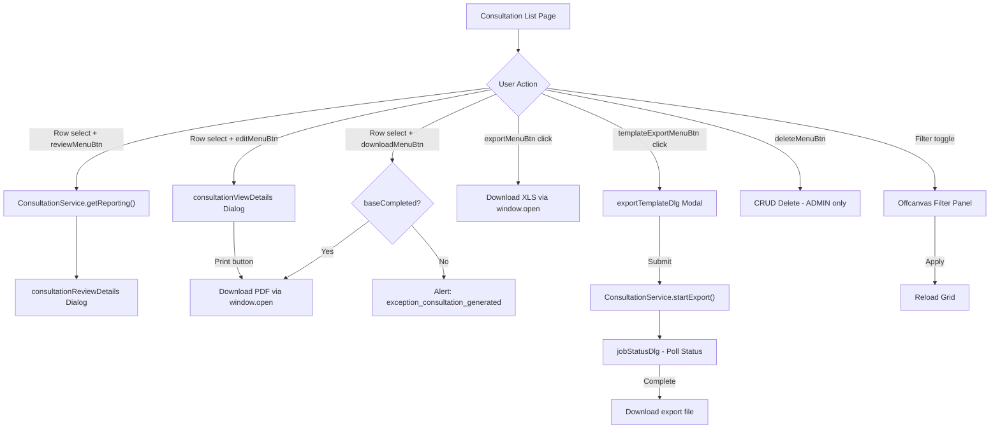
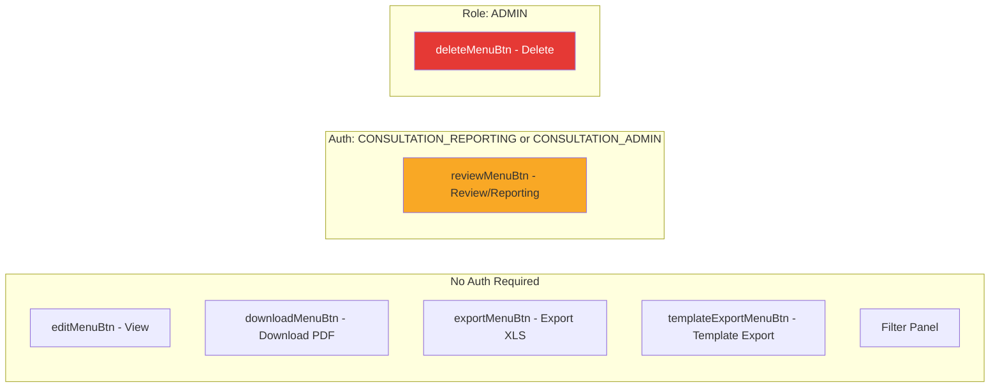

---
---

# Consultation List Page — Legacy UI Analysis

> **Source files analyzed:**
> - `web/src/main/webapp/consultation/index.htmlm` (302 lines)
> - `web/src/main/webapp/consultation/index.js` (180 lines)

---

## 1. Block Title & Visualization

| Attribute | Value |
|-----------|-------|
| Block ID | `consultation` |
| CSS class | `tableView` |
| Icon | — (no `data-icon` on main block) |
| Color | — (no `data-color` on main block) |
| CRUD config | `Core.initCrud` with `serviceName: "ConsultationService"`, `getMethod: "get"`, `initDialog: false`, `deeplink.view: false` |
| Grid mode | `fullscreen: true` via `slickerGrid` |

---

## 2. HTMLM Header Metadata

### Variables

| Field | Method | Value |
|-------|--------|-------|
| `usePanel` | `variable` | `true` |
| `nav` | `variable` | Filter enabled, toolbar buttons (see Section 3) |

### Template Includes

| Field | Method | Template Path |
|-------|--------|---------------|
| `navBar` | `template` | `../_include/navbar.mustache` |
| `siteloader` | `template` | `../_include/siteloader.mustache` |
| `consultationViewDetails` | `template` | `../consultation/viewDetails.html` |
| `consultationReviewDetails` | `template` | `../consultation/reviewDetails.html` |
| `jobStatusDlg` | `template` | `../_include/jobStatusDlg.html` |

### Option Sources

| Field | Service | Method | Style | Value Key | Content Key | Data |
|-------|---------|--------|-------|-----------|-------------|------|
| `jobs` | `JobService` | `getAllOptions` | `OPTION` | `code` | `code` | `pojo` |
| `warningAllergy` | `WarningService` | `getAllergies` | `OPTION` | `id` | `name` | `pojo` |
| `warningConspicous` | `WarningService` | `getConspicious` | `OPTION` | `id` | `name` | `pojo` |
| `warningInfection` | `WarningService` | `getInfections` | `OPTION` | `id` | `name` | `pojo` |
| `warningOther` | `WarningService` | `getOther` | `OPTION` | `id` | `name` | `pojo` |
| `treatmentCategories` | `TreatmentCategoryService` | `getAll` | `OPTION` | `name` | `name` | — |

### Script Includes

| Script |
|--------|
| /_lib/3rdparty/marked.min.js` (Markdown renderer) |
| `/consultation/index.js` |
| `/consultation/messages.i18n.js` |
| `/profile/messages.i18n.js` |

---

## Cross-References

### Source Includes

| Type | Direction | Detail | Linked Document | Condition / Context |
|------|-----------|--------|-----------------|---------------------|
| include | **Includes** | `{{> consultationViewDetails}}` | [Consultation View Review](consultation-view-review.md) | View consultation detail dialog |
| include | **Includes** | `{{> consultationReviewDetails}}` | [Consultation View Review](consultation-view-review.md) | Review consultation dialog |
| include | **Included by** | `{{> navBar}}` | [Navbar Shared Component](../../system/includes/includes-navbar.md) | Top navigation bar |
| include | **Included by** | `{{> siteloader}}` | [Siteloader Shared Component](../../system/includes/includes-siteloader.md) | Site loader/footer includes |
| include | **Included by** | `{{> jobStatusDlg}}` | [Job Status Dialog](../../system/includes/includes-job-status-dlg.md) | Async job status polling for template exports |
| include | **Included by** | `<script src="/consultation/index.js">` | (this file's companion script) | Main consultation list behavior |
| include | **Included by** | `<script src="/consultation/messages.i18n.js">` | (localized strings) | i18n translations for consultation |
| include | **Included by** | `<script src="/profile/messages.i18n.js">` | (localized strings) | i18n translations for profile |

### Service Calls

| Service | Method | Parameters | Dialog / Context |
|---------|--------|------------|------------------|
| `ConsultationService` | `getAll` | `[filter, 100]` | Grid data source, max 100 results |
| `ConsultationService` | `get` | `[id]` | View consultation detail (CRUD default) |
| `ConsultationService` | `getReporting` | `[pojo.id]` | Review/reporting dialog |
| `ConsultationService` | `startExport` | `[exportTemplate.id, data]` | Template export workflow |
| `ConsultationService` | `done` | `[id, timeStart, timeEnd, qm]` | Download PDF guard (`baseCompleted`) |
| `UserService` | `saveSetting` | `[key, value]` | Grid settings persistence |
| `UserService` | `autocomplete` | `[query]` | Doctor filter in offcanvas panel |
| `LocationService` | `autocomplete` | `[query]` | Location filter autocomplete |
| `ExportTemplateService` | `autocomplete` | `[query]` | Template export dialog |
| `CustomerService` | `autocomplete` | `[query]` | Customer field in export dialog |
| `JobService` | `getAllOptions` | `[]` | Job type option source |
| `WarningService` | `getAllergies` | `[]` | Allergy warning options |
| `WarningService` | `getConspicious` | `[]` | Conspicuous warning options |
| `WarningService` | `getInfections` | `[]` | Infection warning options |
| `WarningService` | `getOther` | `[]` | Other warning options |
| `TreatmentCategoryService` | `getAll` | `[]` | Treatment category options |

### Event Flows

| Type | Direction | Event | Linked Document | Condition |
|------|-----------|-------|-----------------|----------|
| event | **Outgoing** | `loadGrid` | (self) | Date toolbar change triggers grid reload |
| event | **Incoming** | `dialogOpen` | [Consultation View Review](consultation-view-review.md) | Opens review dialog via `#consultationDetailsReviewDlg` |
| event | **Outgoing** | CRUD default | [Consultation View Review](consultation-view-review.md) | Row double-click or edit button |

> **Include context:** This file embeds `consultationViewDetails` and `consultationReviewDetails` as Mustache partials for view and review dialogs. Navbar, siteloader, and jobStatusDlg are standard shared components included by all list pages.
>
> **Service chain:** Grid loads via `ConsultationService.getAll(filter, 100)` → row select enables review via `ConsultationService.getReporting(id)` → review dialog opens `dialogOpen` event.
>
> **Event chain:** Date selector change (`#year/#month/#day`) → `updateGlobalFilter` → `$(document).trigger("loadGrid")` → grid reloads with filtered data.

---

## 3. Toolbar (Nav Buttons)

Defined in `nav.buttons` array inside the HTMLM header.

| # | ID | Name (i18n key) | Icon | Disabled (initial) | Auth / Role Gate | Purpose (from JS) |
|---|-----|-----------------|------|---------------------|------------------|--------------------|
| 1 | `editMenuBtn` | `action.view` | `file-contract` | `true` | — (none) | View consultation detail (CRUD default) |
| 2 | `reviewMenuBtn` | `consultation.review` | `books-medical` | `true` | `auths: CONSULTATION_REPORTING, CONSULTATION_ADMIN` | Open reporting review dialog |
| 3 | `deleteMenuBtn` | `action.delete` | `trash` | `true` | `roles: ADMIN` | Delete consultation |
| — | *(spacer)* | — | — | — | `roles: ADMIN` | — |
| 4 | `downloadMenuBtn` | `action.save` | `cloud-download` | `true` | — (none) | Download consultation PDF |
| 5 | `exportMenuBtn` | `action.export` | `download` | `false` | — (none) | Export consultations (XLS by year/month) |
| — | *(spacer)* | — | — | — | — | — |
| 6 | `templateExportMenuBtn` | `action.export` | `file-export` | `false` (default) | — (none) | Open template export dialog |

**Filter toggle**: `filter: true` in nav config enables the offcanvas filter panel toggle.

---

## 4. Grid / Table Columns

Defined in `
` inside `#consultation`.

| # | `data-field` | `data-name` | `data-width` | `data-formatter` | Notes |
|---|-------------|-------------|-------------|------------------|-------|
| 1 | `date` | `{{i18n.label.date}}` | 80 | `Formatter.date` | Date formatted |
| 2 | `start` | `{{i18n.consultation.start}}` | 60 | — (raw text) | Start time |
| 3 | `end` | `{{i18n.consultation.end}}` | 60 | — (raw text) | End time |
| 4 | `bookNumber` | **`"Patient"`** | 200 | — (raw text) | **HARDCODED label** |
| 5 | `location` | `{{i18n.location}}` | 180 | `Formatter.name` | Location object `.name` |
| 6 | `type` | `{{i18n.label.type}}` | 150 | `Formatter.ConsultationType` | Enum display |
| 7 | `state` | `{{i18n.label.state}}` | 100 | `Formatter.ConsultationState` | Enum display |
| 8 | `doctor` | `{{i18n.consultation.doctor}}` | 130 | `Formatter.name` | Doctor object `.name` |
| 9 | `requireReporting` | `{{i18n.consultation.reporting.reportDocumentation}}` | 30 | `Formatter.bool` | Boolean flag |
| 10 | `reportingDocumentation` | `{{i18n.consultation.reporting}}` | 1000 | — (raw text) | Free text, very wide column |

**Grid data source** (from JS):
- Service: `ConsultationService`
- Method: `getAll`
- Params: `[filter, 100]` (filter object + max 100 results)
- Settings persistence: `UserService.saveSetting` keyed by `#gridSetting` `data-code`

---

## 5. Inline Toolbar Filters (Above Grid)

The page has an inline toolbar (`btn-toolbar`) above the grid with date selectors and quick filters.

### Date Selector (Left Group)

| Element | ID | Type | Notes |
|---------|----|------|-------|
| Year | `year` | `<input type="number">` | Default: current year (set in JS). CSS class `number`. Inline style `width: 100px`. |
| Month | `month` | `<select>` | Options 1-12, labels via `{{i18n.Month.JAN}}` ... `{{i18n.Month.DEC}}`. Default: current month (set in JS). |
| Day | `day` | `<select>` | Options `""` (dash) through 1-31. Default: current day (set in JS). HARDCODED `-` for empty option. |

Changing any of these triggers `updateGlobalFilter` which sets `globalFilter.filter` to `YYYY-M-D` and reloads the grid.

### Quick Filters (Right Group)

| Element | ID | Type | Data Model | Placeholder / Default | Service / Method |
|---------|-----|------|------------|----------------------|-----------------|
| Location autocomplete | `filterLocation` | `<input>` autocomplete (`object autoselect`) | `data.filterLocation` | `{{i18n.location}}` | `LocationService.autocomplete`, display: `name` |
| Consultation Type | `filterConsultationType` | `<select>` | `data.defaultConsultation` | `{{i18n.ConsultationType}}` (default option) | — (static options) |
| Book Number | `filterBookNumber` | `<input type="text">` | — (no `name`) | `{{i18n.consultation.booknumber}}` | — |
| Job Type | `filterJobType` | `<select>` | `data.type` | `{{i18n.jobType}}` (default option) | — (static options) |

**Consultation Type options:**

| Value | Label |
|-------|-------|
| `""` | `{{i18n.ConsultationType}}` (placeholder) |
| `EXTERNAL` | `{{i18n.ConsultationType.EXTERNAL}}` |
| `DOCUMENT` | `{{i18n.ConsultationType.DOCUMENT}}` |
| `STANDARD` | `{{i18n.ConsultationType.STANDARD}}` |
| `ONBOARDING` | `{{i18n.ConsultationType.ONBOARDING}}` |
| `ONBOARDING_SHORT` | `{{i18n.ConsultationType.ONBOARDING_SHORT}}` |
| `INCARCERATION` | `{{i18n.ConsultationType.INCARCERATION}}` |

> Note: `TREATMENT` type is defined in translations but NOT listed as a filter option.

**Job Type options:**

| Value | Label |
|-------|-------|
| `""` | `{{i18n.jobType}}` (placeholder) |
| `APPOINTMENT` | `{{i18n.AppointmentType.APPOINTMENT}}` |
| `SHIFT` | `{{i18n.AppointmentType.SHIFT}}` |
| `COUNCIL` | `{{i18n.AppointmentType.COUNCIL}}` |

### Filter Key Mapping (from JS `onFilterChange`)

| Selector | Global Filter Key | Value Extraction |
|----------|-------------------|------------------|
| `#filterLocation` | `location` | `pojo` array `[location]` or `null` |
| `#filterConsultationType` | `type` | `.val()` string |
| `#filterJobType` | `appointmentType` | `.val()` string |
| `#filterBookNumber` | `bookNumber` | `.val()` string |

---

## 6. Filter Panel (Offcanvas)

Element: `
`, scrollable, no backdrop.

### Title
**HARDCODED**: `Filter` (with `fa-filter` icon)

### Filter Fields

| # | Type | Name (`name=`) | Class / Behavior | Placeholder / Title | Service | Notes |
|---|------|---------------|-----------------|---------------------|---------|-------|
| 1a | Date (from) | `data.date` | `date array`, `data-array="0"` | Title: `{{i18n.action.date}}` | — | Date range start, icon `fa-calendar-day` |
| 1b | Date (to) | `data.date` | `date array`, `data-array="1"` | Title: `{{i18n.action.date}}` | — | Date range end |
| 2 | Select (status) | `data.state` | `form-select` | **HARDCODED**: `"- Status -"` | — | Consultation state enum |
| 3 | Autocomplete (doctor) | `data.doctor` | `object autoselect` | `{{i18n.consultation.doctor}}` | `UserService.autocomplete` | Display: `displayName`, icon `fa-user-nurse`, `data-append="#filter"` |

**Status options in filter:**

| Value | Label |
|-------|-------|
| `""` | **HARDCODED**: `- Status -` |
| `CREATED` | `{{i18n.ConsultationState.CREATED}}` |
| `OPEN` | `{{i18n.ConsultationState.OPEN}}` |
| `TRANSMITTED` | `{{i18n.ConsultationState.TRANSMITTED}}` |
| `REPORTED` | `{{i18n.ConsultationState.REPORTED}}` |
| `CLOSED` | `{{i18n.ConsultationState.CLOSED}}` |
| `VERIFIED` | `{{i18n.ConsultationState.VERIFIED}}` |

### Filter Actions

| Element | Class | Label |
|---------|-------|-------|
| Apply button | `btn btn-primary apply` | `{{i18n.button.apply}}` |
| Max Results select | `maxResults form-control` | Title: `{{i18n.filter.results}}`, options: `-1` (default), 150, 200, 300, 500, 2000 |
| Reset button | `btn btn-secondary reset` | `{{i18n.button.reset}}` |

---

## 7. Export Template Dialog (`exportTemplateDlg`)

Element: `
` — rendered as a modal dialog.

| Attribute | Value |
|-----------|-------|
| `data-limit` | `100` |
| `data-icon` | `far fa-download` |
| `data-target` | `modal` |
| `data-color` | `bg-color-appointmentAdmin` |
| Title | `{{i18n.templateExportDlg.title}}` |

### Form Fields (2-column layout, `col-md-6`)

| # | Column | Name (`name=`) | Type | Class | Placeholder / Label | Service / Method | Display | Required | Notes |
|---|--------|---------------|------|-------|---------------------|-----------------|---------|----------|-------|
| 1a | Left | `data.year` | `<input>` number | `number form-control mandatory` | — | — | — | **Yes** (`mandatory`) | Default value: `2024` (HARDCODED) |
| 1b | Left | `data.month` | `<select>` | `form-select mandatory` | — | — | — | **Yes** (`mandatory`) | Month 1-12, i18n labels |
| 2 | Right | `data.exportTemplate` | Autocomplete (`object autoselect`) | `form-control mandatory` | `{{i18n.exportTemplate.template}}` | `ExportTemplateService.autocomplete` | `name` | **Yes** (`mandatory`) | `data-minlength="0"`, `data-filter='["CONSULTATION"]'`, icon `fa-file-invoice` |
| 3 | Left | `data.customer` | Autocomplete (`object autoselect`) | `form-control` | `{{i18n.customer}}` | `CustomerService.autocomplete` | `name` | No | `data-minlength="0"`, label prefix `{{i18n.customer}}` |
| 4 | Right | `data.location` | Autocomplete (`object autoselect`) | `form-control` | `{{i18n.location}}` | `LocationService.autocomplete` | `name` | No | `data-minlength="0"`, label prefix `{{i18n.location}}` |
| 5 | Left | `data.user` | Autocomplete (`object autoselect`) | `form-control` | `{{i18n.expert}}` | `UserService.findDoctor` | `displayName` | No | `data-minlength="0"`, label prefix `{{i18n.expert}}` |

### Dialog Behavior (from JS)

1. Opened by `#templateExportMenuBtn` click
2. Pre-populated with current `year` and `month` from the toolbar selectors
3. On submit: calls `ConsultationService.startExport(exportTemplate.id, data)`
4. On success: opens `#jobStatusDlg` with:
   - `service: "ConsultationService"`
   - `statusMethod: "getStatus"`
   - `title: "Custom Export"` (**HARDCODED**)
   - `download: '../get/ConsultationService/retrieve/' + exportId + "/"`

---

## 8. Template Includes

| Mustache Partial | Source Template | Purpose |
|------------------|----------------|---------|
| `{{> navBar}}` | `../_include/navbar.mustache` | Top navigation bar |
| `{{> consultationViewDetails}}` | `../consultation/viewDetails.html` | Consultation detail view/edit dialog (embedded inside `#consultation` tableView) |
| `{{> consultationReviewDetails}}` | `../consultation/reviewDetails.html` | Consultation reporting/review dialog (rendered at page bottom) |
| `{{> siteloader}}` | `../_include/siteloader.mustache` | Common site loader/footer includes |
| `{{> jobStatusDlg}}` | `../_include/jobStatusDlg.html` | Async job status polling dialog (for template exports) |

---

## 9. Click Actions (from JavaScript)

### Grid Row Selection

| Event | Handler |
|-------|---------|
| `rowSelected` on `$grid` | Enables `#downloadMenuBtn` and `#reviewMenuBtn`; stores selected row `data[0]` as `.data().pojo` on both buttons |

### Button Handlers

| Button ID | Trigger | Action | Service Call | Notes |
|-----------|---------|--------|-------------|-------|
| `editMenuBtn` | CRUD default (row double-click or button) | Opens `consultationViewDetails` detail dialog | `ConsultationService.get(id)` | Default CRUD view behavior |
| `reviewMenuBtn` | Click | Fetches reporting data, opens review dialog | `ConsultationService.getReporting(pojo.id)` | Triggers `dialogOpen` on `#consultationDetailsReviewDlg` |
| `deleteMenuBtn` | CRUD default | Deletes selected consultation | CRUD default delete | Requires `ADMIN` role |
| `downloadMenuBtn` | Click | Downloads consultation PDF | `GET /get/ConsultationService/download/{id}/{filename}` | Guards on `pojo.baseCompleted`; alerts `i18n.exception_consultation_generated` if not completed |
| `exportMenuBtn` | Click | Downloads XLS export | `GET ../get/ConsultationService/downloadExport/{year}/{month}/ExportConsultations-{year}-{month}.xls` | Uses current toolbar year/month |
| `templateExportMenuBtn` | Click | Opens `#exportTemplateDlg` modal | (see Section 7) | Pre-fills year/month from toolbar |

### Detail Dialog (CRUD)

| Config Key | Value | Notes |
|------------|-------|-------|
| `onCreate` | Default: `{ date: new Date(), start: new Date(), type: "STANDARD" }` | New consultation defaults |
| `saveMethod` | Closes dialog, returns `true` (no explicit save call — read-only view) | Detail is view-only |
| `initDialog` | `false` | Dialog is not auto-initialized |
| `deeplink.view` | `false` | No URL deeplink for view |

### Detail Dialog Custom Buttons

| Button | Class | Label | Action |
|--------|-------|-------|--------|
| Print | `btn btn-secondary` | `i18n.dialog_print` (responsive: `fa-print` icon) | Opens `/get/ConsultationService/download/{id}/{filename}` in new window |

### Date Toolbar Change Handlers

All three selectors (`#year`, `#month`, `#day`) trigger `updateGlobalFilter` which:
1. Sets `globalFilter.filter` to `YYYY-M-D`
2. Fires `$(document).trigger("loadGrid")` to reload the grid

---

## 10. Translation Table

### i18n References Found in Templates

| i18n Key | EN | DE | Location | Notes |
|----------|----|----|----------|-------|
| `i18n.label.date` | Date | Datum | Grid column | — |
| `i18n.consultation.start` | Start | Start | Grid column | — |
| `i18n.consultation.end` | End | Ende | Grid column | — |
| `i18n.location` | Location | Standort | Grid column, filters, export dialog | — |
| `i18n.label.type` | Type | Typ | Grid column | — |
| `i18n.label.state` | State | Status | Grid column | — |
| `i18n.consultation.doctor` | Doctor | Arzt | Grid column, filter panel | — |
| `i18n.consultation.reporting.reportDocumentation` | Report documentation | Berichtsdokumentation | Grid column | — |
| `i18n.consultation.reporting` | Reporting | Berichtswesen | Grid column | — |
| `i18n.consultation.booknumber` | Book number | Buchnummer | Toolbar filter | — |
| `i18n.ConsultationType` | Consultation type | Konsultationstyp | Filter placeholder | — |
| `i18n.ConsultationType.EXTERNAL` | External | Extern | Filter, grid formatter | — |
| `i18n.ConsultationType.DOCUMENT` | Consil Psychiatry | Konsiliarbericht | Filter, grid formatter | — |
| `i18n.ConsultationType.STANDARD` | Basic | Normale Konsultation | Filter, grid formatter | — |
| `i18n.ConsultationType.ONBOARDING` | Onboarding | Komplette Zugangsuntersuchung | Filter, grid formatter | — |
| `i18n.ConsultationType.ONBOARDING_SHORT` | Quick Onboarding | Kurze Zugangsuntersuchung | Filter, grid formatter | — |
| `i18n.ConsultationType.INCARCERATION` | Incarceration-suitability | Gewahrsamstauglichkeit | Filter, grid formatter | — |
| `i18n.ConsultationState.CREATED` | Created | Erstellt | Filter panel | — |
| `i18n.ConsultationState.OPEN` | Open | Offen | Filter panel | — |
| `i18n.ConsultationState.TRANSMITTED` | Transmitted | Ubermittelt | Filter panel | — |
| `i18n.ConsultationState.REPORTED` | Report | Bericht | Filter panel | — |
| `i18n.ConsultationState.CLOSED` | Closed | Abgeschlossen | Filter panel | — |
| `i18n.ConsultationState.VERIFIED` | Verified | Verfiziert | Filter panel | — |
| `i18n.Month.JAN` - `i18n.Month.DEC` | Jan-Dec | Jan-Dez | Date selectors, export dialog | 12 month labels |
| `i18n.jobType` | Job type | — | Filter placeholder | — |
| `i18n.AppointmentType.APPOINTMENT` | Appointment | — | Job type filter | — |
| `i18n.AppointmentType.SHIFT` | Shift | — | Job type filter | — |
| `i18n.AppointmentType.COUNCIL` | Council | — | Job type filter | — |
| `i18n.action.date` | Date | — | Filter panel title attr | — |
| `i18n.button.apply` | Apply | Anwenden | Filter panel | — |
| `i18n.button.reset` | Reset | Zurucksetzen | Filter panel | — |
| `i18n.filter.results` | Results | Ergebnisse | Filter max results title | — |
| `i18n.templateExportDlg.title` | Template Export | — | Export dialog title | — |
| `i18n.exportTemplate.template` | Template | — | Export dialog placeholder | — |
| `i18n.customer` | Customer | Kunde | Export dialog | — |
| `i18n.expert` | Expert | Experte | Export dialog | — |
| `i18n.dialog_print` | Print | Drucken | Detail dialog button | From JS |
| `i18n.exception_consultation_generated` | (error message) | — | Download guard alert | From JS |
| `i18n.action.view` | View | Ansicht | Toolbar button | — |
| `i18n.consultation.review` | Review | Uberprufung | Toolbar button | — |
| `i18n.action.delete` | Delete | Loschen | Toolbar button | — |
| `i18n.action.save` | Save | Speichern | Toolbar button (download) | — |
| `i18n.action.export` | Export | Export | Toolbar buttons (x2) | — |

### Hardcoded Strings

| String | Location | Recommendation |
|--------|----------|----------------|
| `"Patient"` | Grid column `data-name` for `bookNumber` | Move to i18n: `consultation.patient` or `consultation.bookNumber` |
| `"Filter"` | Offcanvas title | Move to i18n: `filter.title` |
| `"- Status -"` | Filter panel status select default option | Move to i18n: `filter.status.placeholder` |
| `"-"` | Day select empty option | Move to i18n or use standard empty placeholder |
| `"Custom Export"` | JS: jobStatusDlg title in template export flow | Move to i18n: `consultation.export.customTitle` |
| `"2024"` | Export dialog year default value | Should be dynamic (current year) |
| `"2021"` | Year input default in HTML (overridden by JS to current year) | Stale default, only visible before JS runs |

---

## 11. Mermaid Diagrams

### Dialog Navigation Flowchart

### Permission Gating

