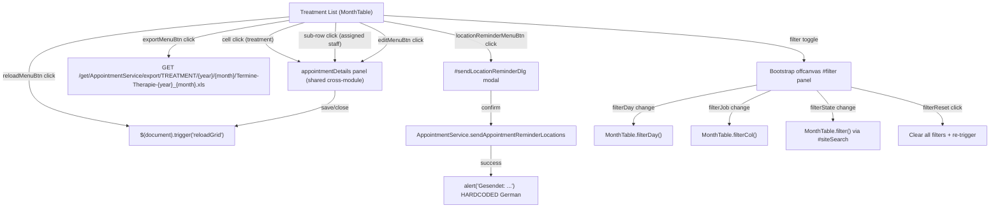
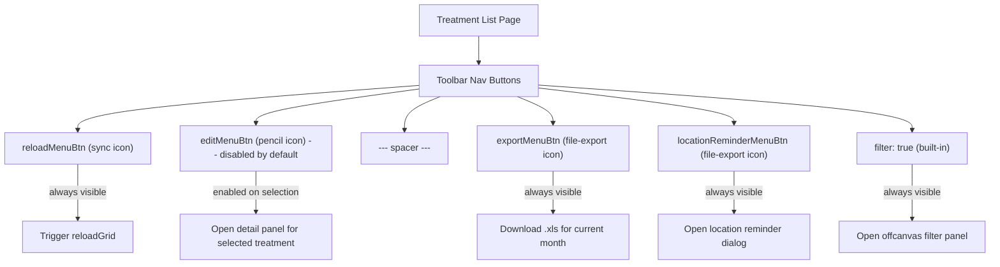
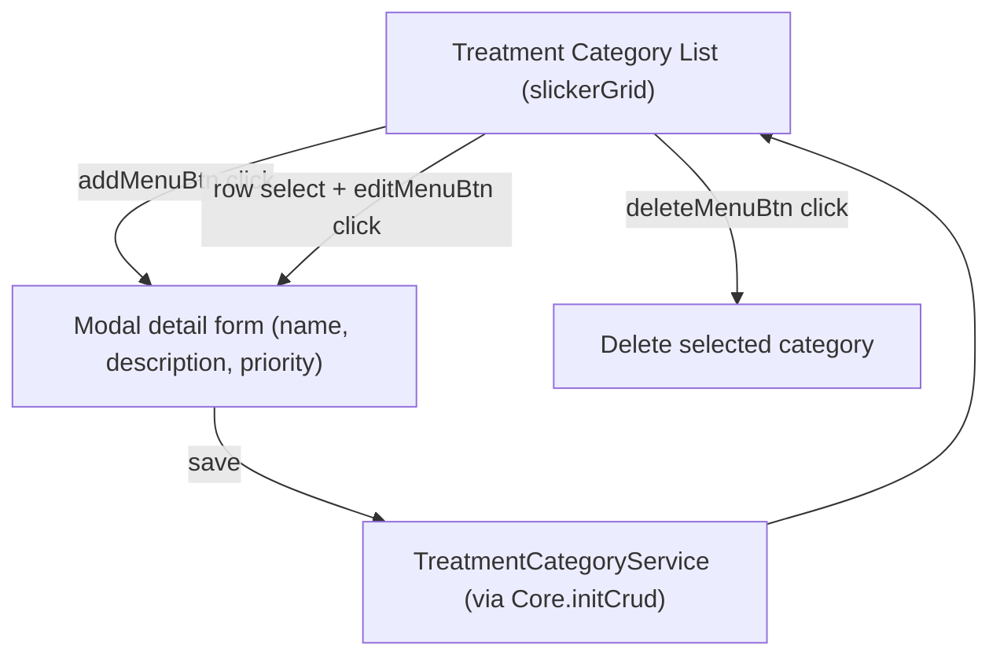

---
---

# Treatment List & Treatment Category CRUD

This analysis covers two related pages:

1. **Treatment List** (`treatment/index.htmlm` + `treatment/index.js`) — A calendar-style MonthTable grid displaying treatments (a type of appointment with `jobType="TREATMENT"`). Reuses the shared `appointment/details.html` detail panel, `assignUser.html` dialog, and `profile/docFinder.html` lookup. Includes a location-reminder dialog and filter panel.

2. **Treatment Category** (`treatmentCategory/index.htmlm` + `treatmentCategory/index.js`) — A simple CRUD page for managing treatment categories with a standard grid and modal detail form.

**Key architectural note**: The Treatment list is NOT a standalone feature — it is a specialized view of the Appointment system filtered to `jobType="TREATMENT"`. It shares `AppointmentService`, `AppointmentDetails`, and all appointment state/assignment logic. The only treatment-specific additions are the location-reminder dialog and the export filename.

---

## Part 1: Treatment List Page

### Behavior Diagrams

#### Dialog Navigation Diagram



#### Toolbar Permission Diagram



---

### HTMLM Header Metadata

| Field | Method | Value / Params | Purpose |
| :--- | :--- | :--- | :--- |
| `usePanel` | variable | `true` | Enables panel layout |
| `navBar` | template | `../_include/navbar.mustache` | Standard navigation bar |
| `siteloader` | template | `../_include/siteloader.mustache` | Loading indicator |
| `search` | variable | `true` | Enables global site search bar (`#siteSearch`) |
| `nav` | variable | `{ filter: true, buttons: [...] }` | Toolbar button definitions (see Toolbar Buttons below) |
| `jobType` | variable | `"TREATMENT"` | Filters to treatment type |
| `appointmentDetails` | template | `../appointment/details.html` | Shared appointment detail/edit panel |
| `assignUserDlg` | template | `../appointment/assignUser.html` | Assign user dialog (cross-module) |
| `docFinder` | template | `../profile/docFinder.html` | Doctor finder lookup dialog (cross-module) |

**Note**: Unlike the Appointment list page, the Treatment page does NOT have an `addMenuBtn` — treatments cannot be created from this view. The `onCreate` callback explicitly returns `false`.

---

### Grid Columns (MonthTable — Dynamic)

The Treatment list uses `MonthTable` (calendar grid), NOT a standard DataTables row-based table. Columns are dynamically generated from the backend service response.

| Axis | Content | Source |
| :--- | :--- | :--- |
| Row headers | Day of month (1-31) | Generated by MonthTable from current month |
| Column headers | Job/service names | Returned by `AppointmentService` for current month (filtered to `TREATMENT`) |
| Cells | Treatment entries with state + assigned staff | Rendered by custom `renderFn` callback |

### MonthTable Initialization

```
MonthTable.init(serviceName, paramFn, prefillFn, transformFn, renderFn)
```

| Parameter | Value | Purpose |
| :--- | :--- | :--- |
| `serviceName` | `"AppointmentService"` | Backend service to call |
| `paramFn` | `(param) => ["TREATMENT", param[0], param[1]]` | Builds request params: `[type, month, year]` |
| `prefillFn` | Creates prefill object from cell click | Returns `{ date, state:"READY", location, customer, job, timeStart, timeEnd }` |
| `transformFn` | Adds `info` and `colorClass` to each data item | Calls `i18n.appointmentState(data.state)`, deletes raw `color` |
| `renderFn` | Builds DOM `<span>` elements for each cell | Renders main entry + doc report icons + assigned staff sub-rows |

### Cell Rendering

Each treatment cell contains:

| Element | Content | CSS class | Condition |
| :--- | :--- | :--- | :--- |
| Main span | State icon + escaped name | `{info.colorClass}` (from `appointmentState()`) | Always |
| Report icon | `fa-file-check` (submitted) or `fa-file-alt` (pending) | (inline) | `data.details.requireReport` is truthy |
| Sub-row: assigned staff | `{index}. {stateIcon} {displayName}` | `sub {docState.color}` | `data.details.assigned` array has entries |
| Sub-row: missing staff | `{index}. fa-octagon ---` | `sub state-missing` | Assigned entry is `null` |

**Difference from Appointment list**: Treatment cells include report status icons (`fa-file-check` / `fa-file-alt`) based on `requireReport` and `dateSubmitted` fields. Appointment cells show referenced appointment sub-rows instead.

---

### Toolbar Buttons

| Button ID | Icon | Label (i18n key) | Initial state | Action |
| :--- | :--- | :--- | :--- | :--- |
| `reloadMenuBtn` | `fa-sync` | `action.reload` | Enabled | Triggers `$(document).trigger("reloadGrid")` — also auto-triggered on page load via `.click()` |
| `editMenuBtn` | `fa-pencil` | `action.change` | **Disabled** | Opens detail panel for selected treatment (enabled on selection) |
| (spacer) | — | — | — | Visual separator |
| `exportMenuBtn` | `fa-file-export` | `action.export` | Enabled | Downloads Excel export for current month |
| `locationReminderMenuBtn` | `fa-file-export` | `appointment.reminder` | Enabled | Opens location reminder dialog |

**Note**: No `addMenuBtn` and no `deleteMenuBtn` exist on this page. Treatments are created through a different flow (not from this list).

---

### Dialog: Send Location Reminder (`#sendLocationReminderDlg`)

**Container**: `<div id="sendLocationReminderDlg">` — modal dialog initialized via `Dialog.init()`
**Icon**: `far fa-business-time`
**Color**: `bg-color-appointment`
**Title**: `{{i18n.Treatment}}` (localized)

#### Form Elements

| # | Text-Reference / Name | Symbol | Datamodel | Type | Options | Placeholder | Default | Required | Read-only | Condition/Permission |
| :--- | :--- | :--- | :--- | :--- | :--- | :--- | :--- | :--- | :--- | :--- |
| — | `treatment.reminder.text1` | — | — | `<p>` (static text) | — | — | — | — | — | Always shown |
| 1 | `action.dateStart` (title) | `far fa-play` | `data.start` | `<input class="date">` | — | — | Next Monday (start of next week, 00:00:01) | Yes (`mandatory`) | No | — |
| 2 | `days` (suffix label) | — | `data.days` | `<input type="number">` | — | — | `7` | Yes (`mandatory`) | No | — |
| — | `treatment.reminder.text2` | — | — | `<p class="text-muted">` (static help text) | — | — | — | — | — | Always shown |

#### Default Values Logic

```javascript
const start = luxon.DateTime.now()
    .set({ hour: 0, minute: 0, second: 1 })
    .startOf('week')
    .plus({ weeks: 1 });
// start = next Monday at 00:00:01
// days = 7 (one full week)
```

#### Server Call on Confirm

| Service | Method | Parameters | Response |
| :--- | :--- | :--- | :--- |
| `AppointmentService` | `sendAppointmentReminderLocations` | `[data.start, data.days, ["TREATMENT"]]` | Array of recipient names → `alert("Gesendet: " + recipients.join(", "))` |

**HARDCODED**: The success alert uses German text `"Gesendet: "` (meaning "Sent: ").

---

### Filter Panel

**Container**: `<div id="filter" class="offcanvas offcanvas-end">` (Bootstrap 5 offcanvas, right-side slide-in)
**Options**: `data-bs-scroll="true"` (body scroll allowed), `data-bs-backdrop="false"` (no backdrop overlay)
**Header**: `<h5>` with `fa-filter` icon + text "Filter" (HARDCODED, not i18n)

#### Form Elements

| # | Element ID | Type | Icon | Placeholder / Label | i18n key | Filter mechanism | Notes |
| :--- | :--- | :--- | :--- | :--- | :--- | :--- | :--- |
| 1 | `filterDay` | `<input type="number">` | `fa-calendar-day` | `"Tag"` | `action.date` (title only) | `MonthTable.filterDay()` — filters rows by day number | **HARDCODED** placeholder "Tag" (German for "Day") |
| 2 | `filterJob` | `<input type="text">` | `fa-briefcase-medical` | `{{i18n.jobId}}` | `jobId` | `MonthTable.filterCol()` — filters columns by job name substring match | |
| 3 | `filterState` | `<select>` | `fa-traffic-light` | `"- {{i18n.AppointmentState}} -"` (empty option) | `AppointmentState` | Triggers `#siteSearch` filter event → `MonthTable.filter()` | 12 state options (see below) |
| 4 | `filterReset` | `<button>` | — | `{{i18n.button.reset}}` | `button.reset` | Clears all filter inputs and re-triggers all filter events | |

#### Filter State Options

| Value | i18n key |
| :--- | :--- |
| `""` | `- {{i18n.AppointmentState}} -` (empty / show all) |
| `READY` | `AppointmentState.READY` |
| `STARTED` | `AppointmentState.STARTED` |
| `REQUESTED` | `AppointmentState.REQUESTED` |
| `LOCKEDIN` | `AppointmentState.LOCKEDIN` |
| `ACTIVE` | `AppointmentState.ACTIVE` |
| `REOPENED` | `AppointmentState.REOPENED` |
| `DONE` | `AppointmentState.DONE` |
| `CLOSED` | `AppointmentState.CLOSED` |
| `STORNO` | `AppointmentState.STORNO` |
| `RESCHEDULED` | `AppointmentState.RESCHEDULED` |
| `CANCELED` | `AppointmentState.CANCELED` |
| `ARCHIVED` | `AppointmentState.ARCHIVED` |

**Note**: Unlike the Appointment list which renders state options via triple-mustache from an enum, the Treatment list has the `<option>` elements hardcoded in the HTMLM template (lines 94-107).

#### Filter Logic Details

| Filter | Scope | Match logic |
| :--- | :--- | :--- |
| Site search (`#siteSearch`) + State (`#filterState`) | Cell-level (`MonthTable.filter`) | If state filter is set, must match `data.state` exactly. Then matches assigned user `displayName` or appointment `name` (case-insensitive substring). Both empty = show all. |
| Day (`#filterDay`) | Row-level (`MonthTable.filterDay`) | Exact match on `row.day` number. Empty/NaN = show all. |
| Job (`#filterJob`) | Column-level (`MonthTable.filterCol`) | Substring match on `col.data.name` (case-insensitive). Empty = show all. |

---

### Click Actions

| Trigger | Target | Action | Details |
| :--- | :--- | :--- | :--- |
| Cell click in MonthTable | Treatment entry | Opens detail panel via `Core.initCrud` | Prefill data: `{ date, state:"READY", location, customer, job, timeStart, timeEnd }` |
| Assigned staff sub-row click | Staff `<span class="sub">` | Opens detail panel | `span.data().pojo` contains the assigned staff object |
| Reload button click | `#reloadMenuBtn` | Refreshes grid | `$(document).trigger("reloadGrid")` — also fires on page load |
| Edit button click | `#editMenuBtn` | Edits selected treatment | Disabled until a treatment is selected |
| Export button click | `#exportMenuBtn` | Downloads Excel file | `GET /get/AppointmentService/export/TREATMENT/{year}/{month}/Termine-Therapie-{year}_{month}.xls` |
| Reminder button click | `#locationReminderMenuBtn` | Opens reminder dialog | Pre-fills start=next Monday, days=7 |
| Reminder confirm | `#sendLocationReminderDlg` | Sends reminders | `AppointmentService.sendAppointmentReminderLocations(start, days, ["TREATMENT"])` |

---

### Server Calls

| Action | Service | Method / URL | Parameters | Response handling |
| :--- | :--- | :--- | :--- | :--- |
| Load month data | `AppointmentService` | Via `MonthTable.init()` | `["TREATMENT", month, year]` | Populates calendar grid cells |
| Get treatment detail | `AppointmentService` | Via `Core.initCrud` (`getMethod: AppointmentDetails.getMethod`) | Treatment/appointment ID | Fills shared detail panel |
| Export month | `AppointmentService` | `GET /get/AppointmentService/export/TREATMENT/{year}/{month}/Termine-Therapie-{year}_{month}.xls` | Year, month in URL path | Browser downloads `.xls` file |
| Send location reminder | `AppointmentService` | `sendAppointmentReminderLocations` | `[data.start, data.days, ["TREATMENT"]]` | Returns array of recipient names |

### CRUD Configuration

```javascript
Core.initCrud($this, {
    grid: $grid,
    detail: $detail,
    serviceName: "AppointmentService",
    getMethod: AppointmentDetails.getMethod,
    onCreate: function(cb) { return false; },   // creation disabled
    onDone: function(data) {
        $(document).trigger("reloadGrid");
        return data;
    },
    deeplink: { view: false }
});
```

Key differences from Appointment list:
- `onCreate` returns `false` — no treatment creation from this view
- No `addMenuBtn` in toolbar
- `deeplink.view` is `false` — no direct URL linking

---

### Location / Room Selection Logic

The page includes cascading location-room selection (shared pattern with appointment):

| Element | Behavior |
| :--- | :--- |
| `#selectedLocation` | On change: unlocks `#selectedRoom`, clears room selection |
| `#selectedRoom` | Locked (`readonly`) when no location is selected. On change: auto-fills location from room's parent location if location is empty. Uses `Core.autoselect()` with filter function returning selected location ID. |

---

### Cross-Module References

| Template | Source path | Mustache partial | Purpose | Also used by |
| :--- | :--- | :--- | :--- | :--- |
| `details.html` | `appointment/details.html` | `{{> appointmentDetails}}` | Shared appointment/treatment detail panel with tabs (Info, Referenced, Patient, Assigned, Suggestion) | Appointment list, Shift list |
| `assignUser.html` | `appointment/assignUser.html` | `{{> assignUserDlg}}` | Conflict-resolution dialog when assigning staff to overlapping appointments | Appointment list |
| `docFinder.html` | `profile/docFinder.html` | `{{> docFinder}}` | Doctor/staff finder lookup dialog with search + filter by job/day/time | Appointment list |

The detail panel title is dynamically set on `dialogopen`:
```javascript
$detail.on('dialogopen', () => $detail.find('.offcanvas-title').text($detail.data().titletreatment));
```
This reads from `data-titleTREATMENT="{{i18n.Treatment}}"` on the detail panel, ensuring the shared panel shows "Treatment" (localized) as the title instead of "Appointment".

---

## Part 2: Treatment Category CRUD

### Behavior Diagram



### HTMLM Header Metadata

| Field | Method | Value / Params | Purpose |
| :--- | :--- | :--- | :--- |
| `usePanel` | variable | `true` | Enables panel layout |
| `navBar` | template | `../_include/navbar.mustache` | Standard navigation bar |
| `nav` | variable | `{ filter: false, buttons: [...] }` | Toolbar (no filter panel) |

**Note**: No `search`, no `siteloader`, no `filter`, no cross-module templates. This is a minimal CRUD page.

---

### Grid Columns

Standard `slickerGrid` with explicit column definitions:

| # | Field | Header (i18n key) | Sortable | Resizable | Width |
| :--- | :--- | :--- | :--- | :--- | :--- |
| 1 | `id` | `id` (hardcoded) | Yes | Yes | 80 |
| 2 | `name` | `label.name` | Yes | Yes | 80 |
| 3 | `description` | `label.description` | Yes | Yes | 80 |
| 4 | `prio` | `label.priority` | Yes | Yes | 80 |

### Grid Configuration

```javascript
$grid.slickerGrid({
    fullscreen: true,
    dataService: {
        service: "TreatmentCategoryService",
        method: "getAll",
        param: function() { return [$this.data().filter, 100]; },
        dataProcess: function(data) { return data; }
    },
    saveSettings: function(settings) {
        const name = $("#gridSetting").attr("data-code");
        if (name && name?.length > 0)
            Core.conn.execute("UserService", "saveSetting", [name, JSON.stringify(settings)]);
    }
});
```

---

### Toolbar Buttons

| Button ID | Icon | Label (i18n key) | Initial state | Action |
| :--- | :--- | :--- | :--- | :--- |
| `addMenuBtn` | `fa-plus-square` | `action.add` | Enabled | Opens modal detail form for new category |
| `editMenuBtn` | `fa-pencil` | `action.change` | **Disabled** | Opens modal detail form for selected category |
| `deleteMenuBtn` | `fa-trash` | `action.delete` | **Disabled** | Deletes selected category |

---

### Modal Detail Form

**Container**: `<div class="detail" data-target="modal">` — rendered as a Bootstrap modal
**Icon**: `fas fa-boxes`
**Color**: `bg-color-treatmentCategory`
**Title**: `{{i18n.treatmentCategory}}`

#### Form Elements

| # | Text-Reference / Name | Symbol | Datamodel | Type | Options | Placeholder | Default | Required | Read-only | Condition/Permission |
| :--- | :--- | :--- | :--- | :--- | :--- | :--- | :--- | :--- | :--- | :--- |
| 1 | `label.name` | — | `data.name` | `<input class="form-control">` | — | `{{i18n.label.name}}` | — | No (no `mandatory` class) | No | — |
| 2 | `label.description` | — | `data.description` | `<input class="form-control">` | — | `{{i18n.label.description}}` | — | No | No | — |
| 3 | `label.priority` | — | `data.prio` | `<input class="form-control number">` | — | `{{i18n.label.priority}}` | — | No | No | — |

**Layout**: Single row with three `col-md-3` columns (compact horizontal layout).

### CRUD Configuration

```javascript
Core.initCrud($this, {
    grid: $grid,
    detail: $detail,
    serviceName: "TreatmentCategoryService",
    getMethod: "get",
    onSave: function(data) { return data; }
});
```

### Server Calls

| Action | Service | Method | Parameters | Response handling |
| :--- | :--- | :--- | :--- | :--- |
| Load all categories | `TreatmentCategoryService` | `getAll` | `[filter, 100]` | Populates grid rows |
| Get single category | `TreatmentCategoryService` | `get` | Category ID | Fills modal form |
| Save category | `TreatmentCategoryService` | Via `Core.initCrud` | Category data object | Identity transform (`onSave` returns data as-is) |
| Delete category | `TreatmentCategoryService` | Via `Core.initCrud` (delete) | Category ID | Removes row from grid |
| Save grid settings | `UserService` | `saveSetting` | `[settingName, JSON.stringify(settings)]` | Persists column widths/order per user |

---

## Translation Table

| Key | German (DE) | English (EN) | Notes |
| :--- | :--- | :--- | :--- |
| `Treatment` | Therapie | Treatment | Page title, detail dialog title |
| `Treatment.comment` | (Kommentar) | Comment | Treatment comment field |
| `Treatment.archived` | (Archiviert) | Archived | Archived flag label |
| `treatment.reminder.text1` | (Erinnerungstext 1) | (Reminder paragraph 1) | Static text in reminder dialog |
| `treatment.reminder.text2` | (Erinnerungstext 2) | (Reminder paragraph 2) | Help text (muted) in reminder dialog |
| `AppointmentType.TREATMENT` | (Therapie) | therapy | Type label for treatments |
| `appointment.reminder` | (Erinnerung) | Reminder | Toolbar button label for location reminder |
| `action.reload` | (Neu laden) | Reload | Toolbar button |
| `action.change` | (Bearbeiten) | Edit | Toolbar button |
| `action.export` | (Exportieren) | Export | Toolbar button |
| `action.add` | (Hinzufugen) | Add | Toolbar button (category page) |
| `action.delete` | (Loschen) | Delete | Toolbar button (category page) |
| `action.dateStart` | (Startdatum) | Start date | Reminder dialog date input title |
| `days` | (Tage) | Days | Reminder dialog days suffix |
| `action.date` | (Datum) | Date | Filter day input title |
| `jobId` | (Job ID) | Job ID | Filter job input placeholder |
| `AppointmentState` | (Zustand) | State | Filter state dropdown label |
| `AppointmentState.READY` | Angelegt | Ready | |
| `AppointmentState.STARTED` | (Gestarted) | Started | |
| `AppointmentState.REQUESTED` | Angefragt | Requested | |
| `AppointmentState.LOCKEDIN` | Bestatigt | Locked in | |
| `AppointmentState.ACTIVE` | Gestarted | Active | |
| `AppointmentState.REOPENED` | Wieder Geoffnet | Reopened | |
| `AppointmentState.DONE` | Durchgefuhrt | Done | |
| `AppointmentState.CLOSED` | Uberpruft | Closed | |
| `AppointmentState.STORNO` | Kunde Abgesagt | Storno | |
| `AppointmentState.RESCHEDULED` | Verschoben | Rescheduled | |
| `AppointmentState.CANCELED` | Ausgefallen (Arzt) | Canceled | |
| `AppointmentState.ARCHIVED` | (Archiviert) | Archived | |
| `button.reset` | (Zurucksetzen) | Reset | Filter reset button |
| `label.name` | (Name) | Name | Category grid + form |
| `label.description` | (Beschreibung) | Description | Category grid + form |
| `label.priority` | (Prioritat) | Priority | Category grid + form |
| `treatmentCategory` | (Behandlungskategorie) | Treatment Category | Category modal title |
| `null.name` | — | — | From `messages.i18n.js` — null name fallback |
| **"Tag"** | Tag | Day | **HARDCODED** German placeholder on `#filterDay` input |
| **"Filter"** | Filter | Filter | **HARDCODED** label in offcanvas header |
| **"Gesendet: "** | Gesendet: | Sent: | **HARDCODED** German in reminder success alert |
| **"Termine-Therapie-"** | — | — | **HARDCODED** export filename prefix |

---

## Architectural Notes for Rebuild

### Treatment List

1. **Shared Appointment infrastructure**: The Treatment list is essentially the Appointment list with `jobType="TREATMENT"`, no create button, and an added location-reminder dialog. The rebuild should model this as a filtered/parameterized view of the Appointment feature, not a separate feature.

2. **MonthTable component**: Needs a reusable React calendar-grid component. The same component is used by Appointment, Shift, and Treatment lists. Key features:
   - Dynamic columns from backend
   - Month/year navigation
   - Cell-level, row-level, and column-level filtering
   - Click-to-open detail panel
   - Cell rendering via render function (state icons, sub-rows for assigned staff)

3. **Report status icons**: Treatment cells uniquely display document report status (`requireReport` + `dateSubmitted`). This is treatment-specific rendering logic within the shared MonthTable cell renderer.

4. **Location reminder**: Treatment-specific feature. A simple form dialog (start date + days) that triggers a server-side batch operation. The success feedback currently uses a browser `alert()` with hardcoded German text — should be replaced with a proper toast notification with i18n.

5. **No create flow**: Unlike Appointment list, treatments cannot be created from the Treatment list (`onCreate` returns `false`). The edit flow reuses the shared appointment detail panel.

### Treatment Category

1. **Simple CRUD**: Standard grid + modal pattern. Ideal candidate for a TanStack Table with inline-modal edit form using Shadcn `Dialog`.

2. **Three fields only**: `name` (text), `description` (text), `prio` (number). No complex relationships, no conditional fields, no cross-module dependencies.

3. **No filter**: The page has no filter panel and no search. Just Add/Edit/Delete toolbar actions.

4. **Grid settings persistence**: Column widths/order are saved per user via `UserService.saveSetting`. Consider whether this is needed in the rebuild or if responsive defaults suffice.
