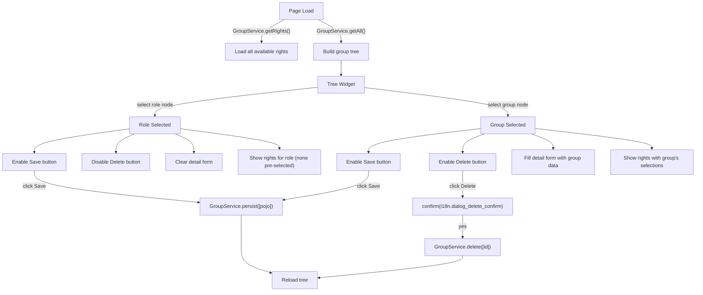
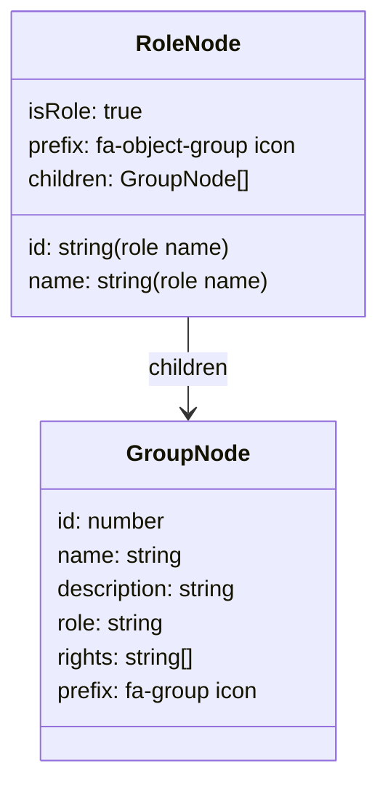

> **Split from**: `admin/05-sysadmin-views.md`
> **Sections extracted here**: Group Management (tree, detail panel, rights, service calls)
> **Other domains received**: `system/admin-system/05-sysconfig-import.md` got System Configuration and CSV Import sections

# 3. Group Management (`group.htmlm` + `group.js`)

**Container**: `
`
**Header**: `<h3>` with text `{{i18n.action.groups}}`
**Layout**: Two-panel layout -- left tree panel (250px float) + right detail card (500px inline-block).

## Group Management Diagram

## Tree Data Structure

Groups are fetched flat via `GroupService.getAll()` and organized client-side into a tree by `role` field. Each unique `role` value becomes a parent `RoleNode`; groups with that role become its children.

## Special Component: jQuery Tree Widget

- **Plugin**: `jquery.tree.js` (loaded in parent `sysadmin.htmlm`)
- **CSS**: `jquery.tree.css`
- **Configuration**:
  - `open: true` -- all nodes expanded by default
  - `load: false` -- manual data loading via `loadData` callback
  - `drop: null` -- drag-and-drop disabled
  - `dblclick`: empty handler (no action)
  - `select`: populates detail panel based on node type (role vs group)
  - `loadData`: fetches data and transforms into tree structure

## Detail Panel (`#groupDetails`)

**Container**: Bootstrap card with header "Details" (HARDCODED English), jsForm-enabled.

### Form Elements

| Text-Reference / Name | Symbol | Datamodel | Type | Placeholder | Default | Required | Read-only | Condition |
| :--- | :--- | :--- | :--- | :--- | :--- | :--- | :--- | :--- |
| Name | -- | `data.name` | text input (`.mandatory.form-control`) | `{{i18n.label.name}}` | -- | Yes | No | -- |
| Description | -- | `data.description` | textarea (`.form-control`) | -- | -- | No | No | -- |
| Rights label | -- | -- | `<label>` | -- | -- | -- | -- | Text: `{{i18n.group.right}}` |
| Rights multiselect | -- | (manual via `Groups.getRights()`) | `<select multiple>` (`#groupRights`, height 150px) | -- | -- | No | No | Populated dynamically from `GroupService.getRights()` |

### Rights Multiselect Behavior

The `<select id="groupRights">` is populated dynamically by `Groups.updateRights(role, selected)`:

1. Fetches all rights on page load via `GroupService.getRights()` and caches in `Groups.rights`
2. Rights are sorted alphabetically by name
3. Each `<option>` displays: `{right.name} ({right.role})` with `title={right.description}`
4. Pre-selects options matching the group's existing `rights[]` array
5. On save, `Groups.getRights()` reads all selected options and returns their `name` values

### Hardcoded Role-to-Permission Mapping

The JS defines a static `Groups.roles` object mapping role names to base permissions:

| Role | USER | BACKUP_USER | RESTORE_USER | SUPERUSER | ADMIN |
| :--- | :--- | :--- | :--- | :--- | :--- |
| STANDARD | x | | | | |
| REGISTERED | x | x | | | |
| LEITER_INTERN | x | | x | | |
| KUNDE | x | x | x | x | |
| ADMIN_KUNDE | x | x | x | x | x |
| ADMIN | x | x | x | x | x |
| ADMIN_INTERN | x | x | x | x | x |

> **Note**: This mapping exists in the JS but is not actively used in the visible code paths. It may be vestigial or used by removed functionality.

### Click Actions

| Action ID | Symbol | Title | English | Service Call | Notes |
| :--- | :--- | :--- | :--- | :--- | :--- |
| `saveGroup` | -- | `{{i18n.button.save}}` | "Save" | `GroupService.persist([pojo])` | pojo includes name, description, rights[], role; reloads tree on success |
| `.deleteEntity` | -- | `{{i18n.button.delete}}` | "Delete" | `GroupService.delete([id])` | Requires `confirm(i18n.dialog_delete_confirm)`; disabled when role node selected; reloads tree on success |
| `refreshAuth` | -- | (not in HTML) | "Refresh Auth" | `GroupService.regenerate([])` | Button `#refreshAuth` referenced in JS but not present in `group.htmlm`; alert "Done" |

### Button State Logic

| Button | Initial State | Enabled When | Disabled When |
| :--- | :--- | :--- | :--- |
| Save (`#saveGroup`) | `disabled` | Any tree node selected | Initial load |
| Delete (`.deleteEntity`) | `disabled` | Group node selected (not role) | Role node selected or initial load |

## Group Service Calls Summary

| Service | Method | Trigger | Parameters | Response Handling |
| :--- | :--- | :--- | :--- | :--- |
| `GroupService` | `getRights` | Page load | `[]` | Cached in `Groups.rights`; sorted alphabetically |
| `GroupService` | `getAll` | Page load + after save/delete | `[]` | Transformed into tree structure; fills tree widget |
| `GroupService` | `persist` | Save button click | `[{name, description, rights[], role}]` | Reloads tree |
| `GroupService` | `delete` | Delete button click | `[id]` | Reloads tree after confirmation |
| `GroupService` | `regenerate` | Refresh button click | `[]` | Alert "Done" |

---

# Translation Table (Group View)

## i18n References Used

| Text-Reference | German | English | Notes |
| :--- | :--- | :--- | :--- |
| `{{i18n.action.groups}}` | Gruppen | Groups | Group page header |
| `{{i18n.label.name}}` | Name | Name | Group name input placeholder |
| `{{i18n.group.right}}` | Recht | Right | Label above rights multiselect |
| `{{i18n.button.save}}` | Speichern | Save | Group save button |
| `{{i18n.button.delete}}` | Loeschen | Delete | Group delete button |
| `i18n.dialog_delete_confirm` | (JS) Wirklich loeschen? | Really delete? | JS confirm dialog (used in group delete) |
| `i18n.dialog_validation_notOk` | (JS) Validierung fehlgeschlagen | Validation failed | JS alert (used in group save validation) |

## Hardcoded Strings Requiring i18n Keys

### Group View

| German (HARDCODED) | English Translation | Suggested i18n Key |
| :--- | :--- | :--- |
| "Details" | "Details" | `group.details` |
| "neue Gruppe Erstellen" (icon title) | "Create New Group" | `group.createNew` |

---

# Permissions Summary (Group View)

| Permission / Condition | Scope | Description |
| :--- | :--- | :--- |
| Sysadmin page access | All 3 views | Entire `sysadmin.htmlm` is an admin-only page; no explicit `{{#isAdmin}}` guard in sub-views -- access control is at the page/route level |
| `#saveGroup` button | Group detail | Enabled only when a tree node is selected |
| `.deleteEntity` button | Group detail | Enabled only when a group (not role) node is selected |

---

# Anomalies and Notes (Group View)

1. **Missing `#refreshAuth` button**: `group.js` binds a click handler to `#refreshAuth` but this button does not exist in `group.htmlm`. It may exist in another included template or was removed.

2. **`Groups.roles` mapping unused**: The static role-to-permission mapping in `group.js` lines 118-127 is defined but never referenced in any visible code path.

3. **jQuery tree dependency**: The group tree uses `jquery.tree.js` (a custom jQuery plugin loaded from `_lib/3rdparty/`). The rebuild should use a React-native tree component.
