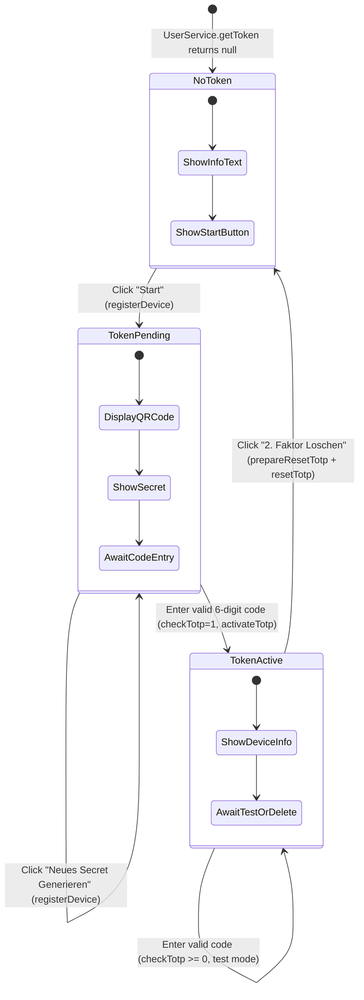
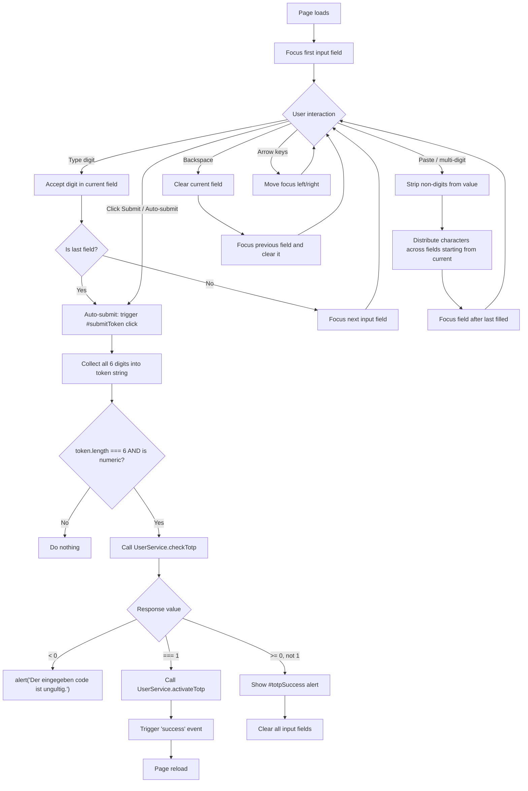
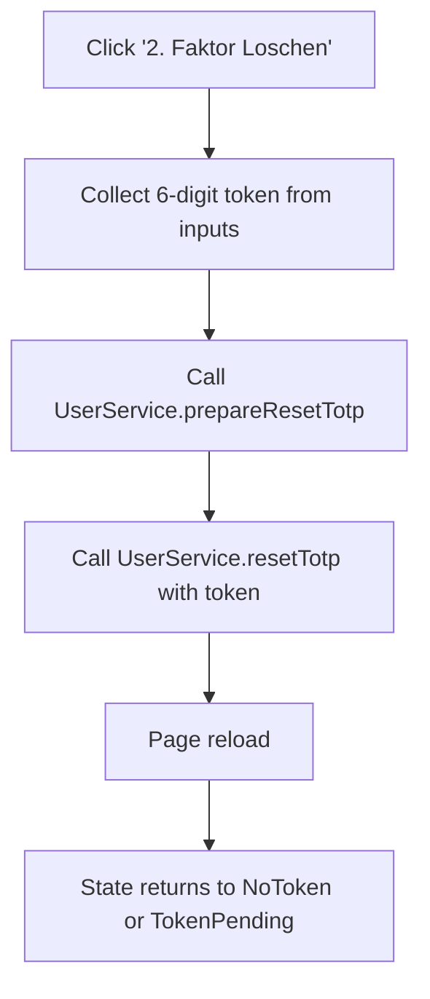

# 06 - Admin TOTP 2FA Onboarding

## Source Files

| File | Lines | Purpose |
|---|---|---|
| `admin/userSecurity.htmlm` | 15 | Security page wrapper; embeds TOTP onboarding via Mustache partial |
| `admin/totpOnboarding.html` | 171 | TOTP 2FA setup UI: QR code display, 6-digit input, authenticator app modal |
| `admin/totpOnboarding.js` | 112 | TOTP logic: keyup handler, paste distribution, verification, reset |
| `admin/totp.css` | 53 | Styling for authenticator app recommendation grid and modal |
| `admin/totpmessages.i18n.js` | 0 | Empty file (no translations defined) |
| `admin/userSecurity.js` | 5 | Minimal: listens for `success` event and reloads page |

## HTMLM Header Metadata

```json
[
  {"field":"totp", "method":"serviceCall","params":[{"service":"UserService","method":"getToken","param":[]}]},
  {"field":"totpOnboarding", "method":"template","params":["../admin/totpOnboarding.html"]}
]
```

- `totp`: Fetches the user's TOTP token record from `UserService.getToken`. Returns an object with `activated`, `secret`, `agent`, `ip`, `dateUsed` fields.
- `totpOnboarding`: Loads the partial template for TOTP onboarding UI.

## Page States (Conditional Rendering)

The template uses Mustache conditionals to show three distinct states:

| State | Condition | Description |
|---|---|---|
| **No Token** | `{{^totp}}` (totp is falsy) | Initial state: informational text + "Start" button to register a device |
| **Token Pending** | `{{#totp}}` + `{{^activated}}` | QR code displayed, secret visible, 6-digit input for activation |
| **Token Active** | `{{#totp}}` + `{{#activated}}` | Device info shown, code input for testing, delete button available |

---

## 1. Form Elements

### 1.1 Six-Digit TOTP Code Input (Split Input)

Six individual `<input>` elements rendered inside `#checkTotp`:

| # | Name/Ref | Symbol | Type | Options | Placeholder | Default | Required | Read-only | Condition |
|---|---|---|---|---|---|---|---|---|---|
| 1 | `input.single-digit.fist-digit` | -- | `text` (single char) | -- | `-` | `""` | Yes (for submit) | No | `{{#totp}}` |
| 2 | `input.single-digit` (2nd) | -- | `text` (single char) | -- | `-` | `""` | Yes | No | `{{#totp}}` |
| 3 | `input.single-digit` (3rd) | -- | `text` (single char) | -- | `-` | `""` | Yes | No | `{{#totp}}` |
| -- | Dash separator `-` | -- | Static text | -- | -- | -- | -- | -- | `{{#totp}}` |
| 4 | `input.single-digit` (4th) | -- | `text` (single char) | -- | `-` | `""` | Yes | No | `{{#totp}}` |
| 5 | `input.single-digit` (5th) | -- | `text` (single char) | -- | `-` | `""` | Yes | No | `{{#totp}}` |
| 6 | `input.single-digit.totpCheck` (6th) | -- | `text` (single char) | -- | `-` | `""` | Yes | No | `{{#totp}}` |

Visual layout: `[ _ ] [ _ ] [ _ ] - [ _ ] [ _ ] [ _ ]` (3-dash-3 grouping)

### 1.2 Hidden Detail Dialogs

| Name/Ref | Symbol | Datamodel | Type | Placeholder | Condition |
|---|---|---|---|---|---|
| `data.name` (in `#setTotpDevice`) | -- | Device name | `text` | `{{i18n.login.totp.device}}` | Hidden (`display:none`) |
| `data.code` (in `#totpCodeDialog`) | -- | TOTP code | `text` | `{{i18n.login.verifyTOTPCode}}` | Hidden (`display:none`) |

### 1.3 Device Information Display (Read-Only, Active State)

| Field | Datamodel Path | Type | Condition |
|---|---|---|---|
| User-Agent | `{{agent}}` | Read-only text | `{{#activated}}` |
| IP | `{{ip}}` | Read-only text | `{{#activated}}` |
| Activated date | `{{datetime activated}}` | Read-only date | `{{#activated}}` |
| Last used date | `{{datetime dateUsed}}` | Read-only date | `{{#activated}}` |

### 1.4 Secret Display (Pending State)

| Field | Datamodel Path | Type | Condition |
|---|---|---|---|
| Secret | `{{secret}}` | Read-only text | `{{^activated}}` (token exists but not activated) |
| Algorithm | -- | Static: `SHA1` | `{{^activated}}` |
| Digits | -- | Static: `6` | `{{^activated}}` |
| Interval | -- | Static: `30` | `{{^activated}}` |

---

## 2. Click Actions

| Action ID | Element | Symbol | Title | English | Notes |
|---|---|---|---|---|---|
| `addTOTPDevice` | `#addTOTPDevice` (button) | -- | `{{i18n.security.start}}` / HARDCODED: "Neues Secret Generieren" | Start / Generate New Secret | Calls `UserService.registerDevice([])`, reloads page |
| `submitToken` | `#submitToken` (button) | -- | `{{i18n.button.next}}` / HARDCODED: "Test" | Next / Test | Collects 6 digits, calls `UserService.checkTotp([token])` |
| `resetTOTP` | `#resetTOTP` (button) | -- | HARDCODED: "2. Faktor Loschen" | Delete 2nd Factor | Calls `UserService.prepareResetTotp([])` then `UserService.resetTotp([token])`, reloads |
| `totpApps` (modal) | `<a>` link | -- | HARDCODED: "Authenticator App" | Authenticator App | Opens Bootstrap modal `#totpApps` listing recommended apps |
| Auto-submit | Last digit keyup | -- | -- | -- | Automatically triggers `#submitToken` click when 6th digit entered |

---

## 3. Special Components

### 3.1 QR Code Display

- **Source**: `` -- server-generated QR code image
- **Condition**: Shown only in pending state (`{{#totp}}{{^activated}}`)
- **Contains**: TOTP provisioning URI (otpauth://...) encoded as QR
- **Adjacent info**: Secret key displayed as text for manual entry

### 3.2 Six-Digit Split Input with Auto-Focus, Paste Handler, and Auto-Submit

This is the core UX component. Key behaviors from `totpOnboarding.js`:

#### Keyboard Navigation

| Key | KeyCode | Behavior |
|---|---|---|
| Ctrl | 17 | Ignored (allows Ctrl+V combo) |
| Left Arrow | 37 | Focus previous input |
| Right Arrow | 39 | Focus next input |
| Backspace | 8 | Clear current input, focus previous, clear previous |
| Delete | 46 | Clear current input only |
| Digits 0-9 | 48-57, 96-105 | Accept digit, auto-advance to next input |
| Non-numeric | other | Rejected (input cleared) |

#### Paste Handler Logic

```
On keyup, if value > 9 OR keyCode == 86 (V for paste):
  1. Strip non-digit characters from pasted value
  2. Starting from current input, fill each subsequent input with one character
  3. Focus the input after the last filled character
```

#### Auto-Submit on Last Digit

When the 6th input (last `single-digit` with no next `input` sibling) receives a valid digit, `#submitToken` click is triggered automatically.

#### Initial Focus

On page load, focus is set to `input.fist-digit` (note: typo "fist" preserved from source).

### 3.3 Authenticator App Recommendation Modal

Bootstrap modal (`#totpApps`) showing a grid of 3 recommended authenticator apps:

| App | Platforms | Store Links |
|---|---|---|
| Google Authenticator | iOS, Android | App Store, Google Play |
| Microsoft Authenticator | iOS, Android | App Store, Google Play |
| AndOTP | Android, F-Droid | Google Play, F-Droid |

Styled with CSS grid (`.totp-grid`), cards with app icons and store badges.

### 3.4 Status Feedback

| Element | Type | Content | Trigger |
|---|---|---|---|
| `.totpStatus` | Empty div | -- | Unused in current code (placeholder) |
| `#totpSuccess` | Alert (hidden by default) | HARDCODED: "Code erfolgreich uberpruft!" | Shown when `checkTotp` returns value >= 0 and not 1 (valid test) |
| `alert()` | Browser alert | HARDCODED: "Der eingegeben code ist ungultig." | When `checkTotp` returns < 0 (invalid code) |

---

## 4. Service Calls

| Service Method | Parameters | Return Value | Trigger | Effect |
|---|---|---|---|---|
| `UserService.getToken` | `[]` | TOTP object or null | Page load (HTMLM serviceCall) | Populates `totp` template variable |
| `UserService.showToken` | -- | QR code image (PNG) | `` src attribute | Displays QR code for scanning |
| `UserService.registerDevice` | `[]` | -- | `#addTOTPDevice` click | Creates new TOTP secret, page reloads |
| `UserService.checkTotp` | `[token: string]` | `number` (-1 = invalid, 1 = needs activation, other = valid) | `#submitToken` click | Validates entered TOTP code |
| `UserService.activateTotp` | `[token: string]` | `boolean/data` | After `checkTotp` returns 1 | Activates TOTP, triggers `success` event |
| `UserService.prepareResetTotp` | `[]` | -- | `#resetTOTP` click | Prepares server for TOTP deletion |
| `UserService.resetTotp` | `[token: string]` | -- | After `prepareResetTotp` | Removes TOTP, page reloads |

### Verification Response Codes

| `checkTotp` Return | Meaning | UI Behavior |
|---|---|---|
| `< 0` | Invalid code | Browser `alert()` with error message |
| `=== 1` | Valid code, device not yet activated | Calls `activateTotp`, then reloads |
| `>= 0` (not 1) | Valid code, already activated (test mode) | Shows `#totpSuccess` alert, clears inputs |

---

## 5. Translation Table

| Text-Reference | German (from source) | English (inferred) | Notes |
|---|---|---|---|
| `i18n.security.text1` | *(not found in i18n files)* | *(unknown)* | Informational text about 2FA; used in no-token state |
| `i18n.security.text2` | *(not found in i18n files)* | *(unknown)* | Additional 2FA explanation text |
| `i18n.security.start` | *(not found in i18n files)* | Start | Button label to begin TOTP setup |
| `i18n.button.next` | *(not found in i18n files)* | Next | Submit button in pending state |
| `i18n.login.verifyTOTP` | *(not found in i18n files)* | Verify TOTP | Dialog title for hidden detail dialogs |
| `i18n.login.totp.device` | *(not found in i18n files)* | Device Name | Placeholder for device name input |
| `i18n.login.verifyTOTPCode` | *(not found in i18n files)* | TOTP Code | Placeholder for code input |
| HARDCODED | "2-Factor" | 2-Factor | Section heading |
| HARDCODED | "Gerateinformationen" | Device Information | Subheading in active state |
| HARDCODED | "Der 2. Faktor ist noch nicht aktiviert" | The 2nd factor is not yet activated | Subheading in pending state |
| HARDCODED | "Zur Aktivierung scannen Sie folgenden QR Code mit ihrer Authenticator App" | To activate, scan the following QR code with your Authenticator App | Instruction text in pending state |
| HARDCODED | "Neues Secret Generieren" | Generate New Secret | Button in pending state |
| HARDCODED | "Activated:" | Activated: | Label prefix |
| HARDCODED | "Letzte Benutzung:" | Last used: | Label prefix |
| HARDCODED | "Secret:" | Secret: | Label prefix |
| HARDCODED | "Algorythmus: SHA1" | Algorithm: SHA1 | TOTP parameter display (note: typo "Algorythmus") |
| HARDCODED | "Zeichen: 6" | Digits: 6 | TOTP parameter display |
| HARDCODED | "Interval: 30" | Interval: 30 | TOTP parameter display |
| HARDCODED | "Sie konnen hier ihren Token testen oder von ihrem Gerat entfernen" | You can test your token here or remove it from your device | Instruction in active state |
| HARDCODED | "Nach dem Scannen des QR Codes, konnen sie das Geat mit der Eingabe eines gultigen Tokens aktivieren" | After scanning the QR code, you can activate the device by entering a valid token | Instruction in pending state (note: typo "Geat") |
| HARDCODED | "Code erfolgreich uberpruft!" | Code successfully verified! | Success alert |
| HARDCODED | "Der eingegeben code ist ungultig." | The entered code is invalid. | Error alert (browser alert) |
| HARDCODED | "Zwei-Faktor Apps" | Two-Factor Apps | Modal header |
| HARDCODED | "Hier eine Liste an unterstutzten 2-FA Apps:" | Here is a list of supported 2FA apps: | Modal body text |
| HARDCODED | "2. Faktor Loschen" | Delete 2nd Factor | Reset button label |
| HARDCODED | "Test" | Test | Submit button label in active state |

**Note**: `totpmessages.i18n.js` is empty. The `i18n.security.*` keys are referenced but their definitions were not found in the scanned source files -- they may be defined in a shared/global i18n bundle.

---

## 6. Flow Diagrams

### 6.1 TOTP Onboarding State Machine



### 6.2 Code Entry and Verification Flow



### 6.3 Reset TOTP Flow



---

## 7. CSS Analysis

### Inline Styles (in template)

| Selector | Properties | Purpose |
|---|---|---|
| `.single-digit` | `display: inline-block; width: 45px; font-size: 16pt` | Individual TOTP digit input sizing |

### External Styles (`totp.css`)

| Selector | Purpose |
|---|---|
| `.totp-grid` | CSS grid layout for authenticator app cards (`repeat(auto-fit, minmax(240px, 1fr))`) |
| `.totp-card` | Card styling with border, rounded corners, shadow |
| `.totp-card header` | Flex layout for app icon + name |
| `.app-icon` | 28x28px app icon |
| `.store-badge` | Store download badges (max 34px height, 120px width) |
| `.stores` | Flex wrap layout for store links |
| `.modal-content` | Max-width 700px, centered |

---

## 8. Notable Implementation Details

### Typos in Source
- `fist-digit` class name (should be `first-digit`)
- `Algorythmus` (should be `Algorithmus` in German / `Algorithm` in English)
- `Geät` truncated to `Geät` in one place (encoding issue: "Gerat" without umlaut rendering)

### Security Observations
- The TOTP secret is displayed in plaintext on the pending activation page (`{{secret}}`)
- QR code is served as a server-rendered image at a predictable URL (`/get/UserService/showToken`)
- The reset flow calls `prepareResetTotp` then `resetTotp` sequentially with no confirmation dialog
- Error messages use browser `alert()` rather than inline UI feedback
- The `#totpSuccess` and error feedback are inconsistent (one uses `alert()`, the other uses an inline element)

### Architecture Notes
- All page transitions are done via `location.reload()` -- no SPA navigation
- The `success` event is a jQuery custom event on `#totpOnboarding`
- Both `userSecurity.js` and `totpOnboarding.js` listen for the `success` event (redundant)
- The `#setTotpDevice` and `#totpCodeDialog` detail dialogs are defined but never shown in the current JS code -- they appear to be legacy or unused elements
- The `totpmessages.i18n.js` file is loaded but empty, meaning all i18n keys referenced are resolved from a global bundle
