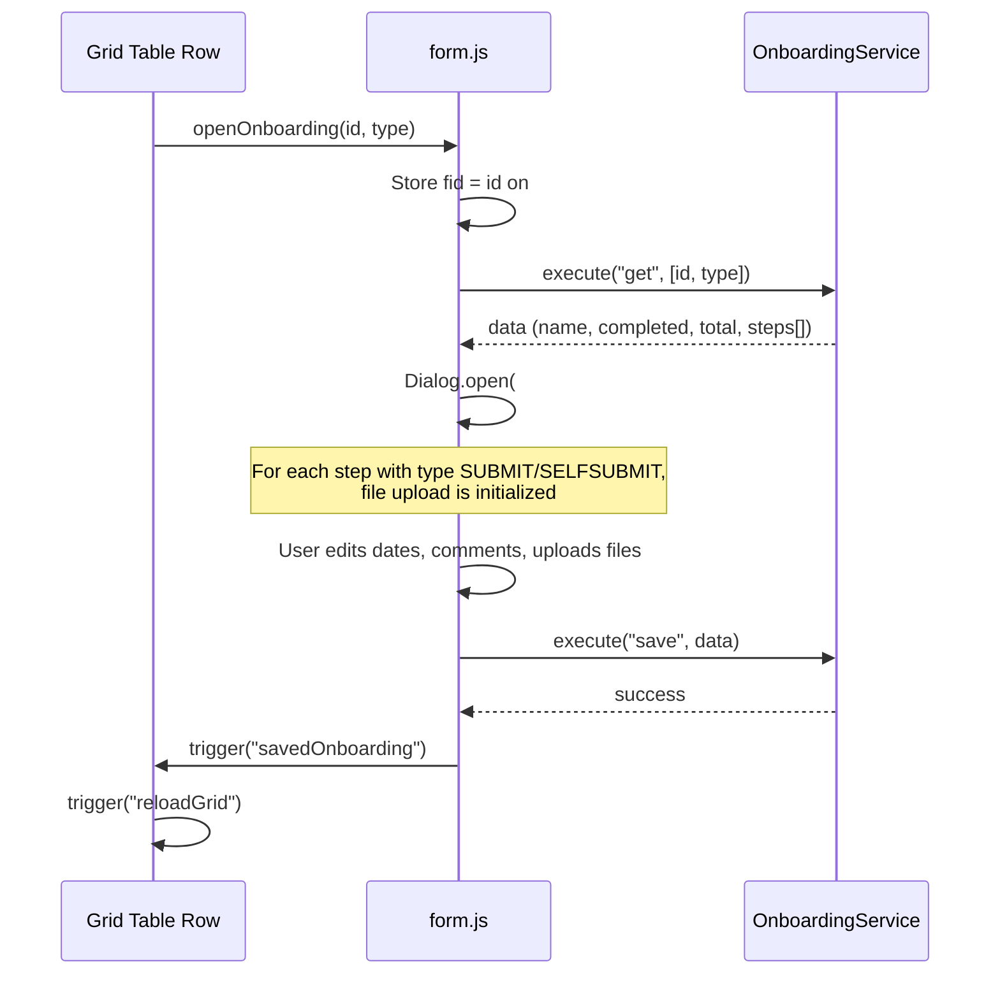

# Onboarding Module -- Legacy UI Analysis

> **Source**: `videoclinic-prod/web/src/main/webapp/onboarding/`
> **Analysis date**: 2026-03-22

---

## Cross-References

| Type | Direction | Detail | Linked Document | Condition / Context |
|------|-----------|--------|-----------------|---------------------|
| include | **Included by** | `{{> onboardingDlg}}` | [Staff Management List](../profile/profile-staff.md#2-block-staff-list-page-grid) | `staff.htmlm` embeds `onboarding/form.html` as Mustache partial; toolbar button opens dialog for selected employee |
| event | **Incoming** | `openOnboarding(id, "EMPLOYEE")` | [Staff Management List](../profile/profile-staff.md#9-click-actions-js) | `#onboardingMenuBtn` click on selected row calls `openOnboarding()` defined in `form.js` |

> **Include context:** This file's source `onboarding/form.html` is embedded as `{{> onboardingDlg}}` in the three onboarding list views (`index.htmlm`, `customer.htmlm`, `location.htmlm`) AND in [Staff Management List](../profile/profile-staff.md). The staff page invokes the dialog via `openOnboarding(id, "EMPLOYEE")` for the currently selected employee row.

---

## 1. Module Overview

The Onboarding module provides three list views that display onboarding progress in a **resource/row grid** (not a standard DataTables list). All three views share the same HTML structure and the same onboarding detail dialog (`form.html`). The only difference between the three views is the **assignment type filter** passed to the backend and the **export filename**.

| View | Route | Assignment Type | Export Filename | Nav Menu Roles |
|------|-------|----------------|-----------------|----------------|
| Employee Onboarding | `/onboarding.html` | `EMPLOYEE` | `OnboardingListExperts.xls` | ADMIN_INTERN, ADMIN |
| Customer Onboarding | `/onboardingCustomer.html` | `CUSTOMER` | `OnboardingListCustomer.xls` | KUNDE_ADMIN, ADMIN |
| Location Onboarding | `/onboardingLocation.html` | `LOCATION` | `OnboardingListLocation.xls` | KUNDE_ADMIN, ADMIN |

A related admin module **OnboardingStep** (`/onboardingStep.html`) manages the step definitions (templates) that drive the onboarding checklists. It is a separate CRUD module with its own grid and detail form.

---

## 2. Navigation Flow

```mermaid
flowchart TD
    subgraph "Sidebar Navigation"
        A["Admin Intern Menu"]
        B["Customer Admin Menu"]
    end

    A --> EMP["/onboarding.html<br/>Employee Onboarding<br/>(type=EMPLOYEE)"]
    A --> STEP["/onboardingStep.html<br/>Onboarding Step Admin"]

    B --> CUST["/onboardingCustomer.html<br/>Customer Onboarding<br/>(type=CUSTOMER)"]
    B --> LOC["/onboardingLocation.html<br/>Location Onboarding<br/>(type=LOCATION)"]

    EMP -- "click row" --> DLG["Onboarding Dialog<br/>(form.html)"]
    CUST -- "click row" --> DLG
    LOC -- "click row" --> DLG

    PROFILE["/profile/staff.htmlm<br/>Staff Profile"] -- "embedded" --> DLG

    STEP -- "defines templates for" -.-> DLG
```

### Key relationships

- **Three list views share one dialog**: `form.html` is included as a Mustache partial (`{{> onboardingDlg}}`) in all three list pages AND in `profile/staff.htmlm`.
- **OnboardingStep admin** defines the step templates (title, description, type, assignment type, validity dates) that populate the onboarding checklist rows shown in the dialog.
- The dialog is opened via the global `openOnboarding(id, type)` function defined in `form.js`.

---

## 3. Grid Table (All Three List Views)

### 3.1 Grid Type

All three list pages use `gridTable.js` -- a **custom resource/row grid** component, NOT the standard SlickGrid/DataTables pattern used elsewhere. The table element has `class="siteLoader table table-bordered"` with empty `<thead>` and `<tbody>` -- columns and rows are generated entirely by JavaScript.

### 3.2 How gridTable.js Works

| Aspect | Detail |
|--------|--------|
| **Data source** | `Core.conn.execute(service, "getData", params)` where service = `OnboardingService` |
| **Column generation** | Columns are created from `data.resources[]` returned by the backend. Each resource becomes a `<th>` with `background-color` from `res.color` and label from `res.name`. |
| **Row generation** | Rows come from `data.rows[]`. Each row has a `title` (rendered in the first `<td class="desc">`) and a `resources[]` array of cells. |
| **Cell rendering** | Each cell may contain multiple `items[]`. Items are rendered via the `renderFunc` callback: `<div style="text-align:center" title="${data.name}"><i class="fa fa-check"></i></div>` |
| **Navigation** | `nav: false` for all three onboarding views (no prev/next page arrows) |
| **Row click** | First `<td>` (description cell) is clickable (`cursor: pointer`). Calls `openOnboarding(data.id, TYPE)` |
| **Cell click** | Single click selects the row. Double-click triggers `newItem()` (creates prefilled data from the resource). |
| **Item click** | Clicking a rendered item inside a cell calls `openItem(id)` which triggers `rowAction` on the grid. |

### 3.3 Grid Columns (Dynamic)

Since columns are generated from backend data, there are no static column definitions. The grid structure is:

| Position | Source | Content |
|----------|--------|---------|
| Column 0 (row header) | `day.title` | Row description text (clickable) |
| Columns 1..N | `data.resources[i]` | Resource columns with `name` as header and `color` as background |

### 3.4 Filtering

| Filter | Trigger | Implementation |
|--------|---------|----------------|
| **Search (rows)** | `#siteSearch` keyup | `GridTable.filterDay()` -- filters rows by `data.row.title` case-insensitive substring match |
| **Job filter (columns)** | `#filterJob` keyup | `GridTable.filterCol()` -- filters columns by `col.data.name` case-insensitive substring match |

### 3.5 paramFunc by View

| View | paramFunc return | Effect |
|------|-----------------|--------|
| index.js (Employee) | `["EMPLOYEE"]` | Backend filters to employee onboarding data |
| customer.js | `["CUSTOMER"]` | Backend filters to customer onboarding data |
| location.js | `["LOCATION"]` | Backend filters to location onboarding data |

### 3.6 newItemData Structure

All three views construct the same shape when double-clicking a cell to create a new item:

```javascript
{
    date: day,            // The row's day value
    state: "READY",       // Default state
    location: data.data[0],
    customer: data.data[0]?.customer,
    job: data.data[1],
    timeStart: data.data[2],
    timeEnd: data.data[3]
}
```

---

## 4. HTMLM Header Metadata (Shared Across All Three Views)

All three `.htmlm` files have identical header metadata:

```json
[
    {"field":"usePanel", "method":"variable", "params":[true]},
    {"field":"navBar", "method":"template", "params":["../_include/navbar.mustache"]},
    {"field":"siteloader", "method":"template", "params":["../_include/siteloader.mustache"]},
    {"field":"onboardingDlg", "method":"template", "params":["../onboarding/form.html"]},
    {"field":"jobs", "method":"options", "params":[
        {"service":"JobService","method":"getAllOptions","style":"OPTION",
         "value":"code","content":"code","data":"pojo"}
    ]},
    {"field":"search", "method":"variable", "params":[true]},
    {"field":"nav", "method":"variable", "params":[{
        "filter": false,
        "buttons":[
            {"name":"action.reload", "id":"reloadMenuBtn", "icon":"sync"},
            {"name":"action.change", "id":"editMenuBtn", "icon":"pencil", "disabled":true},
            {"name":"Export", "id":"exportMenuBtn", "icon":"download"}
        ]
    }]}
]
```

---

## 5. Onboarding Dialog (form.html + form.js)

### 5.1 Dialog Configuration

| Property | Value |
|----------|-------|
| **ID** | `#onboardingDlg` |
| **Icon** | `fas fa-question` |
| **Width** | 1000px |
| **Color** | `bg-color-notify` |
| **Title** | `{{i18n.onboardingStep}}` |
| **Save button** | Yes (`Dialog.init("#onboardingDlg", {buttonSave: true})`) |

### 5.2 Dialog Header Fields

| Position | Content | Type |
|----------|---------|------|
| Left (col-md-6) | `data.name` (span.field) | Display-only (entity name) |
| Right (col-md-2) | `data.completed` / `data.total` | Display-only (progress counter) |

Note: There is a hidden `<input>` with `style="display:block;margin-left:-2000px;height:1px;"` positioned offscreen -- likely a focus trap or form validation anchor.

### 5.3 Steps Table (Collection)

The dialog contains a table with `class="collection"` bound to `data-field="data.steps"` and `id="onboardingStepList"`. Each row represents one onboarding step.

#### Form Elements Table

| Text-Reference / Name | Symbol | Datamodel | Type | Options | Placeholder | Default | Required | Read-only | Condition/Permission |
|----------------------|--------|-----------|------|---------|-------------|---------|----------|-----------|---------------------|
| `i18n.onboarding.step` | -- | `steps.step.title` | Display (bold) | -- | -- | -- | -- | Yes | -- |
| -- | -- | `steps.step.description` | Display (text) | -- | -- | -- | -- | Yes | -- |
| `i18n.label.date` | -- | `steps.dateStarted` | Date input | -- | -- | -- | No | No | -- |
| `i18n.label.date` | -- | `steps.dateEnd` | Date input | -- | -- | -- | No | No | -- |
| `i18n.onboarding.completed` | -- | `steps.dateCompleted` | Date input | -- | -- | -- | No | No | -- |
| `i18n.label.comment` | -- | `steps.comment` | Textarea | -- | -- | -- | No | No | -- |
| -- | fa-file | `steps.file` | File upload | -- | -- | -- | No | No | `step.type == "SELFSUBMIT" OR step.type == "SUBMIT"` |
| -- | -- | `steps.file.name` | Display (link) | -- | -- | -- | -- | Yes | `step.type == "SELFSUBMIT" OR step.type == "SUBMIT"` |

### 5.4 File Upload Logic

The file upload section is **conditionally visible** based on step type:

| Step Type | File Upload | Comment |
|-----------|-------------|---------|
| `SUBMIT` | Visible | File upload + download link |
| `SELFSUBMIT` | Visible | File upload + download link |
| `CHECK` | Hidden | Only date/comment fields |
| `SELFCHECK` | Hidden | Only date/comment fields |
| `SELFVIDEO` | Hidden | Only date/comment fields |

**Upload endpoint**: `OnboardingService.upload(stepId, onboardingId)`
**Download URL template**: `/get/OnboardingService/download/[[cur.id]]/[[data.id]]/[[cur.file.name]]`

### 5.5 Dialog Open/Save Flow



---

## 6. Click Actions Table

### 6.1 Nav Bar Buttons (All Three Views)

| Action ID | Symbol | Title | English | Notes |
|-----------|--------|-------|---------|-------|
| `reloadMenuBtn` | `fa-sync` | `action.reload` | Reload | i18n key |
| `editMenuBtn` | `fa-pencil` | `action.change` | Change | i18n key; disabled by default |
| `exportMenuBtn` | `fa-download` | `Export` | Export | **HARDCODED** string "Export" |

### 6.2 Grid Interactions

| Action | Trigger | Target | Effect |
|--------|---------|--------|--------|
| Row click | Click on `td.desc` | `openOnboarding(data.id, TYPE)` | Opens onboarding dialog for the clicked entity |
| Cell select | Single click on cell | Row | Adds `.selected` class to row |
| Cell new item | Double-click on cell | `newItem(day, resource)` | Prefills and triggers `#addMenuBtn` click |
| Item click | Click on `.item` div | `openItem(id)` | Triggers `rowAction` event on grid |
| Search | Keyup on `#siteSearch` | `GridTable.filterDay()` | Filters rows by title |
| Job filter | Keyup on `#filterJob` | `GridTable.filterCol()` | Filters columns by name |

### 6.3 Dialog Actions

| Action | Trigger | Effect |
|--------|---------|--------|
| Save | Dialog save button | Calls `OnboardingService.save(data)`, triggers `savedOnboarding` event |
| File upload click | Click on `.fileAction` icon | Opens hidden file input |
| File upload | File selected | Calls `OnboardingService.upload(stepId, onboardingId)` |
| File download | Click on file name link | Opens `/get/OnboardingService/download/{curId}/{dataId}/{fileName}` |

### 6.4 Export URLs

| View | Export URL |
|------|-----------|
| Employee | `/get/OnboardingService/export/EMPLOYEE/OnboardingListExperts.xls` |
| Customer | `/get/OnboardingService/export/CUSTOMER/OnboardingListCustomer.xls` |
| Location | `/get/OnboardingService/export/LOCATION/OnboardingListLocation.xls` |

---

## 7. Translation Table

### 7.1 Onboarding Module Keys (form.html)

| Text-Reference | German (inferred) | English | Notes |
|---------------|-------------------|---------|-------|
| `i18n.onboardingStep` | Onboarding Schritt | Onboarding Step | Dialog title |
| `i18n.onboarding.step` | Schritt | Step | Table column header |
| `i18n.label.date` | Datum | Date | Table column header (shared key) |
| `i18n.onboarding.completed` | Abgeschlossen | Completed | Table column header |
| `i18n.label.comment` | Kommentar | Comment | Table column header (shared key) |

### 7.2 Nav Bar Keys

| Text-Reference | German (inferred) | English | Notes |
|---------------|-------------------|---------|-------|
| `action.reload` | Aktualisieren | Reload | Nav button |
| `action.change` | Bearbeiten | Change | Nav button |
| `Export` | -- | Export | **HARDCODED** (not an i18n key) |

### 7.3 Navigation Menu Keys

| Text-Reference | German (inferred) | English | Notes |
|---------------|-------------------|---------|-------|
| `i18n.onboardingCustomerArea` | Kunden Onboarding | Customer Onboarding | Sidebar menu |
| `i18n.onboardingLocationArea` | Standort Onboarding | Location Onboarding | Sidebar menu |
| (none -- hardcoded) | -- | Onboarding | Sidebar menu for employee view; **HARDCODED** in index.json |
| `i18n.menu.onboardingStep` | Onboarding Schritte | Onboarding Steps | Sidebar menu (admin) |

### 7.4 OnboardingStep Types (from onboardingStep/messages.i18n.js)

| Text-Reference | German (inferred) | English | Notes |
|---------------|-------------------|---------|-------|
| `OnboardingType.SUBMIT` | Einreichen | Submit | Step type |
| `OnboardingType.CHECK` | Pruefen | Check | Step type |
| `OnboardingType.SELFCHECK` | Selbstpruefung | Self-Check | Step type |
| `OnboardingType.SELFSUBMIT` | Selbst einreichen | Self-Submit | Step type |
| `OnboardingType.SELFVIDEO` | Selbstvideo | Self-Video | Step type |

### 7.5 Assignment Types

| Text-Reference | German (inferred) | English | Notes |
|---------------|-------------------|---------|-------|
| `OnboardingAssignmentType.EMPLOYEE` | Mitarbeiter | Employee | Assignment type |
| `OnboardingAssignmentType.CUSTOMER` | Kunde | Customer | Assignment type |
| `OnboardingAssignmentType.LOCATION` | Standort | Location | Assignment type |

### 7.6 Hardcoded Strings in JS

| String | Location | German | Notes |
|--------|----------|--------|-------|
| `"Erfolgreich hochgeladen"` | form.js:14 | Erfolgreich hochgeladen | **HARDCODED** German alert after file upload success |

---

## 8. Backend Service Calls

| Service | Method | Parameters | Used By |
|---------|--------|------------|---------|
| `OnboardingService` | `getData` | `[assignmentType]` | Grid loading (via `GridTable.fillGrid`) |
| `OnboardingService` | `getGrid` | -- | `Core.initCrud` (CRUD init) |
| `OnboardingService` | `get` | `[id, type]` | Dialog open (`openOnboarding`) |
| `OnboardingService` | `save` | `[data]` | Dialog save |
| `OnboardingService` | `upload` | `[stepId, onboardingId]` | File upload in dialog |
| `OnboardingService` | `export` | URL: `/get/.../export/{TYPE}/{filename}` | Export button (GET request, opens new window) |
| `JobService` | `getAllOptions` | -- | HTMLM header (populates `jobs` options; style=OPTION, value=code, content=code, data=pojo) |

---

## 9. Cross-Module References

### 9.1 Embedding of form.html

The onboarding dialog (`form.html` + `form.js`) is embedded in:

| Module | File | Context |
|--------|------|---------|
| Onboarding (Employee) | `onboarding/index.htmlm` | Main list view |
| Onboarding (Customer) | `onboarding/customer.htmlm` | Customer list view |
| Onboarding (Location) | `onboarding/location.htmlm` | Location list view |
| Staff Profile | `profile/staff.htmlm` | Employee profile page |

### 9.2 Related Modules

| Module | Relationship |
|--------|-------------|
| **OnboardingStep** (`/onboardingStep.html`) | Admin CRUD for defining step templates (title, description, type, assignmentType, validFrom/To, mandatory, priority). These templates drive the `data.steps[]` shown in the onboarding dialog. |
| **Customer** | Customer onboarding view filters by CUSTOMER assignment type. The `newItemData` derives `customer` from `data.data[0].customer`. |
| **Location** | Location onboarding view filters by LOCATION assignment type. The `newItemData` derives `location` from `data.data[0]`. |
| **Job** | `JobService.getAllOptions` is loaded in all three views (HTMLM header). Jobs appear as grid columns (resources). |
| **Staff Profile** | Embeds the same onboarding dialog to show employee onboarding status inline. |
| **Consultation** | Has `ConsultationType.ONBOARDING` and `ConsultationType.ONBOARDING_SHORT` types, and a `consultation.onboarding` flag -- indicating consultations can trigger or relate to onboarding. |

---

## 10. Data Model (Inferred)

### 10.1 Grid Data Response

```
{
    resources: [                    // Column definitions (dynamic)
        { name: string, color: string, data: any[], customer?: object }
    ],
    rows: [                         // Row data
        {
            title: string,          // Display text for row header
            id: string|number,      // Entity ID (passed to openOnboarding)
            row: { title: string }, // Row metadata (used by search filter)
            day: any,               // Day value (used by newItemData)
            resources: [            // One per column
                {
                    items: [        // Items in this cell
                        { id, name, description, color, colorClass }
                    ]
                }
            ]
        }
    ]
}
```

### 10.2 Onboarding Entity (Dialog Data)

```
{
    name: string,                   // Entity name (displayed in dialog header)
    completed: number,              // Completed steps count
    total: number,                  // Total steps count
    steps: [                        // Onboarding step instances
        {
            step: {                 // Step template reference
                id: string|number,
                title: string,
                description: string,
                type: "SUBMIT"|"CHECK"|"SELFCHECK"|"SELFSUBMIT"|"SELFVIDEO"
            },
            dateStarted: date,
            dateEnd: date,
            dateCompleted: date,
            comment: string,
            file: {                 // Only for SUBMIT/SELFSUBMIT types
                name: string
            }
        }
    ]
}
```

### 10.3 OnboardingStep Entity (Admin CRUD)

| Field | Type | Required | Notes |
|-------|------|----------|-------|
| `id` | number | auto | Primary key |
| `title` | string | Yes (mandatory) | Step name |
| `description` | string | No | Step description |
| `type` | enum | Yes (mandatory) | SUBMIT, CHECK, SELFCHECK, SELFSUBMIT, SELFVIDEO |
| `assignmentType` | enum | Yes (mandatory) | EMPLOYEE, CUSTOMER, LOCATION |
| `priority` | number | No | Display/sort order |
| `mandatory` | boolean | No | Whether step must be completed |
| `validFrom` | date | No | Step validity start |
| `validTo` | date | No | Step validity end |

---

## 11. Behavioral Notes

1. **Guard against double-load**: All three JS files use `Core.hasLoaded("onboardingLoaded")` with the same key, meaning only the first loaded view registers its handlers. This is likely intentional since only one view is shown at a time in the SPA.

2. **Auto-reload on mount**: `$("#reloadMenuBtn").click(function(){ ... }).click()` -- the reload button handler is immediately invoked after binding, triggering an initial data load.

3. **Event-driven refresh**: After saving in the dialog, a `savedOnboarding` document event is fired. All three views listen for this event and trigger `reloadGrid`.

4. **Export opens new window**: Export is a simple `window.open()` to a download URL -- no AJAX, the browser handles the file download.

5. **File upload alert is hardcoded German**: `alert("Erfolgreich hochgeladen")` in form.js -- this must be replaced with an i18n-aware toast in the rebuild.

6. **Incomplete code in form.js**: Line 15 has `line.find("")` -- an empty selector that does nothing. Likely an unfinished cleanup after upload.

7. **Optional chaining inconsistency**: `location.js` uses `data?.data[0]` (optional chaining) while `index.js` and `customer.js` use `data.data[0]` (no optional chaining). The location variant is more defensive.
