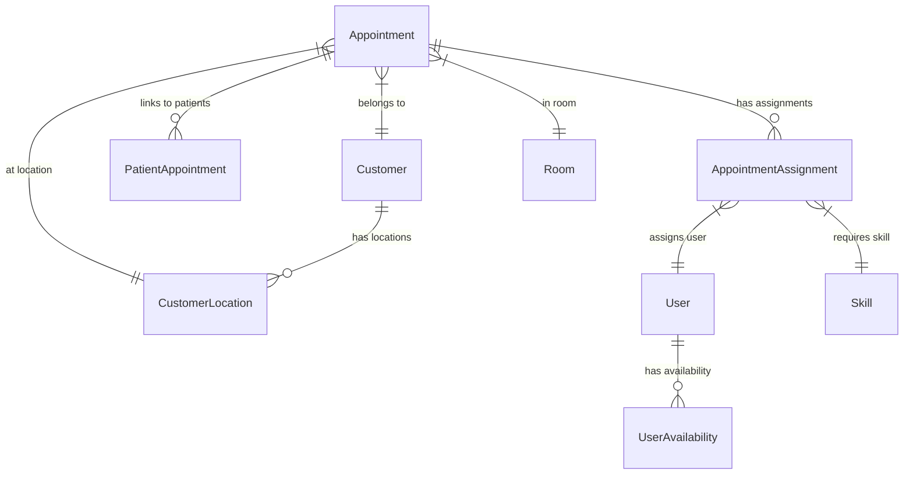

# Appointments Domain - Entity Model

> **Last Updated**: 2026-04-01  
> **Status**: Draft  
> **See Also**: [Domain README](./README.md), [State Machines](./state-machines.md)

---

## Overview

This document describes the entity model for the Appointments domain. All entities are defined with their fields, relationships, and business constraints.

## Entity Relationship Diagram



---

## Core Entities

### Appointment

**PostgreSQL Table**: `appointments`

Represents a scheduled appointment with a customer.

| Field | Type | Constraints | Description |
|-------|------|-------------|-------------|
| `id` | uuid | PK | Unique identifier |
| `customer_id` | uuid | FK → customers, NOT NULL | Customer reference |
| `location_id` | uuid | FK → customer_locations, NOT NULL | Location reference |
| `room_id` | uuid | FK → rooms | Room reference (optional) |
| `start_time` | timestamptz | NOT NULL | Appointment start |
| `end_time` | timestamptz | NOT NULL | Appointment end |
| `state` | appointment_state | NOT NULL, DEFAULT 'draft' | Current state |
| `type` | appointment_type | NOT NULL | Type of appointment |
| `title` | varchar(255) | | Appointment title |
| `description` | text | | Appointment description |
| `created_by` | uuid | FK → users | Creator user |
| `created_at` | timestamptz | NOT NULL, DEFAULT now() | Creation timestamp |
| `updated_at` | timestamptz | NOT NULL, DEFAULT now() | Last update |
| `cancelled_at` | timestamptz | | Cancellation timestamp |
| `cancellation_reason` | text | | Reason for cancellation |

**Indexes**:
- `idx_appointments_customer` ON `appointments(customer_id)`
- `idx_appointments_location` ON `appointments(location_id)`
- `idx_appointments_time` ON `appointments(start_time, end_time)`
- `idx_appointments_state` ON `appointments(state)`

**Constraints**:
- `CHECK (end_time > start_time)`: End must be after start
- `CHECK (start_time > now())`: Start must be in future (for new appointments)

---

### AppointmentAssignment

**PostgreSQL Table**: `appointment_assignments`

Represents the assignment of a user (expert) to an appointment.

| Field | Type | Constraints | Description |
|-------|------|-------------|-------------|
| `id` | uuid | PK | Unique identifier |
| `appointment_id` | uuid | FK → appointments, NOT NULL | Appointment reference |
| `user_id` | uuid | FK → users, NOT NULL | Assigned user |
| `state` | assignment_state | NOT NULL, DEFAULT 'pending' | Assignment state |
| `required_skill_id` | uuid | FK → skills | Required skill |
| `assigned_by` | uuid | FK → users | Who created assignment |
| `assigned_at` | timestamptz | NOT NULL, DEFAULT now() | Assignment time |
| `accepted_at` | timestamptz | | When user accepted |
| `rejected_at` | timestamptz | | When user rejected |
| `rejection_reason` | text | | Reason for rejection |

**Indexes**:
- `idx_assignments_appointment` ON `appointment_assignments(appointment_id)`
- `idx_assignments_user` ON `appointment_assignments(user_id)`
- `idx_assignments_state` ON `appointment_assignments(state)`

**Constraints**:
- `UNIQUE (appointment_id, user_id)`: Same user can't be assigned twice
- `CHECK (assigned_at <= accepted_at OR accepted_at IS NULL)`: Acceptance after assignment

---

### PatientAppointment

**PostgreSQL Table**: `patient_appointments`

Links patients to appointments (for multi-patient appointments).

| Field | Type | Constraints | Description |
|-------|------|-------------|-------------|
| `id` | uuid | PK | Unique identifier |
| `appointment_id` | uuid | FK → appointments, NOT NULL | Appointment reference |
| `patient_id` | uuid | FK → patients, NOT NULL | Patient reference |
| `is_primary` | boolean | DEFAULT false | Primary patient flag |
| `notes` | text | | Patient-specific notes |

**Indexes**:
- `idx_patient_appt_appointment` ON `patient_appointments(appointment_id)`
- `idx_patient_appt_patient` ON `patient_appointments(patient_id)`

**Constraints**:
- `UNIQUE (appointment_id, patient_id)`: Same patient can't be linked twice
- Only one `is_primary = true` per appointment (enforced by trigger)

---

## Value Objects

### AppointmentType

**PostgreSQL Type**: `appointment_type` (enum)

Types of appointments supported in the system.

```sql
CREATE TYPE appointment_type AS ENUM (
  'standard',           -- Standard consultation
  'onboarding',         -- New customer onboarding
  'follow_up',          -- Follow-up appointment
  'emergency',          -- Emergency/Urgent appointment
  'group',              -- Group session
  'remote',             -- Remote/video appointment
  'home_visit'          -- Home visit appointment
);
```

### AppointmentState

**PostgreSQL Type**: `appointment_state` (enum)

States in the appointment lifecycle.

```sql
CREATE TYPE appointment_state AS ENUM (
  'draft',              -- Not yet scheduled
  'scheduled',          -- Scheduled, awaiting confirmation
  'confirmed',          -- Confirmed by all parties
  'in_progress',        -- Currently happening
  'completed',          -- Successfully completed
  'cancelled',          -- Cancelled
  'no_show',            -- Customer didn't show up
  'rescheduled',        -- Rescheduled to different time
  'pending_confirmation', -- Awaiting customer confirmation
  'checked_in',         -- Customer checked in
  'ready_for_consultation' -- Ready for consultation
);
```

### AssignmentState

**PostgreSQL Type**: `assignment_state` (enum)

States in the assignment lifecycle.

```sql
CREATE TYPE assignment_state AS ENUM (
  'pending',            -- Awaiting user response
  'assigned',           -- Assigned to user
  'accepted',           -- User accepted
  'rejected',           -- User rejected
  'cancelled',          -- Assignment cancelled
  'completed',          -- Assignment completed
  'withdrawn',          -- Assignment withdrawn
  'expired',            -- Assignment expired (timeout)
  'reassigned',         -- Reassigned to different user
  'pending_approval',   -- Awaiting manager approval
  'conditionally_accepted', -- Accepted with conditions
  'tentative'          -- Tentative acceptance
);
```

---

## Related Entities

### Customer (from Customers Domain)

**PostgreSQL Table**: `customers`

Referenced by `Appointment.customer_id`.

| Field | Type | Description |
|-------|------|-------------|
| `id` | uuid | Primary key |
| `name` | varchar(255) | Customer name |
| `email` | varchar(255) | Contact email |
| `phone` | varchar(50) | Contact phone |
| `active` | boolean | Active status |

### CustomerLocation (from Customers Domain)

**PostgreSQL Table**: `customer_locations`

Referenced by `Appointment.location_id`.

| Field | Type | Description |
|-------|------|-------------|
| `id` | uuid | Primary key |
| `customer_id` | uuid | FK → customers |
| `name` | varchar(255) | Location name |
| `street` | varchar(255) | Street address |
| `city` | varchar(255) | City |
| `zip_code` | varchar(20) | Postal code |

### User (from Staff Domain)

**PostgreSQL Table**: `users`

Referenced by `AppointmentAssignment.user_id`.

| Field | Type | Description |
|-------|------|-------------|
| `id` | uuid | Primary key |
| `email` | varchar(255) | User email |
| `active` | boolean | Active status |
| `email_verified` | boolean | Email verified |

### Skill (from Staff Domain)

**PostgreSQL Table**: `skills`

Referenced by `AppointmentAssignment.required_skill_id`.

| Field | Type | Description |
|-------|------|-------------|
| `id` | uuid | Primary key |
| `name` | varchar(255) | Skill name |
| `category` | varchar(100) | Skill category |
| `active` | boolean | Active status |

---

## Business Rules

### Appointment Creation

1. **Customer Required**: Every appointment must have a customer
2. **Location Required**: Appointment must have a location
3. **Time Validation**: 
   - `start_time` must be in the future
   - `end_time` must be after `start_time`
   - Duration between 15 minutes and 4 hours
4. **No Collisions**: No overlapping appointments at same location/room

### Assignment Rules

1. **Skill Match**: User must have the required skill
2. **Availability**: User must be available during appointment time
3. **No Overlaps**: User cannot have overlapping assignments
4. **State Transitions**: Must follow valid state transitions (see [state-machines.md](./state-machines.md))

### State Transitions

1. **Draft → Scheduled**: When appointment is scheduled with time
2. **Scheduled → Confirmed**: When all parties confirm
3. **Confirmed → In Progress**: When appointment starts
4. **In Progress → Completed**: When appointment ends successfully
5. **Any → Cancelled**: Can be cancelled at any point (with rules)

---

## Prisma Schema

```prisma
model Appointment {
  id                  Uuid                   @id @default(uuid())
  customerId          Uuid                   @map("customer_id")
  locationId          Uuid                   @map("location_id")
  roomId              Uuid?                  @map("room_id")
  startTime           DateTime               @map("start_time")
  endTime             DateTime               @map("end_time")
  state               AppointmentState       @default(DRAFT)
  type                AppointmentType
  title               String?
  description         String?
  createdBy           Uuid                   @map("created_by")
  createdAt           DateTime               @default(now()) @map("created_at")
  updatedAt           DateTime               @default(now()) @updatedAt @map("updated_at")
  cancelledAt         DateTime?              @map("cancelled_at")
  cancellationReason  String?                @map("cancellation_reason")
  
  customer            Customer               @relation(fields: [customerId], references: [id])
  location            CustomerLocation       @relation(fields: [locationId], references: [id])
  room                Room?                  @relation(fields: [roomId], references: [id])
  assignments         AppointmentAssignment[]
  patients            PatientAppointment[]
  
  @@index([customerId])
  @@index([locationId])
  @@index([startTime, endTime])
  @@index([state])
  @@map("appointments")
}

model AppointmentAssignment {
  id                 Uuid             @id @default(uuid())
  appointmentId      Uuid             @map("appointment_id")
  userId             Uuid             @map("user_id")
  state              AssignmentState  @default(PENDING)
  requiredSkillId    Uuid?            @map("required_skill_id")
  assignedBy         Uuid             @map("assigned_by")
  assignedAt         DateTime         @default(now()) @map("assigned_at")
  acceptedAt         DateTime?        @map("accepted_at")
  rejectedAt         DateTime?        @map("rejected_at")
  rejectionReason    String?          @map("rejection_reason")
  
  appointment        Appointment      @relation(fields: [appointmentId], references: [id], onDelete: Cascade)
  user               User             @relation(fields: [userId], references: [id])
  requiredSkill      Skill?           @relation(fields: [requiredSkillId], references: [id])
  
  @@unique([appointmentId, userId])
  @@index([appointmentId])
  @@index([userId])
  @@index([state])
  @@map("appointment_assignments")
}

enum AppointmentState {
  DRAFT
  SCHEDULED
  CONFIRMED
  IN_PROGRESS
  COMPLETED
  CANCELLED
  NO_SHOW
  RESCHEDULED
  PENDING_CONFIRMATION
  CHECKED_IN
  READY_FOR_CONSULTATION
}

enum AppointmentType {
  STANDARD
  ONBOARDING
  FOLLOW_UP
  EMERGENCY
  GROUP
  REMOTE
  HOME_VISIT
}

enum AssignmentState {
  PENDING
  ASSIGNED
  ACCEPTED
  REJECTED
  CANCELLED
  COMPLETED
  WITHDRAWN
  EXPIRED
  REASSIGNED
  PENDING_APPROVAL
  CONDITIONALLY_ACCEPTED
  TENTATIVE
}
```

---

## References

- [Domain README](./README.md) - Overview
- [State Machines](./state-machines.md) - State diagrams
- [Workflows](./workflows.md) - Business workflows
- [Permissions](./permissions.md) - Permission gates
- [Schema Mapping](../../migration/schema-mapping.md) - MongoDB → PostgreSQL mapping
