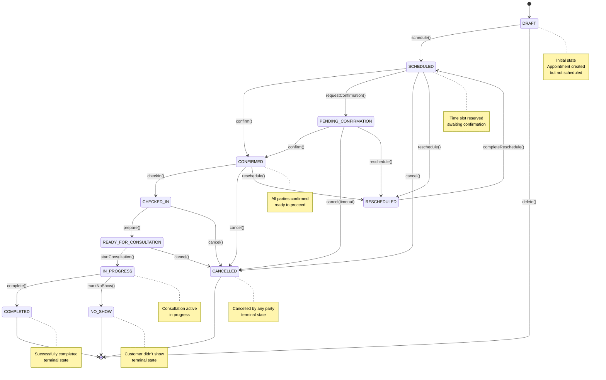
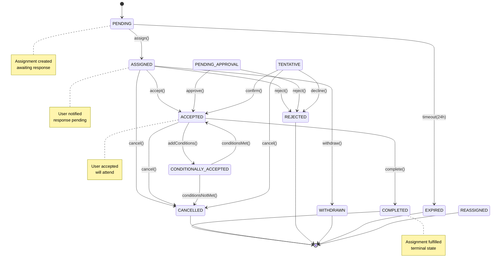

---
---

# Appointments Domain - State Machines

> **Last Updated**: 2026-04-01  
> **Status**: Draft  
> **See Also**: [Entity Model](./entity-model/), [Workflows](./workflows/), [Domain README](./readme/)

---

## Overview

This document describes the state machines for the Appointments domain. There are two primary state machines:
1. **Appointment State Machine** (12 states)
2. **Assignment State Machine** (12 states)

## Appointment State Machine

### State Diagram



### State Definitions

| State | Description | Entry Condition | Exit Transitions |
|-------|-------------|-----------------|------------------|
| `DRAFT` | Appointment created but not scheduled | Initial state | `SCHEDULED`, `[*]` (deleted) |
| `SCHEDULED` | Time slot reserved, awaiting confirmation | `schedule()` called | `CONFIRMED`, `PENDING_CONFIRMATION`, `CANCELLED`, `RESCHEDULED` |
| `PENDING_CONFIRMATION` | Awaiting customer confirmation | `requestConfirmation()` called | `CONFIRMED`, `CANCELLED` (timeout), `RESCHEDULED` |
| `CONFIRMED` | All parties confirmed | All confirmations received | `CHECKED_IN`, `CANCELLED`, `RESCHEDULED` |
| `CHECKED_IN` | Customer arrived and checked in | `checkIn()` called | `READY_FOR_CONSULTATION`, `CANCELLED` |
| `READY_FOR_CONSULTATION` | Ready to start consultation | `prepare()` called | `IN_PROGRESS`, `CANCELLED` |
| `IN_PROGRESS` | Consultation currently happening | `startConsultation()` called | `COMPLETED`, `NO_SHOW` |
| `COMPLETED` | Successfully completed | `complete()` called | `[*]` (terminal) |
| `CANCELLED` | Cancelled by any party | `cancel()` called | `[*]` (terminal) |
| `NO_SHOW` | Customer didn't show up | `markNoShow()` called (15 min grace) | `[*]` (terminal) |
| `RESCHEDULED` | Being rescheduled | `reschedule()` called | `SCHEDULED` (when complete) |

### State Transition Rules

```typescript
// Valid state transitions
const APPOINTMENT_TRANSITIONS = {
  DRAFT: ['SCHEDULED', 'CANCELLED'],
  SCHEDULED: ['CONFIRMED', 'PENDING_CONFIRMATION', 'CANCELLED', 'RESCHEDULED'],
  PENDING_CONFIRMATION: ['CONFIRMED', 'CANCELLED', 'RESCHEDULED'],
  CONFIRMED: ['CHECKED_IN', 'CANCELLED', 'RESCHEDULED'],
  CHECKED_IN: ['READY_FOR_CONSULTATION', 'CANCELLED'],
  READY_FOR_CONSULTATION: ['IN_PROGRESS', 'CANCELLED'],
  IN_PROGRESS: ['COMPLETED', 'NO_SHOW'],
  COMPLETED: [], // Terminal
  CANCELLED: [], // Terminal
  NO_SHOW: [], // Terminal
  RESCHEDULED: ['SCHEDULED'],
};

// Guard conditions
const GUARDS = {
  SCHEDULED: (appt) => {
    return !hasCollision(appt) && isWithinBusinessHours(appt);
  },
  CONFIRMED: (appt) => {
    return allAssignmentsAccepted(appt) && customerConfirmed(appt);
  },
  IN_PROGRESS: (appt) => {
    return isCurrentTime(appt.start_time) && expertCheckedIn(appt);
  },
  COMPLETED: (appt) => {
    return consultationDocumented(appt);
  },
  CANCELLED: (appt) => {
    // Can always cancel, but may incur fees
    return true;
  },
  NO_SHOW: (appt) => {
    return isLateByGracePeriod(appt.start_time, 15); // 15 minutes
  },
};
```

---

## Assignment State Machine

### State Diagram



### State Definitions

| State | Description | Entry Condition | Exit Transitions |
|-------|-------------|-----------------|------------------|
| `PENDING` | Assignment created, awaiting response | Initial state | `ASSIGNED`, `EXPIRED` (timeout) |
| `ASSIGNED` | User notified, awaiting response | `assign()` called | `ACCEPTED`, `REJECTED`, `CANCELLED`, `WITHDRAWN` |
| `ACCEPTED` | User accepted assignment | `accept()` called | `COMPLETED`, `CANCELLED`, `CONDITIONALLY_ACCEPTED` |
| `REJECTED` | User rejected assignment | `reject()` called | `[*]` (terminal) |
| `CANCELLED` | Assignment cancelled | `cancel()` called | `[*]` (terminal) |
| `COMPLETED` | Assignment fulfilled | `complete()` called | `[*]` (terminal) |
| `WITHDRAWN` | Assignment withdrawn by admin | `withdraw()` called | `[*]` (terminal) |
| `EXPIRED` | Assignment expired (no response) | Timeout (24h) | `[*]` (terminal) |
| `REASSIGNED` | Reassigned to different user | `reassign()` called | `[*]` (triggers new assignment) |
| `PENDING_APPROVAL` | Awaiting manager approval | `requestApproval()` called | `ACCEPTED`, `REJECTED` |
| `CONDITIONALLY_ACCEPTED` | Accepted with conditions | `addConditions()` called | `ACCEPTED`, `CANCELLED` |
| `TENTATIVE` | Tentative acceptance | `tentativeAccept()` called | `ACCEPTED`, `REJECTED`, `CANCELLED` |

### State Transition Rules

```typescript
// Valid state transitions
const ASSIGNMENT_TRANSITIONS = {
  PENDING: ['ASSIGNED', 'EXPIRED'],
  ASSIGNED: ['ACCEPTED', 'REJECTED', 'CANCELLED', 'WITHDRAWN'],
  ACCEPTED: ['COMPLETED', 'CANCELLED', 'CONDITIONALLY_ACCEPTED'],
  REJECTED: [], // Terminal
  CANCELLED: [], // Terminal
  COMPLETED: [], // Terminal
  WITHDRAWN: [], // Terminal
  EXPIRED: [], // Terminal
  REASSIGNED: [], // Terminal (triggers new assignment)
  PENDING_APPROVAL: ['ACCEPTED', 'REJECTED'],
  CONDITIONALLY_ACCEPTED: ['ACCEPTED', 'CANCELLED'],
  TENTATIVE: ['ACCEPTED', 'REJECTED', 'CANCELLED'],
};

// Guard conditions
const ASSIGNMENT_GUARDS = {
  ACCEPTED: (assignment) => {
    return hasRequiredSkill(assignment.user, assignment.requiredSkillId) &&
           isAvailable(assignment.user, assignment.appointment);
  },
  COMPLETED: (assignment) => {
    return appointmentIsCompleted(assignment.appointmentId);
  },
  CANCELLED: (assignment) => {
    // Can always cancel, but may have consequences
    return true;
  },
};
```

---

## Event Handlers

### Appointment State Change Events

```typescript
// When appointment state changes
on(AppointmentStateChanged, async (event) => {
  switch (event.newState) {
    case 'SCHEDULED':
      await notifyCustomer(event.appointmentId);
      await checkAvailability(event.appointmentId);
      break;
    
    case 'CONFIRMED':
      await createAssignments(event.appointmentId);
      await notifyExperts(event.appointmentId);
      break;
    
    case 'CHECKED_IN':
      await notifyExpert(event.appointmentId);
      await startPreparation(event.appointmentId);
      break;
    
    case 'IN_PROGRESS':
      await startConsultation(event.appointmentId);
      await blockConflictingAppointments(event.appointmentId);
      break;
    
    case 'COMPLETED':
      await generateInvoice(event.appointmentId);
      await updateExpertWorklog(event.appointmentId);
      await requestFeedback(event.appointmentId);
      break;
    
    case 'CANCELLED':
      await notifyAllParties(event.appointmentId);
      await freeUpTimeSlot(event.appointmentId);
      await applyCancellationFee(event.appointmentId);
      break;
    
    case 'NO_SHOW':
      await notifyExpert(event.appointmentId);
      await applyNoShowFee(event.appointmentId);
      await markAsBillable(event.appointmentId);
      break;
  }
});
```

### Assignment State Change Events

```typescript
// When assignment state changes
on(AssignmentStateChanged, async (event) => {
  switch (event.newState) {
    case 'ASSIGNED':
      await notifyUser(event.assignmentId);
      await startResponseTimeout(event.assignmentId); // 24h timeout
      break;
    
    case 'ACCEPTED':
      await cancelResponseTimeout(event.assignmentId);
      await addToUserCalendar(event.assignmentId);
      await checkForConflicts(event.assignmentId);
      break;
    
    case 'REJECTED':
      await notifyAdmin(event.assignmentId);
      await triggerReassignment(event.assignmentId);
      break;
    
    case 'COMPLETED':
      await updateExpertWorklog(event.assignmentId);
      await updateSkillUsage(event.assignmentId);
      break;
  }
});
```

---

## Timeout Handling

### Assignment Response Timeout

```typescript
// 24-hour timeout for assignment response
const ASSIGNMENT_TIMEOUT_MS = 24 * 60 * 60 * 1000;

async function handleAssignmentTimeout(assignmentId: string) {
  const assignment = await getAssignment(assignmentId);
  
  if (assignment.state === 'ASSIGNED') {
    await transitionAssignment(assignmentId, 'EXPIRED');
    await notifyAdmin(assignmentId);
    await triggerReassignment(assignmentId);
  }
}

// Scheduled check every hour
cron.schedule('0 * * * *', async () => {
  const expiredAssignments = await getExpiredAssignments();
  for (const assignment of expiredAssignments) {
    await handleAssignmentTimeout(assignment.id);
  }
});
```

### Appointment Auto-Confirmation Timeout

```typescript
// Auto-confirm if customer doesn't respond within 48 hours
const CONFIRMATION_TIMEOUT_MS = 48 * 60 * 60 * 1000;

async function handleConfirmationTimeout(appointmentId: string) {
  const appointment = await getAppointment(appointmentId);
  
  if (appointment.state === 'PENDING_CONFIRMATION') {
    // Option 1: Auto-cancel
    await transitionAppointment(appointmentId, 'CANCELLED');
    await notifyCustomer(appointmentId, 'Appointment cancelled due to no confirmation');
    
    // Option 2: Auto-confirm (business decision)
    // await transitionAppointment(appointmentId, 'CONFIRMED');
    // await notifyCustomer(appointmentId, 'Appointment auto-confirmed');
  }
}
```

---

## References

- [Entity Model](./entity-model/) - Entity definitions
- [Domain README](./readme/) - Overview
- [Workflows](./workflows/) - Business workflows
- [Permissions](./permissions/) - Permission gates
