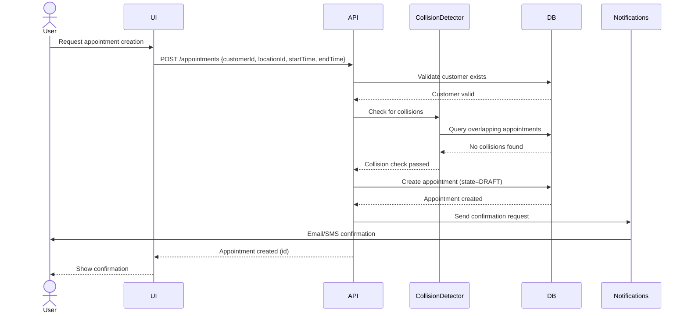
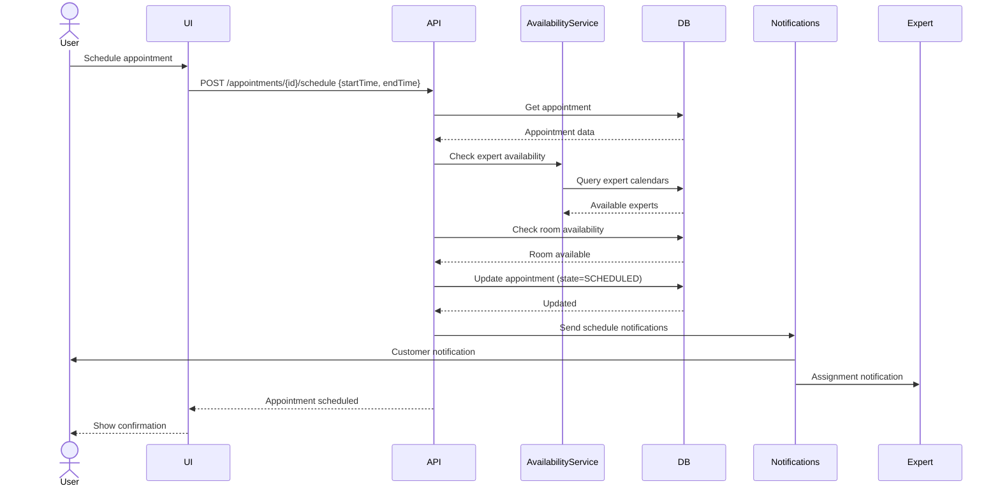
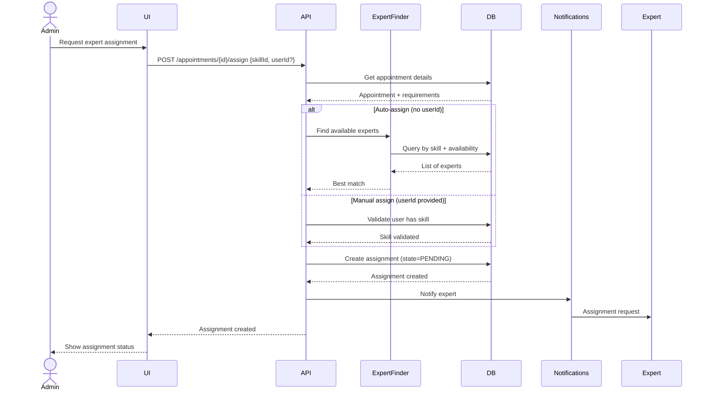
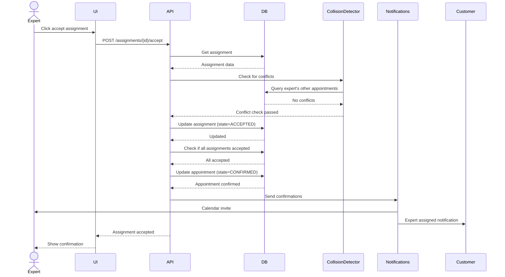
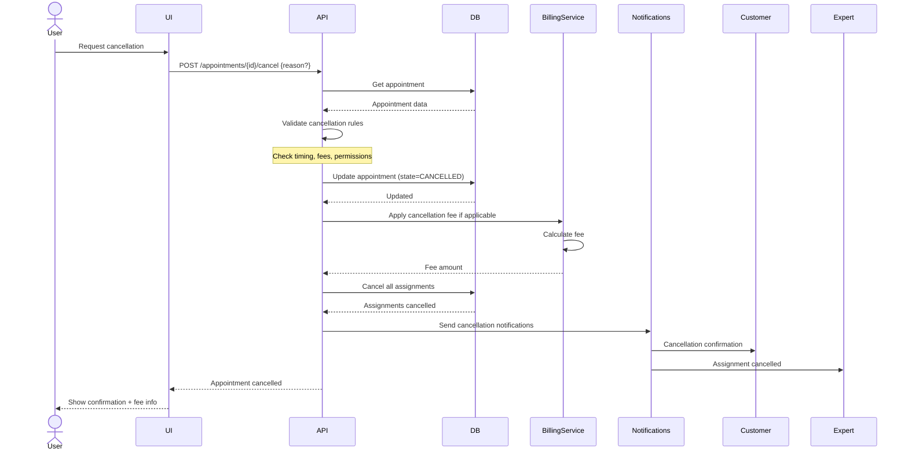
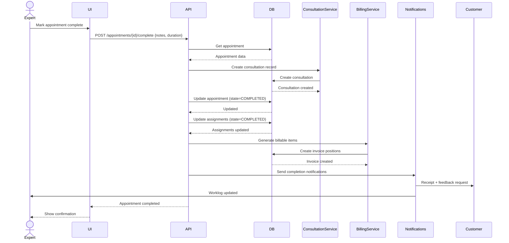
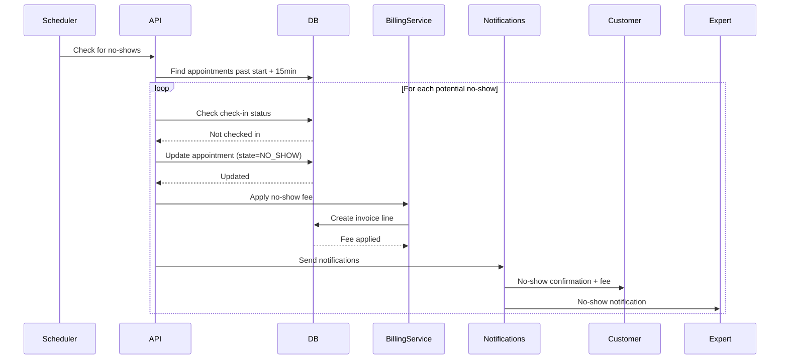

---
---

# Appointments Domain - Workflows

> **Last Updated**: 2026-04-01  
> **Status**: Draft  
> **See Also**: [Entity Model](./entity-model.md), [State Machines](./state-machines.md), [Domain README](./README.md)

---

## Overview

This document describes the key business workflows in the Appointments domain. Each workflow includes preconditions, steps, postconditions, and error handling.

---

## Workflow 1: Create Appointment

**Actor**: Admin, Customer Service Rep  
**Trigger**: Customer requests appointment

### Preconditions
- Customer exists in system
- Location is configured
- Time slot is available

### Flow

### Steps

1. **Validate Input**
   - Customer ID is valid
   - Location ID is valid
   - Start time is in future
   - End time > start time
   - Duration within limits (15min - 4 hours)

2. **Check Availability**
   - Location available at requested time
   - Room available (if specified)
   - No conflicting appointments

3. **Create Appointment**
   - Generate appointment ID
   - Set state = DRAFT
   - Persist to database

4. **Send Notifications**
   - Notify customer (email/SMS)
   - Notify location (if different from customer)

### Postconditions
- Appointment created with state = DRAFT
- Customer notified
- Time slot tentatively reserved

### Error Handling

| Error | Handling |
|-------|----------|
| Customer not found | Return 404, show error |
| Collision detected | Suggest alternative times |
| Invalid time range | Return validation error |
| Location unavailable | Return error, suggest alternatives |

---

## Workflow 2: Schedule Appointment

**Actor**: Admin, Customer Service Rep  
**Trigger**: Appointment created in DRAFT state

### Preconditions
- Appointment exists in DRAFT state
- Customer has confirmed interest

### Flow

### Steps

1. **Get Appointment**
   - Load appointment from database
   - Verify state = DRAFT

2. **Check Availability**
   - Query expert availability
   - Check room availability
   - Verify location open hours

3. **Reserve Resources**
   - Lock time slot
   - Reserve room (if applicable)

4. **Update State**
   - Transition to SCHEDULED
   - Record scheduled time

5. **Notify Parties**
   - Send confirmation to customer
   - Notify experts of potential assignment

### Postconditions
- Appointment state = SCHEDULED
- Time slot reserved
- Customer notified

### Business Rules
- Cannot schedule within 2 hours of start time (unless emergency)
- Must respect location business hours
- Maximum 3 months in advance

---

## Workflow 3: Assign Expert

**Actor**: Admin, System (auto-assignment)  
**Trigger**: Appointment scheduled, expert needed

### Preconditions
- Appointment in SCHEDULED or CONFIRMED state
- Required skill identified

### Flow

### Steps

1. **Identify Requirements**
   - Get required skill from appointment
   - Check location preferences

2. **Find Experts** (auto-assign only)
   - Query by skill match
   - Filter by availability
   - Sort by workload/priority

3. **Create Assignment**
   - Set state = PENDING
   - Set 24h response timeout
   - Record assigned by whom

4. **Notify Expert**
   - Send assignment notification
   - Include appointment details
   - Provide accept/reject links

### Postconditions
- Assignment created with state = PENDING
- Expert notified
- 24h response timer started

### Business Rules
- Expert must have required skill
- Expert must be available during appointment time
- Maximum 8 appointments per expert per day
- Response timeout: 24 hours

---

## Workflow 4: Accept Assignment

**Actor**: Expert (User)  
**Trigger**: Expert receives assignment notification

### Preconditions
- Assignment exists in PENDING state
- Expert is logged in

### Flow

### Steps

1. **Validate Assignment**
   - Assignment exists and is PENDING
   - Expert is the assigned user
   - Not expired

2. **Check for Conflicts**
   - No overlapping appointments
   - No double-booking

3. **Accept Assignment**
   - Update state = ACCEPTED
   - Record acceptance timestamp
   - Cancel response timeout

4. **Check Appointment Status**
   - If all assignments accepted, confirm appointment
   - Update appointment state = CONFIRMED

5. **Notify Parties**
   - Send calendar invite to expert
   - Notify customer of expert assignment

### Postconditions
- Assignment state = ACCEPTED
- Expert's calendar updated
- Customer notified of expert

---

## Workflow 5: Cancel Appointment

**Actor**: Admin, Customer (self-service)  
**Trigger**: Appointment needs to be cancelled

### Preconditions
- Appointment exists (not in terminal state)
- Canceller has permission

### Flow

### Steps

1. **Validate Cancellation**
   - Check appointment state (not terminal)
   - Verify user has permission
   - Calculate time until appointment

2. **Apply Business Rules**
   - Free cancellation if >24 hours before
   - Fee applies if <24 hours
   - No-show rules if applicable

3. **Update State**
   - Transition to CANCELLED
   - Record cancellation reason
   - Record cancellation timestamp

4. **Cancel Assignments**
   - Cancel all pending/accepted assignments
   - Notify affected experts

5. **Process Billing**
   - Calculate cancellation fee
   - Create invoice line item (if applicable)

6. **Notify Parties**
   - Send cancellation confirmation
   - Notify all assigned experts
   - Free up time slot

### Postconditions
- Appointment state = CANCELLED
- All assignments cancelled
- Fee applied (if applicable)
- Time slot freed

### Business Rules
- Free cancellation >24 hours before
- 50% fee for 12-24 hours before
- 100% fee for <12 hours before
- No fee for emergency cancellations

---

## Workflow 6: Complete Appointment

**Actor**: Expert  
**Trigger**: Appointment time ends

### Preconditions
- Appointment in IN_PROGRESS state
- Expert is assigned and present

### Flow

### Steps

1. **Validate Completion**
   - Appointment is IN_PROGRESS
   - Expert is assigned
   - Minimum duration met

2. **Create Consultation Record**
   - Link to appointment
   - Copy relevant data
   - Set initial state

3. **Update States**
   - Appointment → COMPLETED
   - All assignments → COMPLETED

4. **Generate Billing**
   - Create billable items
   - Apply pricing rules
   - Link to customer invoice

5. **Update Worklog**
   - Record expert work time
   - Update utilization metrics

6. **Notify Parties**
   - Send receipt to customer
   - Request feedback
   - Update expert worklog

### Postconditions
- Appointment state = COMPLETED
- Consultation record created
- Invoice generated
- Expert worklog updated

---

## Workflow 7: Handle No-Show

**Actor**: System (automated)  
**Trigger**: 15 minutes after appointment start time

### Preconditions
- Appointment in CONFIRMED or CHECKED_IN state
- Customer has not checked in

### Flow

### Steps

1. **Identify No-Shows**
   - Query appointments started >15 min ago
   - Filter by not checked in

2. **Update State**
   - Transition to NO_SHOW
   - Record no-show timestamp

3. **Apply Fees**
   - Calculate no-show fee
   - Create invoice line item

4. **Notify Parties**
   - Notify customer of no-show status
   - Inform expert
   - Free up remaining time slot

### Postconditions
- Appointment state = NO_SHOW
- No-show fee applied
- Expert notified
- Time slot freed

---

## References

- [Entity Model](./entity-model.md) - Entity definitions
- [State Machines](./state-machines.md) - State diagrams
- [Domain README](./README.md) - Overview
- [Permissions](./permissions.md) - Permission gates
