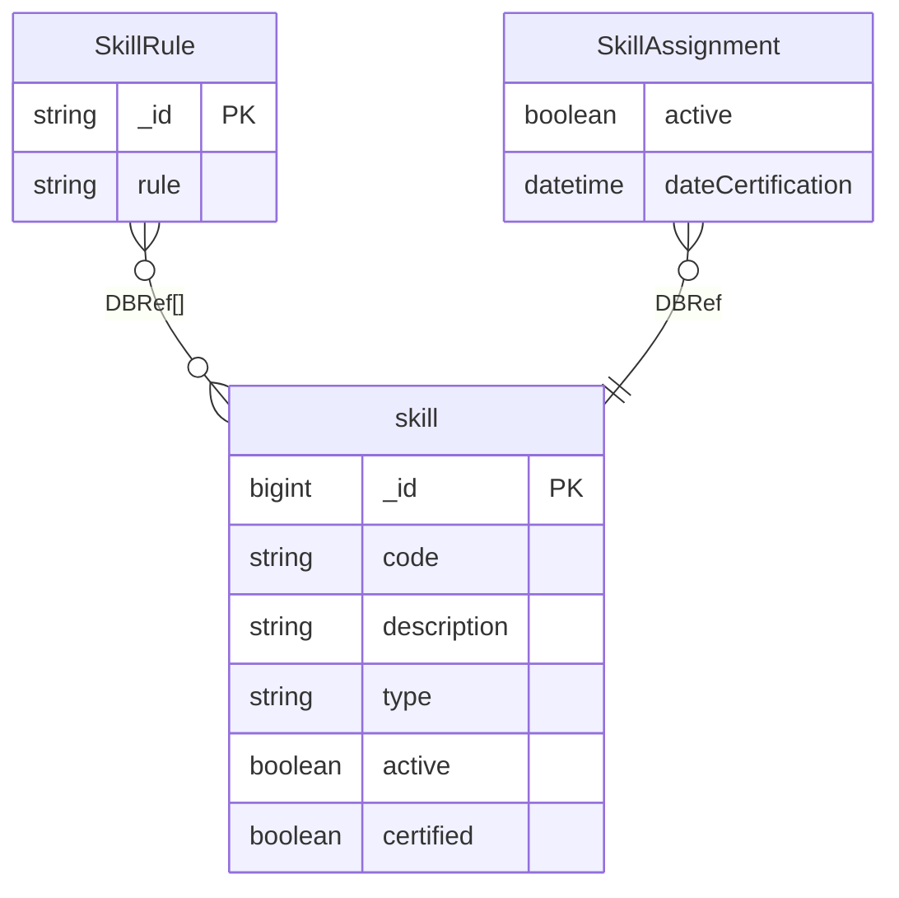

# Capabilities

[← Back to Index](./README.md)

This file covers the Capabilities category, which defines expert skills and required qualifications for services.

---

## ER Diagram

Expert skill definitions and service qualification rules.

---

## Entities in This Category

| Table Name (DBML) | Business Entity | Description Summary |
| :--- | :--- | :--- |
| [`skill`](#entity-fähigkeiten-skills) | Fähigkeiten (Skills) | Definition of a skill (Fähigkeit), including name, description, type, and status. |

---

## Entity: Fähigkeiten (Skills)
Defines the qualifications required by experts.

### Table: skill
| Column | Type | Field Type | Description (from all-together.md) |
| :--- | :--- | :--- | :--- |
| `_id` | `Long` | schema | Interner Bezeichner (MANDATORY) |
| `version` | `Long` | schema | Versionsnummer |
| `code` | `String` | schema | Eine Bezeichnung der Fähigkeit |
| `description` | `String` | schema | Eine Beschreibung |
| `type` | `String` | schema | Art der Fähigkeit: • `ADDITIONAL` (Used) • `EXTRA` (Used) • `LANGUAGE` (Used) • `MAIN` (Used) |
| `active` | `Boolean` | schema | Ob die Fähigkeit aktiv oder deaktiviert ist |
| `certified` | `Boolean` | schema | Ob für die Fähigkeit ein Zertifikat benötigt wird |
| `_class` | `String` | schema | Laufzeitklassen-Marker: `de.videoclinic.model.Skill` |

The `skill` entity is referenced by:
- [`user`](./user-management.md#entity-experte-expert) (via [`SkillAssignment`](./user-management.md#sub-entity-skillassignment))
- [`jobId`](./accounting.md#entity-dienstleistung-service) (via [`SkillRule`](./accounting.md#sub-entity-skillrule))

### Functionality Details
- **Skill Types:** Classified into `Fachrichtung` (MAIN), `Zusatzausbildung` (EXTRA), `Fort- und Weiterbildung` (ADDITIONAL), and `Sprache` (LANGUAGE).
- **Status:** Skills can be active or deactivated.
- **Certification:** Some skills require a certificate, which is then tracked in the expert's profile.
