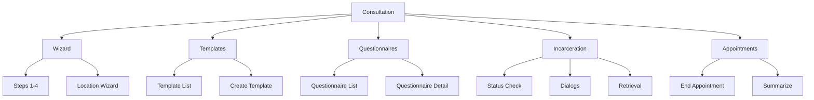
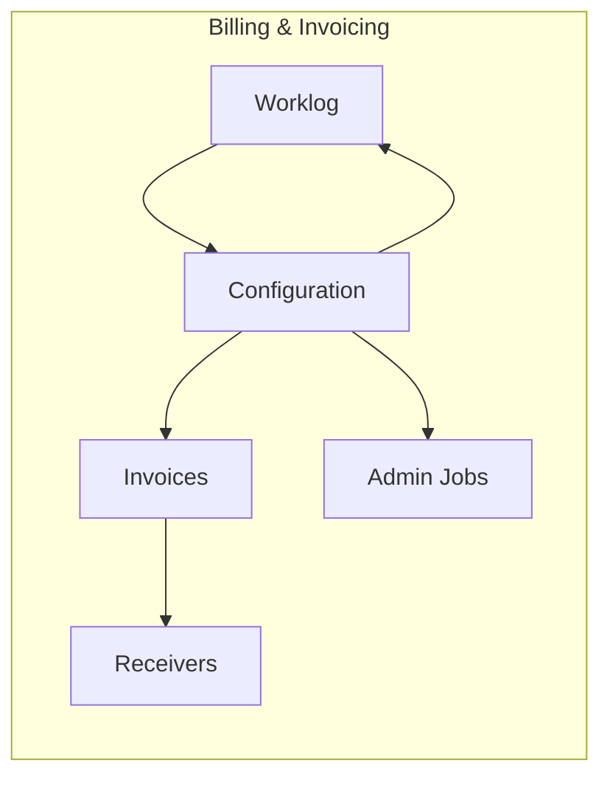
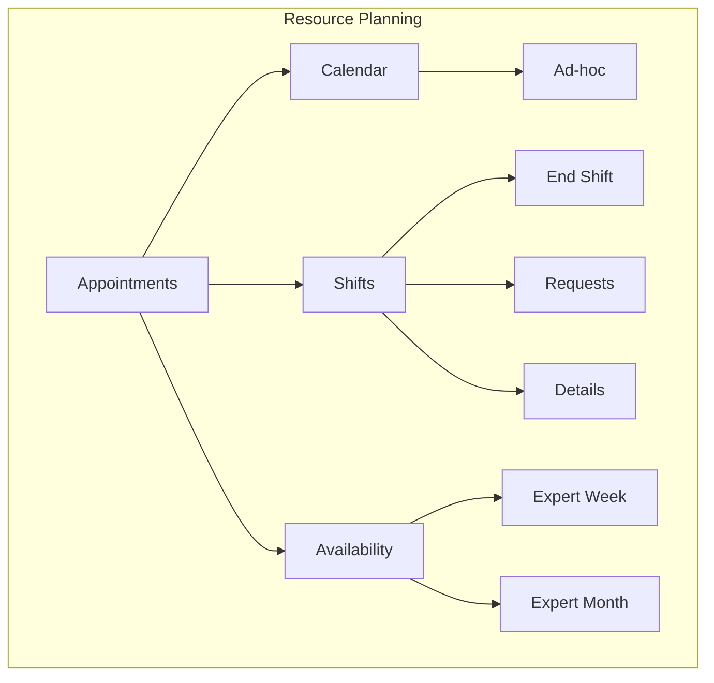
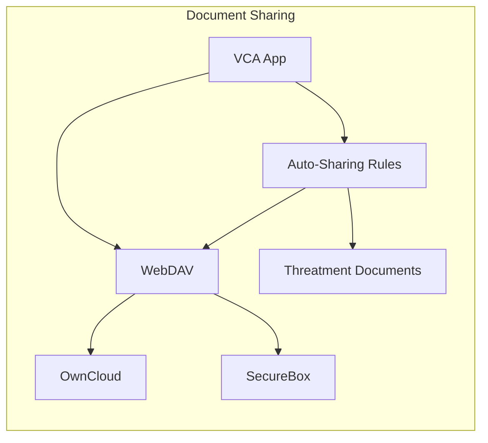
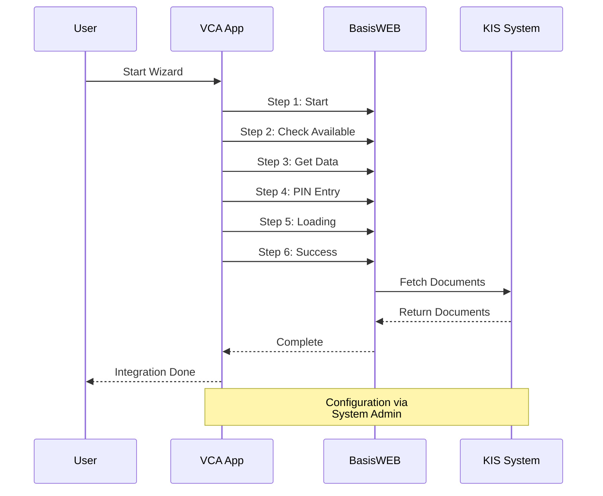
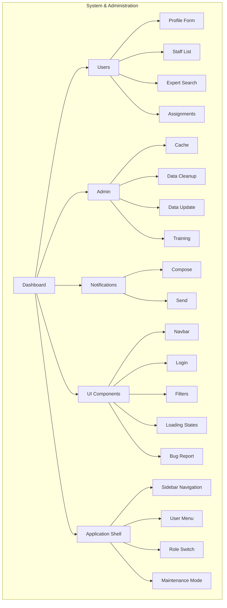
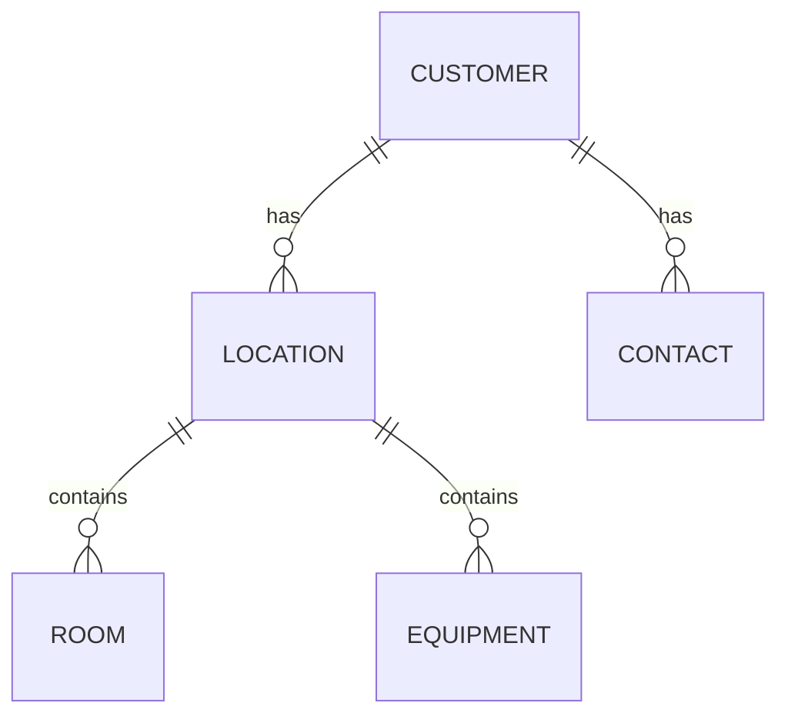
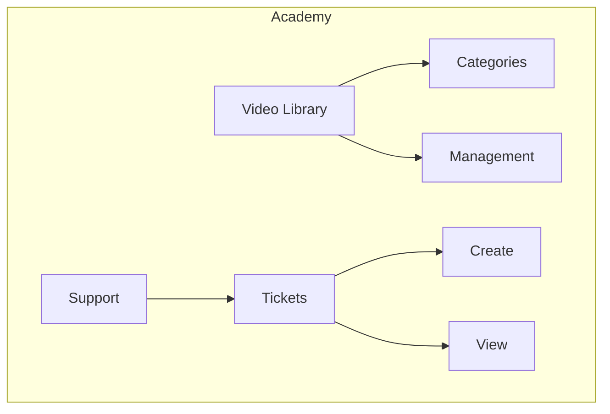

# Starlight Documentation Migration Plan

This document provides a mapping from the current `specs/wireframes` directory structure to the new Starlight documentation organization as defined in `docs/src/content/docs/index.mdx`.

## Target Documentation Areas

The documentation will be organized into the following areas:

1. **Treatment Documentation** - Medical treatment documentation and workflows
2. **Billing and Invoicing** - Invoice generation, PDF emails, e-invoicing
3. **Resource Planning** - Scheduling, calendar, shift management
4. **Sharing** - WebDAV, OwnCloud, SecureBox document sharing
5. **KIS Integration** - Backend system integration (BasisWEB, priority KIS)
6. **System & Administration** - Dashboard, users, system configuration, notifications, UI components
7. **Reference** - Customer management, Academy (supporting documentation)

---

## Implementation Approach

### Phase 0: Infrastructure Setup (FIRST PRIORITY)

Before migrating individual wireframe pages, establish the documentation infrastructure:

1. **Update `docs/astro.config.mjs`** with comprehensive sidebar configuration
2. **Update `docs/src/content/docs/index.mdx`** with feature cards and navigation to all sections
3. **Create directory structure** for all 7 documentation areas
4. **Create 8 overview pages** with Mermaid diagrams:
   - `treatment/index.mdx`
   - `billing/index.mdx`
   - `planning/index.mdx`
   - `sharing/index.mdx`
   - `integrations/kis/index.mdx`
   - `system/index.mdx`
   - `reference/customer/index.mdx`
   - `reference/academy/index.mdx`

### Phase 1-N: Content Migration

After infrastructure is in place, migrate wireframe mappings to actual documentation pages.

---

## Mermaid Diagram Specifications

Each overview page will include a Mermaid diagram showing the section structure and relationships.

### Treatment Overview Diagram



### Billing Overview Diagram



### Planning Overview Diagram



### Sharing Overview Diagram



### KIS Integration Overview Diagram



### System Overview Diagram



### Customer Reference Diagram



### Academy Reference Diagram



---

## Wireframe to Documentation Mapping

### 1. Treatment Documentation

**Target Path:** `docs/src/content/docs/treatment/`

#### Consultation Wireframes
| Source File | Target Doc | Description |
|-------------|------------|-------------|
| `wireframes/treatment/consultation/consultation-list.*` | `consultation/list.md` | Consultation list view |
| `wireframes/treatment/consultation/consultation-view.*` | `consultation/view.md` | Consultation view |
| `wireframes/treatment/consultation/consultation-details-header.*` | `consultation/details.md` | Consultation details header |
| `wireframes/treatment/consultation/consultation-details-standard.*` | `consultation/details-standard.md` | Standard consultation details |
| `wireframes/treatment/consultation/consultation-details-incarceration.*` | `consultation/incarceration.md` | Incarceration-specific details |
| `wireframes/treatment/consultation/consultation-details-onboarding.*` | `consultation/onboarding.md` | Onboarding consultation |
| `wireframes/treatment/consultation/consultation-details-treatment-warning.*` | `consultation/warnings.md` | Treatment warnings |
| `wireframes/treatment/consultation/consultation-review.*` | `consultation/review.md` | Consultation review |
| `wireframes/treatment/consultation/consultation-export-template.*` | `consultation/export.md` | Export templates |
| `wireframes/treatment/consultation/consultation-icd10-search.*` | `consultation/icd10.md` | ICD-10 diagnosis search |
| `wireframes/treatment/consultation/workflows.md` | `consultation/workflows.md` | Consultation workflows |

#### Dashboard & Wizard Wireframes
| Source File | Target Doc | Description |
|-------------|------------|-------------|
| `wireframes/treatment/dashboard/consultation-wizard.*` | `wizard/consultation-wizard.md` | Consultation wizard |
| `wireframes/treatment/dashboard/consultation-wizard-step1-4.*` | `wizard/steps.md` | Wizard steps 1-4 |
| `wireframes/treatment/dashboard/consultation-template.*` | `templates/consultation-templates.md` | Consultation templates |
| `wireframes/treatment/dashboard/consultation-template-list.*` | `templates/template-list.md` | Template list |
| `wireframes/treatment/dashboard/consultation-template-create.*` | `templates/create-template.md` | Create template |
| `wireframes/treatment/dashboard/consultation-location-wizard.*` | `wizard/location-wizard.md` | Location wizard |
| `wireframes/treatment/dashboard/end-appointment.*` | `appointments/end-appointment.md` | End appointment flow |
| `wireframes/treatment/dashboard/summarize-appointment.*` | `appointments/summarize.md` | Summarize appointment |
| `wireframes/treatment/dashboard/incarceration-dialogs.*` | `incarceration/dialogs.md` | Incarceration dialogs |
| `wireframes/treatment/dashboard/incarceration-check.*` | `incarceration/status-check.md` | Incarceration status check |
| `wireframes/treatment/dashboard/incarceration-retrieval.*` | `incarceration/retrieval.md` | Incarceration retrieval |

#### Questionnaire Wireframes
| Source File | Target Doc | Description |
|-------------|------------|-------------|
| `wireframes/treatment/questionnaire/questionnaire-list.*` | `questionnaire/list.md` | Questionnaire list |
| `wireframes/treatment/questionnaire/questionnaire-detail.*` | `questionnaire/detail.md` | Questionnaire detail |

#### Treatment Workflows
| Source File | Target Doc | Description |
|-------------|------------|-------------|
| `wireframes/treatment/workflows.md` | `workflows.md` | Main treatment workflows |

---

### 2. Billing and Invoicing

**Target Path:** `docs/src/content/docs/billing/`

#### Invoice Management
| Source File | Target Doc | Description |
|-------------|------------|-------------|
| `wireframes/accounting/invoice/invoice-list.*` | `invoices/list.md` | Invoice list view |
| `wireframes/accounting/invoice/invoice-details.*` | `invoices/details.md` | Invoice details |
| `wireframes/accounting/invoice-receiver/invoice-receiver.*` | `receivers/management.md` | Invoice receiver management |

#### Worklog & Configuration
| Source File | Target Doc | Description |
|-------------|------------|-------------|
| `wireframes/accounting/worklog/worklog.*` | `worklog/management.md` | Worklog management |
| `wireframes/accounting/config/accounting-config.*` | `configuration/accounting-config.md` | Accounting configuration |
| `wireframes/accounting/admin-job/job-configuration.*` | `configuration/job-config.md` | Admin job configuration |

#### Billing Workflows
| Source File | Target Doc | Description |
|-------------|------------|-------------|
| `wireframes/accounting/workflows.md` | `workflows.md` | Billing workflows |

---

### 3. Resource Planning

**Target Path:** `docs/src/content/docs/planning/`

#### Appointment Management
| Source File | Target Doc | Description |
|-------------|------------|-------------|
| `wireframes/planning/appointment/appointment-list.*` | `appointments/list.md` | Appointment list |
| `wireframes/planning/appointment/appointment-details.*` | `appointments/details.md` | Appointment details |
| `wireframes/planning/appointment/appointment-details-assigned.*` | `appointments/assigned.md` | Assigned appointment details |
| `wireframes/planning/appointment/appointment-details-patients.*` | `appointments/patients.md` | Patient assignments |
| `wireframes/planning/appointment/appointment-details-referenced.*` | `appointments/referenced.md` | Referenced appointments |
| `wireframes/planning/appointment/appointment-details-suggestions.*` | `appointments/suggestions.md` | Appointment suggestions |
| `wireframes/planning/appointment/appointment-assign-user.*` | `appointments/assign-user.md` | User assignment |
| `wireframes/planning/appointment/appointment-state-legend.*` | `appointments/state-legend.md` | State legend |

#### Dashboard & Calendar
| Source File | Target Doc | Description |
|-------------|------------|-------------|
| `wireframes/planning/dashboard/calendar.*` | `calendar/management.md` | Calendar view |
| `wireframes/planning/dashboard/adhoc-appointment.*` | `calendar/adhoc.md` | Ad-hoc appointments |
| `wireframes/planning/dashboard/end-shift.*` | `shifts/end-shift.md` | End shift flow |
| `wireframes/planning/dashboard/shift-dialog.*` | `shifts/dialog.md` | Shift dialog |
| `wireframes/planning/dashboard/shift-dialog-request.*` | `shifts/requests.md` | Shift requests |
| `wireframes/planning/dashboard/shift-dialog-detail.*` | `shifts/details.md` | Shift details |
| `wireframes/planning/dashboard/expert-availability.*` | `availability/expert.md` | Expert availability |
| `wireframes/planning/dashboard/expert-availability-week.*` | `availability/week-view.md` | Weekly availability |
| `wireframes/planning/dashboard/expert-availability-month.*` | `availability/month-view.md` | Monthly availability |

#### Planning Workflows
| Source File | Target Doc | Description |
|-------------|------------|-------------|
| `wireframes/planning/workflows.md` | `workflows.md` | Planning workflows |

---

### 4. Sharing

**Target Path:** `docs/src/content/docs/sharing/`

#### Document Sharing (New Documentation Area)
| Source File | Target Doc | Description |
|-------------|------------|-------------|
| _To be created_ | `webdav/overview.md` | WebDAV protocol integration |
| _To be created_ | `webdav/owncloud.md` | OwnCloud integration |
| _To be created_ | `securebox/overview.md` | SecureBox integration |
| _To be created_ | `securebox/setup.md` | SecureBox setup |
| _To be created_ | `automatic-sharing.md` | Automatic sharing rules |
| _To be created_ | `threatment-documents.md` | Threatment document sharing |

**Note:** Sharing functionality may be implemented in system wireframes. Review `wireframes/system/` for relevant sharing UI components.

---

### 5. KIS Integration

**Target Path:** `docs/src/content/docs/integrations/kis/`

#### BasisWEB Integration
| Source File | Target Doc | Description |
|-------------|------------|-------------|
| `wireframes/interfaces/dashboard/basisweb-wizard.*` | `basisweb/wizard.md` | BasisWEB wizard |
| `wireframes/interfaces/dashboard/step-1-start.*` | `basisweb/steps/start.md` | Step 1: Start |
| `wireframes/interfaces/dashboard/step-2-notavailable.*` | `basisweb/steps/not-available.md` | Step 2: Not available |
| `wireframes/interfaces/dashboard/step-3-error.*` | `basisweb/steps/error.md` | Step 3: Error handling |
| `wireframes/interfaces/dashboard/step-3-getting.*` | `basisweb/steps/getting.md` | Step 3: Getting data |
| `wireframes/interfaces/dashboard/step-4-pin.*` | `basisweb/steps/pin.md` | Step 4: PIN entry |
| `wireframes/interfaces/dashboard/step-5-error.*` | `basisweb/steps/pin-error.md` | Step 5: PIN error |
| `wireframes/interfaces/dashboard/step-5-loading.*` | `basisweb/steps/loading.md` | Step 5: Loading |
| `wireframes/interfaces/dashboard/step-6-success.*` | `basisweb/steps/success.md` | Step 6: Success |
| `wireframes/system/admin/sysconfig-basis-web.*` | `basisweb/configuration.md` | BasisWEB configuration |
| `wireframes/interfaces/dashboard/workflows.md` | `basisweb/workflows.md` | BasisWEB workflows |

#### Priority KIS Integration (New Documentation Area)
| Source File | Target Doc | Description |
|-------------|------------|-------------|
| _To be created_ | `priority/overview.md` | Priority KIS overview |
| _To be created_ | `priority/document-exchange.md` | Document exchange |
| _To be created_ | `priority/configuration.md` | Priority configuration |

---

## Cross-Cutting Documentation Areas

### Application Shell Reference

**Target Path:** `docs/src/content/docs/system/shell/`

The application shell (`site.htmlm`) is the main layout wrapper that contains the global navigation, user menu, and shared infrastructure. It should be documented as a foundational component.

| Source File | Target Doc | Description |
|-------------|------------|-------------|
| `specs/analysis/includes/includes-shared-components.md` (Section 7) | `shell/overview.md` | Application shell overview with HTMLM header metadata |
| `specs/analysis/includes/includes-shared-components.md` (Section 8) | `shell/bug-report.md` | Bug report dialog with html2canvas integration |
| _Extract from legacy code_ | `shell/sitemap.md` | **Full sitemap structure** — all menu items, icons, colors, hierarchy |
| `wireframes/system/shell/app-shell-layout.*` | `shell/layout.md` | Full shell layout wireframe with annotations |
| `wireframes/system/shell/global-navigation.*` | `shell/navigation.md` | Sidebar navigation pattern (collapsed/expanded states) |
| `wireframes/system/shell/user-menu.*` | `shell/user-menu.md` | User dropdown with role switch, settings, logout |

**Sitemap extraction task**: Analyze the legacy codebase to extract the complete navigation structure (main menu items, submenu items, icons, colors, URLs, permission gates). Document as a reference table in `shell/sitemap.md`.

---

### System & Administration

**Target Path:** `docs/src/content/docs/system/`

#### Dashboard
| Source File | Target Doc | Description |
|-------------|------------|-------------|
| `wireframes/system/dashboard/dashboard-admin.*` | `dashboard/admin.md` | Admin dashboard |
| `wireframes/system/dashboard/dashboard-standard.*` | `dashboard/standard.md` | Standard dashboard |
| `wireframes/system/dashboard/login-notification.*` | `dashboard/notifications.md` | Login notifications |

#### User Management
| Source File | Target Doc | Description |
|-------------|------------|-------------|
| `wireframes/user-management/dashboard/user-stats.*` | `users/statistics.md` | User statistics |
| `wireframes/user-management/new.*` | `users/create.md` | Create new user |
| `wireframes/user-management/profile/profile-form.*` | `users/profile-form.md` | Profile form |
| `wireframes/user-management/profile/profile-form-personal-data.*` | `users/personal-data.md` | Personal data |
| `wireframes/user-management/profile/profile-form-business-data.*` | `users/business-data.md` | Business data |
| `wireframes/user-management/profile/profile-form-tab-overview.*` | `users/profile-overview.md` | Profile tab overview |
| `wireframes/user-management/profile/profile-staff-list.*` | `users/staff-list.md` | Staff list |
| `wireframes/user-management/profile/profile-expert-search.*` | `users/expert-search.md` | Expert search |
| `wireframes/user-management/profile/profile-expert-availability.*` | `users/expert-availability.md` | Expert availability |
| `wireframes/user-management/profile/profile-assignment-dialog.*` | `users/assignments.md` | User assignments |
| `wireframes/user-management/profile/profile-password-dialog.*` | `users/password-management.md` | Password management |
| `wireframes/user-management/profile/profile-signature-pad.*` | `users/signature.md` | Digital signature |
| `wireframes/user-management/workflows.md` | `users/workflows.md` | User management workflows |

#### System Configuration
| Source File | Target Doc | Description |
|-------------|------------|-------------|
| `wireframes/system/admin/sysconfig-cache.*` | `admin/cache.md` | Cache management |
| `wireframes/system/admin/sysconfig-data-cleanup.*` | `admin/data-cleanup.md` | Data cleanup |
| `wireframes/system/admin/sysconfig-data-update.*` | `admin/data-update.md` | Data update |
| `wireframes/system/admin/sysconfig-training.*` | `admin/training.md` | Training configuration |
| `wireframes/system/admin/workflows.md` | `admin/workflows.md` | Admin workflows |

#### Notifications
| Source File | Target Doc | Description |
|-------------|------------|-------------|
| `wireframes/system/notification/notification-list.*` | `notifications/list.md` | Notification list |
| `wireframes/system/notification/notification-compose.*` | `notifications/compose.md` | Compose notification |
| `wireframes/system/notification/send-message.*` | `notifications/send.md` | Send message |

#### Common UI Components
| Source File | Target Doc | Description |
|-------------|------------|-------------|
| `wireframes/system/shell/app-shell-layout.*` | `components/app-shell.md` | Application shell layout |
| `wireframes/system/shell/global-navigation.*` | `components/global-navigation.md` | Sitemap-driven sidebar navigation |
| `wireframes/system/shell/user-menu.*` | `components/user-menu.md` | User dropdown with role switch |
| `wireframes/system/includes/navbar.*` | `components/navbar.md` | Module navigation bar |
| `wireframes/system/includes/login.*` | `components/login.md` | Login UI |
| `wireframes/system/includes/quick-filter.*` | `components/quick-filter.md` | Quick filter |
| `wireframes/system/includes/loading-states.*` | `components/loading-states.md` | Loading states |
| `wireframes/system/includes/bug-report.*` | `components/bug-report.md` | Bug report |
| `wireframes/system/includes/color-palette.*` | `design/color-palette.md` | Color palette |

---

## Customer Management (Reference Documentation)

**Target Path:** `docs/src/content/docs/reference/customer/`

| Source File | Target Doc | Description |
|-------------|------------|-------------|
| `wireframes/customer/customer-core/customer-list.*` | `customers/list.md` | Customer list |
| `wireframes/customer/customer-core/customer-detail.*` | `customers/detail.md` | Customer detail |
| `wireframes/customer/customer-core/location-management.*` | `locations/management.md` | Location management |
| `wireframes/customer/customer-core/location-detail.*` | `locations/detail.md` | Location detail |
| `wireframes/customer/customer-core/location-management-grid.*` | `locations/grid-view.md` | Location grid view |
| `wireframes/customer/contact/contact-management.*` | `contacts/management.md` | Contact management |
| `wireframes/customer/contact/contact-detail.*` | `contacts/detail.md` | Contact detail |
| `wireframes/customer/room/room-management.*` | `rooms/management.md` | Room management |
| `wireframes/customer/room/room-detail.*` | `rooms/detail.md` | Room detail |
| `wireframes/customer/equipment/equipment-management.*` | `equipment/management.md` | Equipment management |
| `wireframes/customer/equipment/equipment-detail.*` | `equipment/detail.md` | Equipment detail |
| `wireframes/customer/workflows.md` | `workflows.md` | Customer workflows |

---

## Academy (Reference Documentation)

**Target Path:** `docs/src/content/docs/reference/academy/`

| Source File | Target Doc | Description |
|-------------|------------|-------------|
| `wireframes/academy/support-video/video-library.*` | `video/library.md` | Video library |
| `wireframes/academy/support-video/video-category.*` | `video/categories.md` | Video categories |
| `wireframes/academy/support-video/video-management.*` | `video/management.md` | Video management |
| `wireframes/academy/support-video/video-management-detail.*` | `video/detail.md` | Video detail |
| `wireframes/academy/support-video/support-ticket.*` | `support/tickets.md` | Support tickets |
| `wireframes/academy/support-video/support-ticket-create.*` | `support/create-ticket.md` | Create ticket |
| `wireframes/academy/support-video/support-ticket-view.*` | `support/view-ticket.md` | View ticket |
| `wireframes/academy/workflows.md` | `workflows.md` | Academy workflows |

---

## Migration Checklist

### Phase 0: Infrastructure Setup

- [ ] **Update `docs/astro.config.mjs`**
  - [ ] Configure sidebar with all 7 documentation areas
  - [ ] Set up autogenerate for each directory
  - [ ] Configure collapsed state for Reference section

- [ ] **Update `docs/src/content/docs/index.mdx`**
  - [ ] Add Feature cards for all 5 main areas (Treatment, Billing, Planning, Sharing, KIS)
  - [ ] Add System & Administration card
  - [ ] Add Technical Specification section (MongoDB, BasisWEB)
  - [ ] Add Reference Documentation section (Customer, Academy)

- [ ] **Create Directory Structure**
  ```bash
  mkdir -p docs/src/content/docs/{treatment,billing,planning,sharing,integrations/kis,system,reference/customer,reference/academy}
  ```

- [ ] **Create 8 Overview Pages with Mermaid Diagrams**
  - [ ] `treatment/index.mdx` - Consultation workflow diagram
  - [ ] `billing/index.mdx` - Billing process diagram
  - [ ] `planning/index.mdx` - Planning & scheduling diagram
  - [ ] `sharing/index.mdx` - Sharing architecture diagram
  - [ ] `integrations/kis/index.mdx` - KIS sequence diagram
  - [ ] `system/index.mdx` - System components diagram
  - [ ] `reference/customer/index.mdx` - Customer ER diagram
  - [ ] `reference/academy/index.mdx` - Academy structure diagram

### Phase 1: Core Documentation

- [ ] Create Treatment Documentation section
  - [ ] Consultation docs (11 files)
  - [ ] Dashboard/Wizard docs (11 files)
  - [ ] Questionnaire docs (2 files)
  - [ ] Treatment workflows
- [ ] Create Billing and Invoicing section
  - [ ] Invoice management (3 files)
  - [ ] Worklog & config (3 files)
  - [ ] Billing workflows
- [ ] Create Resource Planning section
  - [ ] Appointment management (8 files)
  - [ ] Calendar & shifts (9 files)
  - [ ] Planning workflows

### Phase 2: Integration Documentation

- [ ] Create KIS Integration section
  - [ ] BasisWEB wizard (10 files)
  - [ ] BasisWEB configuration
  - [ ] Priority KIS docs (new content)
- [ ] Create Sharing section
  - [ ] WebDAV integration (new content)
  - [ ] SecureBox integration (new content)
  - [ ] Automatic sharing rules (new content)

### Phase 3: System Documentation

- [ ] Create System section
  - [ ] Dashboard docs (3 files)
  - [ ] User management (13 files)
  - [ ] System configuration (5 files)
  - [ ] Notifications (3 files)
  - [ ] Common UI components (9 files) ← **Updated: +3 app shell docs**
  - [ ] Application shell (3 files) ← **NEW: Shell layout, navigation, user menu**

### Phase 4: Reference Documentation

- [ ] Create Customer Management reference (12 files)
- [ ] Create Academy reference (8 files)

### Phase 5: Assets & Finalization

- [ ] Migrate all PNG images to `docs/src/assets/wireframes/`
- [ ] Migrate `.pen` files to `docs/src/assets/wireframes/` (for interactive viewing)
- [ ] Create index pages for each subsection
- [ ] Cross-link related documentation
- [ ] Review and update workflows documentation
- [ ] Add search indexing

---

## Directory Structure (Target)

```
docs/
├── astro.config.mjs
└── src/
    ├── assets/
    │   └── wireframes/
    │       ├── treatment/
    │       ├── accounting/
    │       ├── planning/
    │       ├── interfaces/
    │       ├── system/
    │       ├── user-management/
    │       ├── customer/
    │       └── academy/
    └── content/
        └── docs/
            ├── index.mdx
            ├── treatment/
            │   ├── index.mdx
            │   ├── consultation/
            │   ├── wizard/
            │   ├── templates/
            │   ├── appointments/
            │   ├── questionnaire/
            │   └── incarceration/
            ├── billing/
            │   ├── index.mdx
            │   ├── invoices/
            │   ├── receivers/
            │   ├── worklog/
            │   └── configuration/
            ├── planning/
            │   ├── index.mdx
            │   ├── appointments/
            │   ├── calendar/
            │   ├── shifts/
            │   └── availability/
            ├── sharing/
            │   ├── index.mdx
            │   ├── webdav/
            │   └── securebox/
            ├── integrations/
            │   └── kis/
            │       ├── index.mdx
            │       ├── basisweb/
            │       └── priority/
            ├── system/
            │   ├── index.mdx
            │   ├── dashboard/
            │   ├── users/
            │   ├── admin/
            │   ├── notifications/
            │   └── components/
            └── reference/
                ├── customer/
                │   └── index.mdx
                └── academy/
                    └── index.mdx
```

---

## Sidebar Configuration (astro.config.mjs)

```javascript
sidebar: [
  { label: "Introduction", slug: "/" },
  {
    label: "Treatment",
    autogenerate: { directory: "treatment" },
  },
  {
    label: "Billing & Invoicing",
    autogenerate: { directory: "billing" },
  },
  {
    label: "Resource Planning",
    autogenerate: { directory: "planning" },
  },
  {
    label: "Sharing",
    autogenerate: { directory: "sharing" },
  },
  {
    label: "KIS Integration",
    autogenerate: { directory: "integrations/kis" },
  },
  {
    label: "System",
    autogenerate: { directory: "system" },
  },
  {
    label: "Reference",
    collapsed: true,
    items: [
      { autogenerate: { directory: "reference/customer" } },
      { autogenerate: { directory: "reference/academy" } },
    ],
  },
]
```

---

## Notes

1. **PNG Images**: All `.png` files should be migrated to `docs/src/assets/wireframes/` with appropriate subdirectories
2. **.pen Files**: Consider keeping `.pen` files accessible for interactive design viewing
3. **Workflows.md**: Each area's `workflows.md` should be reviewed and enhanced with actual workflow descriptions
4. **New Content**: Sharing and Priority KIS sections require new documentation content not present in wireframes
5. **Cross-references**: Add cross-references between related sections (e.g., Treatment ↔ Planning for appointments)
6. **Starlight Features**: Leverage Starlight features like tabs, callouts, and step-by-step guides
7. **Mermaid Theme**: Use `neutral` theme with `autoTheme: true` for dark/light mode support (configured in astro.config.mjs)
8. **Overview Pages**: Each `index.mdx` should include:
   - Section description
   - Mermaid navigation diagram
   - List of sub-pages with brief descriptions
   - Links to related sections
