# Academy Domain -- User Workflows

This document describes the user experience and decision flows across the Academy domain, covering support ticket management, video administration, video library browsing, and video category management. All diagrams represent the journey from the user's perspective, not internal system architecture.

---

## Context

The Academy domain serves two primary user groups: **end users** who browse training videos and submit support tickets, and **administrators** who manage video content, categories, and support queues. The domain is organized around a card-based video library for learning, a grid-based administrative interface for content management, and a ticketing system for user support.

**Who uses it:**
- **All authenticated users** — browse the video library, watch training content, create support tickets
- **Support staff** — view and reply to support tickets
- **System administrators** — manage videos, video categories, and associated metadata

**Entry points:**
- Support ticket list page (all users)
- Video library page (all users)
- Video management page (admin)
- Video category management page (admin)

**Exit points:**
- Ticket created or replied to
- Video playback completed (watch time tracked)
- Video/category/stream CRUD operation completed
- Navigation to another domain area

---

## 1. Support Ticket Creation Flow

This diagram shows the end-to-end flow a user follows to create a new support ticket, emphasizing the cascading category selection that auto-fills the ticket title and queue.

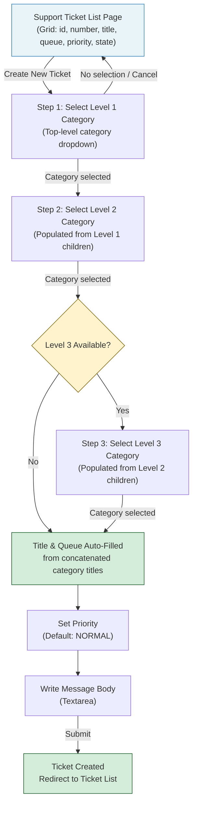

**Key observations:**
- The title field is **auto-generated** from concatenated category titles (e.g. "Billing: Invoice: Missing Payment"), reducing user effort and ensuring consistent naming.
- The queue field is **auto-assigned** from the deepest selected category's `queue` property — users never manually select a queue.
- Level 3 category is optional; if the selected Level 2 category has no children, the flow skips directly to the auto-filled title.
- Priority defaults to NORMAL but can be overridden before submission.

---

## 2. Ticket Lifecycle State Diagram

This diagram models the states a support ticket passes through from the user's and support staff's perspective.

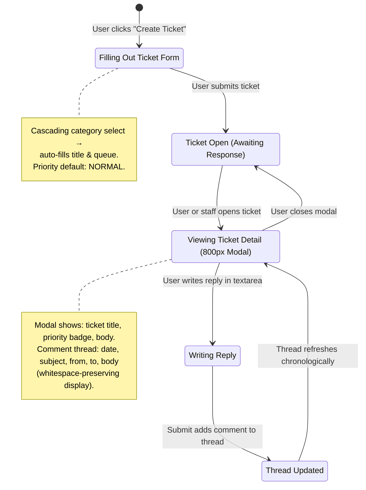

**State transition notes:**
- **Creating** is the entry state where the cascading category selection, title auto-fill, and message composition happen.
- **Viewing** displays the full ticket in an 800px modal, with the comment thread rendered chronologically with whitespace preservation.
- The ticket cycles between **Viewing** and **Updated** as users and staff add comments, growing the thread over time.

---

## 3. Cascading Category Selection Sequence

This diagram shows the user–system interaction during the cascading category selection process when creating a support ticket.

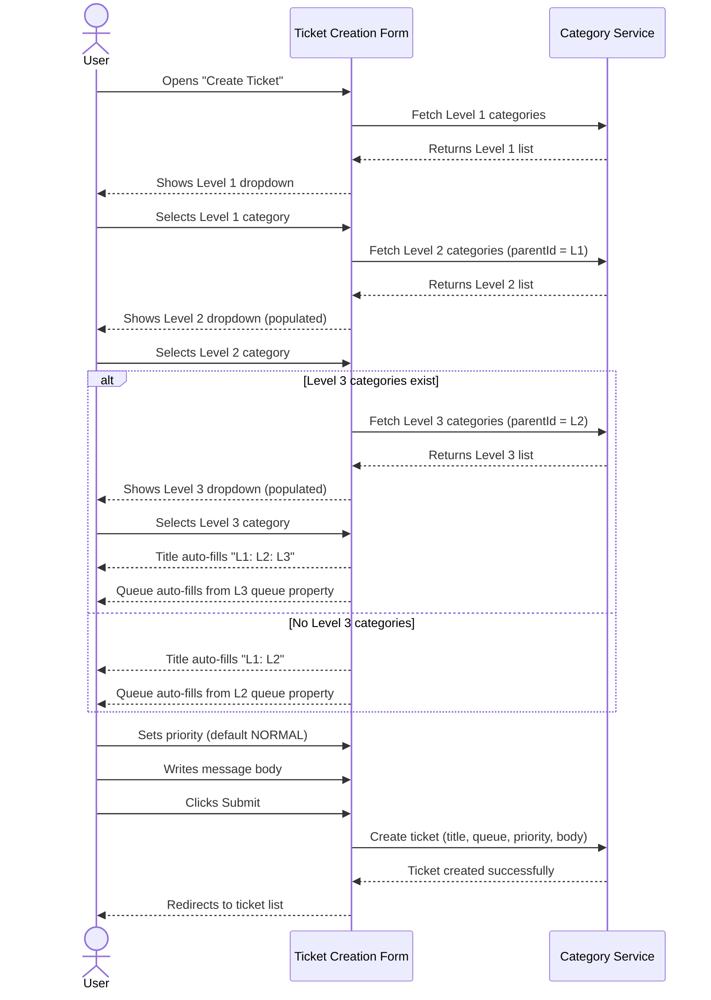

**Interaction highlights:**
- Each category level is loaded **on demand** — Level 2 only fetches when Level 1 is selected, Level 3 only fetches when Level 2 is selected.
- Title and queue are derived fields, not user input. This ensures consistency and correct routing.
- The system determines whether Level 3 exists based on the selected Level 2 category's children.

---

## 4. Video Library Browsing Journey

This diagram shows how an end user navigates the card-based video library, from category browsing through to video playback.

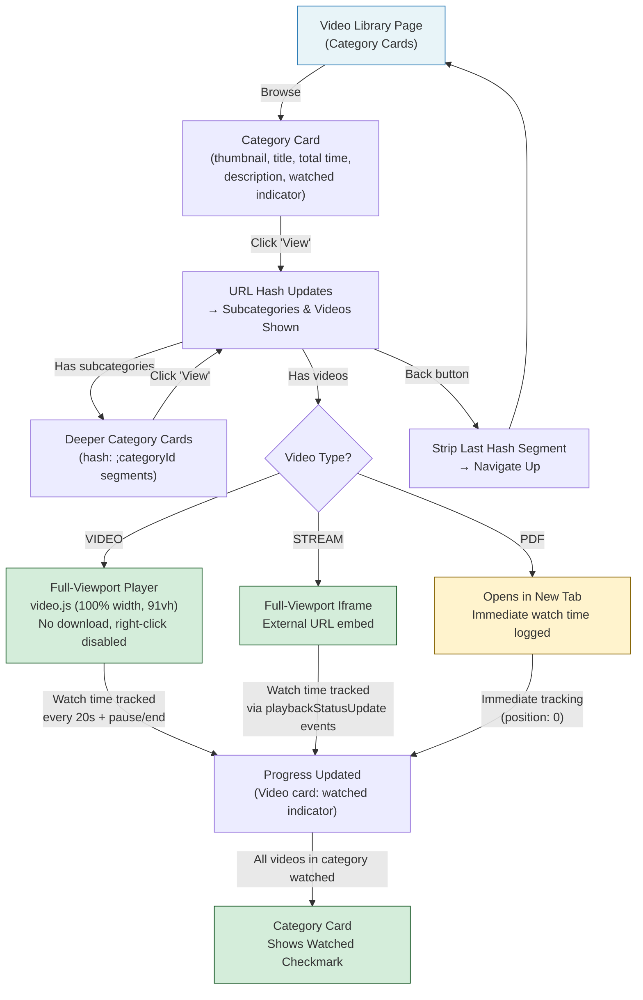

**Key observations:**
- Navigation uses **URL hash segments** (`#;categoryId;subcategoryId`) rather than route changes, allowing deep-linking and browser back-button navigation.
- The back button strips the last hash segment to move up one level in the hierarchy.
- Three distinct content types (VIDEO, STREAM, PDF) each have their own playback mode and tracking behavior.
- Progress is hierarchical: individual video completion rolls up to category-level watched indicators.

---

## 5. Video Upload State Diagram

This diagram models the states of a chunked video upload from the admin's perspective, including pause/resume support.

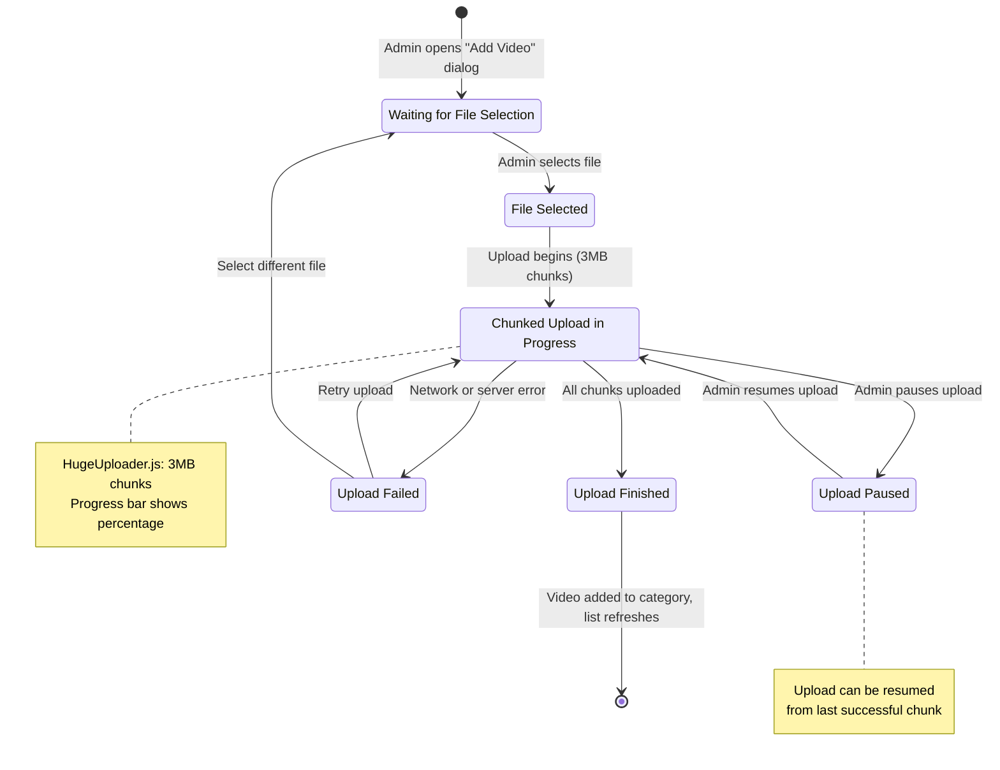

**State transition notes:**
- **Uploading** uses HugeUploader.js with 3MB chunk sizes, showing a real-time progress bar.
- **Paused** preserves upload state so the admin can resume from the last successful chunk.
- **Error** provides two recovery paths: retry the current upload or start fresh with a different file.
- On **Completed**, the video is automatically added to the current category and the video list refreshes.

---

## 6. Video Playback with Watch Time Tracking Sequence

This diagram shows the interaction between the user, the video player, and the tracking system during video playback.

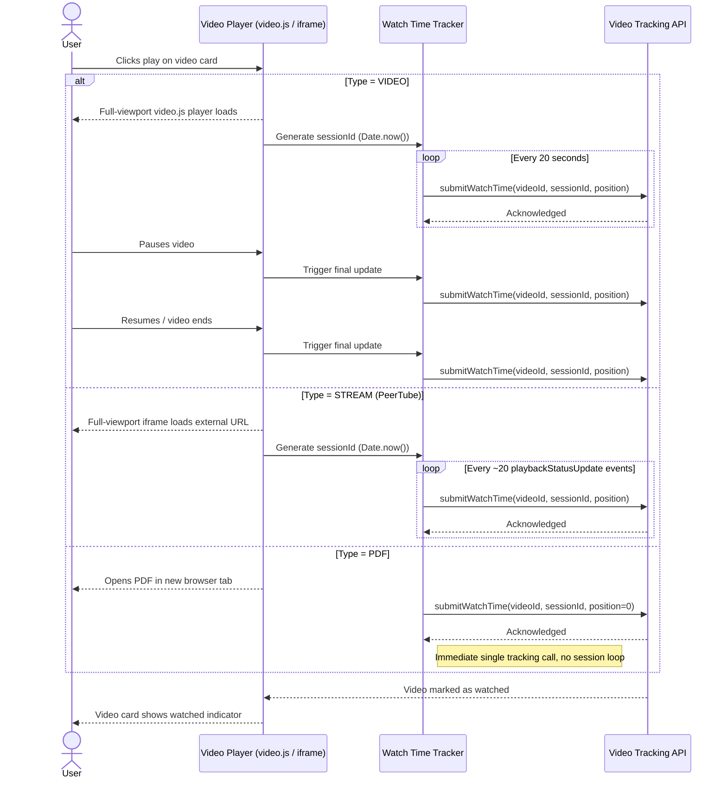

**Interaction highlights:**
- **Session ID** is generated as `Date.now()` at play start, uniquely identifying each viewing session.
- **VIDEO** type tracks position every 20 seconds plus on pause/end events.
- **STREAM** (PeerTube) type tracks based on `playbackStatusUpdate` event counts (~every 20 events).
- **PDF** type is a degenerate case: no player, immediate single tracking call with position 0.
- The watched indicator on the video card updates once the API confirms the video is marked as watched.

---

## 7. Chunked Upload Process Sequence

This diagram details the chunked upload process from the admin's interaction through to completion.

```mermaid
sequenceDiagram
    actor Admin
    participant Dialog as Add Video/Stream Dialog
    participant Uploader as HugeUploader.js
    participant Server as Upload Server

    Admin->>Dialog: Opens "Add Video" in category
    Dialog-->>Admin: Shows left column (upload) + right column (stream)

    Admin->>Dialog: Selects video file
    Dialog->>Uploader: Initialize (file, 3MB chunk size)
    Uploader-->>Dialog: Ready to upload

    Uploader->>Server: Send chunk 1 (0-3MB)
    Server-->>Uploader: Chunk 1 received
    Uploader-->>Dialog: Progress: 10%
    Dialog-->>Admin: Progress bar updates

    Uploader->>Server: Send chunk 2 (3-6MB)
    Server-->>Uploader: Chunk 2 received
    Uploader-->>Dialog: Progress: 20%
    Dialog-->>Admin: Progress bar updates

    alt Admin pauses upload
        Admin->>Dialog: Clicks pause
        Dialog->>Uploader: Pause
        Uploader-->>Dialog: Upload paused at chunk N
        Dialog-->>Admin: Shows "Resume" button

        Admin->>Dialog: Clicks resume
        Dialog->>Uploader: Resume from chunk N
        Uploader->>Server: Send chunk N+1
    end

    Note over Uploader, Server: Continues chunking until complete...

    Uploader->>Server: Send final chunk
    Server-->>Uploader: Upload complete
    Uploader-->>Dialog: Progress: 100%
    Dialog-->>Admin: Video added to category
    Dialog-->>Admin: Video list refreshes with new entry

    Note right of Dialog
        Bottom section shows:
        preview thumbnail + title +
        delete button per video
    end note
```

**Process details:**
- The upload dialog has a **split layout**: left column for file uploads, right column for adding streams manually.
- Chunks are sent sequentially at 3MB each, with the progress bar reflecting cumulative completion.
- Pause/resume is supported at chunk boundaries — the uploader remembers the last successful chunk.
- On completion, the category's video list auto-refreshes to include the new entry with preview thumbnail, title, and delete button.

---

## 8. Video Category Management Flow

This diagram shows the admin flow for managing video categories, including the hierarchical parent-child relationship and associated jobs.

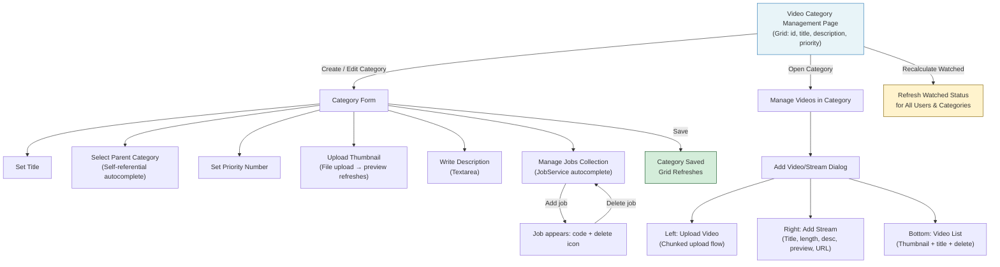

**Key observations:**
- Categories are **self-referential** — a category can be a child of another category, forming a tree structure.
- The **jobs collection** links categories to job roles via autocomplete against the JobService, displayed as code badges with delete icons.
- **Thumbnail upload** provides immediate visual feedback with a preview image refresh.
- The "Recalculate Watched" admin action is a bulk operation that refreshes watched status across all users and all categories.

---

## Interdependencies Summary

| Factor | Affects | How |
|---|---|---|
| **User role** | Available features | End users see video library + ticket creation; admins additionally see video/category management grids |
| **Video type** (VIDEO / STREAM / PDF) | Playback mode & tracking | VIDEO uses video.js player, STREAM uses iframe embed, PDF opens in new tab; each has distinct tracking intervals |
| **Category hierarchy** | Navigation depth & title generation | Deeper category trees create longer hash URLs and longer auto-generated ticket titles; video library shows nested card layers |
| **Upload state** (idle / uploading / paused / error) | Admin interaction options | Pause/resume only available during active upload; retry only available after error; completion auto-refreshes video list |
| **Watch time sessions** | Progress indicators | Session-based tracking determines per-video completion; category watched status rolls up from all child video completion |
| **Cascading category selection** | Ticket title & queue assignment | Selected category chain auto-generates title string and determines queue routing — no manual override |
| **Chunk size (3MB)** | Upload granularity & resume point | Smaller chunks mean more requests but finer-grained resume points; pause/resume operates at chunk boundaries |
| **Category jobs** | User access to content | Job associations on categories may determine which users see which video content based on their role |

---

## Wireframe Screenshots

### WA-1: Support Ticket List (W1)

Grid view with 6 columns (id, number, title, queue, priority, state). Toolbar with Add and View Ticket buttons. Row click opens 800px ticket detail modal. Annotation note describes cascading selects, auto-fill behavior, priority enum, and view dialog structure.

**Annotations:**
- `[DataTable]` 6-col grid → @shadcn/table DataTable pattern
- Detail panel: 3 cascading selects `[cascade: level 1 → level 2 → level 3]`
- Title `[RO]` `[auto: concat(cat1.title, cat2.title, cat3.title)]` — auto-generated
- Queue `[RO]` — determined by category selection
- Priority: VERYLOW | LOW | NORMAL | HIGH | CRITICAL
- View dialog (800px): ticket metadata header + comment thread `[repeats]` + reply textarea
- Body textarea for ticket description

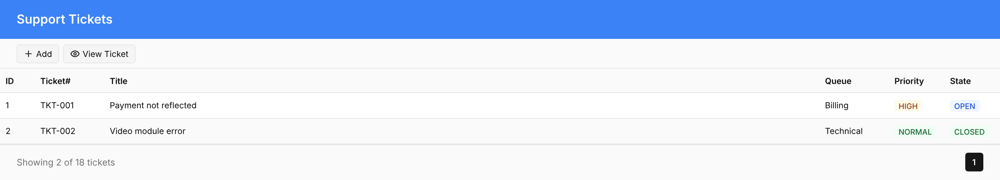

### WA-2: Support Ticket Creation — Cascading Category Select (W1)

600px dialog with three-level category dropdown cascade (`[cascade: level N → level N+1]`). Title field auto-populated from concatenated selections (`[RO]` `[auto: concat]`). Queue field auto-filled from selected category. Priority selector defaulting to NORMAL. Message body textarea. Cancel + Submit footer.

**Annotations:**
- `[DataTable]` 6-col grid → @shadcn/table DataTable pattern
- Detail panel: 3 cascading selects `[cascade: level 1 → level 2 → level 3]`
- Title `[RO]` `[auto: concat(cat1.title, cat2.title, cat3.title)]` — auto-generated
- Queue `[RO]` — determined by category selection
- Priority: VERYLOW | LOW | NORMAL | HIGH | CRITICAL
- View dialog (800px): ticket metadata header + comment thread `[repeats]` + reply textarea
- Body textarea for ticket description

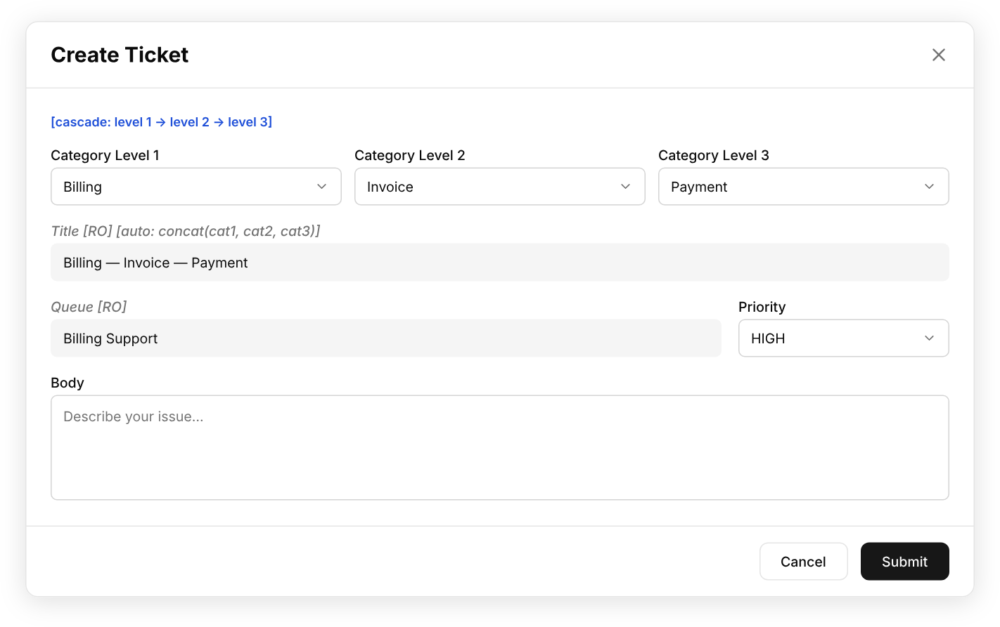

### WA-3: Support Ticket Detail Modal (W1)

800px modal displaying ticket number + concatenated title in header, metadata row (queue, priority badge, state), full body text with whitespace preservation. Chronological comment thread (`[repeats]`) with date, subject, from, to, and body per comment. Reply textarea + "Send Reply" button at bottom.

**Annotations:**
- `[DataTable]` 6-col grid → @shadcn/table DataTable pattern
- Detail panel: 3 cascading selects `[cascade: level 1 → level 2 → level 3]`
- Title `[RO]` `[auto: concat(cat1.title, cat2.title, cat3.title)]` — auto-generated
- Queue `[RO]` — determined by category selection
- Priority: VERYLOW | LOW | NORMAL | HIGH | CRITICAL
- View dialog (800px): ticket metadata header + comment thread `[repeats]` + reply textarea
- Body textarea for ticket description

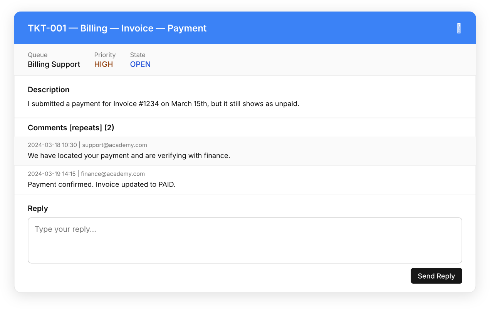

### WA-4: Video Management Grid (W2)

1440px full-page view with 7-column DataTable grid (id, path, preview thumbnail, title, duration, category, description). Toolbar with Add, Edit, Delete, and Watch buttons. Watch button triggers player dialog based on video type. Annotation note describes two player dialog variants.

**Annotations:**
- `[DataTable]` 7-col grid → @shadcn/table DataTable pattern
- Detail panel: path, previewImage, title, lengthInSeconds, category combobox, description textarea
- Two player dialog types:
- `[cond: video.type === VIDEO]` video.js player 800px dialog
- `[cond: video.type === STREAM]` iframe embed 1200px dialog
- Watch button opens appropriate player based on video type

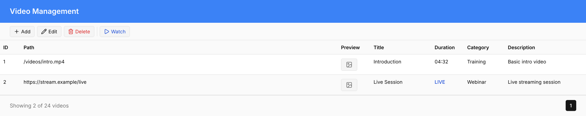

### WA-5: Video Management Detail Panel (W2)

600px dialog with form fields: path, preview image, title, duration (seconds), category combobox (VideoCategoryService.autocomplete), and description textarea. Info box annotates player type routing: `[cond: video.type === VIDEO]` → video.js 800px, `[cond: video.type === STREAM]` → iframe 1200px.

**Annotations:**
- `[DataTable]` 7-col grid → @shadcn/table DataTable pattern
- Detail panel: path, previewImage, title, lengthInSeconds, category combobox, description textarea
- Two player dialog types:
- `[cond: video.type === VIDEO]` video.js player 800px dialog
- `[cond: video.type === STREAM]` iframe embed 1200px dialog
- Watch button opens appropriate player based on video type

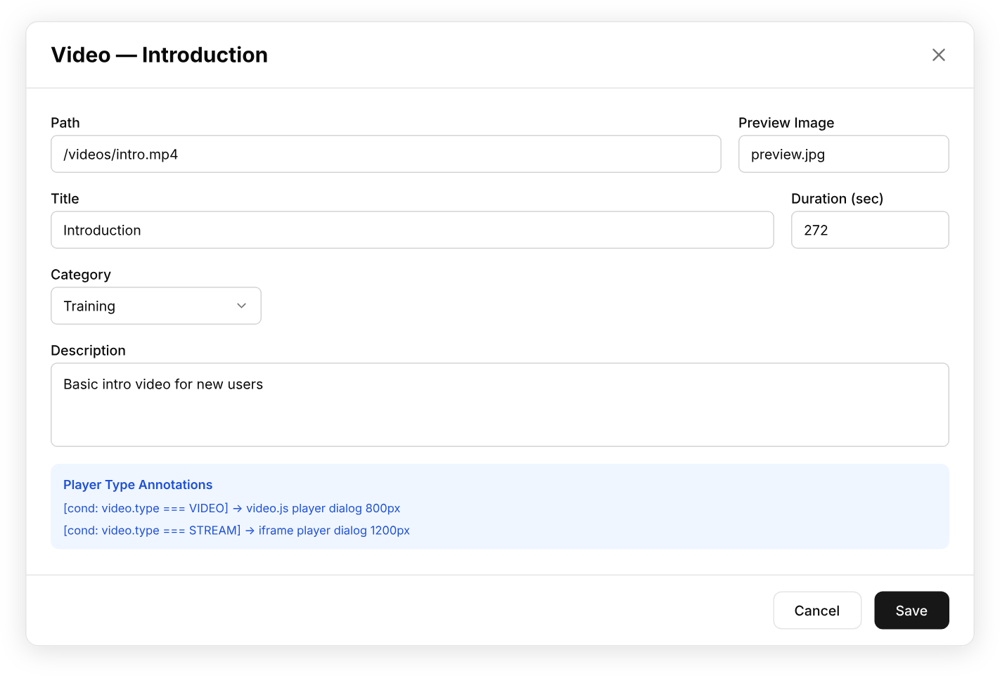

### WA-6: Video Library — Card Browsing (W3)

1440px full-page card-based browsing layout (no DataTable). Header with Back button and "Video Library" title. **Categories section**: 3-column card grid with thumbnail placeholder, title, total time, watched badge (success/warning), and View button. **Videos section**: 3-column card grid within selected category, each card with play icon thumbnail, title, duration, watched indicator (check icon), and Play button. Annotation note describes hash deep linking (`#CATEGORYID;SUBCATEGORY:VIDEOID:POSITION`), periodic watch time tracking, and 3 player variants.

**Annotations:**
- Card-based browsing layout (no DataTable)
- Category cards grid: thumbnail, title, totalTime, watched indicator, View button
- Video cards grid: thumbnail, title, duration, watched indicator, Play button
- `[hash: deep link]` #CATEGORYID;SUBCATEGORY:VIDEOID:POSITION
- `[async: periodic submitWatchTime]` track video watch progress
- 3 player variants: VIDEO (video.js), STREAM (iframe), PDF (embedded viewer)
- goBack button returns to previous view

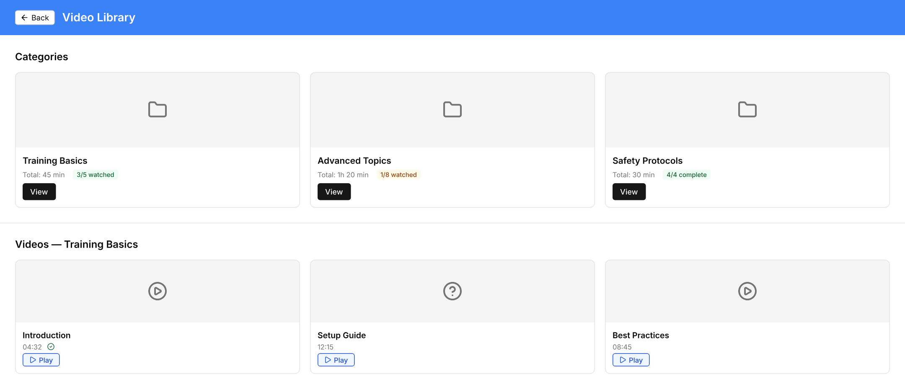

### WA-7: Video Category Management (W4)

1440px full-page view with 4-column grid (id, title, description, priority). Toolbar with Add, Edit, Delete, Videos, and Recalculate buttons. **Detail form** below grid: title input, self-referential parent category combobox, priority number, thumbnail file upload with image preview, description textarea, and jobs collection (`[repeats]`) with autocomplete insert + badge list with delete buttons. **Add Video/Stream dialog**: split two-column layout — left column for chunked file upload (`[chunked: 3MB, pause/resume]`) with progress bar + pause/resume controls, right column for stream form (title, length, description, preview URL, stream URL, Add button). Bottom section shows existing videos in category with thumbnail + title + delete.

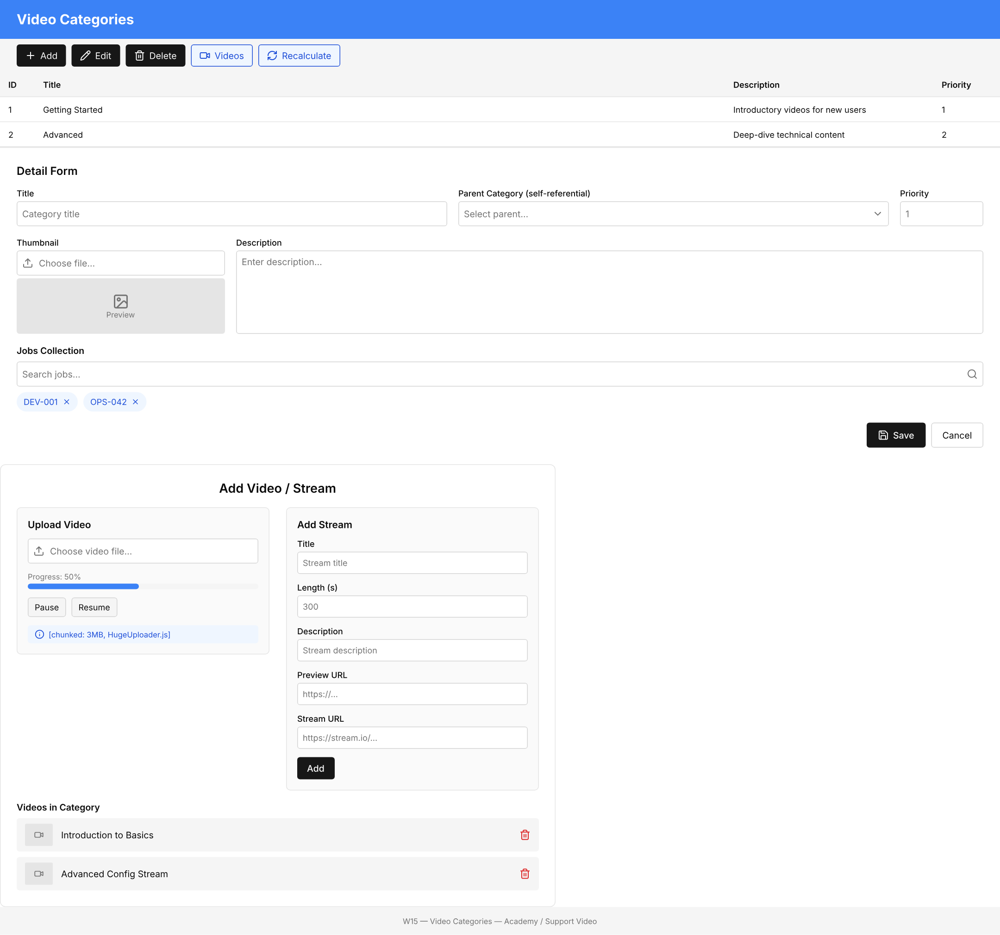
