# Customer Domain — User Workflows

This document describes the user experience and decision flows across all Customer domain entities: Customers, Locations, Contacts, Rooms, Equipment, and Customer Users. All diagrams represent the journey from the user's perspective, not internal system architecture.

---

## Context

The Customer domain is the foundational data layer of the application. It manages the organizations (customers), their physical sites (locations), the people associated with them (contacts, customer users), and the infrastructure at each site (rooms, equipment). Nearly every other domain depends on customer data for filtering, association, and configuration.

**Who uses it:** Admin staff, facility managers, and authenticated clinical staff — each with different levels of access. Admin-only sections (billing, user management) are restricted.

**Entry points:** Each entity has its own list page accessible from the main navigation. Some entities are also reachable from within other entity forms (e.g., rooms from a location form, equipment from a room form).

**Exit points:** Users return to the respective list page after saving or cancelling an entity form. Cross-references (e.g., clicking a customer link from a location) navigate to the related entity's edit form.

---

## 1. Customer Management — User Journey

This diagram shows the complete flow an admin experiences when managing customers, including the billing tab which is restricted to admin roles.

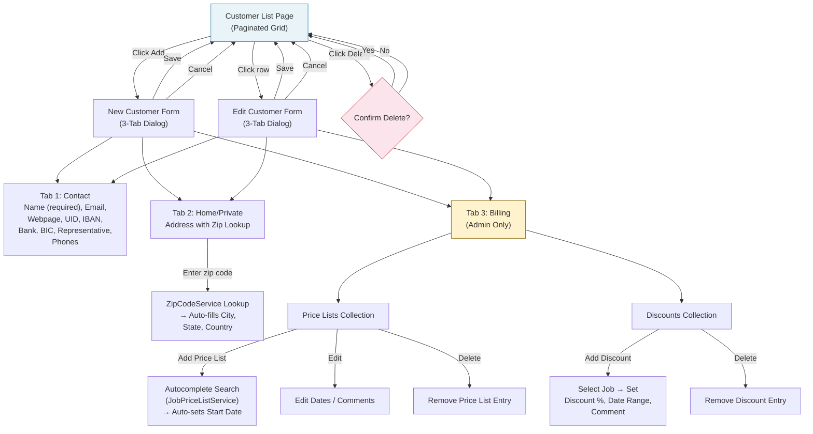
```mermaid
flowchart TD
    A["Customer List Page<br>(Paginated Grid)"] -->|"Click Add"| B["New Customer Form<br>(3-Tab Dialog)"]
    A -->|"Click row"| C["Edit Customer Form<br>(3-Tab Dialog)"]
    A -->|"Click Delete"| D{"Confirm Delete?"}

    D -->|"Yes"| A
    D -->|"No"| A

    B --> TAB1["Tab 1: Contact<br>Name (required), Email,<br>Webpage, UID, IBAN,<br>Bank, BIC, Representative,<br>Phones"]
    B --> TAB2["Tab 2: Home/Private<br>Address with Zip Lookup"]
    B --> TAB3["Tab 3: Billing<br>(Admin Only)"]

    C --> TAB1
    C --> TAB2
    C --> TAB3

    TAB2 -->|"Enter zip code"| ZIP["ZipCodeService Lookup<br>→ Auto-fills City,<br>State, Country"]

    TAB3 --> PL["Price Lists Collection"]
    TAB3 --> DISC["Discounts Collection"]

    PL -->|"Add Price List"| PL_ADD["Autocomplete Search<br>(JobPriceListService)<br>→ Auto-sets Start Date"]
    PL -->|"Edit"| PL_EDIT["Edit Dates / Comments"]
    PL -->|"Delete"| PL_DEL["Remove Price List Entry"]

    DISC -->|"Add Discount"| DISC_ADD["Select Job → Set<br>Discount %, Date Range,<br>Comment"]
    DISC -->|"Delete"| DISC_DEL["Remove Discount Entry"]

    B -->|"Save"| A
    C -->|"Save"| A
    B -->|"Cancel"| A
    C -->|"Cancel"| A

    style A fill:#e8f4f8,stroke:#2c7bb6
    style TAB3 fill:#fff3cd,stroke:#856404
    style D fill:#fce4ec,stroke:#c62828
```

**Key observations:**

- The billing tab (Tab 3) is only visible to users with admin role. Non-admin users see only Tabs 1 and 2.
- Zip code entry on Tab 2 triggers an automatic lookup that fills city, state, and country — the user does not need to enter these manually.
- Price lists are added via autocomplete search against the JobPriceListService. Selecting a price list auto-populates the start date.
- Discounts require selecting a specific job first, then configuring the percentage and date range.

---

## 2. Location Management — User Journey

Locations are the most complex entity in the customer domain, involving patient data connection testing, SIP account management, and geographic mapping.

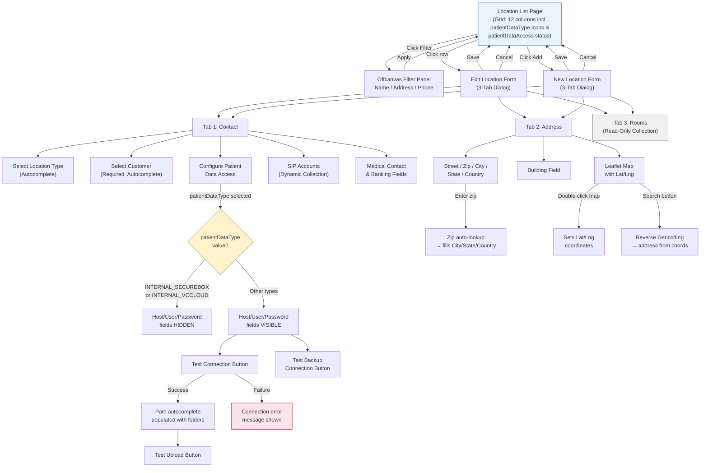
```mermaid
flowchart TD
    A["Location List Page<br>(Grid: 12 columns incl.<br>patientDataType icons &<br>patientDataAccess status)"] -->|"Click Filter"| FILT["Offcanvas Filter Panel<br>Name / Address / Phone"]
    A -->|"Click row"| EDIT["Edit Location Form<br>(3-Tab Dialog)"]
    A -->|"Click Add"| NEW["New Location Form<br>(3-Tab Dialog)"]

    FILT -->|"Apply"| A

    EDIT --> L_TAB1["Tab 1: Contact"]
    EDIT --> L_TAB2["Tab 2: Address"]
    EDIT --> L_TAB3["Tab 3: Rooms<br>(Read-Only Collection)"]

    NEW --> L_TAB1
    NEW --> L_TAB2
    NEW --> L_TAB3

    L_TAB1 --> TYPE["Select Location Type<br>(Autocomplete)"]
    L_TAB1 --> CUST["Select Customer<br>(Required, Autocomplete)"]
    L_TAB1 --> PDA["Configure Patient<br>Data Access"]
    L_TAB1 --> SIP["SIP Accounts<br>(Dynamic Collection)"]
    L_TAB1 --> MED["Medical Contact<br>& Banking Fields"]

    PDA -->|"patientDataType selected"| PDA_CHECK{"patientDataType<br>value?"}
    PDA_CHECK -->|"INTERNAL_SECUREBOX<br>or INTERNAL_VCCLOUD"| HIDE["Host/User/Password<br>fields HIDDEN"]
    PDA_CHECK -->|"Other types"| SHOW["Host/User/Password<br>fields VISIBLE"]
    SHOW --> TEST_CONN["Test Connection Button"]
    TEST_CONN -->|"Success"| FOLDERS["Path autocomplete<br>populated with folders"]
    TEST_CONN -->|"Failure"| CONN_ERR["Connection error<br>message shown"]
    FOLDERS --> TEST_UP["Test Upload Button"]
    SHOW --> TEST_BACKUP["Test Backup<br>Connection Button"]

    L_TAB2 --> ADDR["Street / Zip / City /<br>State / Country"]
    ADDR -->|"Enter zip"| ZIP2["Zip auto-lookup<br>→ fills City/State/Country"]
    L_TAB2 --> BLDG["Building Field"]
    L_TAB2 --> MAP["Leaflet Map<br>with Lat/Lng"]
    MAP -->|"Double-click map"| COORDS["Sets Lat/Lng<br>coordinates"]
    MAP -->|"Search button"| GEOCODE["Reverse Geocoding<br>→ address from coords"]

    EDIT -->|"Save"| A
    EDIT -->|"Cancel"| A
    NEW -->|"Save"| A
    NEW -->|"Cancel"| A

    style A fill:#e8f4f8,stroke:#2c7bb6
    style L_TAB3 fill:#f0f0f0,stroke:#666
    style CONN_ERR fill:#fce4ec,stroke:#c62828
    style PDA_CHECK fill:#fff3cd,stroke:#856404
```

**Key observations:**

- The grid's 12 columns include visual indicators: icons for `patientDataType` and status badges for `patientDataAccess`.
- The `patientDataType` enum directly controls field visibility — selecting `INTERNAL_SECUREBOX` or `INTERNAL_VCCLOUD` hides connection credential fields because these types use internal infrastructure.
- Connection testing follows a sequential flow: test connection → populate folder paths → test upload. Each step depends on the previous one succeeding.
- Tab 3 (Rooms) is read-only — it shows rooms associated with this location but rooms are managed from their own list page.

---

### 2a. Location Patient Data Connection — State Diagram

This diagram models the connection testing lifecycle from the user's perspective.

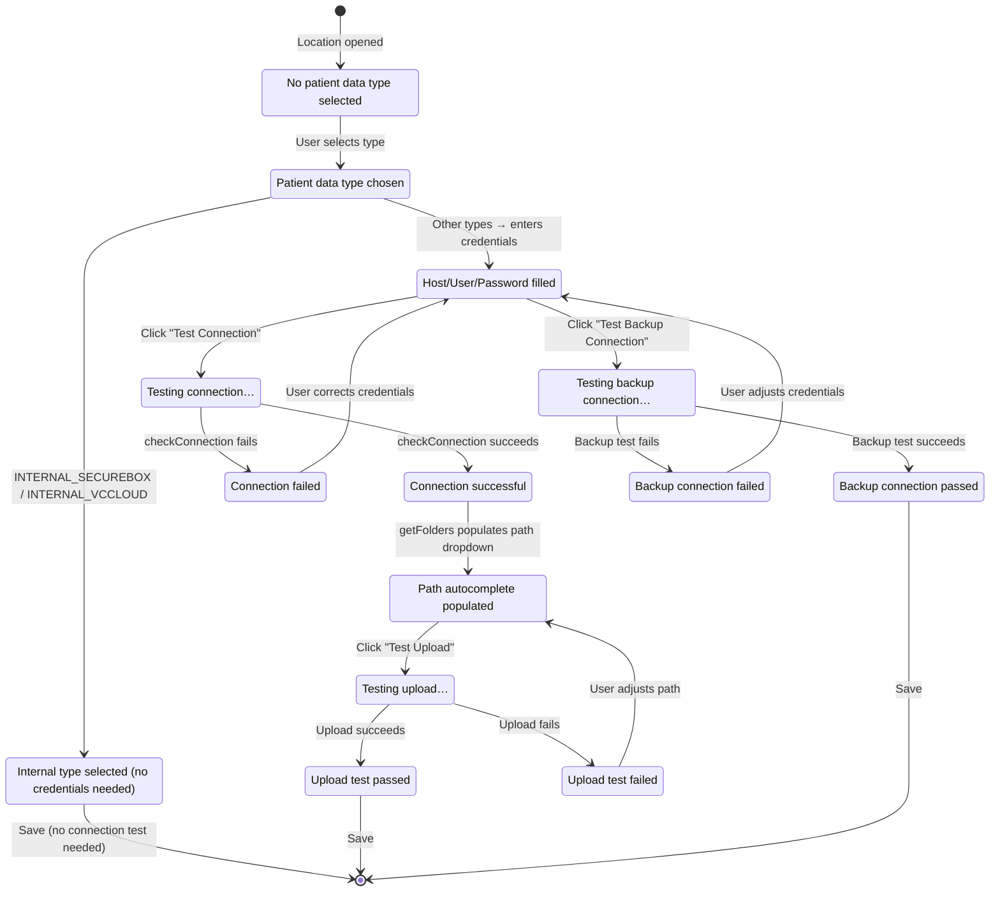
```mermaid
stateDiagram-v2
    [*] --> Unconfigured: Location opened

    Unconfigured: No patient data type selected
    TypeSelected: Patient data type chosen
    InternalType: Internal type selected (no credentials needed)
    CredentialsEntered: Host/User/Password filled
    TestingConnection: Testing connection…
    Connected: Connection successful
    ConnectionFailed: Connection failed
    FoldersLoaded: Path autocomplete populated
    TestingUpload: Testing upload…
    UploadOK: Upload test passed
    UploadFailed: Upload test failed
    TestingBackup: Testing backup connection…
    BackupOK: Backup connection passed
    BackupFailed: Backup connection failed

    Unconfigured --> TypeSelected: User selects type
    TypeSelected --> InternalType: INTERNAL_SECUREBOX / INTERNAL_VCCLOUD
    TypeSelected --> CredentialsEntered: Other types → enters credentials
    InternalType --> [*]: Save (no connection test needed)

    CredentialsEntered --> TestingConnection: Click "Test Connection"
    TestingConnection --> Connected: checkConnection succeeds
    TestingConnection --> ConnectionFailed: checkConnection fails
    ConnectionFailed --> CredentialsEntered: User corrects credentials

    Connected --> FoldersLoaded: getFolders populates path dropdown
    FoldersLoaded --> TestingUpload: Click "Test Upload"
    TestingUpload --> UploadOK: Upload succeeds
    TestingUpload --> UploadFailed: Upload fails
    UploadFailed --> FoldersLoaded: User adjusts path

    CredentialsEntered --> TestingBackup: Click "Test Backup Connection"
    TestingBackup --> BackupOK: Backup test succeeds
    TestingBackup --> BackupFailed: Backup test fails
    BackupFailed --> CredentialsEntered: User adjusts credentials

    UploadOK --> [*]: Save
    BackupOK --> [*]: Save
```

---

## 3. Contact Management — User Journey

Contacts feature a unique A-Z quick filter and support import/export operations alongside standard CRUD.

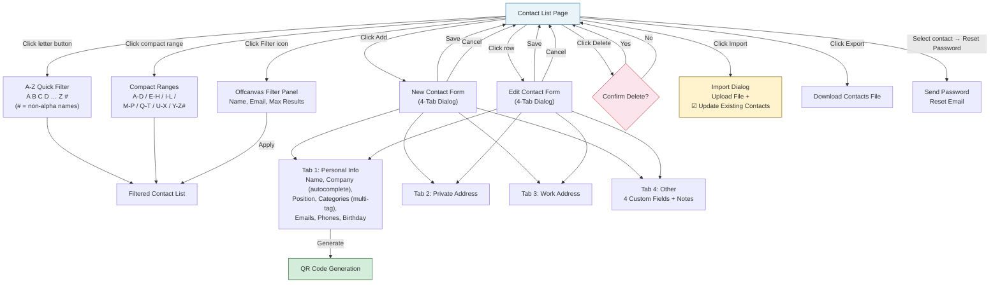
```mermaid
flowchart TD
    A["Contact List Page"] -->|"Click letter button"| AZ["A-Z Quick Filter<br>A B C D … Z #<br>(# = non-alpha names)"]
    A -->|"Click compact range"| AZ_COMPACT["Compact Ranges<br>A-D / E-H / I-L /<br>M-P / Q-T / U-X / Y-Z#"]
    AZ --> A_FILTERED["Filtered Contact List"]
    AZ_COMPACT --> A_FILTERED

    A -->|"Click Filter icon"| FILT["Offcanvas Filter Panel<br>Name, Email, Max Results"]
    FILT -->|"Apply"| A_FILTERED

    A -->|"Click Add"| NEW["New Contact Form<br>(4-Tab Dialog)"]
    A -->|"Click row"| EDIT["Edit Contact Form<br>(4-Tab Dialog)"]
    A -->|"Click Delete"| DEL{"Confirm Delete?"}

    DEL -->|"Yes"| A
    DEL -->|"No"| A

    NEW --> CT1["Tab 1: Personal Info<br>Name, Company (autocomplete),<br>Position, Categories (multi-tag),<br>Emails, Phones, Birthday"]
    NEW --> CT2["Tab 2: Private Address"]
    NEW --> CT3["Tab 3: Work Address"]
    NEW --> CT4["Tab 4: Other<br>4 Custom Fields + Notes"]

    CT1 -->|"Generate"| QR["QR Code Generation"]

    EDIT --> CT1
    EDIT --> CT2
    EDIT --> CT3
    EDIT --> CT4

    A -->|"Click Import"| IMP["Import Dialog<br>Upload File +<br>☑ Update Existing Contacts"]
    A -->|"Click Export"| EXP["Download Contacts File"]
    A -->|"Select contact → Reset Password"| RESET["Send Password<br>Reset Email"]

    NEW -->|"Save"| A
    EDIT -->|"Save"| A
    NEW -->|"Cancel"| A
    EDIT -->|"Cancel"| A

    style A fill:#e8f4f8,stroke:#2c7bb6
    style DEL fill:#fce4ec,stroke:#c62828
    style QR fill:#d4edda,stroke:#155724
    style IMP fill:#fff3cd,stroke:#856404
```

**Key observations:**

- The A-Z quick filter is a unique component: letter buttons A through Z plus `#` for contacts whose names start with non-alphabetic characters. A compact variant groups letters into ranges (A-D, E-H, etc.) for smaller viewports.
- Categories on Tab 1 use a multi-tag widget (tag-it) allowing multiple category assignments.
- The import dialog includes an "Update existing contacts" checkbox that controls whether matching contacts are overwritten or skipped.
- QR code generation produces a vCard-compatible QR code from the contact's current data.

---

## 4. Room Management — User Journey

Rooms combine basic CRUD with a calendar-based planning interface and equipment association.

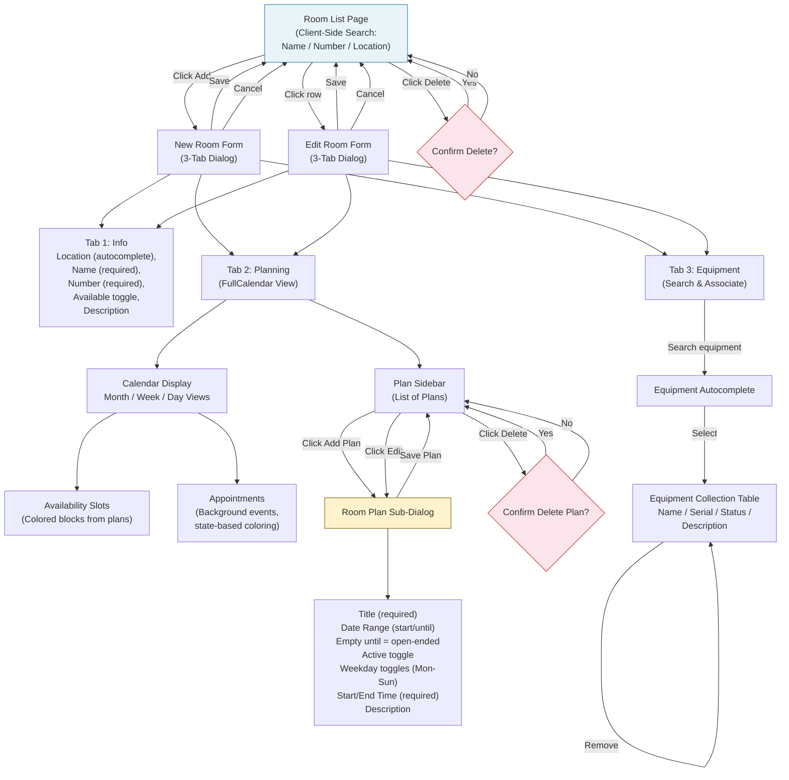
```mermaid
flowchart TD
    A["Room List Page<br>(Client-Side Search:<br>Name / Number / Location)"] -->|"Click Add"| NEW["New Room Form<br>(3-Tab Dialog)"]
    A -->|"Click row"| EDIT["Edit Room Form<br>(3-Tab Dialog)"]
    A -->|"Click Delete"| DEL{"Confirm Delete?"}

    DEL -->|"Yes"| A
    DEL -->|"No"| A

    NEW --> RT1["Tab 1: Info<br>Location (autocomplete),<br>Name (required),<br>Number (required),<br>Available toggle,<br>Description"]
    NEW --> RT2["Tab 2: Planning<br>(FullCalendar View)"]
    NEW --> RT3["Tab 3: Equipment<br>(Search & Associate)"]

    EDIT --> RT1
    EDIT --> RT2
    EDIT --> RT3

    RT2 --> CAL["Calendar Display<br>Month / Week / Day Views"]
    CAL --> AVAIL["Availability Slots<br>(Colored blocks from plans)"]
    CAL --> APPTS["Appointments<br>(Background events,<br>state-based coloring)"]

    RT2 --> SIDEBAR["Plan Sidebar<br>(List of Plans)"]
    SIDEBAR -->|"Click Add Plan"| PLAN_DLG["Room Plan Sub-Dialog"]
    SIDEBAR -->|"Click Edit"| PLAN_DLG
    SIDEBAR -->|"Click Delete"| PLAN_DEL{"Confirm Delete Plan?"}
    PLAN_DEL -->|"Yes"| SIDEBAR
    PLAN_DEL -->|"No"| SIDEBAR

    PLAN_DLG --> PLAN_FIELDS["Title (required)<br>Date Range (start/until)<br>Empty until = open-ended<br>Active toggle<br>Weekday toggles (Mon-Sun)<br>Start/End Time (required)<br>Description"]
    PLAN_DLG -->|"Save Plan"| SIDEBAR

    RT3 -->|"Search equipment"| EQ_SEARCH["Equipment Autocomplete"]
    EQ_SEARCH -->|"Select"| EQ_TABLE["Equipment Collection Table<br>Name / Serial / Status /<br>Description"]
    EQ_TABLE -->|"Remove"| EQ_TABLE

    NEW -->|"Save"| A
    EDIT -->|"Save"| A
    NEW -->|"Cancel"| A
    EDIT -->|"Cancel"| A

    style A fill:#e8f4f8,stroke:#2c7bb6
    style DEL fill:#fce4ec,stroke:#c62828
    style PLAN_DEL fill:#fce4ec,stroke:#c62828
    style PLAN_DLG fill:#fff3cd,stroke:#856404
```

**Key observations:**

- Room search is client-side (no server call) — instant filtering as the user types.
- The planning tab displays a FullCalendar with two overlay layers: availability slots from room plans (colored blocks) and existing appointments (background events with state-based coloring).
- Room plans use a sub-dialog that opens on top of the room form. An empty "until" date means the plan repeats indefinitely.
- Equipment association is additive via autocomplete search — equipment items appear in a collection table and can be removed.

---

### 4a. Room Plan CRUD — Sequence Diagram

This diagram shows the user interaction when managing room plans within the room editing form.

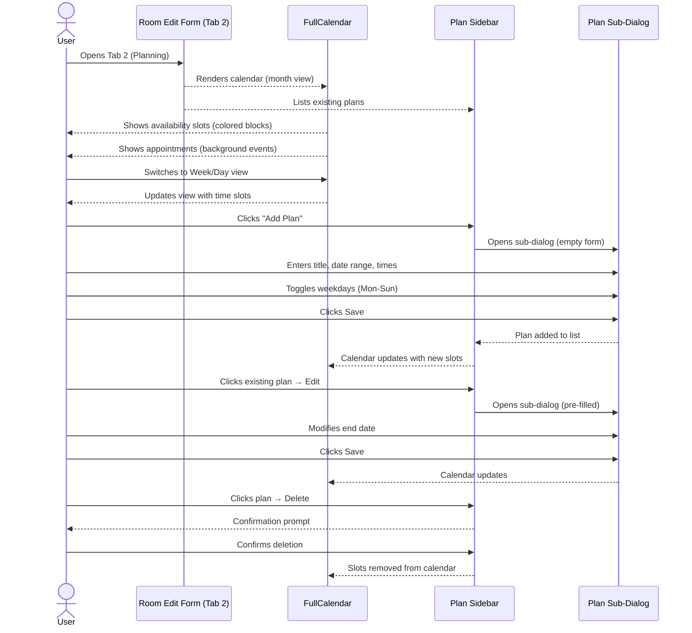
```mermaid
sequenceDiagram
    actor User
    participant RoomForm as Room Edit Form (Tab 2)
    participant Calendar as FullCalendar
    participant PlanSidebar as Plan Sidebar
    participant PlanDialog as Plan Sub-Dialog

    User->>RoomForm: Opens Tab 2 (Planning)
    RoomForm-->>Calendar: Renders calendar (month view)
    RoomForm-->>PlanSidebar: Lists existing plans

    Calendar-->>User: Shows availability slots (colored blocks)
    Calendar-->>User: Shows appointments (background events)

    User->>Calendar: Switches to Week/Day view
    Calendar-->>User: Updates view with time slots

    User->>PlanSidebar: Clicks "Add Plan"
    PlanSidebar->>PlanDialog: Opens sub-dialog (empty form)

    User->>PlanDialog: Enters title, date range, times
    User->>PlanDialog: Toggles weekdays (Mon-Sun)
    User->>PlanDialog: Clicks Save

    PlanDialog-->>PlanSidebar: Plan added to list
    PlanSidebar-->>Calendar: Calendar updates with new slots

    User->>PlanSidebar: Clicks existing plan → Edit
    PlanSidebar->>PlanDialog: Opens sub-dialog (pre-filled)
    User->>PlanDialog: Modifies end date
    User->>PlanDialog: Clicks Save
    PlanDialog-->>Calendar: Calendar updates

    User->>PlanSidebar: Clicks plan → Delete
    PlanSidebar-->>User: Confirmation prompt
    User->>PlanSidebar: Confirms deletion
    PlanSidebar-->>Calendar: Slots removed from calendar
```

---

## 5. Equipment Management — User Journey

Equipment has the most complex filtering (cascading location→room dependency) and a status lifecycle with mandatory comments.

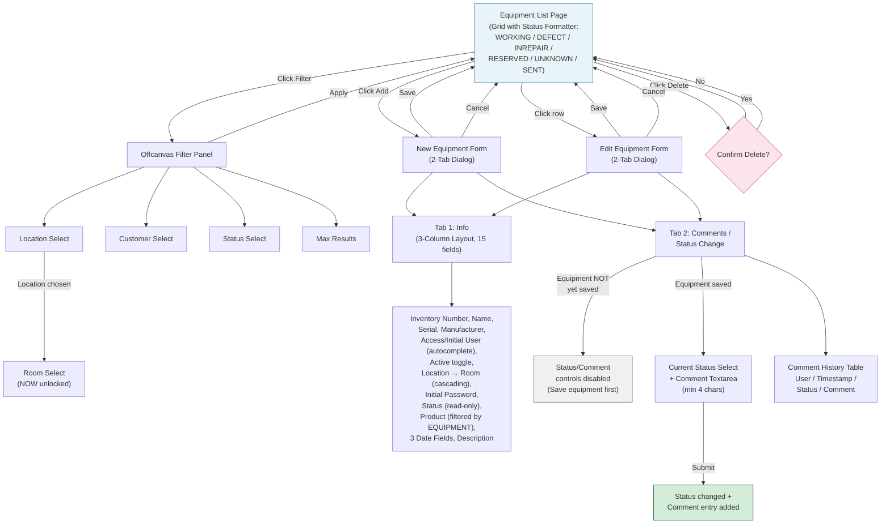
```mermaid
flowchart TD
    A["Equipment List Page<br>(Grid with Status Formatter:<br>WORKING / DEFECT / INREPAIR /<br>RESERVED / UNKNOWN / SENT)"] -->|"Click Filter"| FILT["Offcanvas Filter Panel"]
    A -->|"Click Add"| NEW["New Equipment Form<br>(2-Tab Dialog)"]
    A -->|"Click row"| EDIT["Edit Equipment Form<br>(2-Tab Dialog)"]
    A -->|"Click Delete"| DEL{"Confirm Delete?"}

    DEL -->|"Yes"| A
    DEL -->|"No"| A

    FILT --> FILT_LOC["Location Select"]
    FILT_LOC -->|"Location chosen"| FILT_ROOM["Room Select<br>(NOW unlocked)"]
    FILT --> FILT_CUST["Customer Select"]
    FILT --> FILT_STATUS["Status Select"]
    FILT --> FILT_MAX["Max Results"]
    FILT -->|"Apply"| A

    NEW --> ET1["Tab 1: Info<br>(3-Column Layout, 15 fields)"]
    EDIT --> ET1
    NEW --> ET2["Tab 2: Comments /<br>Status Change"]
    EDIT --> ET2

    ET1 --> FIELDS["Inventory Number, Name,<br>Serial, Manufacturer,<br>Access/Initial User (autocomplete),<br>Active toggle,<br>Location → Room (cascading),<br>Initial Password,<br>Status (read-only),<br>Product (filtered by EQUIPMENT),<br>3 Date Fields, Description"]

    ET2 -->|"Equipment NOT<br>yet saved"| DISABLED["Status/Comment<br>controls disabled<br>(Save equipment first)"]
    ET2 -->|"Equipment saved"| STATUS_FORM["Current Status Select<br>+ Comment Textarea<br>(min 4 chars)"]
    STATUS_FORM -->|"Submit"| STATUS_CHANGE["Status changed +<br>Comment entry added"]
    ET2 --> HISTORY["Comment History Table<br>User / Timestamp /<br>Status / Comment"]

    NEW -->|"Save"| A
    EDIT -->|"Save"| A
    NEW -->|"Cancel"| A
    EDIT -->|"Cancel"| A

    style A fill:#e8f4f8,stroke:#2c7bb6
    style DEL fill:#fce4ec,stroke:#c62828
    style DISABLED fill:#f0f0f0,stroke:#666
    style STATUS_CHANGE fill:#d4edda,stroke:#155724
```

**Key observations:**

- The filter panel has a cascading dependency: the Room select is read-only and disabled until a Location is selected. If the user selects a Room first (from another context), the Location auto-populates.
- Status is read-only on Tab 1 — it can only be changed via the dedicated status change form on Tab 2.
- Status changes require a comment of at least 4 characters. This creates an audit trail visible in the comment history.
- Tab 2 controls are disabled until the equipment record has been saved at least once.

---

### 5a. Equipment Status Lifecycle — State Diagram

This diagram shows all valid equipment statuses and the transitions a user can make.

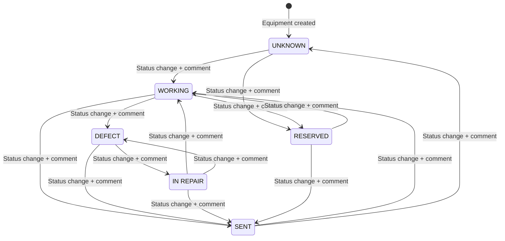
```mermaid
stateDiagram-v2
    [*] --> UNKNOWN: Equipment created

    UNKNOWN: UNKNOWN
    WORKING: WORKING
    DEFECT: DEFECT
    INREPAIR: IN REPAIR
    RESERVED: RESERVED
    SENT: SENT

    UNKNOWN --> WORKING: Status change + comment
    UNKNOWN --> RESERVED: Status change + comment

    WORKING --> DEFECT: Status change + comment
    WORKING --> RESERVED: Status change + comment
    WORKING --> SENT: Status change + comment

    DEFECT --> INREPAIR: Status change + comment
    DEFECT --> SENT: Status change + comment

    INREPAIR --> WORKING: Status change + comment
    INREPAIR --> DEFECT: Status change + comment
    INREPAIR --> SENT: Status change + comment

    RESERVED --> WORKING: Status change + comment
    RESERVED --> SENT: Status change + comment

    SENT --> WORKING: Status change + comment
    SENT --> UNKNOWN: Status change + comment
```

**Status lifecycle notes:**

- Every status transition requires a comment (minimum 4 characters), creating a full audit trail.
- New equipment starts in `UNKNOWN` status.
- `DEFECT` equipment can only move to `INREPAIR` or `SENT` — it cannot go directly back to `WORKING`.
- Equipment returning from repair (`INREPAIR → WORKING`) represents a completed repair cycle.

---

### 5b. Cascading Filter Dependency — Sequence Diagram

This diagram shows how the Location and Room filters interact in the equipment filter panel.

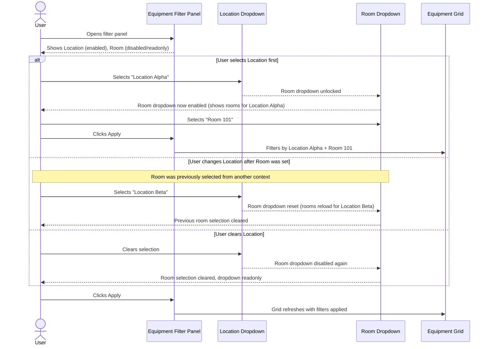
```mermaid
sequenceDiagram
    actor User
    participant FilterPanel as Equipment Filter Panel
    participant LocationSelect as Location Dropdown
    participant RoomSelect as Room Dropdown
    participant Grid as Equipment Grid

    User->>FilterPanel: Opens filter panel
    FilterPanel-->>User: Shows Location (enabled), Room (disabled/readonly)

    alt User selects Location first
        User->>LocationSelect: Selects "Location Alpha"
        LocationSelect-->>RoomSelect: Room dropdown unlocked
        RoomSelect-->>User: Room dropdown now enabled (shows rooms for Location Alpha)
        User->>RoomSelect: Selects "Room 101"
        User->>FilterPanel: Clicks Apply
        FilterPanel->>Grid: Filters by Location Alpha + Room 101
    else User changes Location after Room was set
        Note over User,RoomSelect: Room was previously selected from another context
        User->>LocationSelect: Selects "Location Beta"
        LocationSelect-->>RoomSelect: Room dropdown reset (rooms reload for Location Beta)
        RoomSelect-->>User: Previous room selection cleared
    else User clears Location
        User->>LocationSelect: Clears selection
        LocationSelect-->>RoomSelect: Room dropdown disabled again
        RoomSelect-->>User: Room selection cleared, dropdown readonly
    end

    User->>FilterPanel: Clicks Apply
    FilterPanel->>Grid: Grid refreshes with filters applied
```

---

## 6. Customer User Management — User Journey

Customer users are managed from a dedicated page filtered by `type=CUSTOMER`, with a profile form that includes Austrian/German-specific SSN validation.

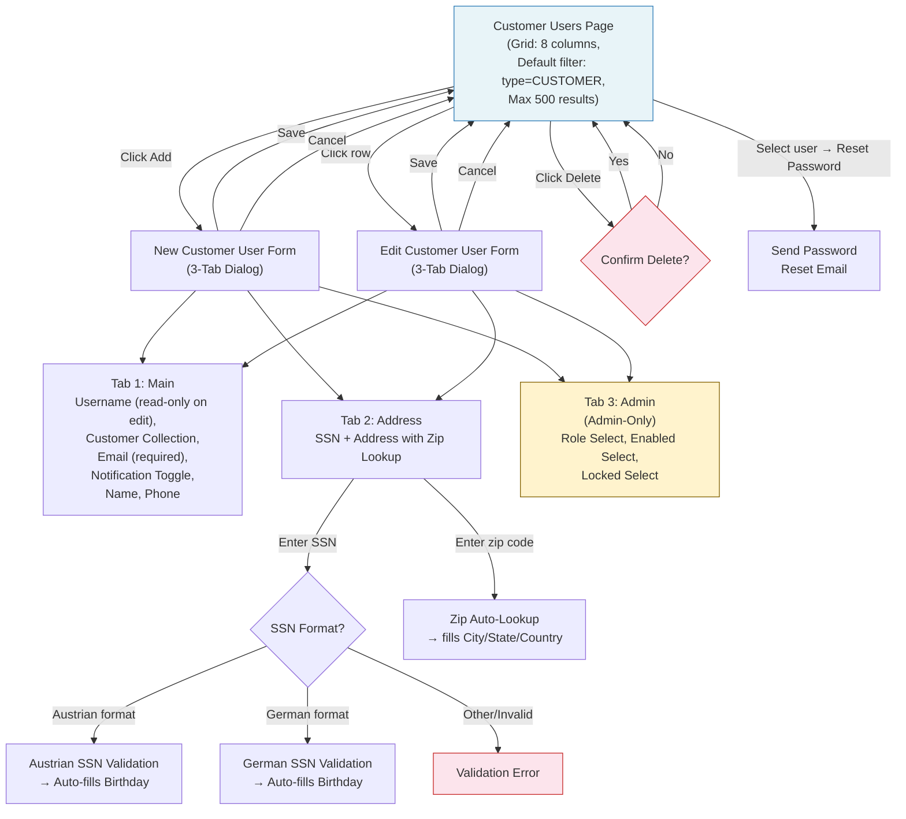
```mermaid
flowchart TD
    A["Customer Users Page<br>(Grid: 8 columns,<br>Default filter: type=CUSTOMER,<br>Max 500 results)"] -->|"Click Add"| NEW["New Customer User Form<br>(3-Tab Dialog)"]
    A -->|"Click row"| EDIT["Edit Customer User Form<br>(3-Tab Dialog)"]
    A -->|"Click Delete"| DEL{"Confirm Delete?"}
    A -->|"Select user → Reset Password"| RESET["Send Password<br>Reset Email"]

    DEL -->|"Yes"| A
    DEL -->|"No"| A

    NEW --> UT1["Tab 1: Main<br>Username (read-only on edit),<br>Customer Collection,<br>Email (required),<br>Notification Toggle,<br>Name, Phone"]
    NEW --> UT2["Tab 2: Address<br>SSN + Address with Zip Lookup"]
    NEW --> UT3["Tab 3: Admin<br>(Admin-Only)<br>Role Select, Enabled Select,<br>Locked Select"]

    EDIT --> UT1
    EDIT --> UT2
    EDIT --> UT3

    UT2 -->|"Enter SSN"| SSN_CHECK{"SSN Format?"}
    SSN_CHECK -->|"Austrian format"| AT["Austrian SSN Validation<br>→ Auto-fills Birthday"]
    SSN_CHECK -->|"German format"| DE["German SSN Validation<br>→ Auto-fills Birthday"]
    SSN_CHECK -->|"Other/Invalid"| SSN_ERR["Validation Error"]

    UT2 -->|"Enter zip code"| ZIP3["Zip Auto-Lookup<br>→ fills City/State/Country"]

    NEW -->|"Save"| A
    EDIT -->|"Save"| A
    NEW -->|"Cancel"| A
    EDIT -->|"Cancel"| A

    style A fill:#e8f4f8,stroke:#2c7bb6
    style DEL fill:#fce4ec,stroke:#c62828
    style UT3 fill:#fff3cd,stroke:#856404
    style SSN_ERR fill:#fce4ec,stroke:#c62828
```

**Key observations:**

- The page always pre-filters by `type=CUSTOMER` — only customer-type users appear.
- Username becomes read-only after initial creation (on edit).
- SSN validation is locale-aware: it recognizes Austrian and German social security number formats and auto-fills the birthday field from the SSN.
- The Admin tab (Tab 3) is restricted to admin users and controls role assignment, account enabled/locked status.
- Password reset sends an email to the user's registered email address.

---

### 6a. Zip Code Auto-Lookup — Sequence Diagram

This interaction pattern is shared across Customer, Location, and Customer User forms wherever an address with zip code is entered.

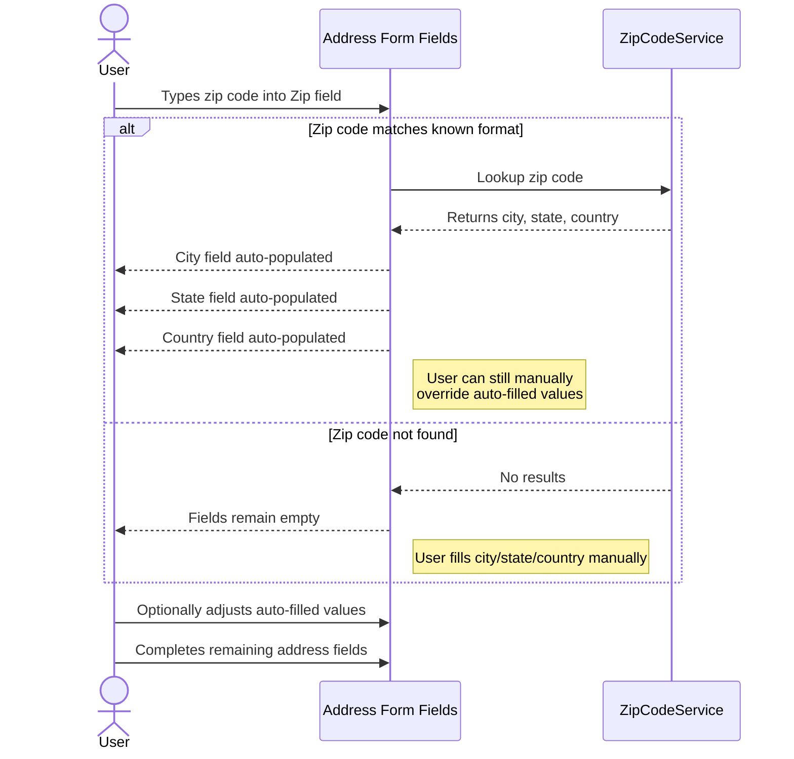
```mermaid
sequenceDiagram
    actor User
    participant Form as Address Form Fields
    participant ZipService as ZipCodeService

    User->>Form: Types zip code into Zip field

    alt Zip code matches known format
        Form->>ZipService: Lookup zip code
        ZipService-->>Form: Returns city, state, country

        Form-->>User: City field auto-populated
        Form-->>User: State field auto-populated
        Form-->>User: Country field auto-populated

        Note right of Form: User can still manually<br/>override auto-filled values
    else Zip code not found
        ZipService-->>Form: No results
        Form-->>User: Fields remain empty
        Note right of Form: User fills city/state/country manually
    end

    User->>Form: Optionally adjusts auto-filled values
    User->>Form: Completes remaining address fields
```

---

## Interdependencies Summary

| Factor | Affects | How |
|---|---|---|
| **Customer** | Locations, Customer Users | Locations and customer users must reference a customer. Customer deletion cascades or is blocked. |
| **Location** | Rooms, Equipment, Appointments | Rooms belong to a location. Equipment and appointments reference locations. Location type controls patient data config. |
| **Location → patientDataType** | Patient data access fields | Enum value controls which credential fields are shown/hidden on the location form. |
| **Location → Room** | Equipment filter, Room plans | Equipment filter's Room dropdown depends on Location selection. Room plans generate calendar availability slots. |
| **Room Plans** | Calendar availability, Appointments | Plans define availability slots shown on the FullCalendar. Appointments are displayed as background events alongside plans. |
| **Equipment Status** | Comment requirement | Every status change requires a comment (min 4 chars), creating an audit trail. |
| **Equipment → Location/Room** | Cascading filter | Room select is disabled until Location is chosen. Changing Location resets Room. |
| **ZipCodeService** | Customer, Location, Customer User addresses | Shared service auto-fills city/state/country from zip code across all address forms. |
| **User role (Admin)** | Customer billing tab, User admin tab | Billing (Customer Tab 3) and Admin (User Tab 3) are restricted to admin role. |
| **SSN validation** | Customer User birthday | Austrian/German SSN formats auto-populate birthday field on customer user forms. |
| **Contact categories** | Contact filtering | Multi-tag categories (via tag-it widget) enable categorization and downstream filtering. |
| **Contact import** | Existing contacts | "Update existing" checkbox controls whether matching contacts are overwritten or skipped during import. |
| **Customer User type** | Page default filter | Customer Users page always pre-filters by `type=CUSTOMER`, showing only customer-type users. |

---

## Wireframe Screenshots

### W1: Customer List & Detail

7-column paginated grid with Add/Edit/Delete toolbar. 3-tab detail dialog (Contact, Address with zip auto-fill, Billing with price list + discount collections). Billing tab is admin-only.

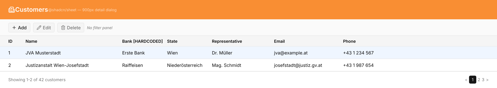

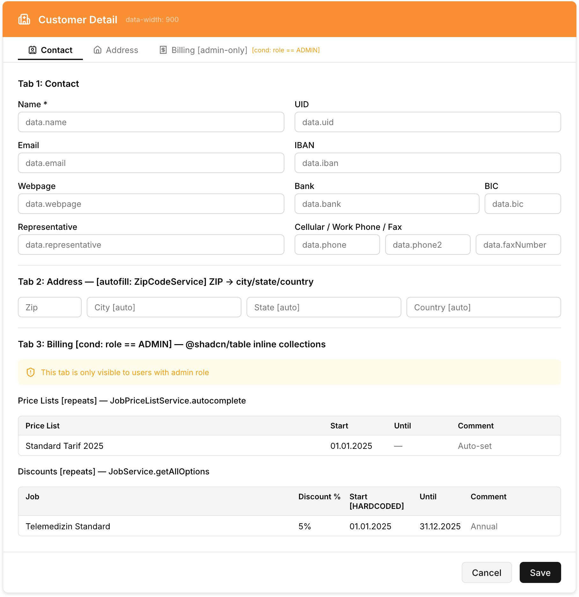

### W2: Location Management

12-column grid with patientDataType icons and patientDataAccess status indicators. Offcanvas filter panel (name/address/phone). 3-tab detail dialog with ~31 fields including patient data connection testing (sequential: test connection → folder paths → test upload → test backup), SIP accounts collection, Leaflet/Mapbox map with reverse geocoding, and read-only rooms tab.

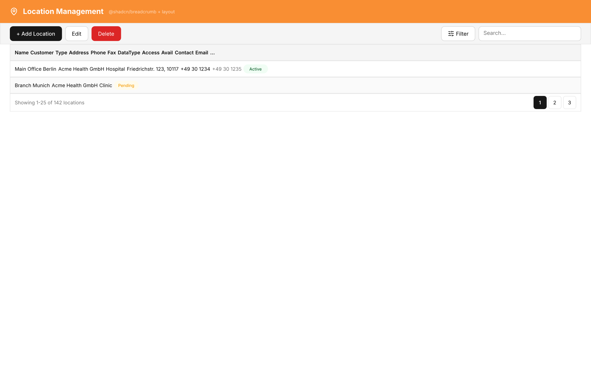

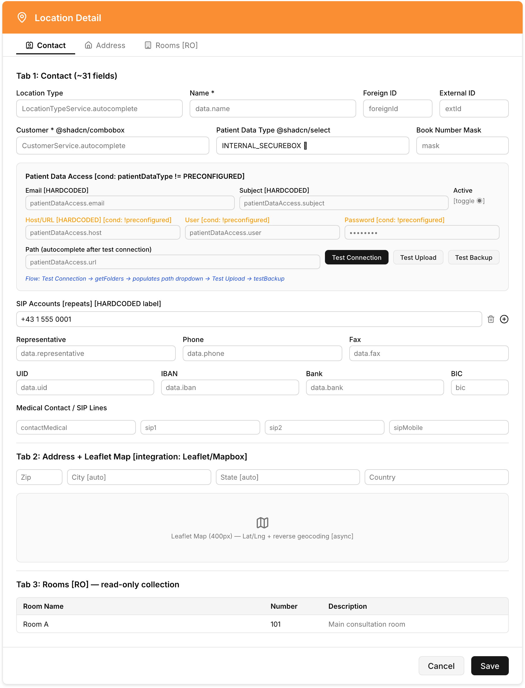

### W3: Contact Management

A-Z quick filter bar (full A–Z + # and compact ranges A-D/E-H/etc.). 13-column grid with offcanvas filter (name, email, max results). 4-tab detail dialog (personal info with categories multi-tag + QR code, private address, work address, custom fields + notes). Import dialog with force-update checkbox. Download export + Send Password actions.

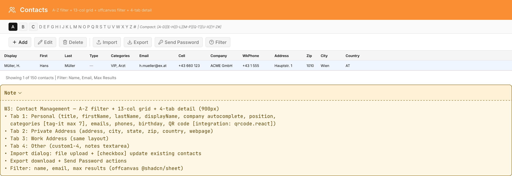

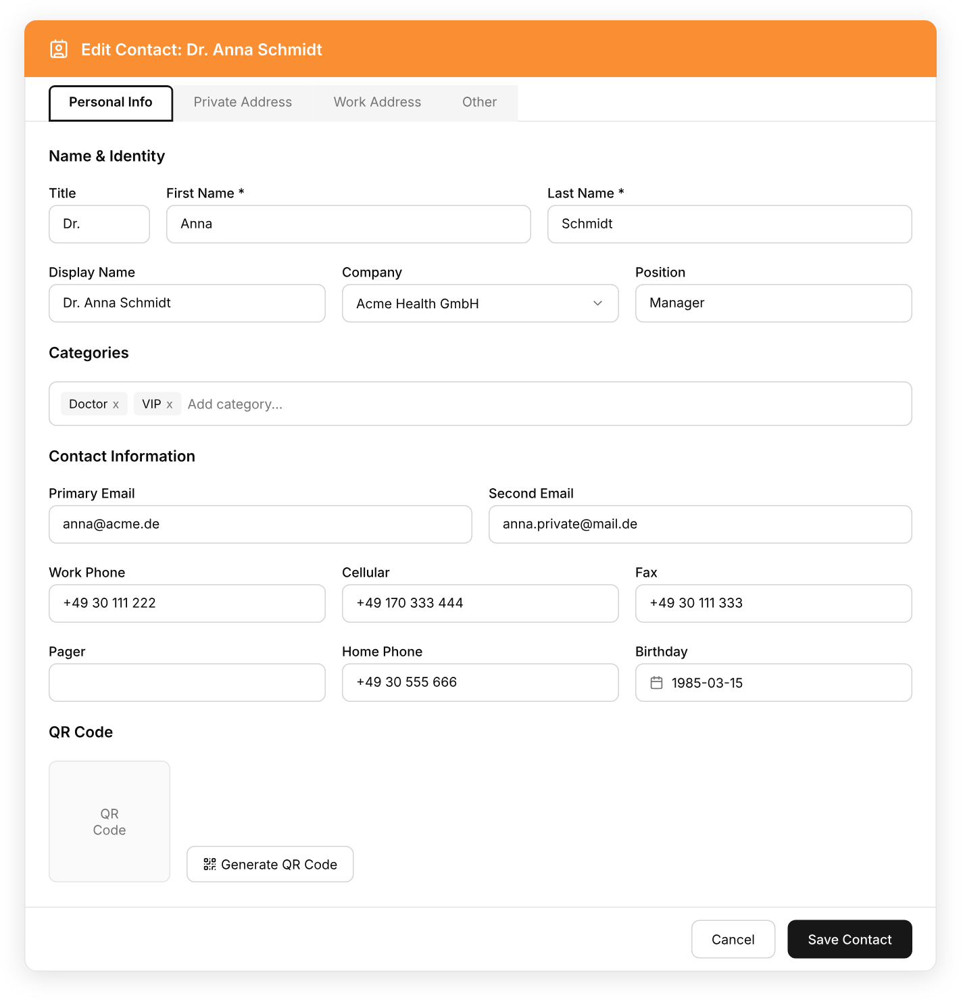

### W4: Room Management

5-column grid with client-side search. 3-tab detail dialog: room info with location autocomplete + available toggle, planning tab with FullCalendar (month/week/day views, availability slots from plans, appointment background events) + plan sidebar with CRUD + room plan sub-dialog (weekday checkboxes, time pickers), equipment tab with autocomplete insert + collection table.

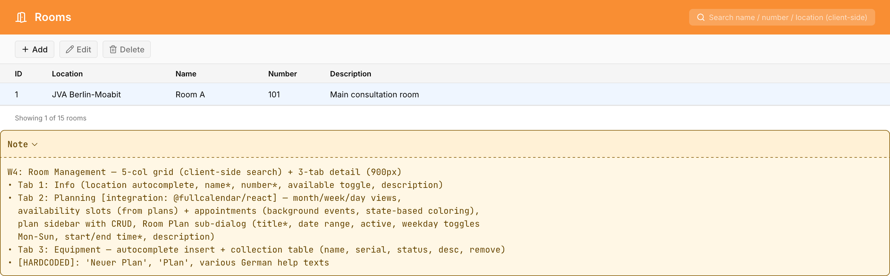

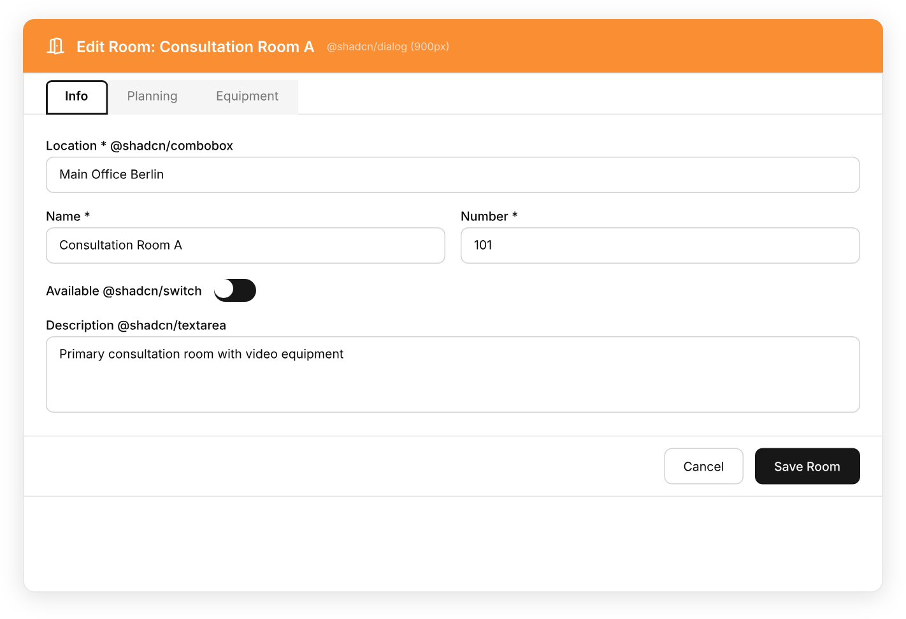

### W5: Equipment Management

9-column grid with status formatter. Offcanvas filter panel with cascading Location→Room dependency. 2-tab detail dialog: 15 equipment fields in 3-column layout with cascading location→room autocompletes, comments/status change tab with status select + comment textarea (min 4 chars) + timestamped history collection. Status is read-only on Tab 1.

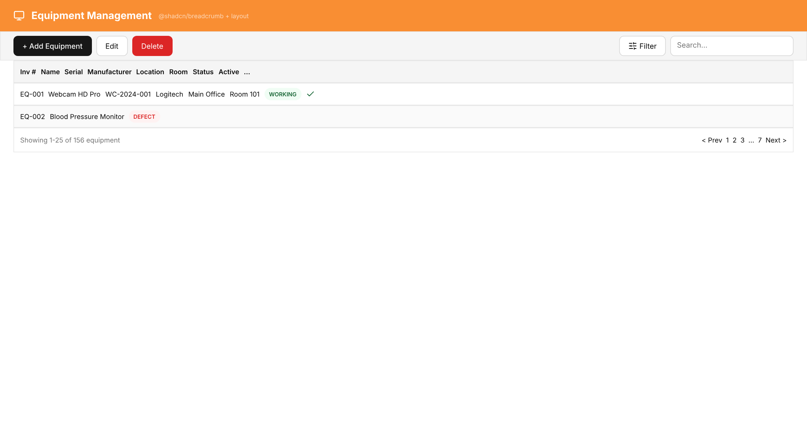

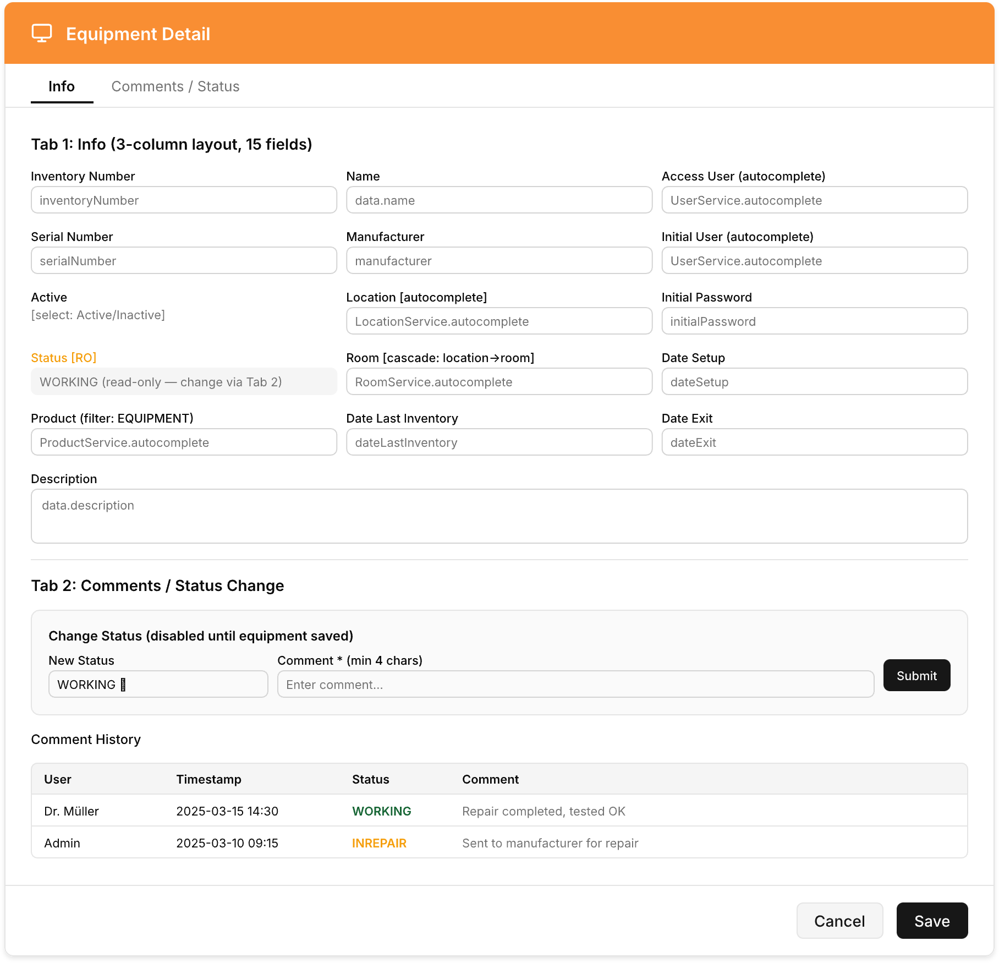
