# BasisWeb Wizard -- User Workflows

This document describes the user experience and decision flows when a clinical staff member starts a consultation via the BasisWeb Wizard. All diagrams represent the journey from the user's perspective, not internal system architecture.

---

## Context

The BasisWeb Wizard is a 6-step modal dialog launched from the treatment dashboard when a staff member wants to start a new consultation. Its purpose is to look up existing patient data from the BasisWeb external system so that the consultation can be pre-populated, or to allow a manual fallback when BasisWeb data is unavailable.

**Who uses it:** Clinical staff members (nurses, therapists, doctors) working from the treatment dashboard within an appointment context.

**Entry point:** The user clicks "Start Consultation" from the treatment dashboard for a specific appointment.

**Exit point:** The wizard closes and hands off to the Consultation Details form, either with BasisWeb data or with a manually entered book number.

---

## 1. User Journey Flowchart

This diagram shows the high-level decision flow as the user experiences it. Each node represents something the user sees or decides.

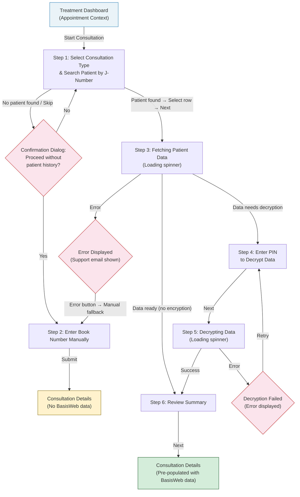

**Key observations:**

- There are two distinct paths to starting a consultation: the **BasisWeb lookup path** (Steps 1 → 3 → 4 → 5 → 6) and the **manual fallback path** (Steps 1 → 2).
- The manual fallback is reachable from two places: deliberately skipping patient search at Step 1, or as error recovery from Step 3.
- The consultation type selected in Step 1 determines which tabs and sections appear in the Consultation Details form downstream.
- Available consultation types are filtered by the user's **job capabilities** and **location settings** before the wizard opens.

---

## 2. Wizard State Diagram

This diagram models the wizard states and transitions from the user's perspective. Each state corresponds to what the user sees on screen.

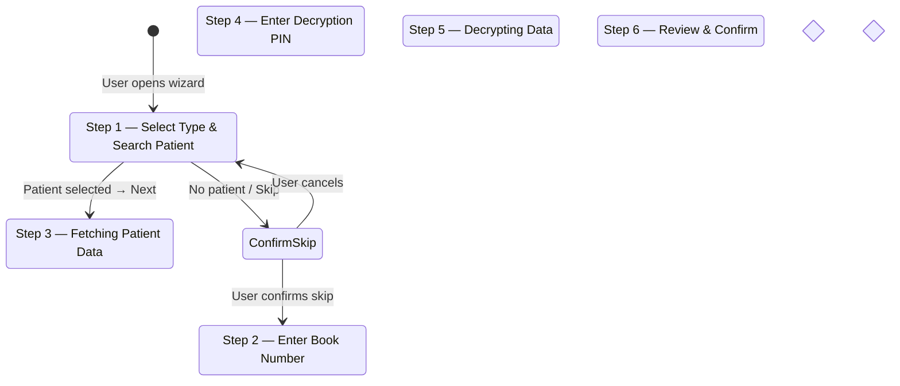

**State transition notes:**

- **SelectTypeAndSearch** is the only entry state. The user cannot skip it.
- **FetchingData** and **Decrypting** are automatic (loading) states where the user waits and cannot interact beyond observing progress.
- **ManualEntry** and **ReviewSummary** are the two terminal states that lead to closing the wizard and opening Consultation Details.
- Error states always provide a clear recovery path: fetch errors fall back to manual entry; decryption errors allow PIN retry.

---

## 3. User–System Interaction Sequence

This diagram shows the back-and-forth between the user and the system, emphasizing what the user sees (loading states, results, errors, confirmations) at each step.

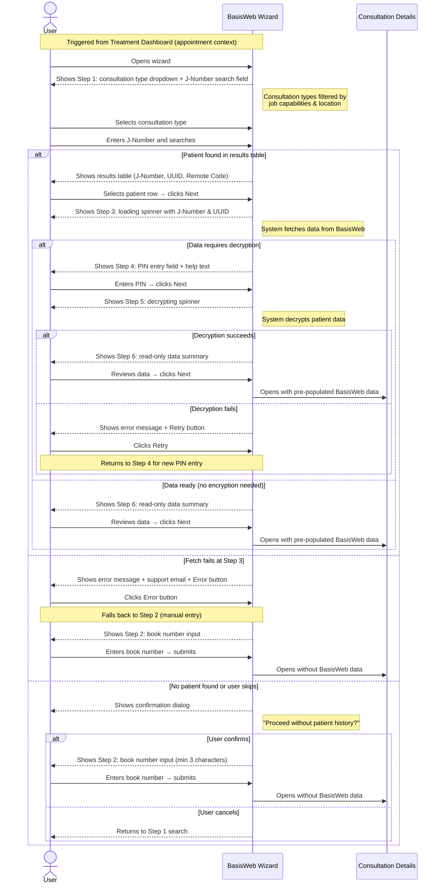

**Interaction highlights:**

- The user never interacts directly with BasisWeb. The wizard mediates all data retrieval and presents results in a simplified format.
- Loading states (Steps 3 and 5) show contextual information (J-Number, UUID) so the user knows what is being processed.
- Every error state provides an actionable next step: either retry the current operation or fall back to manual entry.
- The PIN (Step 4) is a value the user locates within the BasisWeb system itself. Help text within the wizard guides them on where to find it.

---

## Interdependencies Summary

| Factor | Affects | How |
|---|---|---|
| **Appointment context** | Wizard availability | Wizard is only accessible from a specific appointment on the treatment dashboard |
| **Job capabilities** | Step 1 consultation types | Only types matching the user's role and qualifications appear in the dropdown |
| **Location settings** | Step 1 consultation types | Facility/location configuration further filters available types |
| **Consultation type selection** | Consultation Details layout | Determines which tabs, sections, and fields appear after the wizard completes |
| **BasisWeb availability** | Path taken (lookup vs manual) | If BasisWeb fetch fails, user is routed to manual fallback |
| **Data encryption status** | Steps visited | Unencrypted data skips Steps 4 and 5 entirely |
| **Wizard output** | Consultation Details content | Summary data from Step 6 (or book number from Step 2) pre-populates the consultation form |

---

## Wireframe Screenshots

### W6-1: Step 1 — Start (JNumber Search)

Consultation type select (filtered by job capabilities) + J-Number search with autocomplete results table. Radio-select behavior on rows. Info alert with BasisWeb lookup help text.

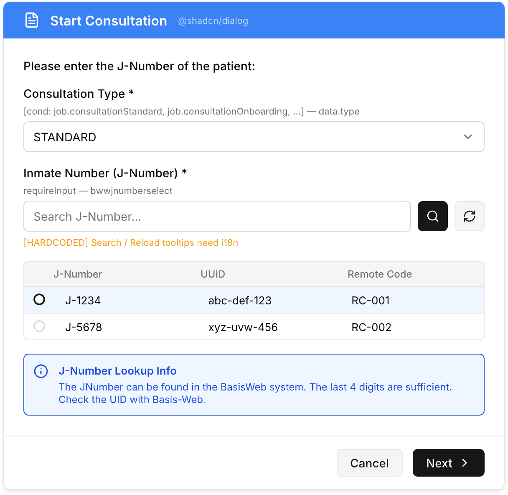

### W6-2: Step 2 — Not Available (Book Number Fallback)

Reached when user skips patient search or when BasisWeb fetch fails. Danger alert explains JNumber not found. Warning alert explains treatment can proceed with book number only. Manual book number input (min 3 chars).

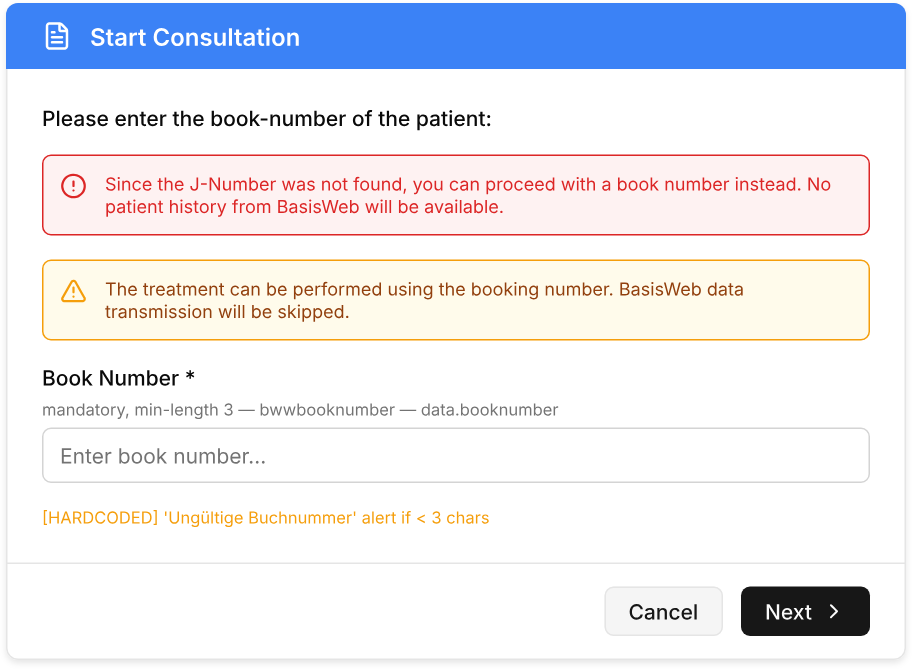

### W6-3a: Step 3 — Getting (Prepare & Poll Loading)

Automatic loading state — Next button is hidden (`data-next=false`). Shows J-Number and UUID of selected patient. Spinner indicates async polling (500ms interval) for BasisWeb data preparation.

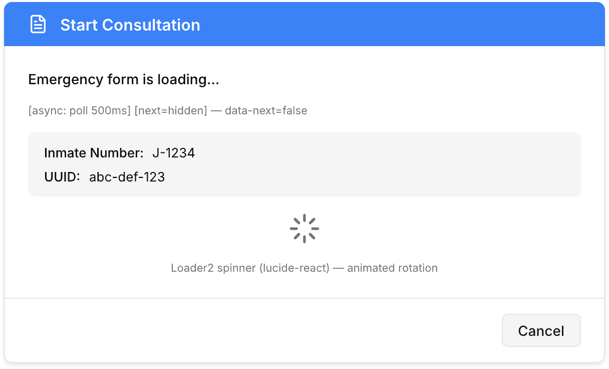

### W6-3b: Step 3 — Getting (Error)

Error variant of Step 3. Shows error message with support email link (hardcoded German). "Continue Manually" button routes user to Step 2 (book number fallback).

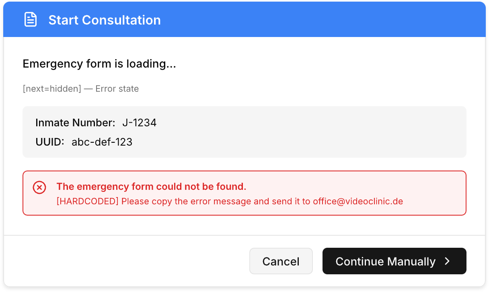

### W6-4: Step 4 — PIN Entry

Shown only when BasisWeb data requires decryption (`resultdata.requireDecrypt === true`). Key icon on input. Help text guides user to find PIN in BasisWeb system. PIN is cleared each time this step is shown.

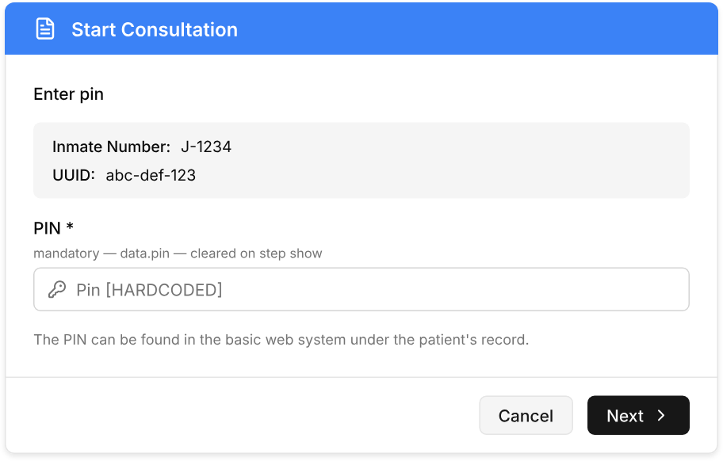

### W6-5a: Step 5 — Loading (Decryption)

Automatic loading state — Next button is hidden (`data-next=false`). System decrypts patient data using the provided PIN.

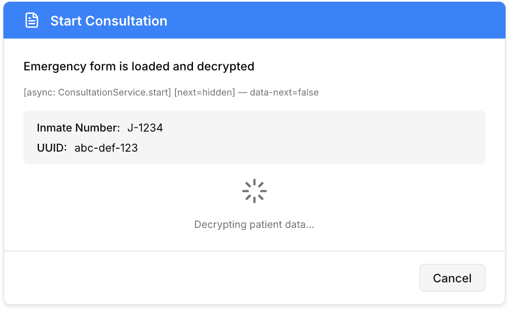

### W6-5b: Step 5 — Loading (Decryption Error)

Error variant of Step 5. Shows error message (hardcoded German). "Retry" button returns to Step 4 to re-enter PIN.

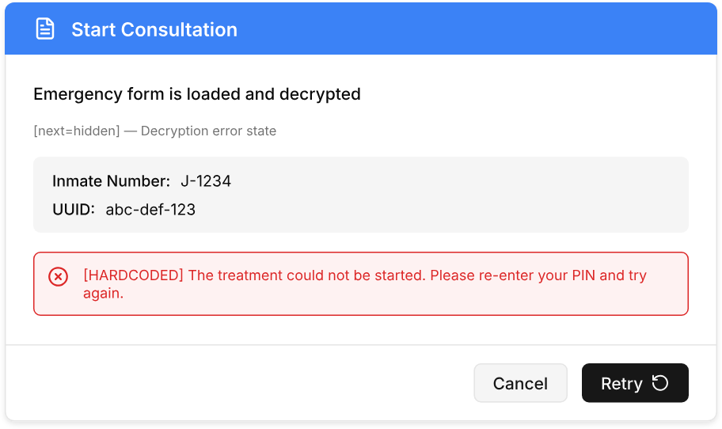

### W6-6: Step 6 — Success (Summary)

Read-only summary of all decrypted data. Disabled consultation type select includes `ONBOARDING_SHORT` (not available in Step 1). Next button closes wizard and opens Consultation Details with pre-populated data.

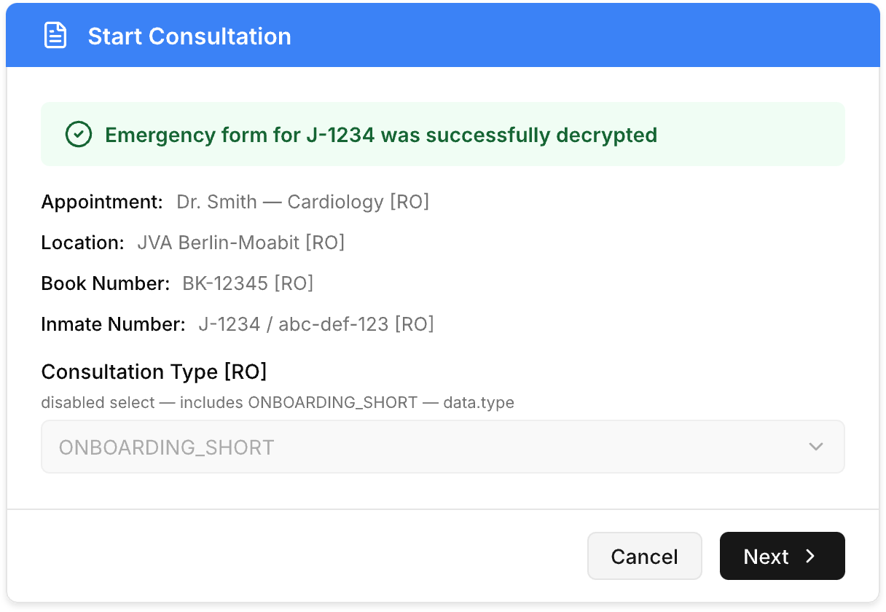
