# Planning Domain — User Workflows

This document describes the user experience and decision flows for the Planning domain: Appointment lifecycle (MonthTable grid, detail dialog, state machine), Self-service dashboard (available actions, confirmations), Calendar view, Expert availability management, and supporting dialogs (shift, ad-hoc appointment, end shift). All diagrams represent the journey from the user's perspective, not internal system architecture.

---

## Area 1: Appointment Lifecycle — From Creation to Archive

### Context

The appointment lifecycle is the core flow in the Planning domain. A manager or admin creates appointments in the MonthTable calendar grid, assigns experts, manages state transitions, and ultimately archives completed appointments. The flow involves a 12-state machine with role-dependent actions and collision detection.

**Who uses it:** Managers and admins (planning role) who schedule and coordinate appointments, shifts, councils, and treatments.

**Entry point:** User navigates to the Appointment List page (MonthTable calendar grid).

**Exit points:** Appointment reaches ARCHIVED state, or is cancelled/storno'd.

---

### 1.1 Appointment Management — User Journey Flowchart

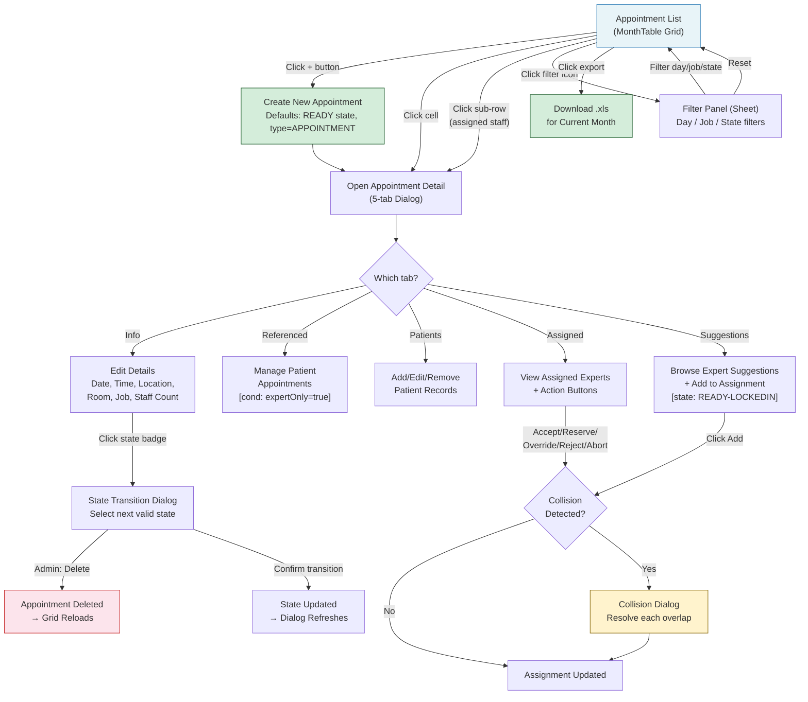
```mermaid
flowchart TD
    A["Appointment List\n(MonthTable Grid)"] -->|"Click + button"| B["Create New Appointment\nDefaults: READY state, type=APPOINTMENT"]
    A -->|"Click cell"| C["Open Appointment Detail\n(5-tab Dialog)"]
    A -->|"Click sub-row\n(assigned staff)"| C
    A -->|"Click filter icon"| D["Filter Panel (Sheet)\nDay / Job / State filters"]
    A -->|"Click export"| E["Download .xls\nfor Current Month"]

    B --> C

    C --> F{"Which tab?"}
    F -->|"Info"| G["Edit Details\nDate, Time, Location,\nRoom, Job, Staff Count"]
    F -->|"Referenced"| H["Manage Patient\nAppointments\n[cond: expertOnly=true]"]
    F -->|"Patients"| I["Add/Edit/Remove\nPatient Records"]
    F -->|"Assigned"| J["View Assigned Experts\n+ Action Buttons"]
    F -->|"Suggestions"| K["Browse Expert Suggestions\n+ Add to Assignment\n[state: READY-LOCKEDIN]"]

    J -->|"Accept/Reserve/\nOverride/Reject/Abort"| L{"Collision\nDetected?"}
    L -->|"No"| M["Assignment Updated"]
    L -->|"Yes"| N["Collision Dialog\nResolve each overlap"]
    N --> M

    K -->|"Click Add"| L

    G -->|"Click state badge"| O["State Transition Dialog\nSelect next valid state"]
    O -->|"Admin: Delete"| P["Appointment Deleted\n→ Grid Reloads"]
    O -->|"Confirm transition"| Q["State Updated\n→ Dialog Refreshes"]

    D -->|"Filter day/job/state"| A
    D -->|"Reset"| A

    style A fill:#e8f4f8,stroke:#2c7bb6
    style B fill:#d4edda,stroke:#155724
    style N fill:#fff3cd,stroke:#856404
    style P fill:#fce4ec,stroke:#c62828
    style E fill:#d4edda,stroke:#155724
```

**Key observations:**

- The MonthTable is NOT a standard DataTables grid — it's a calendar with rows = days, columns = jobs, cells = colored appointments.
- Cell clicks, sub-row clicks, and the Add button all open the same 5-tab detail dialog.
- The Suggestions tab is only visible in early states (READY through LOCKEDIN).
- The Referenced tab is only visible when the "Expert Only" checkbox is checked.
- All assignment actions (accept, reserve, override, reject, abort) pass through collision detection.
- State transitions are constrained by `ShiftLogic.getValidState()` — the dialog only shows valid next states.

---

### 1.2 Appointment State Machine — State Diagram

This diagram shows all 12 appointment states and their valid transitions as experienced by the user through the state transition dialog.

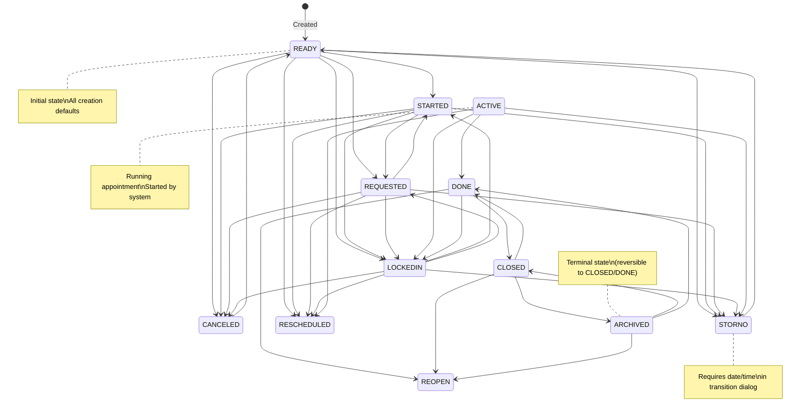
```mermaid
stateDiagram-v2
    [*] --> READY: Created

    READY --> STARTED
    READY --> REQUESTED
    READY --> LOCKEDIN
    READY --> CANCELED
    READY --> STORNO
    READY --> RESCHEDULED

    STARTED --> REQUESTED
    STARTED --> LOCKEDIN
    STARTED --> CANCELED
    STARTED --> STORNO
    STARTED --> RESCHEDULED

    REQUESTED --> STARTED
    REQUESTED --> LOCKEDIN
    REQUESTED --> CANCELED
    REQUESTED --> STORNO
    REQUESTED --> RESCHEDULED

    LOCKEDIN --> STARTED
    LOCKEDIN --> REQUESTED
    LOCKEDIN --> CANCELED
    LOCKEDIN --> STORNO
    LOCKEDIN --> RESCHEDULED

    ACTIVE --> DONE
    ACTIVE --> LOCKEDIN
    ACTIVE --> STORNO
    ACTIVE --> RESCHEDULED

    DONE --> CLOSED
    DONE --> LOCKEDIN
    DONE --> REOPEN

    CLOSED --> ARCHIVED
    CLOSED --> DONE
    CLOSED --> REOPEN

    ARCHIVED --> CLOSED
    ARCHIVED --> DONE
    ARCHIVED --> REOPEN

    CANCELED --> READY
    STORNO --> READY

    note right of READY: Initial state\nAll creation defaults
    note right of ACTIVE: Running appointment\nStarted by system
    note right of STORNO: Requires date/time\nin transition dialog
    note left of ARCHIVED: Terminal state\n(reversible to CLOSED/DONE)
```

**Key observations:**

- READY ↔ STARTED ↔ REQUESTED ↔ LOCKEDIN form a flexible pre-execution cluster.
- ACTIVE is the "running" state — forward-only to DONE/LOCKEDIN/STORNO/RESCHEDULED.
- DONE → CLOSED → ARCHIVED is the standard completion path.
- CANCELED and STORNO both allow returning to READY (re-activation).
- STORNO transition requires additional date/time fields in the dialog.
- Admin users see a Delete button in the state transition dialog (hidden for non-admins).

---

### 1.3 Appointment Detail — Sequence Diagram

This shows the user ↔ system interaction when opening and working with an appointment detail dialog.

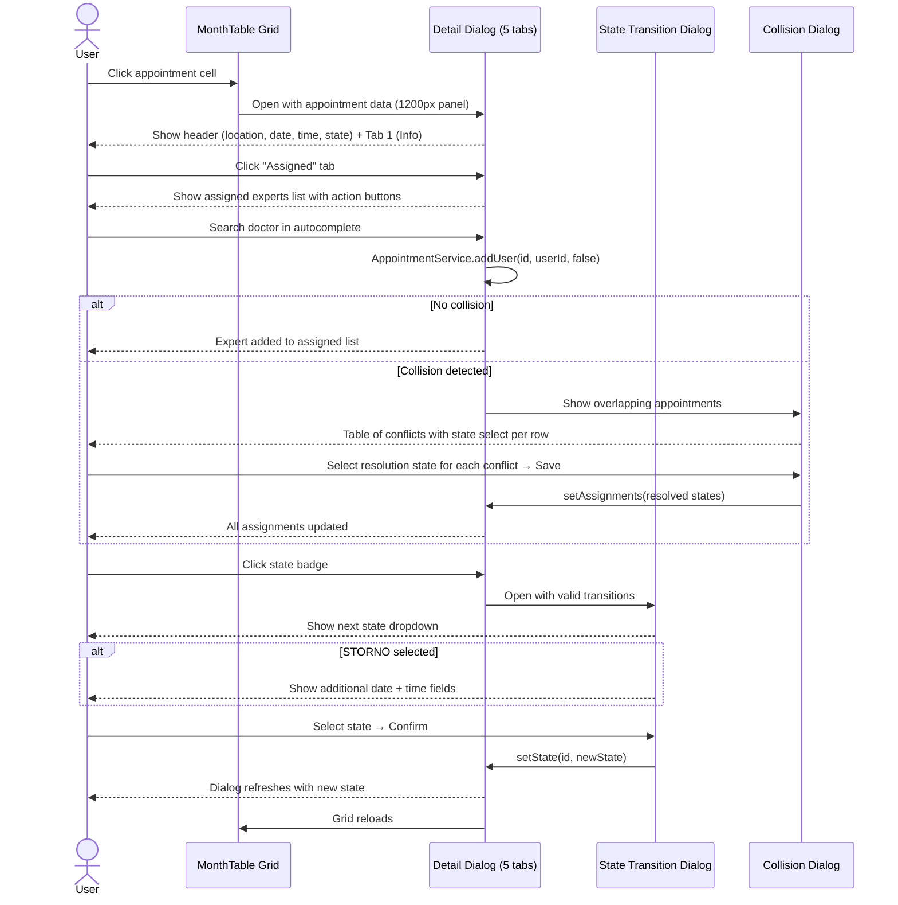
```mermaid
sequenceDiagram
    actor User
    participant Grid as MonthTable Grid
    participant Detail as Detail Dialog (5 tabs)
    participant StateDialog as State Transition Dialog
    participant CollisionDlg as Collision Dialog

    User->>Grid: Click appointment cell
    Grid->>Detail: Open with appointment data (1200px panel)
    Detail-->>User: Show header (location, date, time, state) + Tab 1 (Info)

    User->>Detail: Click "Assigned" tab
    Detail-->>User: Show assigned experts list with action buttons

    User->>Detail: Search doctor in autocomplete
    Detail->>Detail: AppointmentService.addUser(id, userId, false)

    alt No collision
        Detail-->>User: Expert added to assigned list
    else Collision detected
        Detail->>CollisionDlg: Show overlapping appointments
        CollisionDlg-->>User: Table of conflicts with state select per row
        User->>CollisionDlg: Select resolution state for each conflict → Save
        CollisionDlg->>Detail: setAssignments(resolved states)
        Detail-->>User: All assignments updated
    end

    User->>Detail: Click state badge
    Detail->>StateDialog: Open with valid transitions
    StateDialog-->>User: Show next state dropdown

    alt STORNO selected
        StateDialog-->>User: Show additional date + time fields
    end

    User->>StateDialog: Select state → Confirm
    StateDialog->>Detail: setState(id, newState)
    Detail-->>User: Dialog refreshes with new state
    Detail->>Grid: Grid reloads
```

---

### 1.4 Entity Type Decision — Type-Driven Visibility

This diagram shows how the appointment type affects what the user sees in the detail dialog.

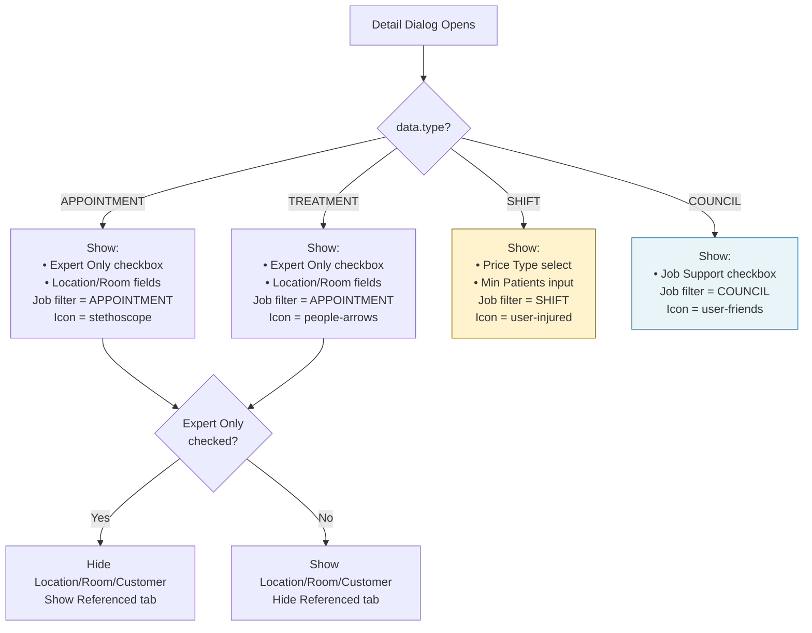
```mermaid
flowchart TD
    Open["Detail Dialog Opens"] --> TypeCheck{"data.type?"}

    TypeCheck -->|"APPOINTMENT"| AP["Show:\n• Expert Only checkbox\n• Location/Room fields\nJob filter = APPOINTMENT\nIcon = stethoscope"]
    TypeCheck -->|"TREATMENT"| TR["Show:\n• Expert Only checkbox\n• Location/Room fields\nJob filter = APPOINTMENT\nIcon = people-arrows"]
    TypeCheck -->|"SHIFT"| SH["Show:\n• Price Type select\n• Min Patients input\nJob filter = SHIFT\nIcon = user-injured"]
    TypeCheck -->|"COUNCIL"| CO["Show:\n• Job Support checkbox\nJob filter = COUNCIL\nIcon = user-friends"]

    AP --> Expert{"Expert Only\nchecked?"}
    TR --> Expert

    Expert -->|"Yes"| HideLoc["Hide Location/Room/Customer\nShow Referenced tab"]
    Expert -->|"No"| ShowLoc["Show Location/Room/Customer\nHide Referenced tab"]

    style SH fill:#fff3cd,stroke:#856404
    style CO fill:#e8f4f8,stroke:#2c7bb6
```

---

## Area 2: Self-Service Dashboard — Expert's View

### Context

Standard users (non-admin) with the `SELF_ASSIGNMENT` permission see a self-service dashboard. From here they can browse available actions, view their upcoming schedule, manage treatments, confirm/decline queued appointments, and cancel pending requests.

**Who uses it:** Clinical staff (doctors/therapists/experts) who self-manage their schedule.

**Entry point:** User logs in and views the main dashboard (standard role + SELF_ASSIGNMENT permission).

**Exit points:** Actions result in page reload with updated lists; treatment clicks open consultation detail views.

---

### 2.1 Self-Service Dashboard — User Journey Flowchart

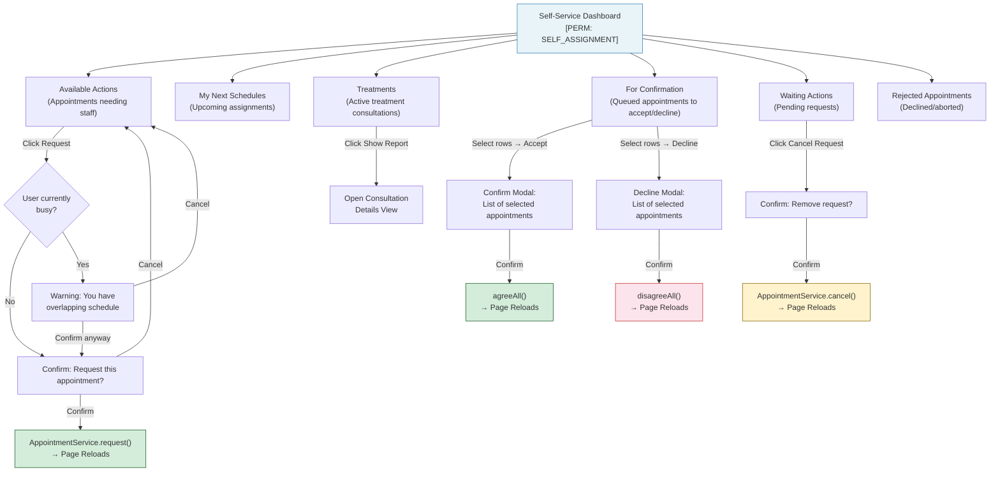
```mermaid
flowchart TD
    DASH["Self-Service Dashboard\n[PERM: SELF_ASSIGNMENT]"]

    DASH --> A["Available Actions\n(Appointments needing staff)"]
    DASH --> B["My Next Schedules\n(Upcoming assignments)"]
    DASH --> C["Treatments\n(Active treatment consultations)"]
    DASH --> D["For Confirmation\n(Queued appointments to accept/decline)"]
    DASH --> E["Waiting Actions\n(Pending requests)"]
    DASH --> F["Rejected Appointments\n(Declined/aborted)"]

    A -->|"Click Request"| G{"User currently\nbusy?"}
    G -->|"No"| H["Confirm: Request this appointment?"]
    G -->|"Yes"| I["Warning: You have\noverlapping schedule"]
    I -->|"Confirm anyway"| H
    I -->|"Cancel"| A
    H -->|"Confirm"| J["AppointmentService.request()\n→ Page Reloads"]
    H -->|"Cancel"| A

    C -->|"Click Show Report"| K["Open Consultation\nDetails View"]

    D -->|"Select rows → Accept"| L["Confirm Modal:\nList of selected appointments"]
    L -->|"Confirm"| M["agreeAll()\n→ Page Reloads"]
    D -->|"Select rows → Decline"| N["Decline Modal:\nList of selected appointments"]
    N -->|"Confirm"| O["disagreeAll()\n→ Page Reloads"]

    E -->|"Click Cancel Request"| P["Confirm: Remove request?"]
    P -->|"Confirm"| Q["AppointmentService.cancel()\n→ Page Reloads"]

    style DASH fill:#e8f4f8,stroke:#2c7bb6
    style J fill:#d4edda,stroke:#155724
    style M fill:#d4edda,stroke:#155724
    style O fill:#fce4ec,stroke:#c62828
    style Q fill:#fff3cd,stroke:#856404
```

**Key observations:**

- Available Actions check for scheduling conflicts before allowing requests (busy check).
- Confirmation and Decline modals support bulk operations on multiple selected appointments.
- The Treatments section links to the consultation detail view (crosses into Treatment domain).
- Rejected appointments are display-only (no user actions).
- All successful actions trigger a full page reload.

---

## Area 3: Calendar View — Weekly Event Overview

### Context

The calendar view provides a visual weekly overview of all scheduled events across entity types. It serves as a read-only navigation hub — users can see holidays, birthdays, appointments, and shifts at a glance, with click handlers for birthday greetings.

**Who uses it:** All authenticated users viewing their weekly schedule or team calendar.

**Entry point:** User navigates to the Calendar view from the dashboard or sidebar.

**Exit points:** Birthday click opens message compose; other event types have no click action in legacy.

---

### 3.1 Calendar View — User Journey Flowchart

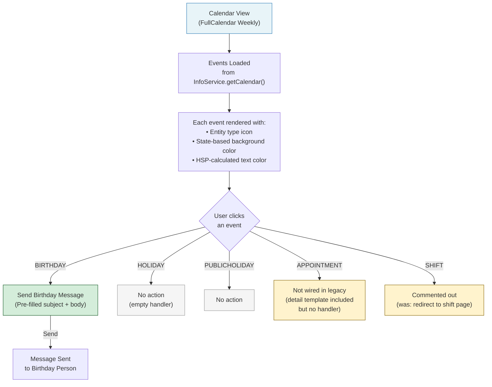
```mermaid
flowchart TD
    CAL["Calendar View\n(FullCalendar Weekly)"]

    CAL --> EVENTS["Events Loaded\nfrom InfoService.getCalendar()"]

    EVENTS --> RENDER["Each event rendered with:\n• Entity type icon\n• State-based background color\n• HSP-calculated text color"]

    RENDER --> CLICK{"User clicks\nan event"}

    CLICK -->|"BIRTHDAY"| MSG["Send Birthday Message\n(Pre-filled subject + body)"]
    CLICK -->|"HOLIDAY"| NOOP1["No action\n(empty handler)"]
    CLICK -->|"PUBLICHOLIDAY"| NOOP2["No action"]
    CLICK -->|"APPOINTMENT"| NOOP3["Not wired in legacy\n(detail template included\nbut no handler)"]
    CLICK -->|"SHIFT"| NOOP4["Commented out\n(was: redirect to shift page)"]

    MSG -->|"Send"| SENT["Message Sent\nto Birthday Person"]

    style CAL fill:#e8f4f8,stroke:#2c7bb6
    style MSG fill:#d4edda,stroke:#155724
    style NOOP1 fill:#f5f5f5,stroke:#999
    style NOOP2 fill:#f5f5f5,stroke:#999
    style NOOP3 fill:#fff3cd,stroke:#856404
    style NOOP4 fill:#fff3cd,stroke:#856404
```

### 3.2 Calendar Event Color Reference

| Entity Type | Icon | State | Color | Text |
|:---|:---|:---|:---|:---|
| HOLIDAY | island-tropical | approved | #2a67aa | white |
| HOLIDAY | island-tropical | requested | #46b1ea | black |
| HOLIDAY | island-tropical | denied | #c59838 | white |
| PUBLICHOLIDAY | calendar-times | approved | #2a67aa | white |
| BIRTHDAY | birthday-cake | active | #cce5ff | black |
| APPOINTMENT | hourglass | ready | #fff2cc | black |
| APPOINTMENT | hourglass | active | #ffff00 | black |
| APPOINTMENT | hourglass | done | #228dae | white |
| APPOINTMENT | hourglass | closed | #ff0000 | white |
| SHIFT | business-time | (same 18 states as APPOINTMENT) | (same colors) | (HSP) |

---

## Area 4: Expert Availability Management — Week & Month Grids

### Context

Experts manage their availability through two complementary grids: a **week grid** (hours × days) for fine-grained hourly availability, and a **month grid** (days × slots) for shift/appointment slot preferences. Both use a tri-state toggle interaction (unset → available → unavailable) with bulk toggle shortcuts.

**Who uses it:** Experts (doctors, therapists) managing their own availability schedule.

**Entry point:** User navigates to Week View or Month View from the dashboard.

**Exit points:** Save persists availability; Holiday dialog submits absence request.

---

### 4.1 Expert Availability — State Diagram (Tri-State Cycle)

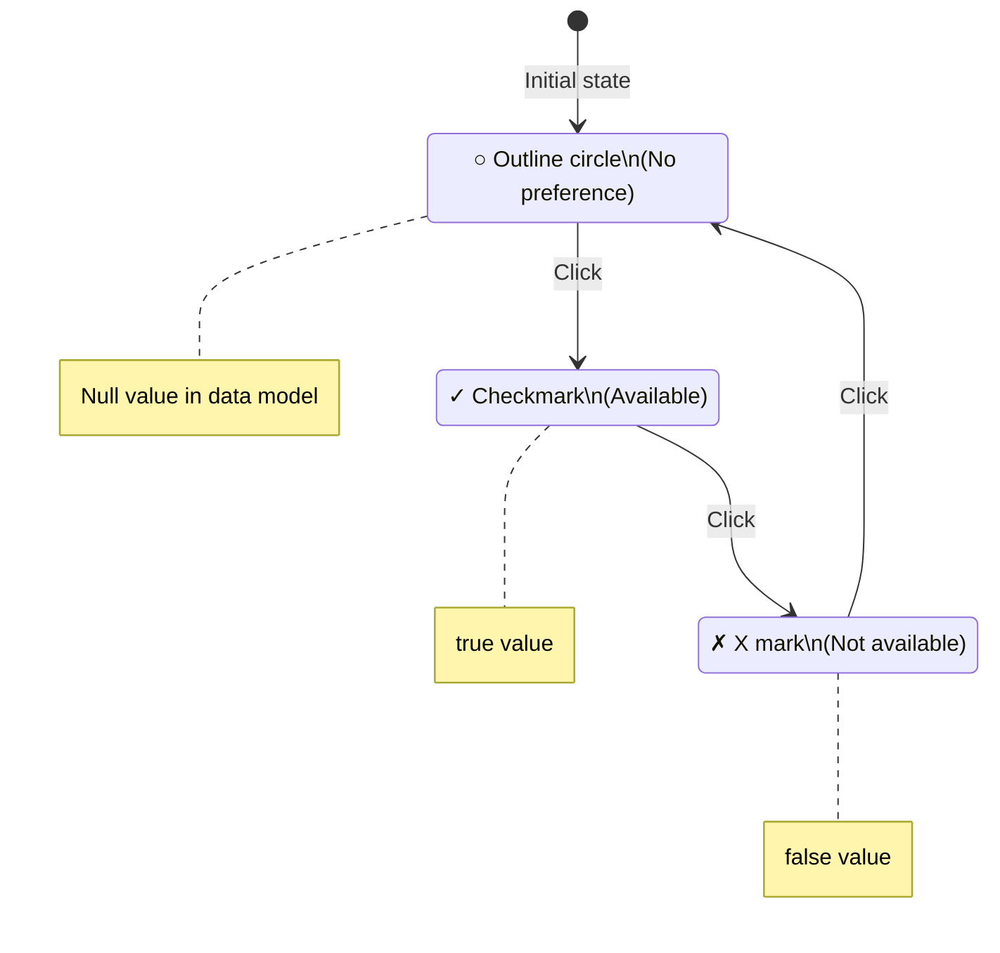
```mermaid
stateDiagram-v2
    [*] --> Unset: Initial state

    Unset: ○ Outline circle\n(No preference)
    Available: ✓ Checkmark\n(Available)
    Unavailable: ✗ X mark\n(Not available)

    Unset --> Available: Click
    Available --> Unavailable: Click
    Unavailable --> Unset: Click

    note right of Unset: Null value in data model
    note right of Available: true value
    note right of Unavailable: false value
```

### 4.2 Week View — Sequence Diagram

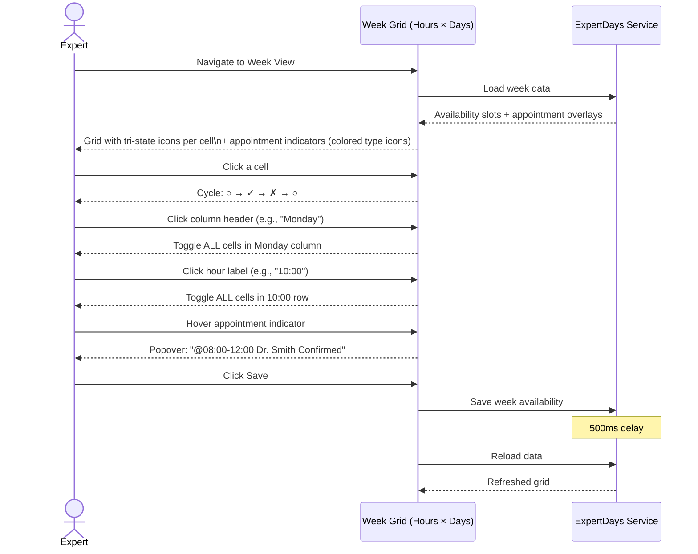
```mermaid
sequenceDiagram
    actor Expert
    participant WeekGrid as Week Grid (Hours × Days)
    participant Server as ExpertDays Service

    Expert->>WeekGrid: Navigate to Week View
    WeekGrid->>Server: Load week data
    Server-->>WeekGrid: Availability slots + appointment overlays

    WeekGrid-->>Expert: Grid with tri-state icons per cell\n+ appointment indicators (colored type icons)

    Expert->>WeekGrid: Click a cell
    WeekGrid-->>Expert: Cycle: ○ → ✓ → ✗ → ○

    Expert->>WeekGrid: Click column header (e.g., "Monday")
    WeekGrid-->>Expert: Toggle ALL cells in Monday column

    Expert->>WeekGrid: Click hour label (e.g., "10:00")
    WeekGrid-->>Expert: Toggle ALL cells in 10:00 row

    Expert->>WeekGrid: Hover appointment indicator
    WeekGrid-->>Expert: Popover: "@08:00-12:00 Dr. Smith Confirmed"

    Expert->>WeekGrid: Click Save
    WeekGrid->>Server: Save week availability
    Note over Server: 500ms delay
    WeekGrid->>Server: Reload data
    Server-->>WeekGrid: Refreshed grid
```

### 4.3 Month View — Sequence Diagram

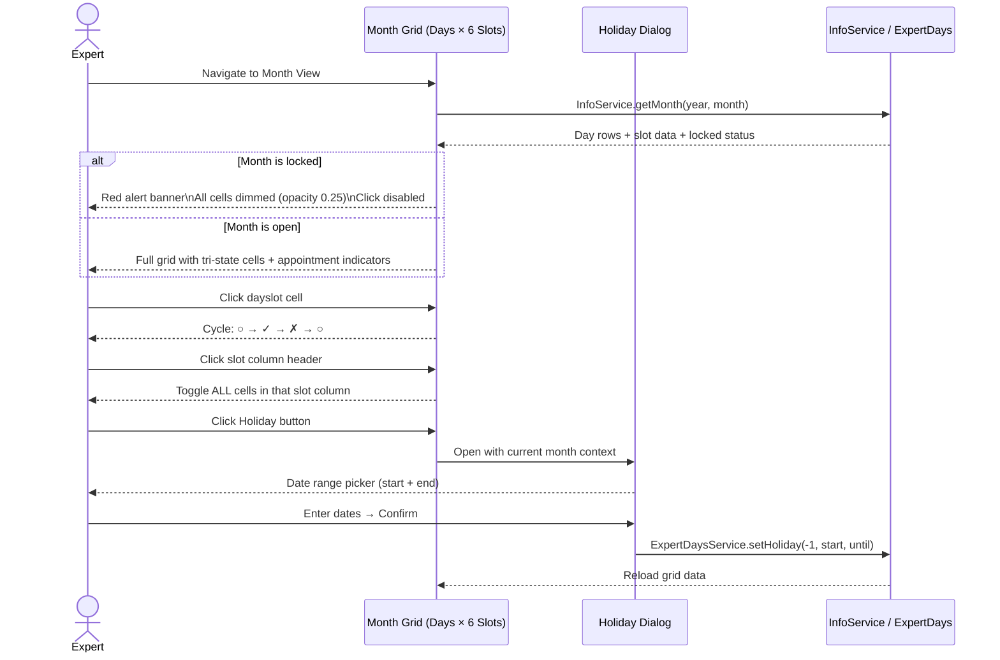
```mermaid
sequenceDiagram
    actor Expert
    participant MonthGrid as Month Grid (Days × 6 Slots)
    participant HolidayDlg as Holiday Dialog
    participant Server as InfoService / ExpertDays

    Expert->>MonthGrid: Navigate to Month View
    MonthGrid->>Server: InfoService.getMonth(year, month)
    Server-->>MonthGrid: Day rows + slot data + locked status

    alt Month is locked
        MonthGrid-->>Expert: Red alert banner\nAll cells dimmed (opacity 0.25)\nClick disabled
    else Month is open
        MonthGrid-->>Expert: Full grid with tri-state cells + appointment indicators
    end

    Expert->>MonthGrid: Click dayslot cell
    MonthGrid-->>Expert: Cycle: ○ → ✓ → ✗ → ○

    Expert->>MonthGrid: Click slot column header
    MonthGrid-->>Expert: Toggle ALL cells in that slot column

    Expert->>MonthGrid: Click Holiday button
    MonthGrid->>HolidayDlg: Open with current month context
    HolidayDlg-->>Expert: Date range picker (start + end)

    Expert->>HolidayDlg: Enter dates → Confirm
    HolidayDlg->>Server: ExpertDaysService.setHoliday(-1, start, until)
    Server-->>MonthGrid: Reload grid data
```

---

### 4.4 Month Grid Header Structure

```
┌─────────────────┬─────────────┬──────────────────────┬──────────────────────────┐
│ [Year: 2022]    │             │      Shift           │      Appointment         │
│ [Month: March▼] │             │ Morning│Aftern│Night │ Morning│Aftern│Treatment │
├─────────────────┼─────────────┼────────┼──────┼──────┼────────┼──────┼──────────┤
│ Max services    │ Weekday     │ 3/10   │ 2/8  │ 1/5  │  4/12  │ 3/10 │          │
│ (rowspan)       │ Weekend     │ 1/4    │ 1/3  │ 0/2  │  Max before/after        │
├─────────────────┼─────────────┼────────┼──────┼──────┼────────┼──────┼──────────┤
│ 1               │ Monday      │ ○      │ ✓    │ ✗    │ ✓  👨‍⚕️  │ ○    │ ✓        │
│ 2               │ Tuesday     │ ✓      │ ✓    │ ○    │ ○      │ ✓    │ ○        │
│ ...             │ ...         │ ...    │ ...  │ ...  │ ...    │ ...  │ ...      │
└─────────────────┴─────────────┴────────┴──────┴──────┴────────┴──────┴──────────┘
```

---

## Area 5: Shift Detail & Request Action

### Context

When an expert views a shift from their schedule, they see a shift detail dialog with the shift's location on a map and a table of available actions (time slots they can request). Each action can be requested, which triggers a review workflow.

**Who uses it:** Experts viewing their shift assignments and requesting specific action slots.

**Entry point:** Click on a shift from My Next Schedules or other shift listings.

**Exit points:** Action request submitted → confirmation message; or dialog closed without action.

---

### 5.1 Shift & Request Action — Sequence Diagram

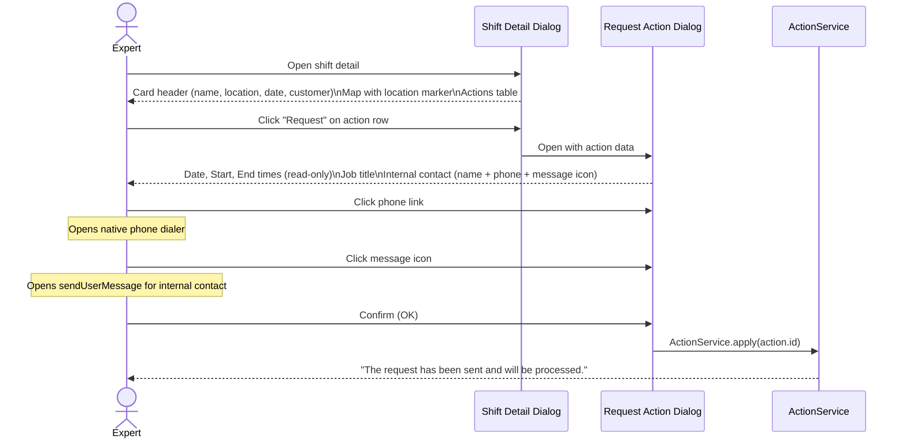
```mermaid
sequenceDiagram
    actor Expert
    participant ShiftDlg as Shift Detail Dialog
    participant RequestDlg as Request Action Dialog
    participant Server as ActionService

    Expert->>ShiftDlg: Open shift detail
    ShiftDlg-->>Expert: Card header (name, location, date, customer)\nMap with location marker\nActions table

    Expert->>ShiftDlg: Click "Request" on action row
    ShiftDlg->>RequestDlg: Open with action data

    RequestDlg-->>Expert: Date, Start, End times (read-only)\nJob title\nInternal contact (name + phone + message icon)

    Expert->>RequestDlg: Click phone link
    Note over Expert: Opens native phone dialer

    Expert->>RequestDlg: Click message icon
    Note over Expert: Opens sendUserMessage for internal contact

    Expert->>RequestDlg: Confirm (OK)
    RequestDlg->>Server: ActionService.apply(action.id)
    Server-->>Expert: "The request has been sent and will be processed."
```

---

## Area 6: Ad-Hoc Appointment & End Shift

### Context

Two quick-action dialogs support ad-hoc workflow needs: creating unplanned appointments (permission-gated) and ending active shifts (adjusting times).

**Who uses it:**
- Ad-hoc appointment: Admin/managers with `APPOINTMENT_ADHOC` permission
- End shift: Any user with an active shift

---

### 6.1 Ad-Hoc Appointment — Flowchart

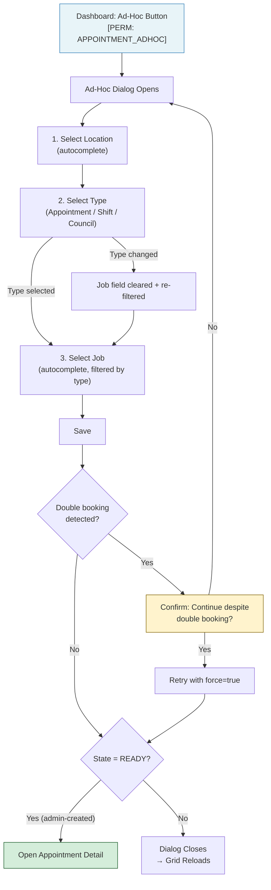
```mermaid
flowchart TD
    BTN["Dashboard: Ad-Hoc Button\n[PERM: APPOINTMENT_ADHOC]"] --> DLG["Ad-Hoc Dialog Opens"]

    DLG --> LOC["1. Select Location\n(autocomplete)"]
    LOC --> TYPE["2. Select Type\n(Appointment / Shift / Council)"]
    TYPE -->|"Type selected"| JOB["3. Select Job\n(autocomplete, filtered by type)"]
    TYPE -->|"Type changed"| RESET["Job field cleared + re-filtered"]
    RESET --> JOB

    JOB --> SAVE["Save"]
    SAVE --> CHECK{"Double booking\ndetected?"}

    CHECK -->|"No"| SUCCESS{"State = READY?"}
    CHECK -->|"Yes"| CONFIRM["Confirm: Continue despite\ndouble booking?"]

    CONFIRM -->|"Yes"| FORCE["Retry with force=true"]
    CONFIRM -->|"No"| DLG

    FORCE --> SUCCESS

    SUCCESS -->|"Yes (admin-created)"| DETAIL["Open Appointment Detail"]
    SUCCESS -->|"No"| DONE["Dialog Closes\n→ Grid Reloads"]

    style BTN fill:#e8f4f8,stroke:#2c7bb6
    style CONFIRM fill:#fff3cd,stroke:#856404
    style DETAIL fill:#d4edda,stroke:#155724
```

### 6.2 End Shift — Flowchart

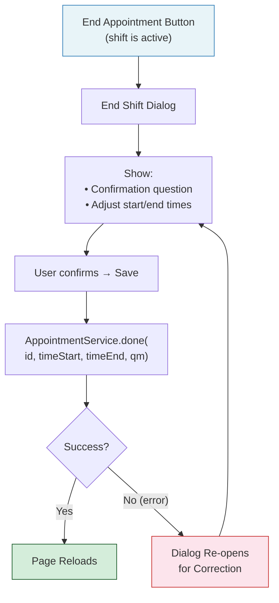
```mermaid
flowchart TD
    BTN["End Appointment Button\n(shift is active)"] --> DLG["End Shift Dialog"]

    DLG --> SHOW["Show:\n• Confirmation question\n• Adjust start/end times"]

    SHOW --> SAVE["User confirms → Save"]
    SAVE --> API["AppointmentService.done(\nid, timeStart, timeEnd, qm)"]

    API --> CHECK{"Success?"}
    CHECK -->|"Yes"| RELOAD["Page Reloads"]
    CHECK -->|"No (error)"| REOPEN["Dialog Re-opens\nfor Correction"]
    REOPEN --> SHOW

    style BTN fill:#e8f4f8,stroke:#2c7bb6
    style RELOAD fill:#d4edda,stroke:#155724
    style REOPEN fill:#fce4ec,stroke:#c62828
```

---

## Interdependencies Summary

This table lists the key factors that influence the user's experience across the Planning domain.

| Factor | Affects | How |
|:---|:---|:---|
| **User role** (admin vs standard) | Dashboard layout, state transition dialog (delete button), ad-hoc button visibility | Admin sees appointment management tools; standard sees self-service dashboard |
| **SELF_ASSIGNMENT permission** | Self-service dashboard visibility | Entire self-service section hidden without this permission |
| **APPOINTMENT_ADHOC permission** | Ad-hoc appointment button | Button hidden without permission |
| **Appointment type** (APPOINTMENT/SHIFT/COUNCIL/TREATMENT) | Detail dialog fields, icon, title, job filter | Each type shows different field sets and filters |
| **Appointment state** (12 states) | Valid transitions, tab visibility, action buttons, cell colors | State machine constrains what actions user can take |
| **Assignment state** (12 states) | Action buttons enabled/disabled per assignment row | Each state disables specific buttons |
| **expertOnly checkbox** | Referenced tab visibility, location/room field visibility | Toggles between location-bound and expert-only modes |
| **Month lock status** | Month grid editability | Locked months disable all tri-state toggles and show danger alert |
| **Entity type in calendar** | Event color, icon, click handler | BIRTHDAY → message; others → no action (legacy) |
| **Scheduling conflicts** (busy check / double booking) | Request and assignment flows | Busy/conflict → confirmation dialog → force retry option |
| **Price type** | Detail dialog (SHIFT only) | Auto-suggested from date + time (weekday/weekend × day/night) |

---

## Wireframe Screenshots

### Appointment Module

#### W1: Appointment List (MonthTable)

MonthTable calendar grid showing days × jobs with state-colored appointment cells, sub-rows for assigned staff, toolbar with month navigation and action buttons.

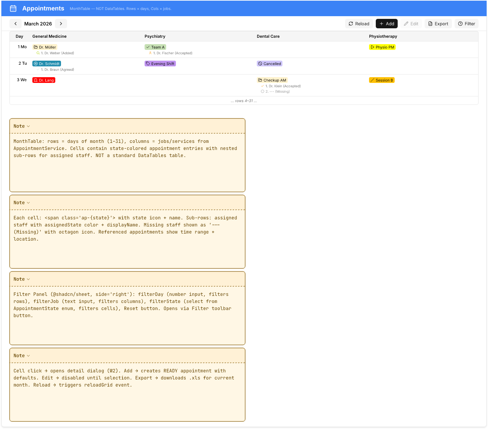

#### W2: Appointment Details Dialog

5-tab detail dialog (Info, Referenced, Patients, Assigned, Suggestions) with type-driven field visibility, state badge, and form fields. SHIFT-only fields highlighted.

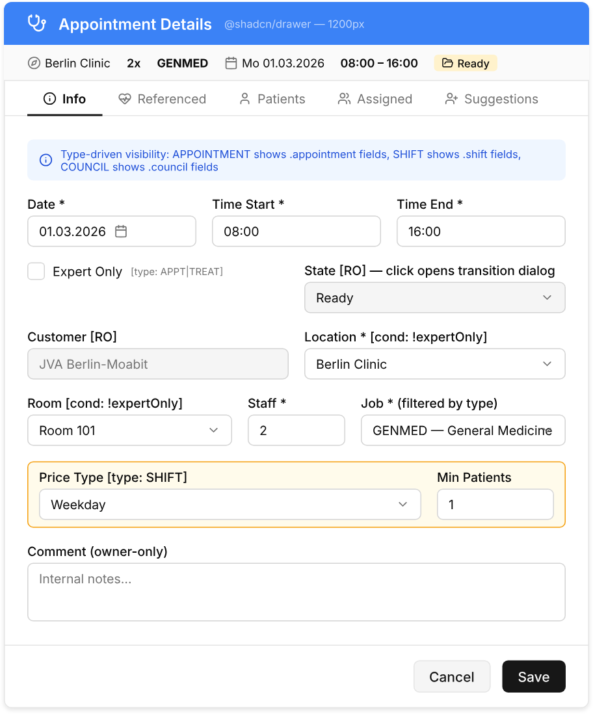

#### W2a: Appointment Details — Tab 2: Referenced

Referenced (Patient Appointments) tab content panel. Visible only when Expert Only checkbox is checked (`expertOnly=true`). Toolbar with location autocomplete and delete button, table showing time range, location, book number, job code, and clickable state badge. Includes sub-dialog wireframe for editing referenced appointments.

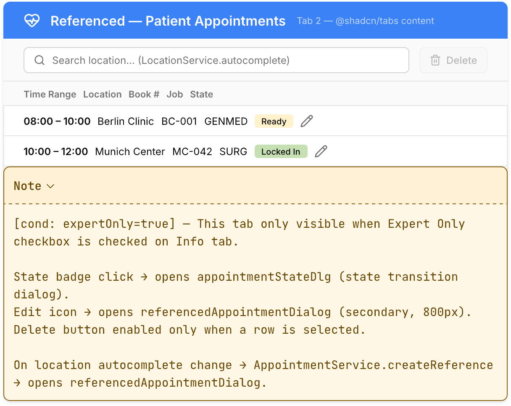

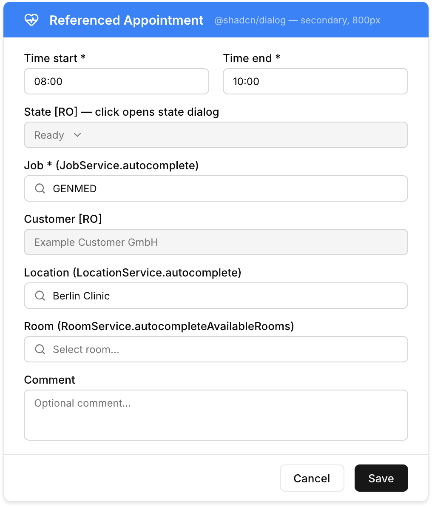

#### W2b: Appointment Details — Tab 3: Patients

Patients tab content panel. Always visible. Add patient toolbar with book number input, patients table with title, documentation-only flag, closed date, location, edit/remove/sort actions. Treatments sub-table below. Includes Patient Data Dialog sub-dialog with attachments management.

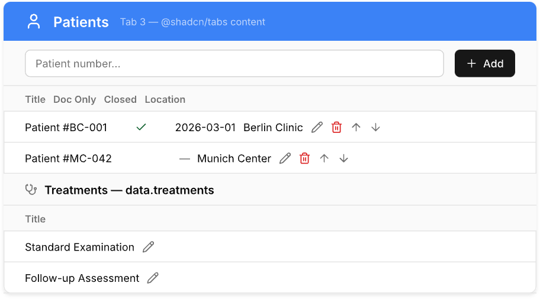

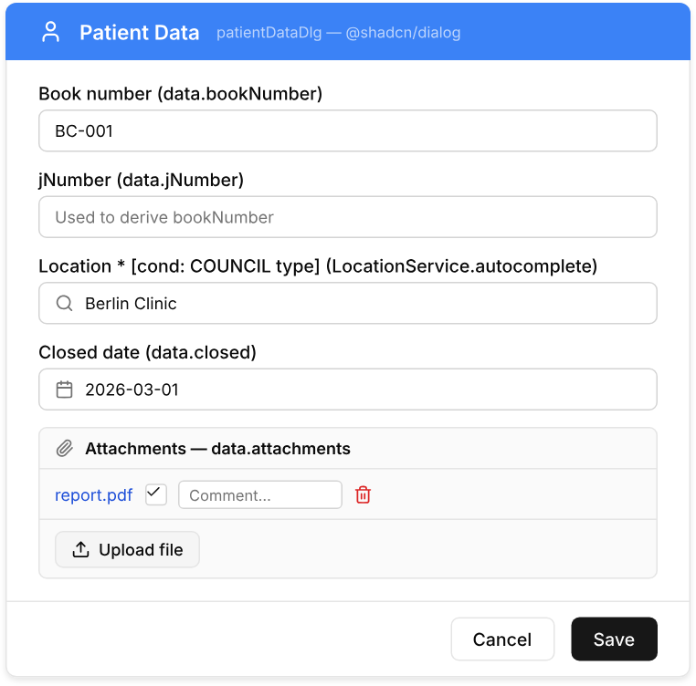

#### W2c: Appointment Details — Tab 4: Assigned

Assigned (Expert Confirm) tab content panel. Always visible, toolbar only in READY–LOCKEDIN states. Doctor autocomplete + delete button toolbar. Table rows with avatar, role icon (support/main/doctor) + name + message icon, phone link, state badge, and 7 action buttons (Accept, Reserve, Override, Reject, Abort, Send Reminder, History) with state-dependent disable rules.

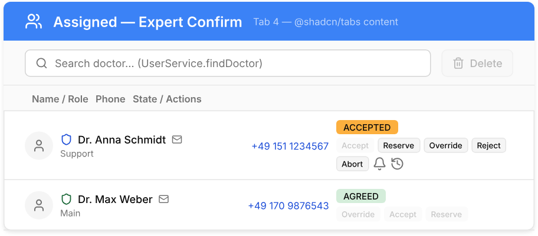

#### W2d: Appointment Details — Tab 5: Suggestions

Suggestions (Add Expert) tab content panel. Visible only in states READY, STARTED, REOPENED, REQUESTED, LOCKEDIN. Text filter on firstName/lastName, table with avatar, role icon + name + preference icon (thumbs-up green if wantFlag=true), skills (comma-separated codes), phone link, and Add button that moves expert to Assigned tab.

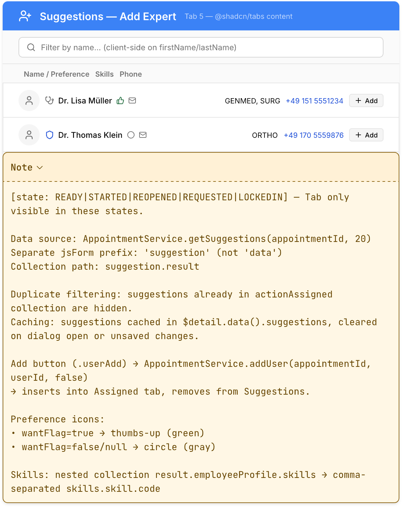

#### W3: Assign User — Collision Dialog

Collision resolution modal shown when assigning a doctor with overlapping appointments. State select per row with Accept/Reserve/Override/Reject/Abort/Remove options.

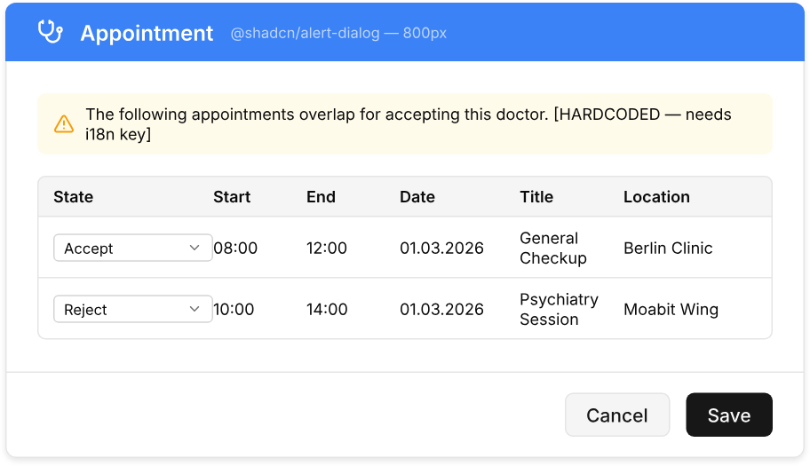

#### W4: State & Color Legend

Visual reference card showing all 13 appointment states and 12 assigned staff states with their icons, hex colors, and CSS class names.

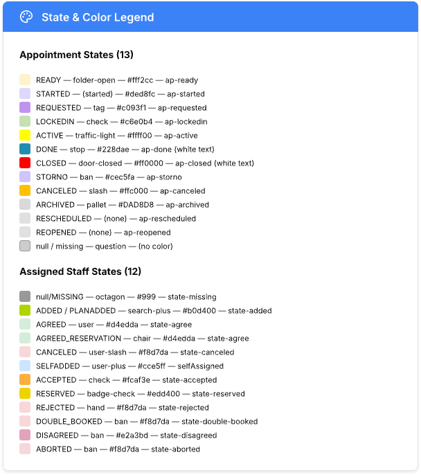

### Planning Dashboard Dialogs

#### W3-dash: Calendar View

FullCalendar weekly view with sample events for HOLIDAY (blue), BIRTHDAY (light blue), APPOINTMENT (state-colored), and SHIFT (state-colored). Entity type legend at bottom.

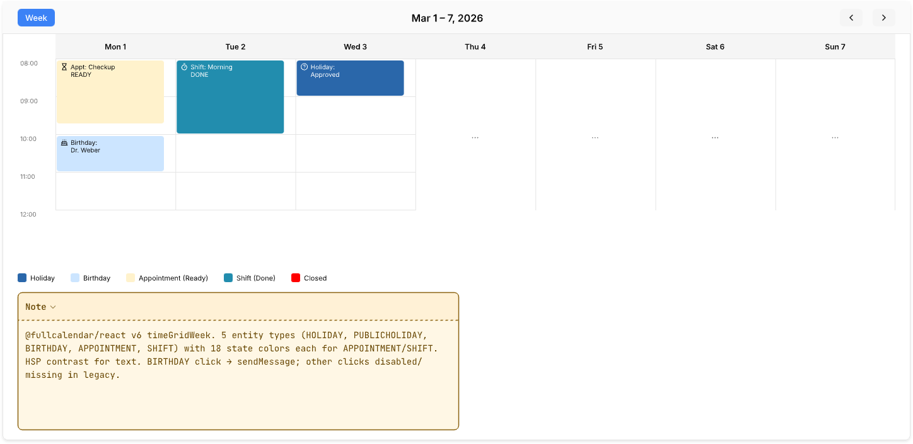

#### W4-dash: Expert Availability — Week Grid

Hours × 7 days grid with tri-state slots (circle=unset, check=available, X=unavailable). Toolbar with Save/Reload. Click column header toggles all in column.

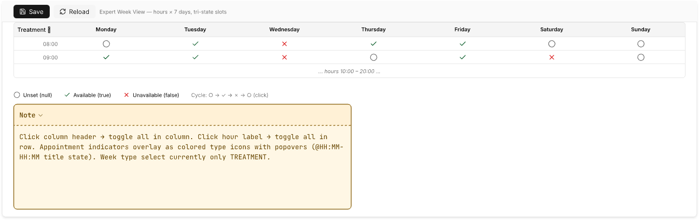

#### W4-dash: Expert Availability — Month Grid

Days × 6 slots grid with 4-row header (year/month, slot labels, weekday counters, weekend counters). Month lock alert banner. Holiday button for absence requests.

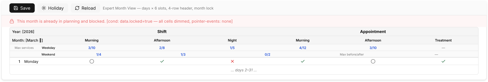

#### W8: Shift Dialog — Detail

Shift detail with card header (name, location, date, customer), Leaflet map area (200px), and actions table with Request button per row.

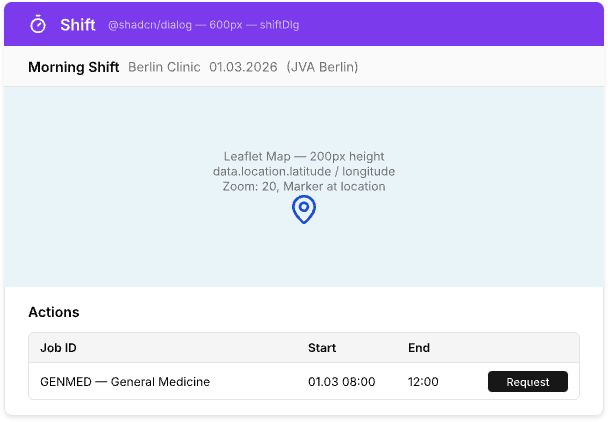

#### W8: Shift Dialog — Request Action

Request action detail showing date/time (read-only), job title, and internal contact with message icon and phone link.

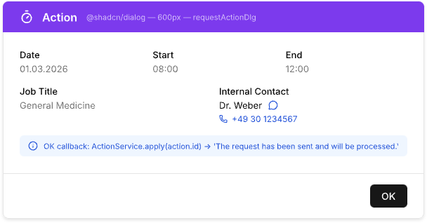

#### W10: Ad-Hoc Appointment

Permission-gated dialog (APPOINTMENT_ADHOC) with location autocomplete, type select (Appointment/Shift/Council), and job autocomplete filtered by type.

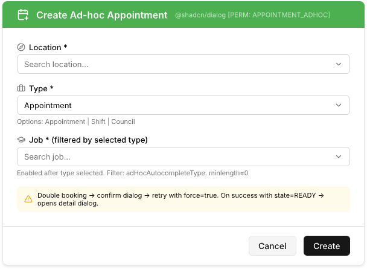

#### W13a: End Shift

Confirmation dialog for ending an active shift with adjustable start/end time inputs.

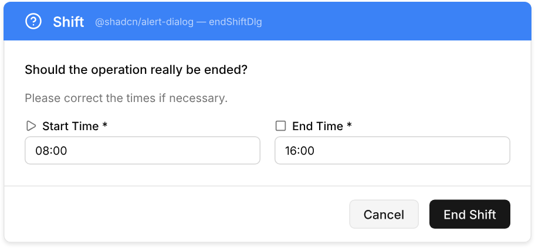
