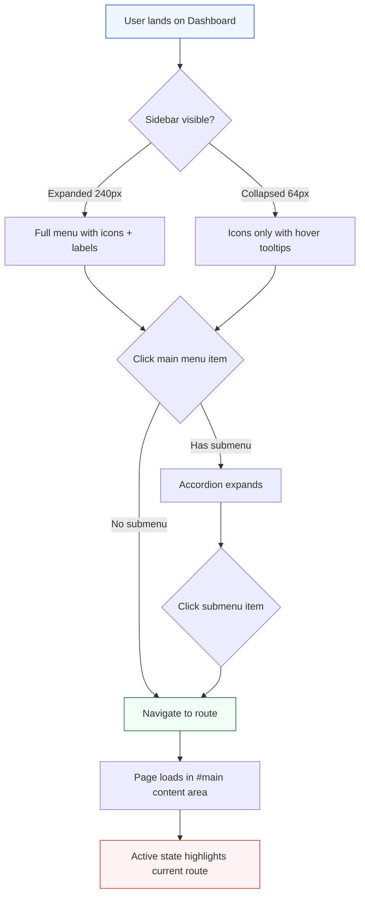
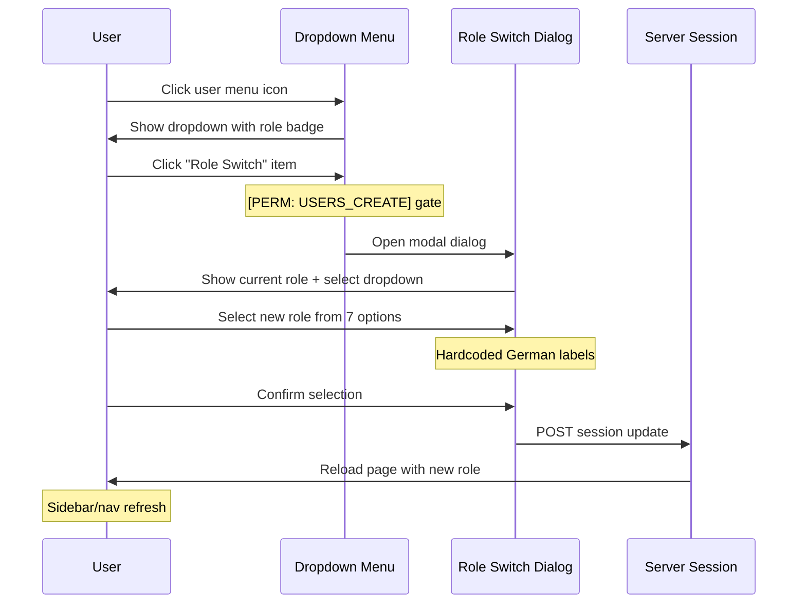
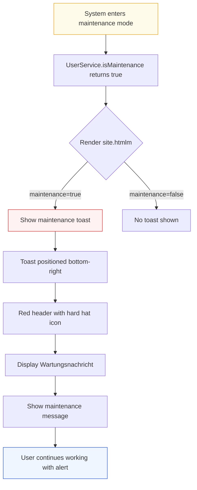
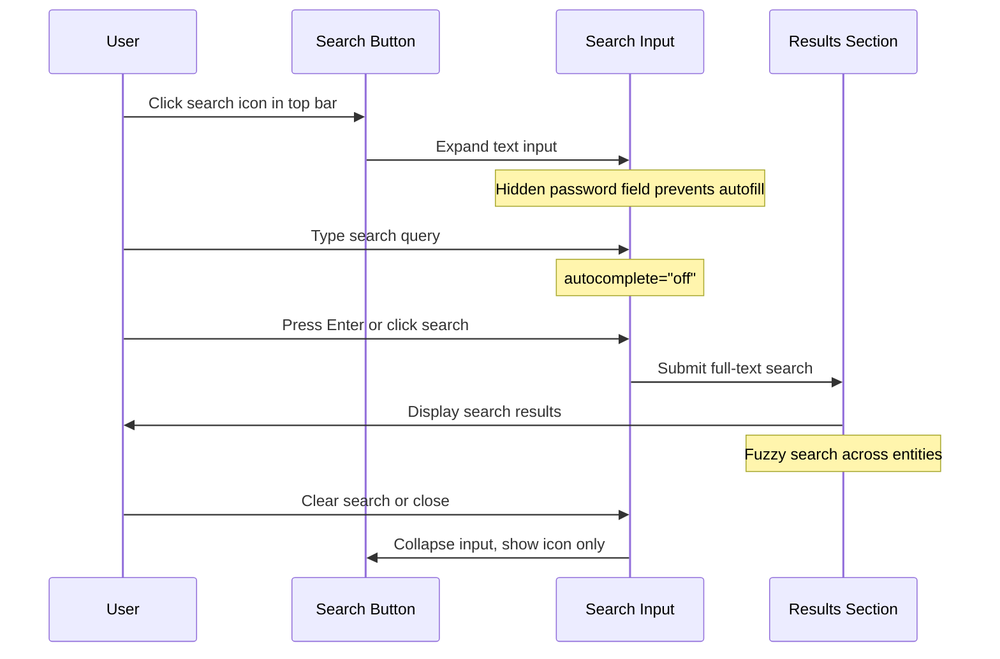
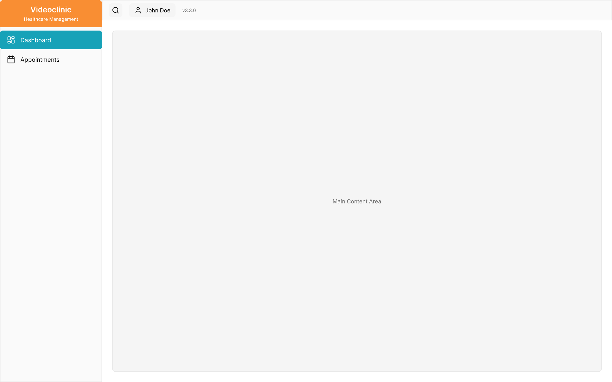
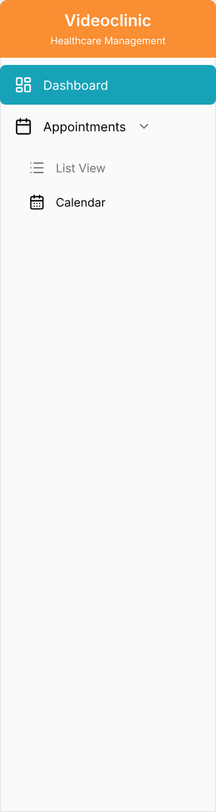
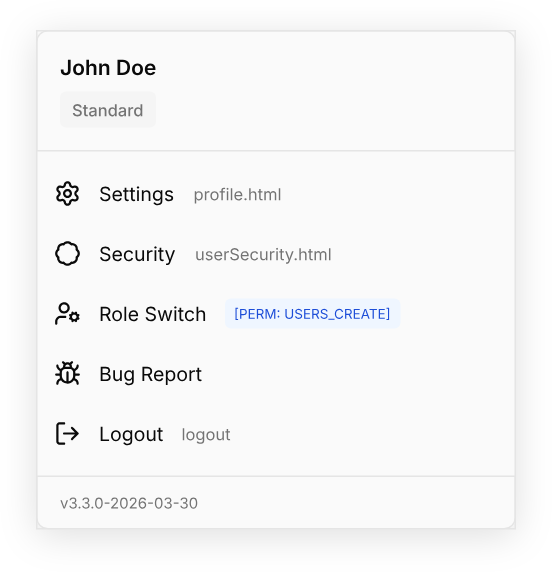

# Application Shell Workflows

> **Domain**: System / Application Shell  
> **Source**: `site.htmlm` (272 lines)  
> **Wireframes**: W7 (App Shell Layout), W8 (Global Navigation), W9 (User Menu)

---

## 1. Navigation Flow

User navigates between modules via the sidebar navigation.

**User Experience:**
- **Entry point**: Any page load or route change
- **Navigation**: Click main menu items or submenu items
- **Visual feedback**: Active route highlighted with `bg-color-{module}` class
- **Sitemap-driven**: Menu structure generated from `{{sitemap}}` server data

---

## 2. Role Switch Flow

User switches active role via dropdown menu → dialog → confirmation.

**User Experience:**
- **Entry point**: User menu → Role Switch item
- **Permission gate**: Only visible if `roleSwitch=true` (authority: `USERS_CREATE`)
- **Dialog content**: Current role display + 7-option select dropdown
- **Hardcoded strings**: German role labels need i18n keys
- **Exit point**: Session update + page reload with new role

**Role Options:**
1. REGISTERED (Neu Registriert)
2. STANDARD (Standard)
3. LEITER_INTERN (Interner Leiter)
4. ADMIN_INTERN (Interner Admin)
5. KUNDE (Kunde)
6. ADMIN_KUNDE (Kunde Admin)
7. ADMIN (System-Admin)

---

## 3. Maintenance Mode Flow

System enters maintenance → persistent toast appears → user notified.

**User Experience:**
- **Trigger**: `UserService.isMaintenance` returns `true`
- **Visual**: Persistent toast in bottom-right corner
- **Styling**: Red header (`#ff3a00`), hard hat icon
- **Content**: i18n title + server-provided message
- **Behavior**: Non-blocking alert — user can continue working

---

## 4. Search Flow

User clicks search icon → input expands → types query → results shown.

**User Experience:**
- **Entry point**: Click search icon in `#globalMenu`
- **Expansion**: Text input expands from icon
- **Anti-autofill**: Hidden `type="password"` field prevents browser password autofill
- **Search behavior**: Full-text search across all entities
- **Exit point**: Clear search or collapse input

---

## Wireframe Screenshots

### W7: App Shell Layout

Full application shell (1440px width) showing sidebar navigation (240px expanded), top bar (48px height, search toggle + user menu + version), main content area placeholder, maintenance toast (bottom-right, fixed position), loading spinner overlay (centered, semi-transparent).

**Annotations:**
- `"?"` — W7: App Shell Layout — Components: Sidebar 240px `@shadcn/Sidebar`, Top bar 48px, User menu `@shadcn/DropdownMenu`. Data bindings: `user.displayName`, `i18n.application.version`. Permission gates: `USERS_CREATE` for role switch.
- `"sidebarNote"` — `@shadcn/Sidebar`, 240px expanded, 64px collapsed, Sitemap-driven navigation.

---

### W8: Global Navigation

Sidebar navigation in two states. Expanded (240px): logo area 64px, sitemap-driven menu items with icons + labels, color-coded backgrounds per module, active state highlight, accordion submenus. Collapsed (64px): icons only, hover tooltips for labels.

**Annotations:**
- `"?"` — Expanded State (240px): Logo area 64px, Sitemap-driven menu items, Color-coded bg per module, Active state highlight, Accordion submenus. Collapsed State (64px): Icons only, Hover tooltips.
- `"expandedNote"` — `@shadcn/Sidebar`, Sitemap-driven, bg-color per module, Active state highlight
- `"collapsedNote"` — Collapsed 64px, Icons only, Hover tooltips for labels

---

### W9: User Menu

`@shadcn/DropdownMenu` with user display name + role badge at top, 5 menu items (Settings → profile, Security → userSecurity, Role Switch → dialog `[PERM: USERS_CREATE]`, Bug Report → dialog, Logout → /login), version display at bottom.

**Annotations:**
- `"?"` — `@shadcn/DropdownMenu`. Items: 1. Settings→profile, 2. Security→userSecurity, 3. Role Switch `[PERM: USERS_CREATE]`, 4. Bug Report→dialog, 5. Logout→/login

---

## Interdependencies Summary

| Factor | Influences | Impact on UX |
|--------|------------|--------------|
| **Sitemap structure** | Sidebar menu items, submenus | Determines navigation hierarchy and available routes |
| **User role** | Role switch availability, menu visibility | Controls which features/actions are accessible |
| **Permission: USERS_CREATE** | Role switch menu item visibility | Only admins/user managers can switch roles |
| **Maintenance mode** | Toast visibility | Alerts users to system status |
| **Nav state (expanded/collapsed)** | Label visibility, hover tooltips | Affects discoverability vs. screen real estate |
| **Module color** | Menu item background | Visual categorization of navigation sections |

---

## Related Documentation

- **Analysis**: [`specs/analysis/includes/site-shell.md`](../../../analysis/system/includes/site-shell.md)
- **Wireframe Plan**: [`specs/analysis/includes/wireframes.md`](../../../analysis/system/includes/wireframes.md)
- **Progress Index**: [`specs/analysis/wireframes-index.md`](../../wireframes-index.md)
