# System Domain — User Workflows & Wireframe Screenshots

> **Domain**: System  
> **Subdirectories**: dashboard, notification, includes, admin-cruds, config, templates-files  
> **Related workflows**:  
> - [`shell/workflows.md`](./shell/workflows.md) — App shell layout, global navigation, user menu  
> - [`admin/workflows.md`](./admin/workflows.md) — Sysconfig tab administration

This file consolidates user workflows, Mermaid diagrams, wireframe screenshots, and pen-file annotations for the System domain modules: Dashboard, Notification, Includes, MOTD Management, CDR Call & Assignment, System Config CRUDs, and Templates & Files.

**Who uses it:** System administrators with full admin access. Standard users see dashboard and notification views.

**Entry points:** Admin navigation panel — each module is reached via the sysadmin sidebar. Dashboard and notifications are available to all authenticated users.

**Exit points:** CRUD completion (save/delete confirmation toasts), export file downloads, dialog dismissals, navigation to other domain areas.

---

## 1. MOTD Management Flow

This diagram shows the admin workflow for creating, editing, previewing, and managing Message of the Day entries. The MOTD list is a 7-column grid (id, subject, dateStart, enabled, sort, priority, dateCreated). Each MOTD targets specific user roles and supports markdown content with optional image placement.

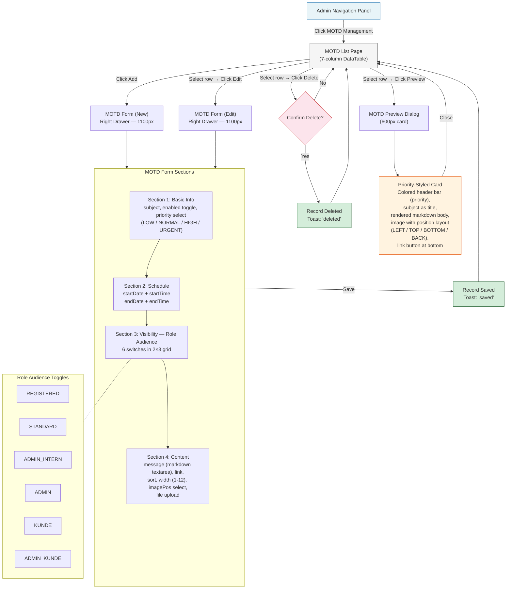
```mermaid
flowchart TD
    ENTRY["Admin Navigation Panel"] -->|"Click MOTD Management"| LIST["MOTD List Page<br>(7-column DataTable)"]

    LIST -->|"Click Add"| CREATE["MOTD Form (New)<br>Right Drawer — 1100px"]
    LIST -->|"Select row → Click Edit"| EDIT["MOTD Form (Edit)<br>Right Drawer — 1100px"]
    LIST -->|"Select row → Click Preview"| PREVIEW["MOTD Preview Dialog<br>(600px card)"]
    LIST -->|"Select row → Click Delete"| DEL_CONFIRM{"Confirm Delete?"}

    DEL_CONFIRM -->|"Yes"| DEL_DONE["Record Deleted<br>Toast: 'deleted'"]
    DEL_CONFIRM -->|"No"| LIST

    DEL_DONE --> LIST

    CREATE --> FORM_SECTIONS
    EDIT --> FORM_SECTIONS

    subgraph FORM_SECTIONS["MOTD Form Sections"]
        direction TB
        S1["Section 1: Basic Info<br>subject, enabled toggle, priority select<br>(LOW / NORMAL / HIGH / URGENT)"]
        S2["Section 2: Schedule<br>startDate + startTime<br>endDate + endTime"]
        S3["Section 3: Visibility — Role Audience<br>6 switches in 2×3 grid"]
        S4["Section 4: Content<br>message (markdown textarea), link,<br>sort, width (1-12), imagePos select,<br>file upload"]
        S1 --> S2 --> S3 --> S4
    end

    subgraph ROLES["Role Audience Toggles"]
        R1["REGISTERED"]
        R2["STANDARD"]
        R3["ADMIN_INTERN"]
        R4["ADMIN"]
        R5["KUNDE"]
        R6["ADMIN_KUNDE"]
    end

    S3 -.- ROLES

    FORM_SECTIONS -->|"Save"| SAVE_DONE["Record Saved<br>Toast: 'saved'"]
    SAVE_DONE --> LIST

    PREVIEW --> PREVIEW_CARD["Priority-Styled Card<br>Colored header bar (priority),<br>subject as title,<br>rendered markdown body,<br>image with position layout<br>(LEFT / TOP / BOTTOM / BACK),<br>link button at bottom"]
    PREVIEW_CARD -->|"Close"| LIST

    style ENTRY fill:#e8f4f8,stroke:#2c7bb6
    style LIST fill:#f5f5f5,stroke:#333
    style SAVE_DONE fill:#d4edda,stroke:#155724
    style DEL_DONE fill:#d4edda,stroke:#155724
    style DEL_CONFIRM fill:#fce4ec,stroke:#c62828
    style PREVIEW_CARD fill:#FFF3E0,stroke:#E65100
```

**Key observations:**

- The preview dialog renders a card matching the dashboard MOTD display, with priority-driven color coding (LOW=gray, NORMAL=blue, HIGH=amber, URGENT=red).
- The 6 role switches determine which user groups see the MOTD on their dashboard after login.
- Image position (LEFT/TOP/BOTTOM/BACK) changes the layout of the preview card and the dashboard rendering.
- File upload is available in the Content section for attaching an image to the MOTD.

---

## 2. CDR Call Management Flow

This diagram shows the CDR (Call Detail Record) management workflow. The call list is a 16-column grid with year/month/day decomposition filters. Admins can view/edit individual calls, trigger exports, reset calls, upload CSV data, or run analysis on open calls. The CDR Assignment sub-flow links calls to users and appointments.

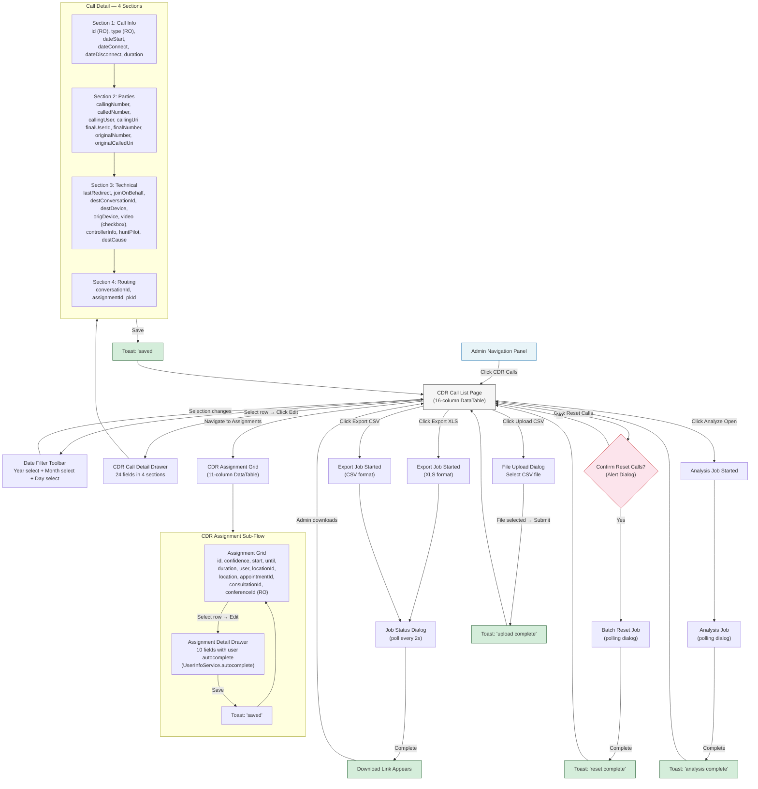
```mermaid
flowchart TD
    ENTRY["Admin Navigation Panel"] -->|"Click CDR Calls"| LIST["CDR Call List Page<br>(16-column DataTable)"]

    LIST --> FILTERS["Date Filter Toolbar<br>Year select + Month select + Day select"]
    FILTERS -->|"Selection changes"| LIST

    LIST -->|"Select row → Click Edit"| DETAIL["CDR Call Detail Drawer<br>24 fields in 4 sections"]
    LIST -->|"Click Export XLS"| EXPORT_XLS["Export Job Started<br>(XLS format)"]
    LIST -->|"Click Export CSV"| EXPORT_CSV["Export Job Started<br>(CSV format)"]
    LIST -->|"Click Reset Calls"| RESET_CONFIRM{"Confirm Reset Calls?<br>(Alert Dialog)"}
    LIST -->|"Click Upload CSV"| UPLOAD["File Upload Dialog<br>Select CSV file"]
    LIST -->|"Click Analyze Open"| ANALYZE["Analysis Job Started"]

    subgraph DETAIL_SECTIONS["Call Detail — 4 Sections"]
        direction TB
        D1["Section 1: Call Info<br>id (RO), type (RO), dateStart,<br>dateConnect, dateDisconnect, duration"]
        D2["Section 2: Parties<br>callingNumber, calledNumber,<br>callingUser, callingUri,<br>finalUserId, finalNumber,<br>originalNumber, originalCalledUri"]
        D3["Section 3: Technical<br>lastRedirect, joinOnBehalf,<br>destConversationId, destDevice,<br>origDevice, video (checkbox),<br>controllerInfo, huntPilot, destCause"]
        D4["Section 4: Routing<br>conversationId, assignmentId, pkId"]
        D1 --> D2 --> D3 --> D4
    end

    DETAIL --> DETAIL_SECTIONS
    DETAIL_SECTIONS -->|"Save"| DETAIL_SAVED["Toast: 'saved'"]
    DETAIL_SAVED --> LIST

    EXPORT_XLS --> JOB_POLL["Job Status Dialog<br>(poll every 2s)"]
    EXPORT_CSV --> JOB_POLL
    JOB_POLL -->|"Complete"| DOWNLOAD["Download Link Appears"]
    DOWNLOAD -->|"Admin downloads"| LIST

    RESET_CONFIRM -->|"Yes"| RESET_JOB["Batch Reset Job<br>(polling dialog)"]
    RESET_CONFIRM -->|"No"| LIST
    RESET_JOB -->|"Complete"| RESET_DONE["Toast: 'reset complete'"]
    RESET_DONE --> LIST

    UPLOAD -->|"File selected → Submit"| UPLOAD_DONE["Toast: 'upload complete'"]
    UPLOAD_DONE --> LIST

    ANALYZE --> ANALYZE_JOB["Analysis Job<br>(polling dialog)"]
    ANALYZE_JOB -->|"Complete"| ANALYZE_DONE["Toast: 'analysis complete'"]
    ANALYZE_DONE --> LIST

    LIST -->|"Navigate to Assignments"| ASSIGN_LIST["CDR Assignment Grid<br>(11-column DataTable)"]

    subgraph ASSIGN_FLOW["CDR Assignment Sub-Flow"]
        direction TB
        A1["Assignment Grid<br>id, confidence, start, until,<br>duration, user, locationId,<br>location, appointmentId,<br>consultationId, conferenceId (RO)"]
        A2["Assignment Detail Drawer<br>10 fields with user autocomplete<br>(UserInfoService.autocomplete)"]
        A1 -->|"Select row → Edit"| A2
        A2 -->|"Save"| A3["Toast: 'saved'"]
        A3 --> A1
    end

    ASSIGN_LIST --> ASSIGN_FLOW

    style ENTRY fill:#e8f4f8,stroke:#2c7bb6
    style LIST fill:#f5f5f5,stroke:#333
    style RESET_CONFIRM fill:#fce4ec,stroke:#c62828
    style DETAIL_SAVED fill:#d4edda,stroke:#155724
    style DOWNLOAD fill:#d4edda,stroke:#155724
    style RESET_DONE fill:#d4edda,stroke:#155724
    style UPLOAD_DONE fill:#d4edda,stroke:#155724
    style ANALYZE_DONE fill:#d4edda,stroke:#155724
```

**Key observations:**

- The date filter toolbar uses three independent selects (Year, Month, Day) rather than a date picker, matching the legacy CDR decomposition pattern.
- Export and analysis operations are asynchronous — they launch background jobs with polling status dialogs.
- Reset Calls requires explicit confirmation via an alert dialog before proceeding.
- The CDR Assignment grid is a related sub-view linking calls to users, appointments, and consultations.
- The user field in the assignment drawer uses autocomplete powered by `UserInfoService.autocomplete`.

---

## 3. CDR Export & Job Status Sequence

This diagram shows the back-and-forth between the admin and the system during an asynchronous export operation. The same pattern applies to Reset Calls and Analyze Open jobs.

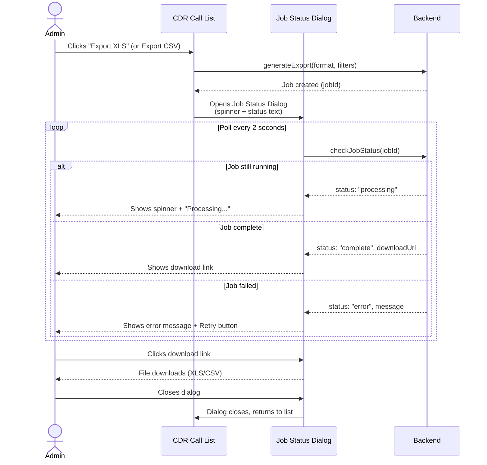
```mermaid
sequenceDiagram
    actor Admin
    participant CDRList as CDR Call List
    participant JobDialog as Job Status Dialog
    participant Server as Backend

    Admin->>CDRList: Clicks "Export XLS" (or Export CSV)
    CDRList->>Server: generateExport(format, filters)
    Server-->>CDRList: Job created (jobId)
    CDRList->>JobDialog: Opens Job Status Dialog<br>(spinner + status text)

    loop Poll every 2 seconds
        JobDialog->>Server: checkJobStatus(jobId)
        alt Job still running
            Server-->>JobDialog: status: "processing"
            JobDialog-->>Admin: Shows spinner + "Processing..."
        else Job complete
            Server-->>JobDialog: status: "complete", downloadUrl
            JobDialog-->>Admin: Shows download link
        else Job failed
            Server-->>JobDialog: status: "error", message
            JobDialog-->>Admin: Shows error message + Retry button
        end
    end

    Admin->>JobDialog: Clicks download link
    JobDialog-->>Admin: File downloads (XLS/CSV)
    Admin->>JobDialog: Closes dialog
    JobDialog->>CDRList: Dialog closes, returns to list
```

**Interaction highlights:**

- The job status dialog is modal — the admin cannot interact with the CDR list while waiting.
- Polling occurs at 2-second intervals (`[async: poll 2000ms]`).
- On failure, the admin can retry the export without leaving the dialog.
- The same polling pattern applies to Reset Calls and Analyze Open operations.

---

## 4. System Config CRUD Flow

This diagram shows the tabbed System Config page with its four configuration modules. Each tab follows the standard DataTable + Drawer CRUD pattern with module-specific field variations.

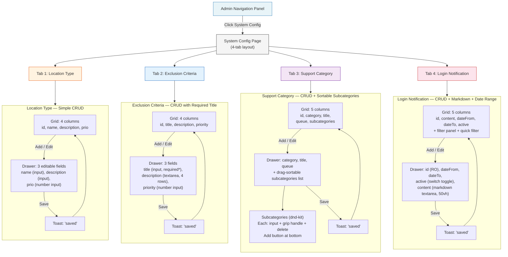
```mermaid
flowchart TD
    ENTRY["Admin Navigation Panel"] -->|"Click System Config"| CONFIG["System Config Page<br>(4-tab layout)"]

    CONFIG --> TAB1["Tab 1: Location Type"]
    CONFIG --> TAB2["Tab 2: Exclusion Criteria"]
    CONFIG --> TAB3["Tab 3: Support Category"]
    CONFIG --> TAB4["Tab 4: Login Notification"]

    subgraph LOC["Location Type — Simple CRUD"]
        direction TB
        L1["Grid: 4 columns<br>id, name, description, prio"]
        L2["Drawer: 3 editable fields<br>name (input), description (input),<br>prio (number input)"]
        L1 -->|"Add / Edit"| L2
        L2 -->|"Save"| L3["Toast: 'saved'"]
        L3 --> L1
    end
    TAB1 --> LOC

    subgraph EXC["Exclusion Criteria — CRUD with Required Title"]
        direction TB
        E1["Grid: 4 columns<br>id, title, description, priority"]
        E2["Drawer: 3 fields<br>title (input, required*),<br>description (textarea, 4 rows),<br>priority (number input)"]
        E1 -->|"Add / Edit"| E2
        E2 -->|"Save"| E3["Toast: 'saved'"]
        E3 --> E1
    end
    TAB2 --> EXC

    subgraph SUP["Support Category — CRUD + Sortable Subcategories"]
        direction TB
        SC1["Grid: 5 columns<br>id, category, title,<br>queue, subcategories"]
        SC2["Drawer: category, title, queue<br>+ drag-sortable subcategories list"]
        SC3["Subcategories (dnd-kit)<br>Each: input + grip handle + delete<br>Add button at bottom"]
        SC1 -->|"Add / Edit"| SC2
        SC2 --> SC3
        SC2 -->|"Save"| SC4["Toast: 'saved'"]
        SC4 --> SC1
    end
    TAB3 --> SUP

    subgraph LN["Login Notification — CRUD + Markdown + Date Range"]
        direction TB
        LN1["Grid: 5 columns<br>id, content, dateFrom, dateTo, active<br>+ filter panel + quick filter"]
        LN2["Drawer: id (RO), dateFrom, dateTo,<br>active (switch toggle),<br>content (markdown textarea, 50vh)"]
        LN1 -->|"Add / Edit"| LN2
        LN2 -->|"Save"| LN3["Toast: 'saved'"]
        LN3 --> LN1
    end
    TAB4 --> LN

    style ENTRY fill:#e8f4f8,stroke:#2c7bb6
    style CONFIG fill:#f5f5f5,stroke:#333
    style TAB1 fill:#FFF3E0,stroke:#E65100
    style TAB2 fill:#E3F2FD,stroke:#1565C0
    style TAB3 fill:#F3E5F5,stroke:#6A1B9A
    style TAB4 fill:#FCE4EC,stroke:#C62828
```

**Key observations:**

- Location Type is the simplest CRUD in the system — 3 editable fields with no special features.
- Exclusion Criteria has a mandatory `title` field — the form validates this before allowing save.
- Support Category includes a drag-sortable subcategories list using `dnd-kit`.
- Login Notification is the only tab with a filter panel and quick filter enabled. The markdown content editor uses a 50vh-height textarea.

---

## 5. Login Notification Lifecycle

This diagram shows the full lifecycle of a login notification from admin creation through user experience on login.

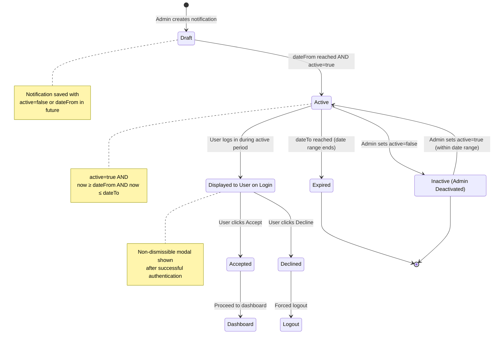
```mermaid
stateDiagram-v2
    [*] --> Draft: Admin creates notification

    Draft: Draft
    note right of Draft
        Notification saved with
        active=false or dateFrom in future
    end note

    Active: Active
    note right of Active
        active=true AND
        now ≥ dateFrom AND now ≤ dateTo
    end note

    Displayed: Displayed to User on Login
    note right of Displayed
        Non-dismissible modal shown
        after successful authentication
    end note

    Expired: Expired
    Inactive: Inactive (Admin Deactivated)

    Draft --> Active: dateFrom reached AND active=true
    Active --> Displayed: User logs in during active period

    Displayed --> Accepted: User clicks Accept
    Displayed --> Declined: User clicks Decline

    Accepted --> Dashboard: Proceed to dashboard
    Declined --> Logout: Forced logout

    Active --> Expired: dateTo reached (date range ends)
    Active --> Inactive: Admin sets active=false

    Inactive --> Active: Admin sets active=true (within date range)
    Expired --> [*]
    Inactive --> [*]

    state Accepted <<choice>>
    state Declined <<choice>>
```

**State transition notes:**

- **Draft** is the initial state when a notification is created but not yet active (future date or inactive toggle).
- **Active** means the notification is within its `dateFrom`–`dateTo` window with `active=true`. All users logging in during this period see it.
- **Displayed** is the user-facing modal state — a non-dismissible dialog appears after login. Multiple active notifications are joined with `---` separators.
- **Accept** proceeds to the dashboard. **Decline** triggers immediate forced logout — there is no way to bypass the notification.
- **Expired** is reached automatically when `dateTo` passes. **Inactive** is set manually by the admin toggling `active=false`.

---

## 6. Templates & Files Management Flow

This diagram shows the 3-tab Templates & Files management page. Each tab follows the DataTable + Drawer pattern with module-specific behaviors.

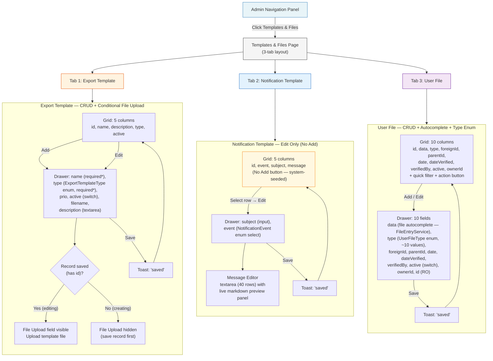
```mermaid
flowchart TD
    ENTRY["Admin Navigation Panel"] -->|"Click Templates & Files"| TABS["Templates & Files Page<br>(3-tab layout)"]

    TABS --> T1["Tab 1: Export Template"]
    TABS --> T2["Tab 2: Notification Template"]
    TABS --> T3["Tab 3: User File"]

    subgraph ET["Export Template — CRUD + Conditional File Upload"]
        direction TB
        ET1["Grid: 5 columns<br>id, name, description, type, active"]
        ET2["Drawer: name (required*),<br>type (ExportTemplateType enum, required*),<br>prio, active (switch), filename,<br>description (textarea)"]
        ET3{"Record saved<br>(has id)?"}
        ET4["File Upload field visible<br>Upload template file"]
        ET5["File Upload hidden<br>(save record first)"]
        ET1 -->|"Add"| ET2
        ET1 -->|"Edit"| ET2
        ET2 --> ET3
        ET3 -->|"Yes (editing)"| ET4
        ET3 -->|"No (creating)"| ET5
        ET2 -->|"Save"| ET6["Toast: 'saved'"]
        ET6 --> ET1
    end
    T1 --> ET

    subgraph NT["Notification Template — Edit Only (No Add)"]
        direction TB
        NT1["Grid: 5 columns<br>id, event, subject, message<br>(No Add button — system-seeded)"]
        NT2["Drawer: subject (input),<br>event (NotificationEvent enum select)"]
        NT3["Message Editor<br>textarea (40 rows) with<br>live markdown preview panel"]
        NT1 -->|"Select row → Edit"| NT2
        NT2 --> NT3
        NT2 -->|"Save"| NT4["Toast: 'saved'"]
        NT4 --> NT1
    end
    T2 --> NT

    subgraph UF["User File — CRUD + Autocomplete + Type Enum"]
        direction TB
        UF1["Grid: 10 columns<br>id, data, type, foreignId, parentId,<br>date, dateVerified, verifiedBy, active, ownerId<br>+ quick filter + action button"]
        UF2["Drawer: 10 fields<br>data (file autocomplete — FileEntryService),<br>type (UserFileType enum, ~10 values),<br>foreignId, parentId, date, dateVerified,<br>verifiedBy, active (switch), ownerId, id (RO)"]
        UF1 -->|"Add / Edit"| UF2
        UF2 -->|"Save"| UF3["Toast: 'saved'"]
        UF3 --> UF1
    end
    T3 --> UF

    style ENTRY fill:#e8f4f8,stroke:#2c7bb6
    style TABS fill:#f5f5f5,stroke:#333
    style T1 fill:#FFF3E0,stroke:#E65100
    style T2 fill:#E3F2FD,stroke:#1565C0
    style T3 fill:#F3E5F5,stroke:#6A1B9A
    style NT1 fill:#FFF8E1,stroke:#F57F17
```

**Key observations:**

- Export Template file upload is **conditional** — the file upload field only appears when editing an existing record (`[cond: data.id]`). The admin must save the record first, then edit to attach a file.
- Notification Template has **no Add button** — templates are system-seeded. Admins can only edit existing templates or delete them.
- The notification template message editor provides a live markdown preview panel beside the textarea for real-time formatting feedback.
- User File uses a combobox autocomplete for the `data` field, powered by `FileEntryService`. The `type` select offers ~10 compliance document classifications from the `UserFileType` enum.
- User File includes date verification fields (`dateVerified`, `verifiedBy`) for compliance document tracking.

---

## Interdependencies Summary

| Factor | Affects | How |
|:---|:---|:---|
| Admin role | All admin modules | Full admin access required to reach MOTD, CDR, Config, Templates modules |
| MOTD role targets | Dashboard MOTD display | The 6 role switches determine which users see the MOTD on their dashboard |
| CDR date filter | Grid content | Year + Month + Day selection determines which call records are visible |
| Export job status | User wait time | Polling dialog blocks interaction until the export job completes or fails |
| Login notification dates | Active period | `dateFrom` / `dateTo` determine the window when the notification is shown on login |
| Template type enum | Template usage | `ExportTemplateType` determines which export workflows use the template file |
| User file type | Document classification | ~10 `UserFileType` enum values categorize compliance documents |
| Dashboard role | Panel visibility | Admin dashboard shows all panels; standard dashboard shows MOTD + appointments + consultations |
| Notification admin gate | Bulk actions | Bulk Message button only visible to `[ADMIN]` role users |

---

## Wireframe Screenshots

### Dashboard — Admin View

All-panels admin-only dashboard with active calls, statistics cards, and system overview. Requires `[ADMIN]` role for all panels.

**Annotations:**
- `[ADMIN]` role requirement — all panels on this page are admin-only
- `[HARDCODED]` German strings: 'Active Calls', card headers. All panels require `[ADMIN]` role.

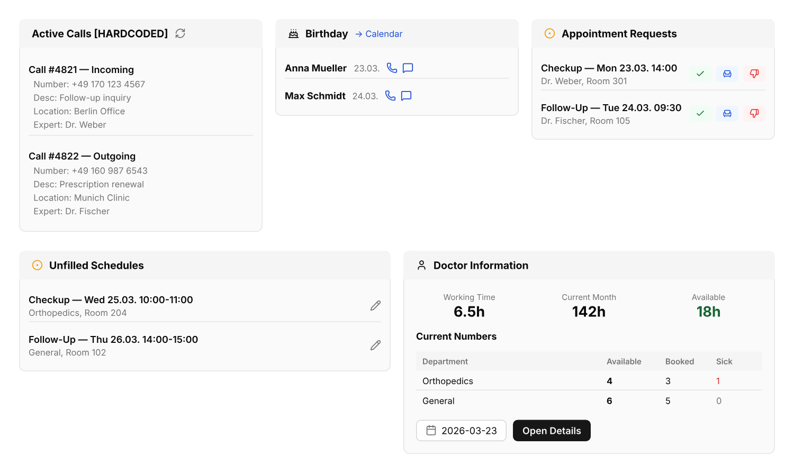

---

### Dashboard — Standard View

Standard user dashboard with MOTD panel, upcoming appointments, recent consultations, and active treatments. Conditional visibility and state-driven rendering throughout.

**Annotations:**
- `[markdown]` body, priority-based styling, optional image positioning (LEFT/TOP/BOTTOM/BACK)
- Button visibility depends on state + control + shift + location flags
- Status columns: checkmark=complete (green), ?=pending (red), dash=N/A (gray)
- Hidden when empty

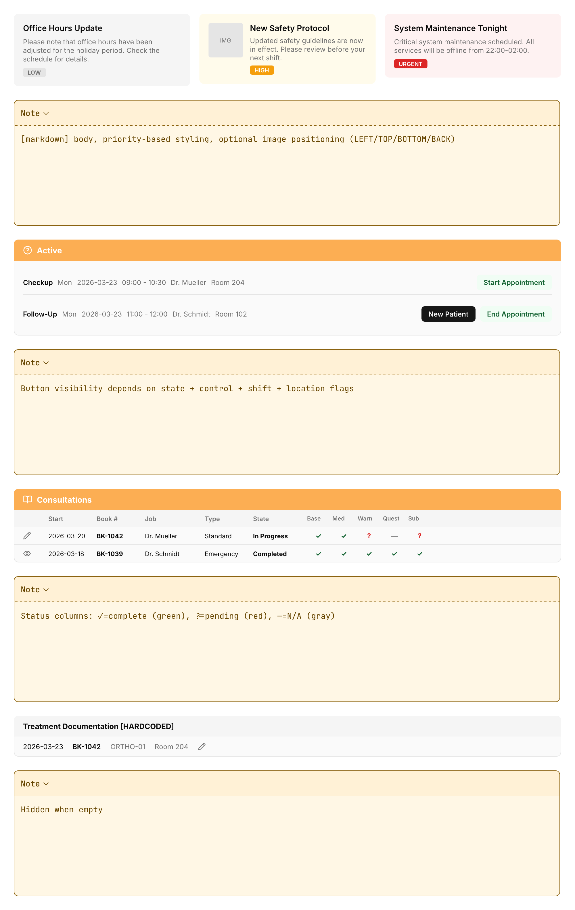

---

### Login Notification Modal

Non-dismissible Bootstrap modal shown after login if pending notifications exist. Multiple notifications joined with separators. Decline triggers immediate logout. Blocks all dashboard interaction until resolved.

**Annotations:**
- `[markdown]` rendered body content
- Multiple notifications joined with `---` separators
- Cancel → logout
- Non-dismissible modal (`data-bs-backdrop=static`). Shown after login if pending. Decline → immediate logout.

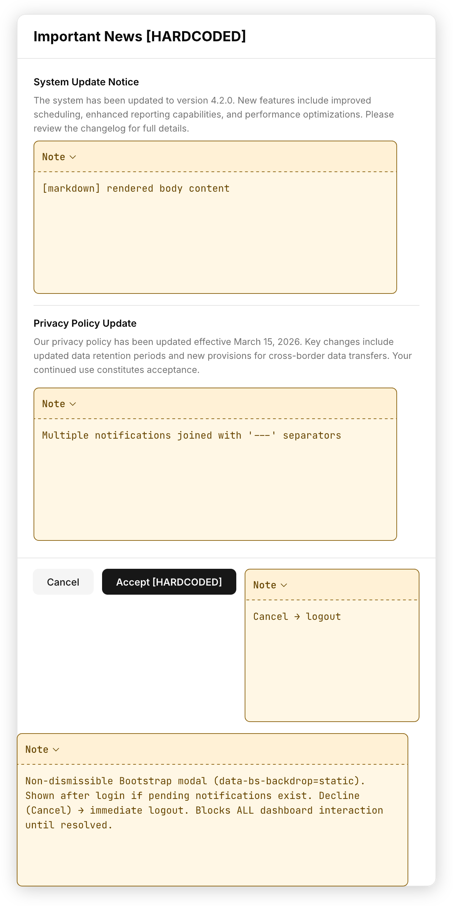

---

### Notification List

Admin-filterable notification list with selectable rows and inline detail expansion. Bulk Message button gated by `[ADMIN]` role.

**Annotations:**
- `[ADMIN]` Bulk Message button visible only to admins
- Selectable rows, `[repeats]`, data from `NotificationService.list`
- Detail expands inline below selected row, not a separate route

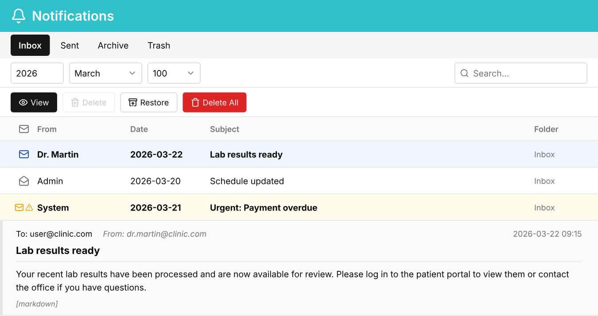

---

### Notification Compose

Full notification compose form.

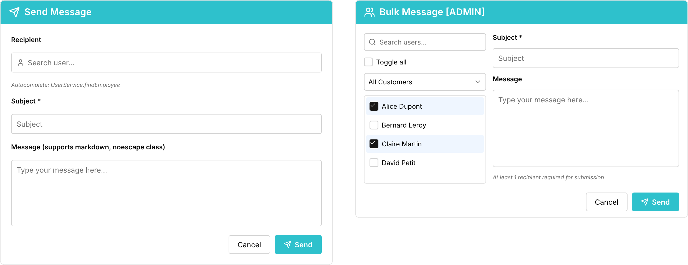

---

### Send Message (Dashboard Quick Compose)

Dashboard-included quick compose widget. Can be pre-filled from context (e.g., birthday card with pre-set subject and greeting template). Focus management based on whether recipient is pre-filled.

**Annotations:**
- Dashboard-included quick compose. Can be pre-filled from context (birthday card: subject='Happy Birthday', message=greeting template). Focus goes to textarea if recipient pre-filled, otherwise to recipient field.

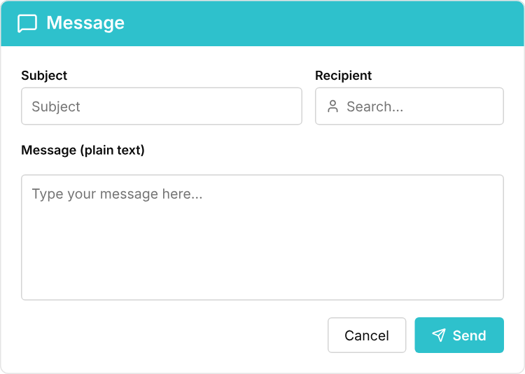

---

### Navbar

Top navigation bar shared across the application.

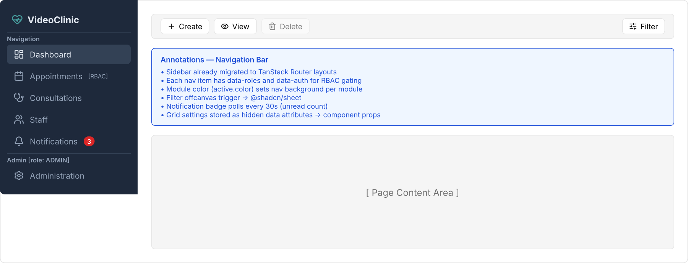

---

### Login Page

Authentication entry point with credentials form.

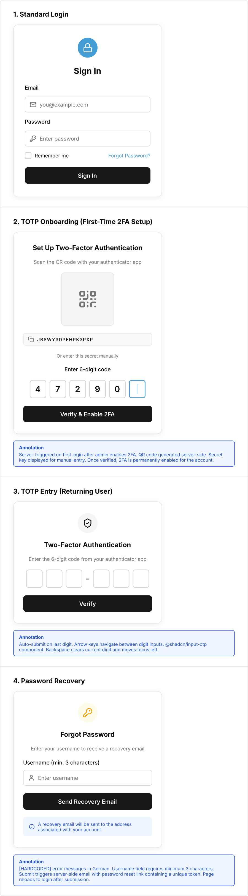

---

### Loading States

Spinner overlays and skeleton loading patterns used across the application.

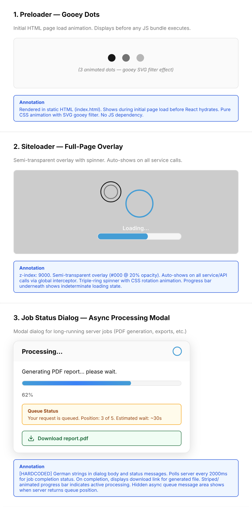

---

### Quick Filter

Reusable inline filter component for list views.

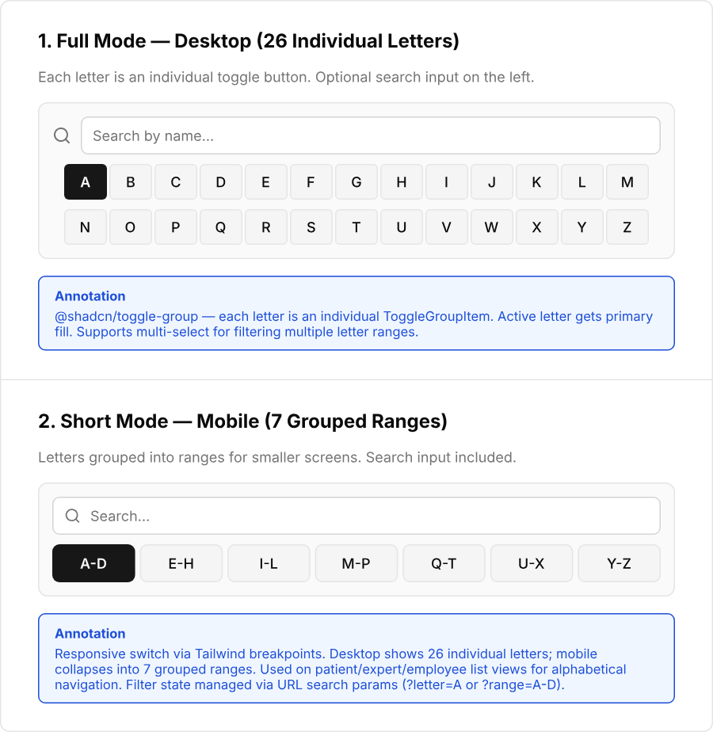

---

### Bug Report Dialog

Bug report submission dialog triggered from user menu.

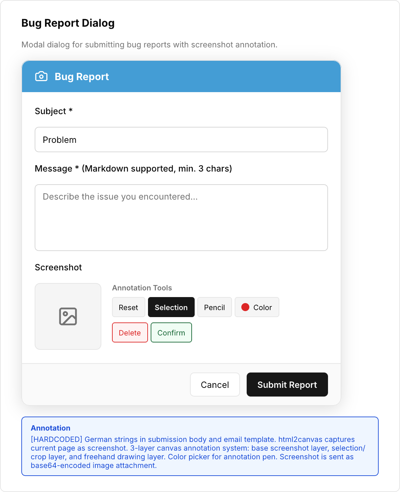

---

### Color Palette

Application color system reference showing module-specific colors and status indicators.

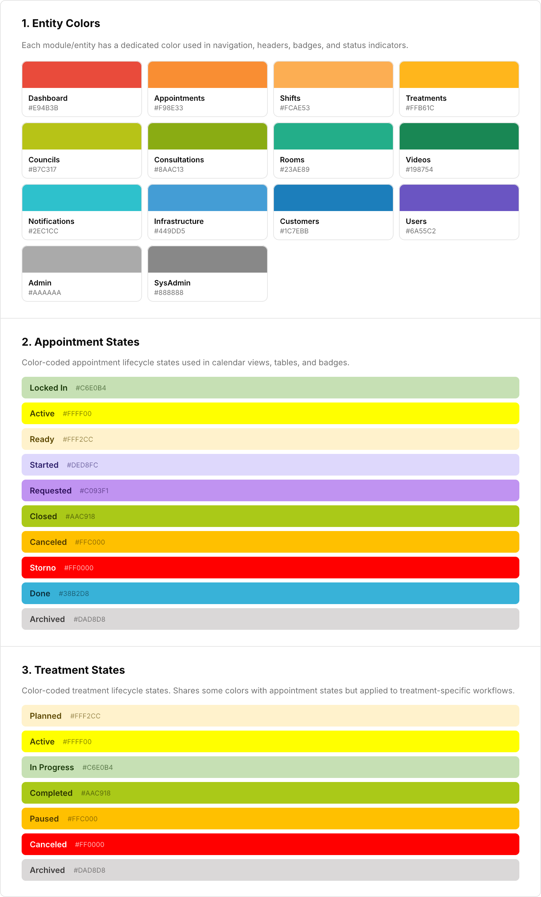

---

### W15: MOTD List

MOTD grid with 7 columns (ID, Subject, Start Date, Enabled, Sort, Priority, Created). Toolbar with Add/Edit/Delete/Preview buttons, pagination at bottom.

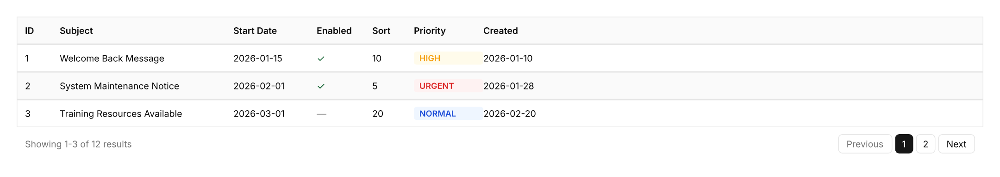

---

### W15b: MOTD Detail

1100px detail drawer with 20 fields: Subject, Enabled switch, Priority select, Sort, Width, Start/End date+time, 6 role visibility switches (Registered, Standard, Admin Intern, Admin, Kunde, Admin Kunde), Markdown message textarea, Link, Image Position select, Image upload/preview.

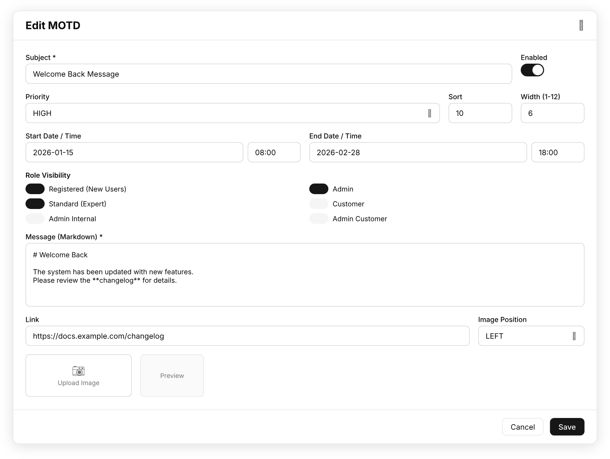

---

### W16: CDR Call List

16-column CDR grid with Year/Month/Day filter toolbar. 8 action buttons: Add, Edit, Delete, Export XLS, Export CSV, Reset Calls, Upload CSV, Analyze Open. Pagination at bottom.

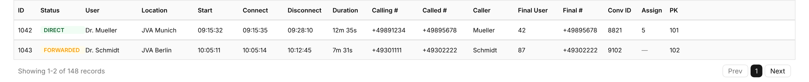

---

### W16b: CDR Call Detail

800px detail drawer with 3 sections (Call Information, Parties, Technical/Routing) showing 18 key fields including type, dates, calling/called numbers, routing IDs, and technical metadata.

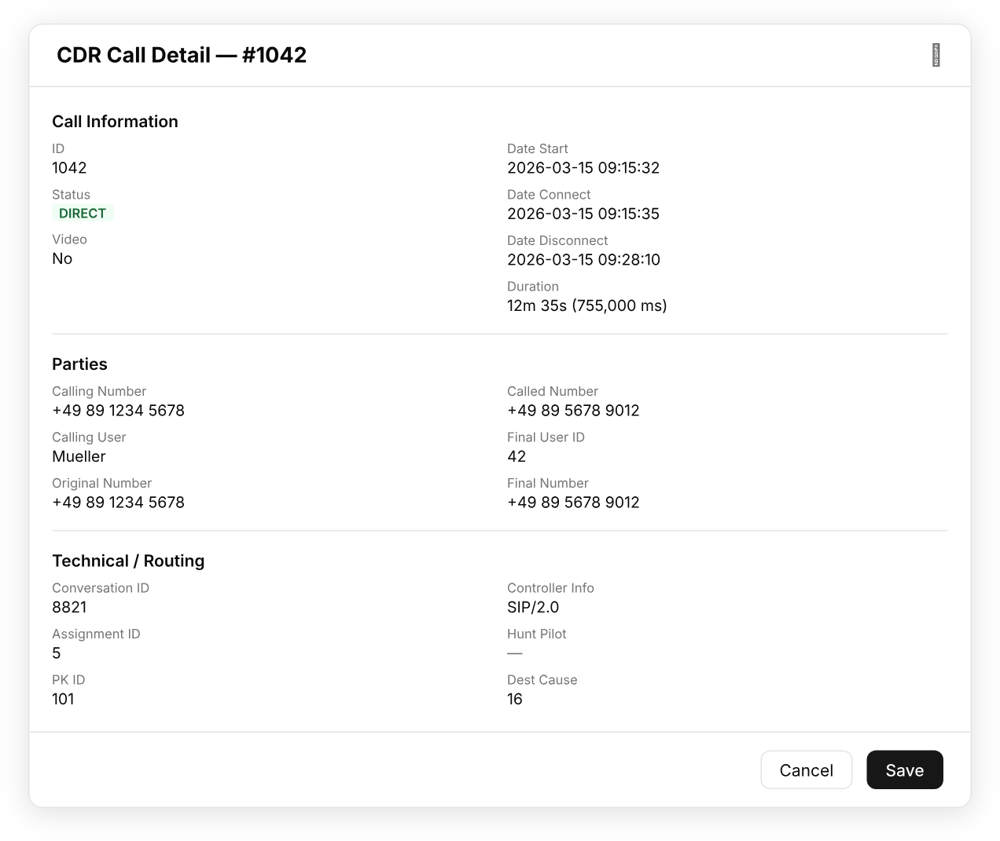

---

### W17: System Config

4-tab configuration page (Location Type active) with grid showing 4 columns (ID, Name, Description, Priority) and detail panel with Name, Description, and Priority fields. Tabs: Location Type, Exclusion Criteria, Support Category, Login Notification.

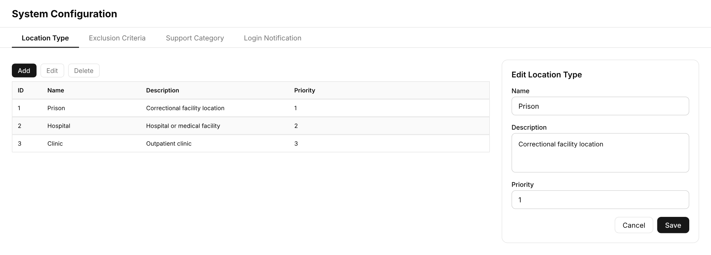

---

### W18: Templates & Files

3-tab interface (Export Template active) with grid showing 5 columns (ID, Name, Description, Type badge, Active). Detail panel with Name*, Type* select, Priority, Active switch, Filename Pattern, Description textarea, Upload/Download buttons. Tabs: Export Template, Notification Template, User File.

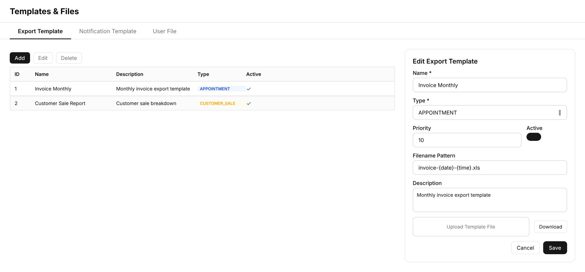
