# Consultation Module — Workflows & Interdependencies

> **Domain:** Treatment > Consultation  
> **Complexity:** Very High — 778-line dialog, 11 tabs, 7 consultation types, 6 states  
> **Reference analysis:** `specs/analysis/treatment/consultation/` (8 documents)  
> **Wireframe plan:** `specs/analysis/treatment/consultation/wireframe-plan.md`

---

## 1. Consultation Lifecycle State Machine

**Who:** Treating doctor (primary), Admin (reopen), Reviewing physician (verify)  
**Entry point:** Consultation created via wizard (Batch 3) or list page  
**Exit points:** VERIFIED (final) or CLOSED (pending review)

The consultation passes through 6 states. Only the **OPEN** state allows field editing. The state machine controls which toolbar buttons are active, whether the form is editable, and which actions are available.

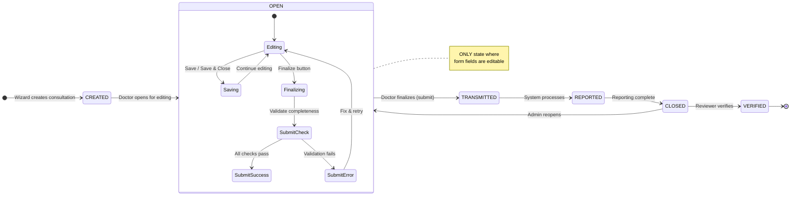

### State-Based UI Behavior Matrix

| State | Fields Editable | Save Button | Submit Visible | Finalize Visible | QM Tab Editable | Reopen Button | Download |
|:------|:---:|:---:|:---:|:---:|:---:|:---:|:---:|
| CREATED | No | No | No | No | Yes | No | No |
| **OPEN** | **Yes** | **Yes** | **Yes** | **Conditional** | Yes | No | Yes |
| TRANSMITTED | No | No | No | No | Yes | No | Yes |
| REPORTED | No | No | No | No | Yes | No | Yes |
| CLOSED | No | No | No | No | No | **Yes** (Admin) | Yes |
| VERIFIED | No | No | No | No | Yes | No | Yes |

**Finalize condition:** `state !== CLOSED && type !== EXTERNAL && !archived && baseComplete && dataComplete && warningComplete`

---

## 2. Consultation User Journey — End-to-End Flow

**Who:** Doctor / Clinical staff  
**Entry point:** Consultation list page (nav menu)  
**Exit points:** PDF download, verified consultation, closed consultation

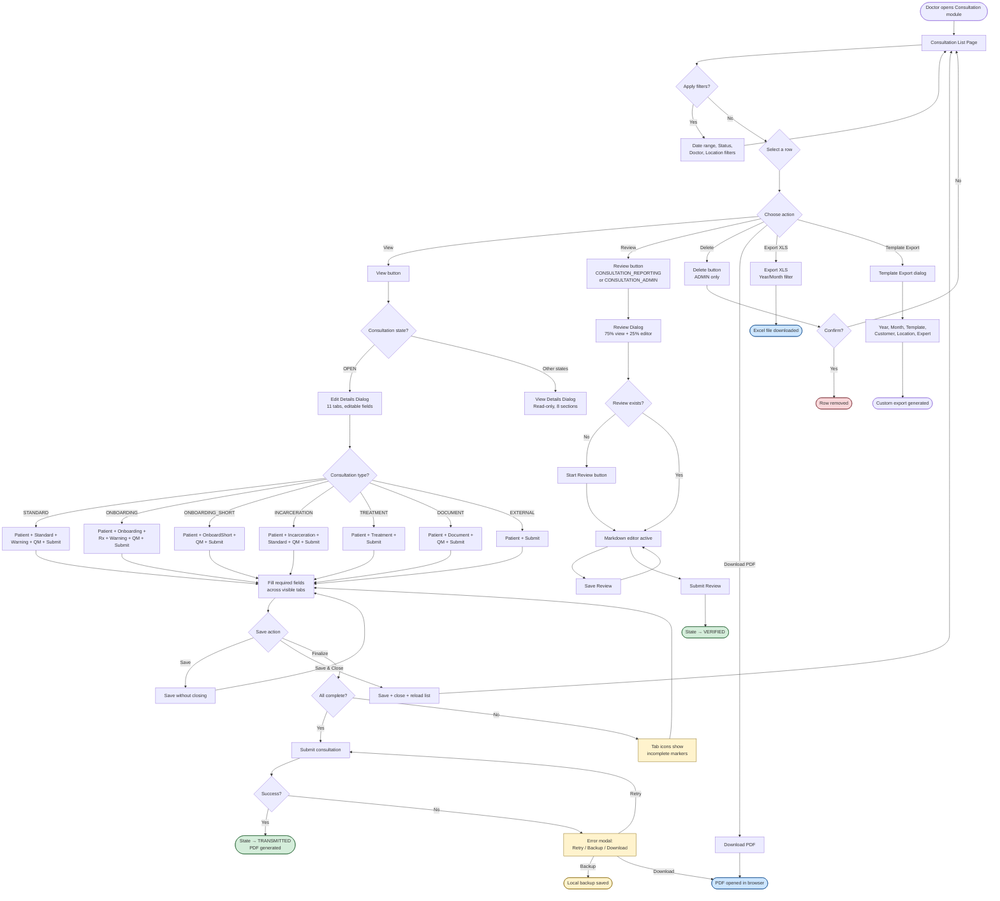

---

## 3. Type-to-Tab Visibility Matrix

**Who:** System (automatic based on `data.type` selection)  
**Entry point:** Doctor selects consultation type in Patient Data tab  
**Key observation:** Changing the type dynamically shows/hides tabs. 7 types control 11 possible tabs.

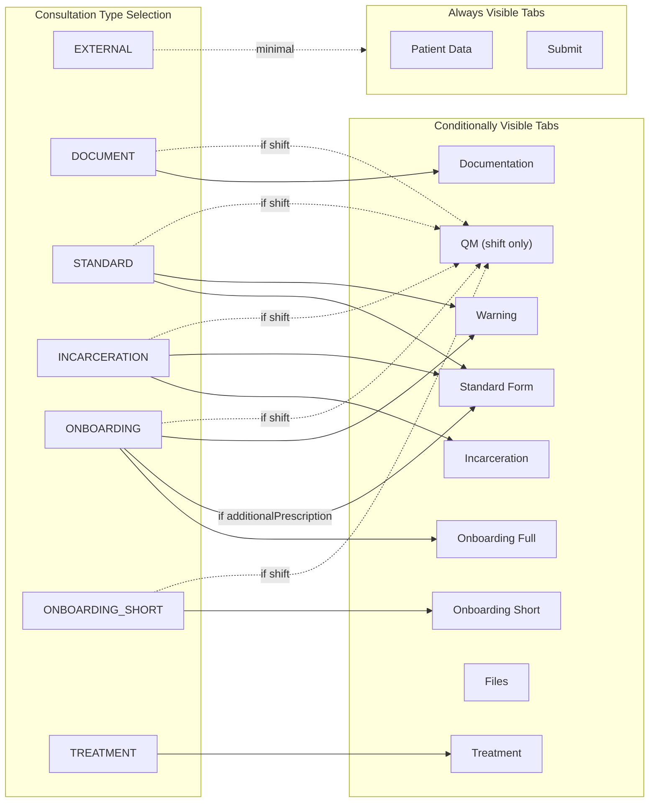

### Detailed Visibility Table

| Tab | EXTERNAL | STANDARD | ONBOARDING | ONBOARD_SHORT | INCARCERATION | TREATMENT | DOCUMENT |
|:----|:---:|:---:|:---:|:---:|:---:|:---:|:---:|
| Patient Data | Always | Always | Always | Always | Always | Always | Always |
| Standard Form | - | **Yes** | Rx only* | - | **Yes** (partial**) | - | - |
| Incarceration | - | - | - | - | **Yes** | - | - |
| Onboarding (Full) | - | - | **Yes** | - | - | - | - |
| Onboarding (Short) | - | - | - | **Yes** | - | - | - |
| Treatment | - | - | - | - | - | **Yes** | - |
| Warning | - | **Yes** | **Yes** | - | - | - | - |
| Documentation | - | - | - | - | - | - | **Yes** |
| Files | Always | Always | Always | Always | Always | Always | Always |
| QM | - | shift | shift | shift | shift | - | shift |
| Submit | Always | Always | Always | Always | Always | Always | Always |

*Rx: Standard tab shown only if `data.onboarding.additionalPrescription === "true"`  
**Partial: When type=INCARCERATION, Standard form hides Blocks 1-3 (medication anamnesis, anamnesis, patient report), Block 5 (prescriptions), Blocks 6-7 (work incapacity, procedere) via `incarceration-hide` CSS class — only Diagnosis/ICD-10 and Block 4 remain.

---

## 4. Conditionize2 Field Rules — User Experience

**Who:** Doctor filling consultation form  
**Mechanism:** jQuery `conditionize2` plugin shows/hides fields based on other field values  
**Key observation:** These are client-side-only visibility rules — the hidden fields still exist in the data model.

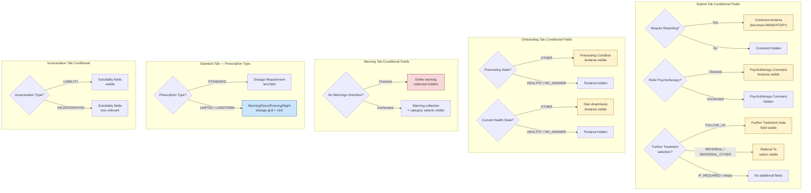

### Full Conditionize2 Rules Reference

| Trigger Field | Trigger Value | Target Field(s) | Effect |
|:---|:---|:---|:---|
| `requireReporting` | `true` | `comment` | Becomes **mandatory** (not just visible) |
| `referPsychotherapy` | checked | `psychoTherapy.comment` | Shows textarea |
| `furtherTreatment` | `FOLLOW_UP` | `dateFurtherTreatment` | Shows date picker |
| `furtherTreatment` | `REFERRAL` / `REFERRAL_OTHER` | `standard.referralTo` | Shows category select |
| `preexistingState` | `OTHER` | `preexistingCondition` | Shows textarea (onboarding) |
| `currentState` | `OTHER` | `anamnesisOwn` | Shows textarea (onboarding) |
| `noWarnings` | checked | Warning collection UI | **Hides** entire collection + insert selects |
| `prescription.type` | `STANDARD` | `dosageRequirement` | Shows text field |
| `prescription.type` | `LIMITED` / `LONGTERM` | Dosage grid (4 cols) + unit | Shows grid |
| `prescription.product` | custom vs catalog | Product name + ingredient inputs | Toggles custom/display modes |

---

## 5. Review & Approval Workflow

**Who:** Reviewing physician (requires `CONSULTATION_REPORTING` or `CONSULTATION_ADMIN` permission)  
**Entry point:** Review button in list toolbar (row selected)  
**Exit point:** Consultation state becomes VERIFIED

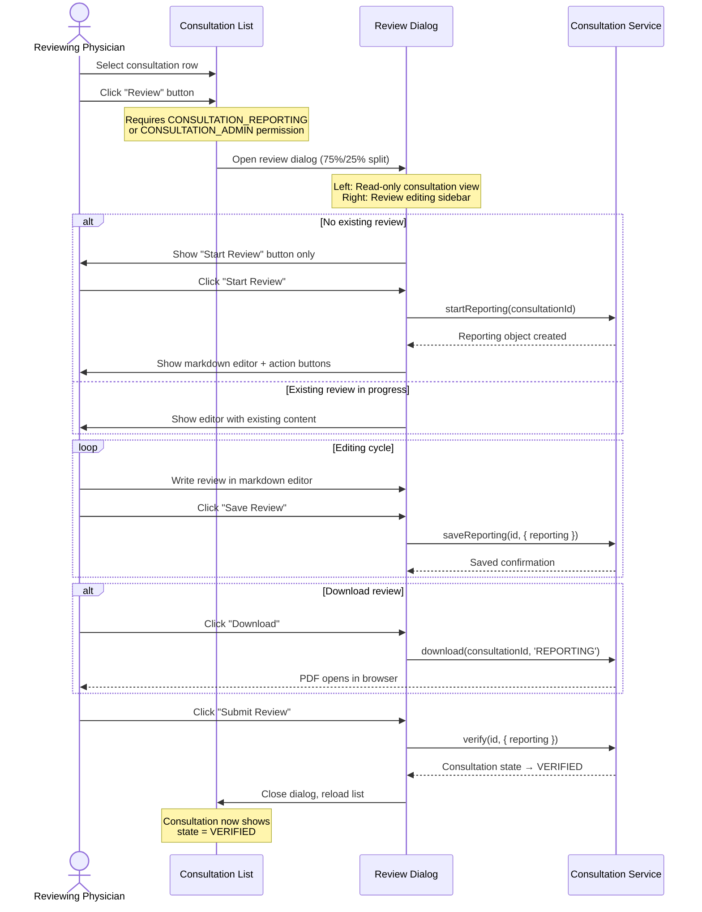

### Review Dialog Layout

```
+--------------------------------------------------+
| Review Dialog (1500px)                           |
+--------------------------------------------------+
| +-----------------------------+  +-----------+   |
| |  Read-Only Consultation     |  | Review    |   |
| |  View (75% width)           |  | Sidebar   |   |
| |                             |  | (25%)     |   |
| |  - Header info              |  |           |   |
| |  - Type-specific sections   |  | Expert:   |   |
| |  - Attachments              |  | [name]    |   |
| |  - Warning info             |  |           |   |
| |                             |  | End Date: |   |
| |                             |  | [date]    |   |
| |                             |  |           |   |
| |                             |  | Markdown  |   |
| |                             |  | Editor:   |   |
| |                             |  | [70vh     |   |
| |                             |  |  textarea]|   |
| |                             |  |           |   |
| |                             |  | [Start]   |   |
| |                             |  | [Save]    |   |
| |                             |  | [Download]|   |
| |                             |  | [Submit]  |   |
| +-----------------------------+  +-----------+   |
+--------------------------------------------------+
```

---

## 6. Submit & Error Recovery Flow

**Who:** Doctor finalizing a consultation  
**Entry point:** Finalize button in Submit tab (requires all completeness checks)  
**Exit points:** TRANSMITTED state (success) or error recovery actions

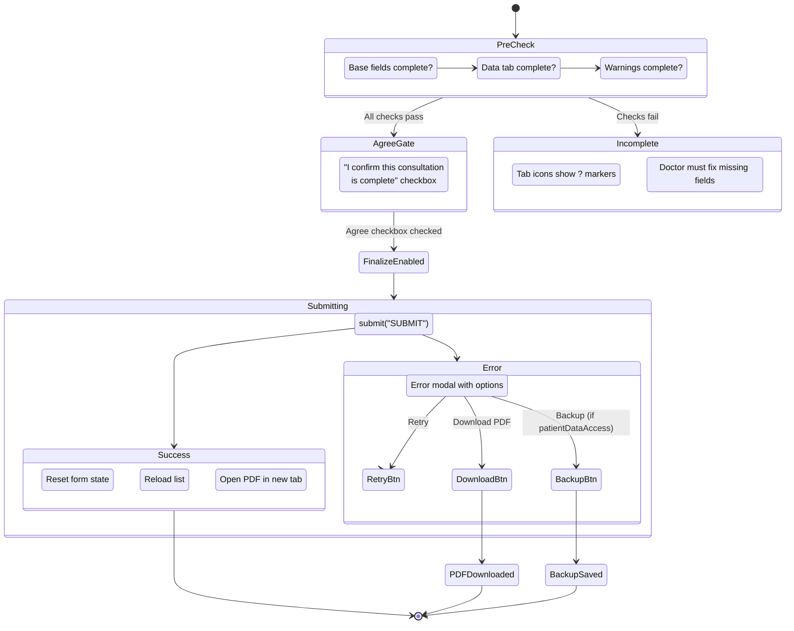

---

## 7. Interdependencies Summary

### Factors Affecting User Experience

| Factor | Source | Affects | How |
|:---|:---|:---|:---|
| **Consultation Type** (7 values) | Patient Data tab → type select | Tab visibility, field visibility, form content | Completely changes which tabs and fields appear |
| **Consultation State** (6 values) | Server-controlled | Editability, button visibility, action availability | Only OPEN allows editing; CLOSED enables reopen |
| **User Role** | Authentication | Toolbar buttons, field editability, delete access | Admin: edit doctor + delete; Reporting: review |
| **Shift context** (`data.shift`) | Appointment origin | QM tab, contact time, end time | Shift-originated consultations show additional fields |
| **Template mode** | Created from template | template/notemplate classes | Templates hide location, specialization; show name/description |
| **Internal user flag** | `class="internalOnly"` | Gender, Birthday/Age fields | External users cannot see patient identity fields |
| **BasisWeb integration** | `class="basiswebonly"` | Medication/History tabs in header | BasisWeb-imported consultations show extra data tables |
| **Location.patientDataAccess** | Location config | Backup button in error modal | Controls whether offline backup is available |
| **additionalPrescription** | Onboarding form checkbox | Standard tab visibility | ONBOARDING type can optionally show prescriptions |
| **Prescription product type** | Catalog vs custom | Product entry mode | Toggles between select dropdown and free-text input |

### Cross-Module Dependencies

| This Module | Depends On | Nature of Dependency |
|:---|:---|:---|
| Consultation List | Consultation Wizard (Batch 3) | Wizard creates new consultations that appear in list |
| Consultation Details | Location module (Batch 8) | Room autocomplete filtered by location; room detail dialog |
| Consultation Details | ICD-10 Service | Diagnosis search modal for adding ICD-10 codes |
| Consultation Details | Medication Service | Prescription search for adding medications |
| Consultation Details | User Management (Batch 6) | Doctor autocomplete; expert assignments |
| Consultation Review | Consultation View | Review dialog embeds read-only view at 75% width |
| Export Template | Customer module (Batch 8) | Customer/Location filters for custom exports |
| Warning Tab | Warning Service | 4 category-specific dropdown sources (allergies, infections, etc.) |
| Submit Flow | BasisWeb (Batch 1) | Submission triggers BasisWeb data generation for integrated locations |
| QM Tab | Questionnaire (Batch 3) | Embedded questionnaire within consultation context |

---

## 8. Wireframe Screenshots

### W1: Consultation List Page
List page with 10-column data grid, date/type/location toolbar filters, 6 action buttons (View, Review, Delete, Download, Export, Template Export), and offcanvas filter panel.

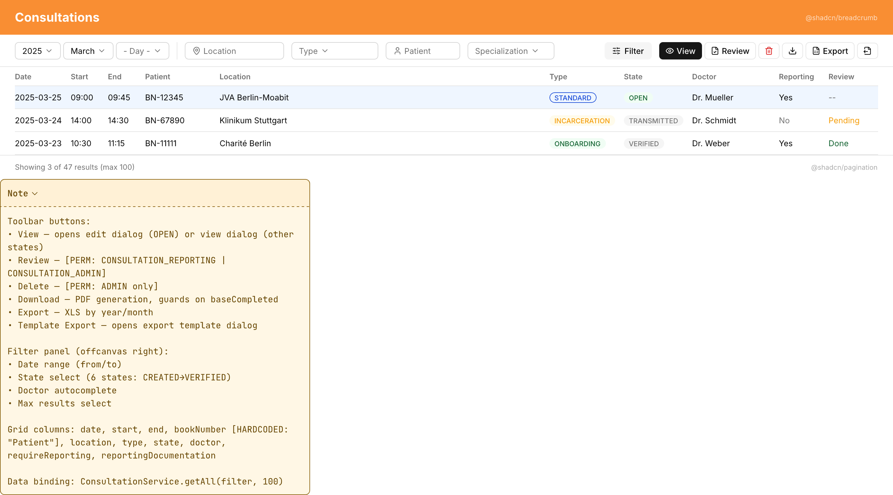

### W2: Consultation Details — Header & Tab Scaffold
778-line dialog scaffold: header row (book number, copy/template buttons, gender/birthday [internalOnly], date/start), 10-tab navigation with status icons, Patient Data tab content, Save/OK/Download footer.

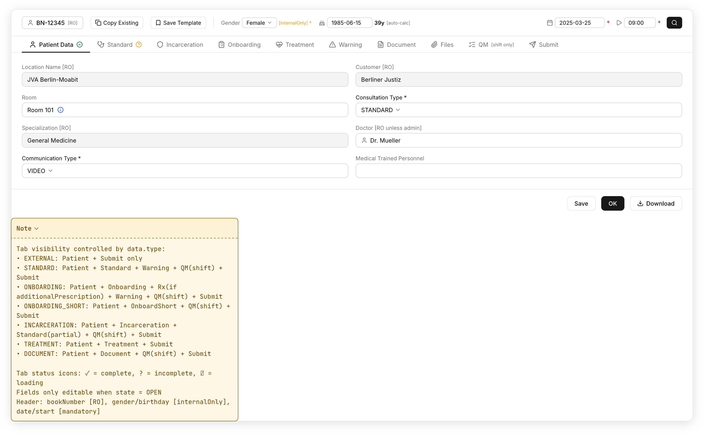

### W3: Consultation Details — Standard Form
Standard consultation form with 7 card sections: Medication Anamnesis, Anamnesis Collection (11 types), Patient Report Collection (10 types), Diagnosis/ICD-10, Prescription with nested activeIngredients and conditional dosage grid, Work Incapacity, Procedere Report. Fields marked `[incarceration-hide]` are hidden when type=INCARCERATION.

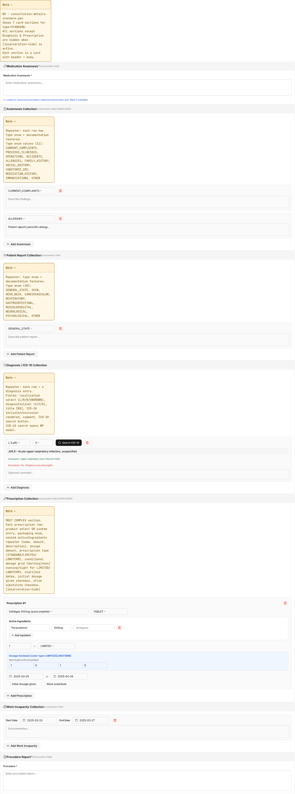

### W4: Consultation Details — Onboarding Form
Full onboarding form (~50 elements): Row 1 = Medical History & Examination (family history, physical findings, infectious diseases, organ systems), Row 2 = Evaluation (suitability checks). Includes conditionize2 rules for preexisting/current state. Note: ONBOARDING_SHORT is a strict subset.

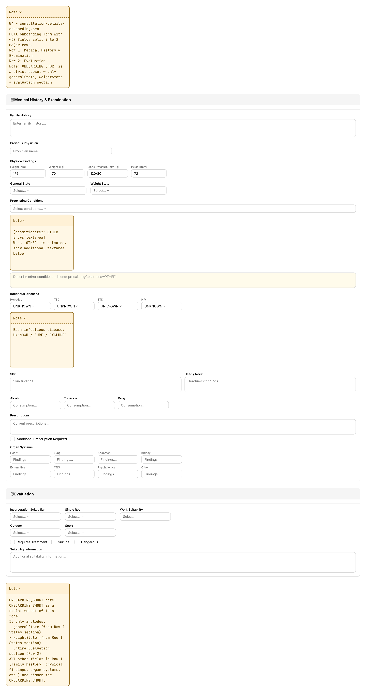

### W5: Consultation Details — Incarceration Form
Incarceration form (51 fields, 6 blocks): Type select with `[SIREN]`, Examination Result (3-column), Re-Introduction (disabled), Doctor Examination with consumption sub-block, Intoxication Assessment (stadium NONE–STAGE_5), Body Check. Cross-model bindings to onboarding data.

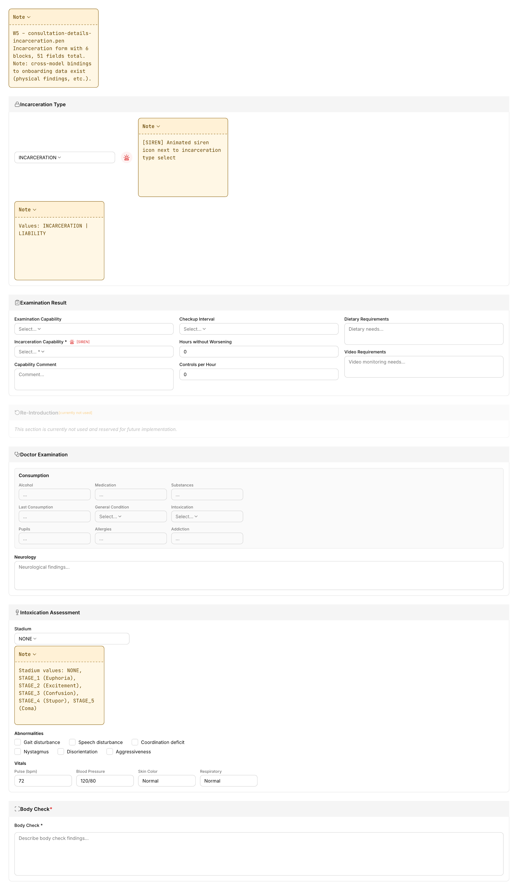

### W6: Consultation Details — Treatment & Warning
Treatment Form (15 textareas in sections: diagnoses, anamnese, medication, findings, history repeater, further treatment) + Warning Form (4 category selects, warning collection with conditionize2 noWarnings checkbox).

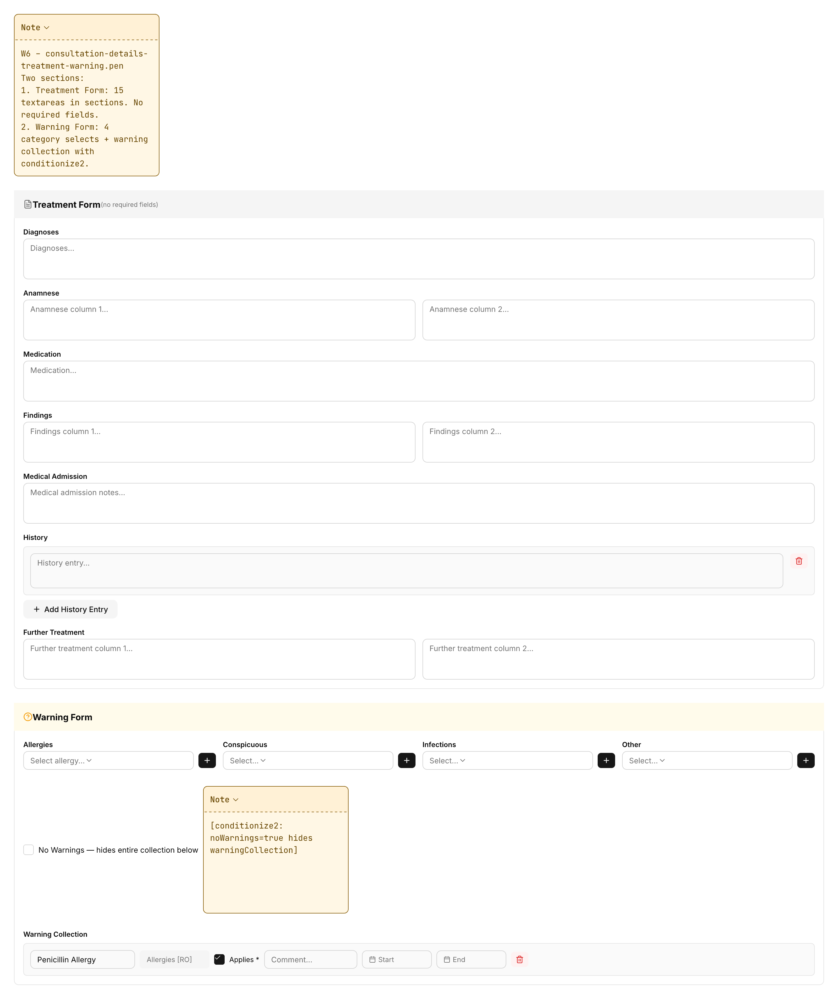

### W7: Consultation View (Read-Only)
Read-only view dialog (1500px): header info bar, type-conditional sections (STANDARD/ONBOARDING/INCARCERATION/TREATMENT/DOCUMENT), attachments with download links, OK + Download PDF buttons.

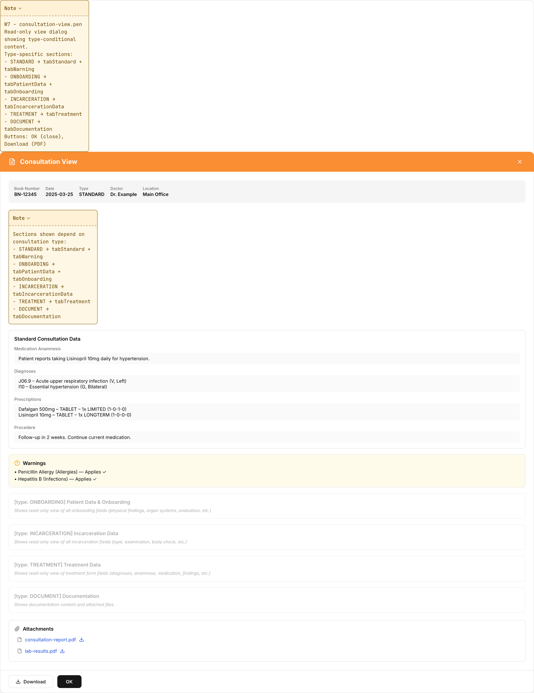

### W8: Consultation Review Dialog
Review dialog with 75%/25% split: left = read-only consultation view, right = review sidebar (expert name, report end date, markdown editor 70vh, Start/Save/Download/Submit Review buttons). 3-step workflow: no reporting → editing → verified.

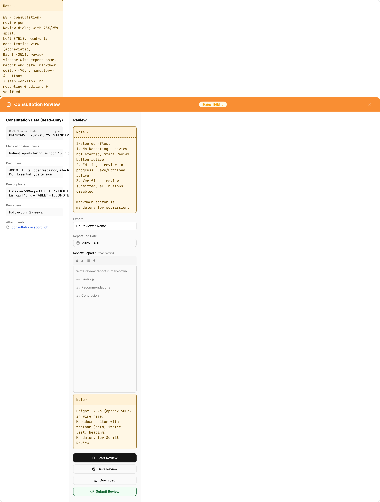

### W9: ICD-10 Search Modal
ICD-10 search dialog (600px): search input, scrollable results with ICD-10 code (bold), title, inclusion/exclusion lists, Select button per result.

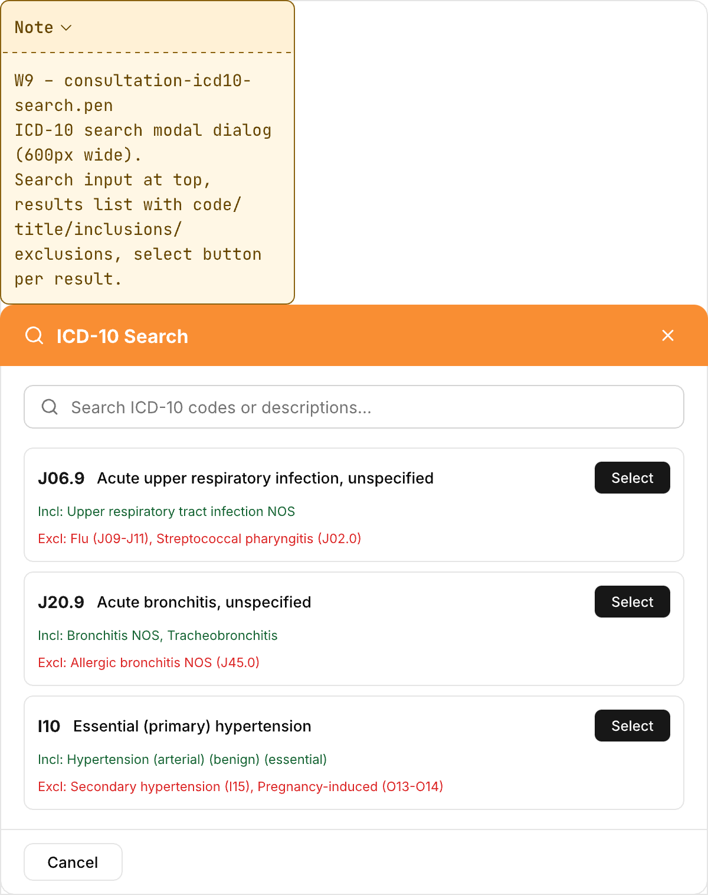

### W10: Export Template Modal
Export template dialog (600px): Year, Month, Template autocomplete (required, filter=CONSULTATION), Customer, Location, Expert fields, Export + Cancel buttons.

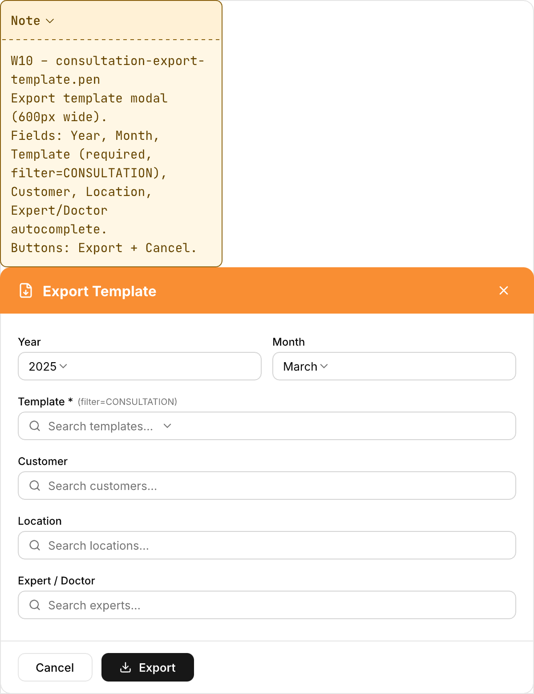
