# Treatment Domain -- User Workflows

This document describes the user experience and decision flows for the Treatment domain: Questionnaire (QM) completion, Consultation Start (wizard + routing), Appointment Summarization, and Incarceration retrieval. All diagrams represent the journey from the user's perspective, not internal system architecture.

---

## Area 1: Consultation Start — Wizard Routing & Patient Selection

### Context

When a clinical staff member wants to start a new consultation for an active appointment, the system must determine the correct wizard path based on the appointment's location configuration. This is a 3-way routing decision that the user does not directly control — the system evaluates it automatically and presents the appropriate wizard.

**Who uses it:** Clinical staff members (nurses, therapists, doctors) working from the treatment dashboard within an active appointment.

**Entry point:** User clicks "Start Consultation" on an active appointment from the treatment dashboard.

**Exit points:** The wizard closes and hands off to the Consultation Details form, with the selected patient, book number, consultation type, and location pre-populated.

---

### 1.1 Consultation Start — Routing Flowchart

This diagram shows the 3-way routing decision and the full consultation wizard flow from the user's perspective.

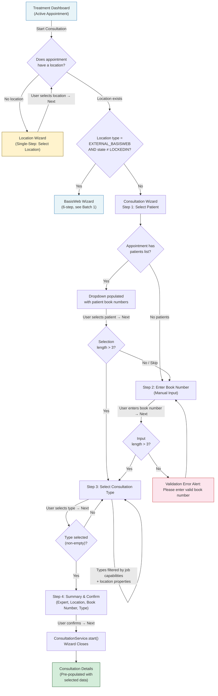
```mermaid
flowchart TD
    A["Treatment Dashboard<br>(Active Appointment)"] -->|"Start Consultation"| B{"Does appointment<br>have a location?"}

    B -->|"No location"| C["Location Wizard<br>(Single-Step: Select Location)"]
    C -->|"User selects location → Next"| B

    B -->|"Location exists"| D{"Location type =<br>EXTERNAL_BASISWEB<br>AND state ≠ LOCKEDIN?"}

    D -->|"Yes"| E["BasisWeb Wizard<br>(6-step, see Batch 1)"]
    D -->|"No"| F["Consultation Wizard<br>Step 1: Select Patient"]

    F --> G{"Appointment has<br>patients list?"}
    G -->|"Yes"| H["Dropdown populated<br>with patient book numbers"]
    G -->|"No patients"| I["Step 2: Enter Book Number<br>(Manual Input)"]

    H -->|"User selects patient → Next"| J{"Selection<br>length > 3?"}
    J -->|"Yes"| K["Step 3: Select Consultation Type"]
    J -->|"No / Skip"| I

    I -->|"User enters book number → Next"| L{"Input<br>length > 3?"}
    L -->|"No"| M["Validation Error Alert:<br>Please enter valid book number"]
    M --> I
    L -->|"Yes"| K

    K -->|"Types filtered by job capabilities<br>+ location properties"| K
    K -->|"User selects type → Next"| N{"Type selected<br>(non-empty)?"}
    N -->|"No"| K
    N -->|"Yes"| O["Step 4: Summary & Confirm<br>(Expert, Location, Book Number, Type)"]

    O -->|"User confirms → Next"| P["ConsultationService.start()<br>Wizard Closes"]
    P --> EXIT_DETAIL["Consultation Details<br>(Pre-populated with<br>selected data)"]

    style A fill:#e8f4f8,stroke:#2c7bb6
    style C fill:#fff3cd,stroke:#856404
    style E fill:#e8f4f8,stroke:#2c7bb6
    style EXIT_DETAIL fill:#d4edda,stroke:#155724
    style M fill:#fce4ec,stroke:#c62828
```

**Key observations:**

- The 3-way routing is fully automatic: the user sees only the wizard path that applies to their appointment's configuration.
- The **Location Wizard** is a recursive entry point — once the user selects a location, the routing check repeats with the new location.
- The **BasisWeb Wizard** (Batch 1) is an entirely separate flow for external patient data retrieval; it is NOT part of this consultation wizard.
- The patient dropdown in Step 1 is pre-populated from the appointment's patient list. If the list is empty, the user skips directly to manual book number entry.
- **COUNCIL appointment type** has special behavior: selecting a patient auto-fills and locks the location from the patient's associated location data.

---

### 1.2 Consultation Wizard — State Diagram

This diagram models the wizard states and transitions as experienced by the user.

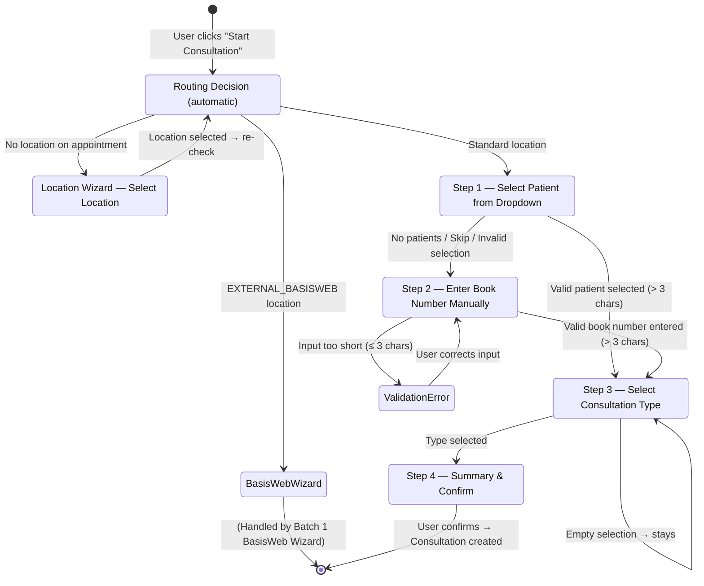
```mermaid
stateDiagram-v2
    [*] --> RoutingCheck: User clicks "Start Consultation"

    RoutingCheck: Routing Decision (automatic)
    LocationWizard: Location Wizard — Select Location
    SelectPatient: Step 1 — Select Patient from Dropdown
    EnterBookNumber: Step 2 — Enter Book Number Manually
    SelectType: Step 3 — Select Consultation Type
    ReviewSummary: Step 4 — Summary & Confirm

    RoutingCheck --> LocationWizard: No location on appointment
    RoutingCheck --> BasisWebWizard: EXTERNAL_BASISWEB location
    RoutingCheck --> SelectPatient: Standard location

    LocationWizard --> RoutingCheck: Location selected → re-check

    state BasisWebWizard <<choice>>
    BasisWebWizard --> [*]: (Handled by Batch 1 BasisWeb Wizard)

    SelectPatient --> SelectType: Valid patient selected (> 3 chars)
    SelectPatient --> EnterBookNumber: No patients / Skip / Invalid selection

    EnterBookNumber --> SelectType: Valid book number entered (> 3 chars)
    EnterBookNumber --> ValidationError: Input too short (≤ 3 chars)
    ValidationError --> EnterBookNumber: User corrects input

    SelectType --> ReviewSummary: Type selected
    SelectType --> SelectType: Empty selection → stays

    ReviewSummary --> [*]: User confirms → Consultation created

    state ValidationError <<choice>>
```

**State transition notes:**

- **RoutingCheck** is an automatic decision state — the user never sees it as a screen; they see the result (one of three wizard paths).
- **LocationWizard** loops back to RoutingCheck because the location selection may change the routing outcome.
- **SelectPatient** and **EnterBookNumber** are the two patient identification paths. They converge at **SelectType**.
- **SelectType** dynamically filters its options based on the user's job capabilities. Not all 7 consultation types are available to every user.
- **ReviewSummary** is the terminal confirmation state before the consultation is created.

---

### 1.3 Consultation Wizard — Sequence Diagram

This diagram shows the user-system interaction during the consultation wizard, including the routing decision.

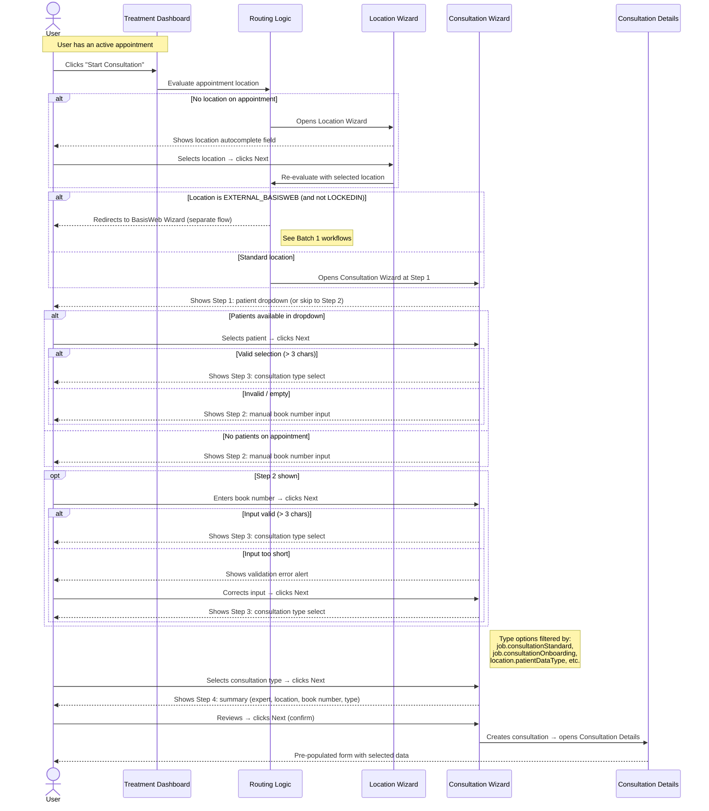
```mermaid
sequenceDiagram
    actor User
    participant Dashboard as Treatment Dashboard
    participant Router as Routing Logic
    participant LocWizard as Location Wizard
    participant CWizard as Consultation Wizard
    participant Detail as Consultation Details

    Note over User, Dashboard: User has an active appointment

    User->>Dashboard: Clicks "Start Consultation"
    Dashboard->>Router: Evaluate appointment location

    alt No location on appointment
        Router->>LocWizard: Opens Location Wizard
        LocWizard-->>User: Shows location autocomplete field
        User->>LocWizard: Selects location → clicks Next
        LocWizard->>Router: Re-evaluate with selected location
    end

    alt Location is EXTERNAL_BASISWEB (and not LOCKEDIN)
        Router-->>User: Redirects to BasisWeb Wizard (separate flow)
        Note right of Router: See Batch 1 workflows
    else Standard location
        Router->>CWizard: Opens Consultation Wizard at Step 1
    end

    CWizard-->>User: Shows Step 1: patient dropdown (or skip to Step 2)

    alt Patients available in dropdown
        User->>CWizard: Selects patient → clicks Next
        alt Valid selection (> 3 chars)
            CWizard-->>User: Shows Step 3: consultation type select
        else Invalid / empty
            CWizard-->>User: Shows Step 2: manual book number input
        end
    else No patients on appointment
        CWizard-->>User: Shows Step 2: manual book number input
    end

    opt Step 2 shown
        User->>CWizard: Enters book number → clicks Next
        alt Input valid (> 3 chars)
            CWizard-->>User: Shows Step 3: consultation type select
        else Input too short
            CWizard-->>User: Shows validation error alert
            User->>CWizard: Corrects input → clicks Next
            CWizard-->>User: Shows Step 3: consultation type select
        end
    end

    Note right of CWizard: Type options filtered by:<br/>job.consultationStandard,<br/>job.consultationOnboarding,<br/>location.patientDataType, etc.

    User->>CWizard: Selects consultation type → clicks Next
    CWizard-->>User: Shows Step 4: summary (expert, location, book number, type)
    User->>CWizard: Reviews → clicks Next (confirm)

    CWizard->>Detail: Creates consultation → opens Consultation Details
    Detail-->>User: Pre-populated form with selected data
```

**Interaction highlights:**

- The routing decision is invisible to the user — they click one button and the system determines the path.
- Step 3 (type selection) is the critical filtering point: the available options depend on the user's job entity and the appointment's location properties. This means two users with different jobs may see different type options for the same appointment.
- The wizard accumulates state across steps (`appointment`, `location`, `job`, `booknumber`, `type`) and submits everything at once in Step 4.
- After submission, the wizard closes and `ConsultationDetails.open(data)` is called, seamlessly transitioning the user to the full consultation form.

---

## Area 2: Appointment Summarization & End Appointment

### Context

When a clinical staff member finishes working on an appointment, they use one of two dialogs depending on the appointment context:

- **Summarize Appointment** — used for external-location appointments. A comprehensive dialog capturing adjusted times, communication type, further treatment counters, and a QM questionnaire.
- **End Appointment** — used for standard (non-shift) appointments. A simpler dialog confirming end with adjusted times and a QM questionnaire.

Both dialogs embed the same QM questionnaire form, making quality management data collection an integral part of the appointment closure flow.

**Who uses it:** Clinical staff members completing an appointment.

**Entry point:** User clicks "Summarize" or "End Appointment" on an active appointment from the treatment dashboard.

**Exit points:** Dashboard refreshes with the appointment marked as completed, or dialog re-opens on error.

---

### 2.1 Summarize / End Appointment — Flowchart

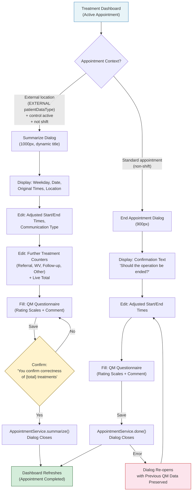
```mermaid
flowchart TD
    A["Treatment Dashboard<br>(Active Appointment)"] --> B{"Appointment Context?"}

    B -->|"External location<br>(EXTERNAL patientDataType)<br>+ control active<br>+ not shift"| C["Summarize Dialog<br>(1000px, dynamic title)"]
    B -->|"Standard appointment<br>(non-shift)"| D["End Appointment Dialog<br>(900px)"]

    C --> C1["Display: Weekday, Date,<br>Original Times, Location"]
    C1 --> C2["Edit: Adjusted Start/End Times,<br>Communication Type"]
    C2 --> C3["Edit: Further Treatment Counters<br>(Referral, WV, Follow-up, Other)<br>+ Live Total"]
    C3 --> C4["Fill: QM Questionnaire<br>(Rating Scales + Comment)"]
    C4 -->|"Save"| C5{"Confirm:<br>'You confirm correctness<br>of {total} treatments'"}
    C5 -->|"Yes"| C6["AppointmentService.summarize()<br>Dialog Closes"]
    C5 -->|"No"| C4
    C6 --> EXIT_REFRESH["Dashboard Refreshes<br>(Appointment Completed)"]

    D --> D1["Display: Confirmation Text<br>'Should the operation be ended?'"]
    D1 --> D2["Edit: Adjusted Start/End Times"]
    D2 --> D3["Fill: QM Questionnaire<br>(Rating Scales + Comment)"]
    D3 -->|"Save"| D4["AppointmentService.done()<br>Dialog Closes"]
    D4 --> EXIT_REFRESH

    D4 -->|"Error"| D5["Dialog Re-opens<br>with Previous QM Data Preserved"]
    D5 --> D2

    style A fill:#e8f4f8,stroke:#2c7bb6
    style EXIT_REFRESH fill:#d4edda,stroke:#155724
    style C5 fill:#fff3cd,stroke:#856404
    style D5 fill:#fce4ec,stroke:#c62828
```

**Key observations:**

- The **Summarize** dialog has a dynamic title that changes based on appointment type: "Appointment" for APPOINTMENT, "Shift" for SHIFT or COUNCIL.
- The further treatment counters (referral, WV, follow-up, referral-other) have a **live computed total** that updates as the user types. This total is shown in the confirmation prompt.
- The confirmation prompt for Summarize includes a HARDCODED German legal text about data correctness and administrative-only subsequent changes.
- The **End Appointment** dialog preserves QM data across error-retry cycles — if the save fails, the dialog reopens with the user's previously entered questionnaire data intact.
- Both dialogs apply `filterQm()` before displaying the QM section, which adjusts visible rating questions based on job type and consultation context.

---

### 2.2 QM Questionnaire Completion — State Diagram

This diagram models the QM questionnaire sub-flow that is embedded in both the Summarize and End Appointment dialogs.

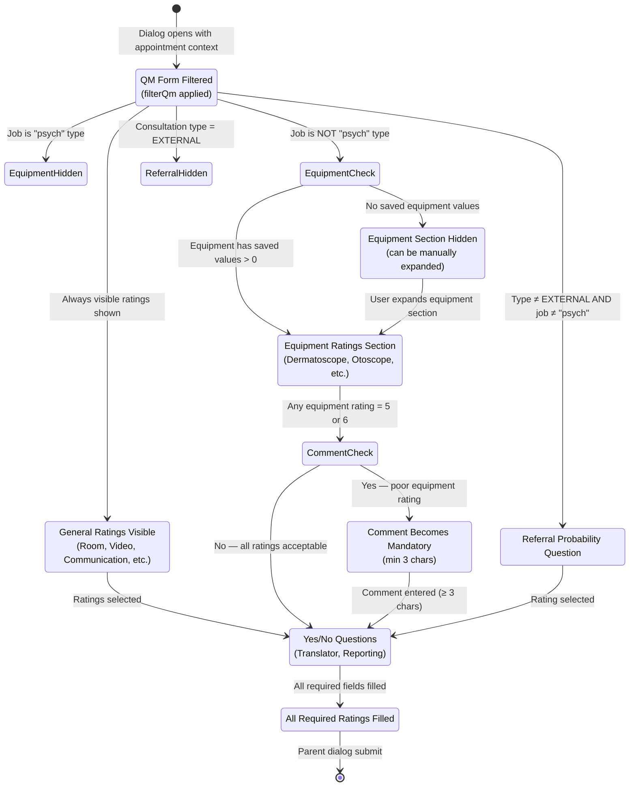
```mermaid
stateDiagram-v2
    [*] --> FilterApplied: Dialog opens with appointment context

    FilterApplied: QM Form Filtered<br>(filterQm applied)
    GeneralRatings: General Ratings Visible<br>(Room, Video, Communication, etc.)
    EquipmentRatings: Equipment Ratings Section<br>(Dermatoscope, Otoscope, etc.)
    ReferralQuestion: Referral Probability Question
    BooleanQuestions: Yes/No Questions<br>(Translator, Reporting)
    CommentRequired: Comment Becomes Mandatory<br>(min 3 chars)
    FormComplete: All Required Ratings Filled

    FilterApplied --> GeneralRatings: Always visible ratings shown
    FilterApplied --> EquipmentHidden: Job is "psych" type
    FilterApplied --> EquipmentCheck: Job is NOT "psych" type

    state EquipmentHidden <<choice>>
    state EquipmentCheck <<choice>>

    EquipmentCheck --> EquipmentRatings: Equipment has saved values > 0
    EquipmentCheck --> EquipmentCollapsed: No saved equipment values

    EquipmentCollapsed: Equipment Section Hidden<br>(can be manually expanded)
    EquipmentCollapsed --> EquipmentRatings: User expands equipment section

    GeneralRatings --> BooleanQuestions: Ratings selected

    EquipmentRatings --> CommentCheck: Any equipment rating = 5 or 6

    state CommentCheck <<choice>>
    CommentCheck --> CommentRequired: Yes — poor equipment rating
    CommentCheck --> BooleanQuestions: No — all ratings acceptable

    CommentRequired --> BooleanQuestions: Comment entered (≥ 3 chars)

    FilterApplied --> ReferralHidden: Consultation type = EXTERNAL
    FilterApplied --> ReferralQuestion: Type ≠ EXTERNAL AND job ≠ "psych"

    state ReferralHidden <<choice>>

    ReferralQuestion --> BooleanQuestions: Rating selected

    BooleanQuestions --> FormComplete: All required fields filled
    FormComplete --> [*]: Parent dialog submit
```

**State transition notes:**

- **FilterApplied** runs automatically when the dialog opens. It evaluates job type and consultation type to determine which questions are visible.
- **Equipment ratings** are hidden by default and only auto-expand when they have saved values > 0. For psych-type jobs, they are permanently hidden.
- The **referral probability question** is hidden under two conditions: EXTERNAL consultation type OR psych job type (it carries both `qmphysical` and `qmexternal` CSS classes).
- **Comment mandatory trigger** is dynamic: rating any equipment item at 5 ("poor") or 6 ("inadequate") immediately makes the feedback textarea required with a minimum of 3 characters.

---

## Area 3: Incarceration Consultation Retrieval

### Context

The incarceration retrieval flow allows staff to look up and retrieve medical examination data for incarcerated individuals. It is a two-step process: first verify the book number and code, then fill in the target person's address for document delivery.

**Who uses it:** Clinical staff with access to the "Retrieve Consultation" menu item on the treatment dashboard.

**Entry point:** User clicks "Retrieve Consultation" (`#retrieveConsultationMenuBtn`) on the treatment dashboard.

**Exit points:** A PDF document is generated and available for download via the Job Status dialog.

---

### 3.1 Incarceration Retrieval — Flowchart

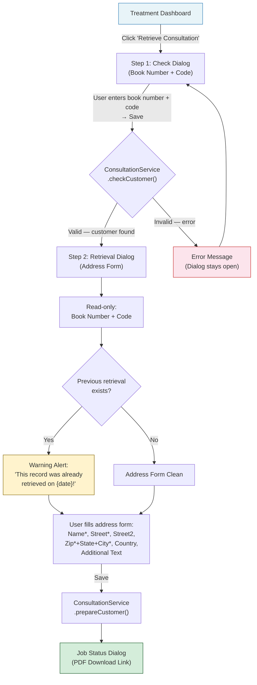
```mermaid
flowchart TD
    A["Treatment Dashboard"] -->|"Click 'Retrieve Consultation'"| B["Step 1: Check Dialog<br>(Book Number + Code)"]

    B -->|"User enters book number + code<br>→ Save"| C{"ConsultationService<br>.checkCustomer()"}

    C -->|"Valid — customer found"| D["Step 2: Retrieval Dialog<br>(Address Form)"]
    C -->|"Invalid — error"| E["Error Message<br>(Dialog stays open)"]
    E --> B

    D --> D1["Read-only:<br>Book Number + Code"]
    D1 --> D2{"Previous retrieval<br>exists?"}
    D2 -->|"Yes"| D3["Warning Alert:<br>'This record was already<br>retrieved on {date}!'"]
    D2 -->|"No"| D4["Address Form Clean"]
    D3 --> D5["User fills address form:<br>Name*, Street*, Street2,<br>Zip*+State+City*, Country,<br>Additional Text"]
    D4 --> D5

    D5 -->|"Save"| F["ConsultationService<br>.prepareCustomer()"]
    F --> G["Job Status Dialog<br>(PDF Download Link)"]

    style A fill:#e8f4f8,stroke:#2c7bb6
    style G fill:#d4edda,stroke:#155724
    style E fill:#fce4ec,stroke:#c62828
    style D3 fill:#fff3cd,stroke:#856404
```

**Key observations:**

- This is a strictly sequential two-step flow: the check dialog must succeed before the retrieval dialog opens.
- The retrieval dialog shows the verified book number and code as **read-only** fields, preventing accidental modification after verification.
- The **previous retrieval warning** is a dangerous-red alert that appears when the same record has been retrieved before, including the exact date. This is a safeguard against duplicate retrievals.
- The zip code field has a `searchZipCode` class that triggers auto-lookup for state and city, reducing manual data entry.
- The final output is a PDF document available through the standard Job Status dialog (async generation pattern).

---

### 3.2 Incarceration Retrieval — Sequence Diagram

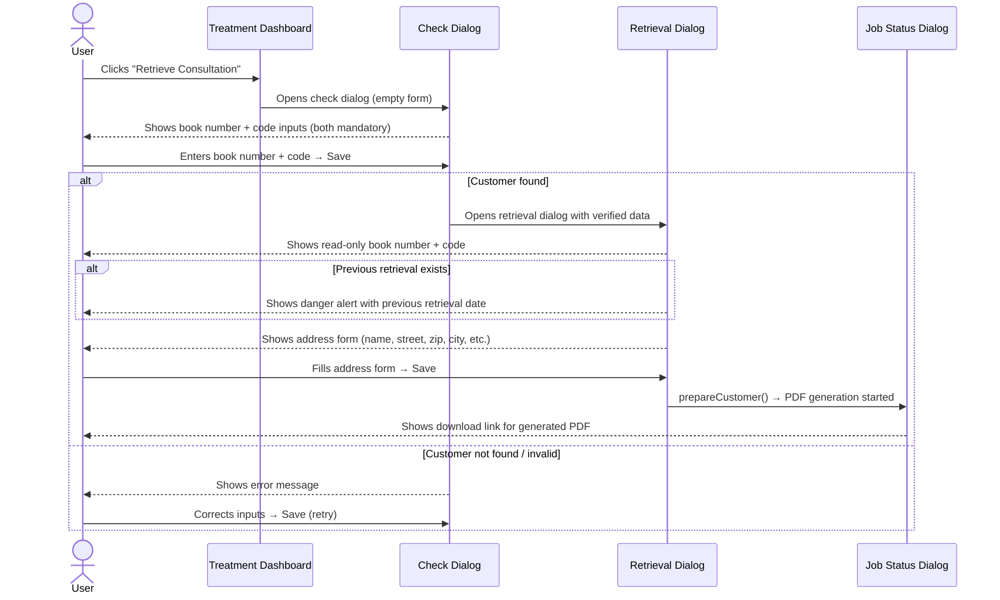
```mermaid
sequenceDiagram
    actor User
    participant Dashboard as Treatment Dashboard
    participant CheckDlg as Check Dialog
    participant RetrievalDlg as Retrieval Dialog
    participant JobStatus as Job Status Dialog

    User->>Dashboard: Clicks "Retrieve Consultation"
    Dashboard->>CheckDlg: Opens check dialog (empty form)

    CheckDlg-->>User: Shows book number + code inputs (both mandatory)
    User->>CheckDlg: Enters book number + code → Save

    alt Customer found
        CheckDlg->>RetrievalDlg: Opens retrieval dialog with verified data
        RetrievalDlg-->>User: Shows read-only book number + code

        alt Previous retrieval exists
            RetrievalDlg-->>User: Shows danger alert with previous retrieval date
        end

        RetrievalDlg-->>User: Shows address form (name, street, zip, city, etc.)
        User->>RetrievalDlg: Fills address form → Save
        RetrievalDlg->>JobStatus: prepareCustomer() → PDF generation started
        JobStatus-->>User: Shows download link for generated PDF
    else Customer not found / invalid
        CheckDlg-->>User: Shows error message
        User->>CheckDlg: Corrects inputs → Save (retry)
    end
```

---

## Area 4: Consultation Template Management

### Context

Consultation templates allow clinical staff to save and reuse pre-configured consultation structures. Templates are managed through a list panel accessible from the treatment dashboard, with options to create, edit, and delete templates.

**Who uses it:** Clinical staff (experts) who frequently create similar consultation types.

**Entry point:** User clicks the "Templates" button on the treatment dashboard.

**Exit points:** User opens a template in Consultation Details (for editing), or closes the template panel.

---

### 4.1 Consultation Template — Flowchart

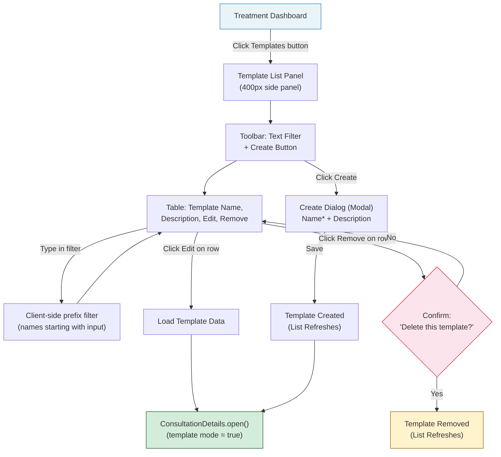
```mermaid
flowchart TD
    A["Treatment Dashboard"] -->|"Click Templates button"| B["Template List Panel<br>(400px side panel)"]

    B --> B1["Toolbar: Text Filter<br>+ Create Button"]
    B1 --> C["Table: Template Name,<br>Description, Edit, Remove"]

    C -->|"Type in filter"| D["Client-side prefix filter<br>(names starting with input)"]
    D --> C

    C -->|"Click Edit on row"| E["Load Template Data"]
    E --> F["ConsultationDetails.open()<br>(template mode = true)"]

    C -->|"Click Remove on row"| G{"Confirm:<br>'Delete this template?'"}
    G -->|"Yes"| H["Template Removed<br>(List Refreshes)"]
    G -->|"No"| C

    B1 -->|"Click Create"| I["Create Dialog (Modal)<br>Name* + Description"]
    I -->|"Save"| J["Template Created<br>(List Refreshes)"]
    J --> F

    style A fill:#e8f4f8,stroke:#2c7bb6
    style F fill:#d4edda,stroke:#155724
    style H fill:#fff3cd,stroke:#856404
    style G fill:#fce4ec,stroke:#c62828
```

**Key observations:**

- The template list is a **side panel** (400px, secondary target), not a modal dialog. It coexists with the main dashboard view.
- The text filter is **client-side only** using prefix matching (`name.toLowerCase().startsWith(value)`). No server-side search is needed.
- Both **Create** and **Edit** actions end by opening Consultation Details in template mode. The difference is that Create first saves a blank template, while Edit loads an existing one.
- The **Remove** action requires explicit confirmation before deletion. After removal, the list refreshes automatically.

---

## Area 5: Medication CRUD Flow

### Context

The Medication module provides a standard CRUD interface for managing medication records used across treatment plans and consultations. It follows a grid-to-detail pattern with client-side filtering.

**Who uses it:** Administrative staff and clinical staff managing the medication catalog.

**Entry point:** User navigates to the Medication list view.

**Exit points:** Medication record created, updated, or deleted; user returns to the grid.

---

### 5.1 Medication CRUD — Flowchart

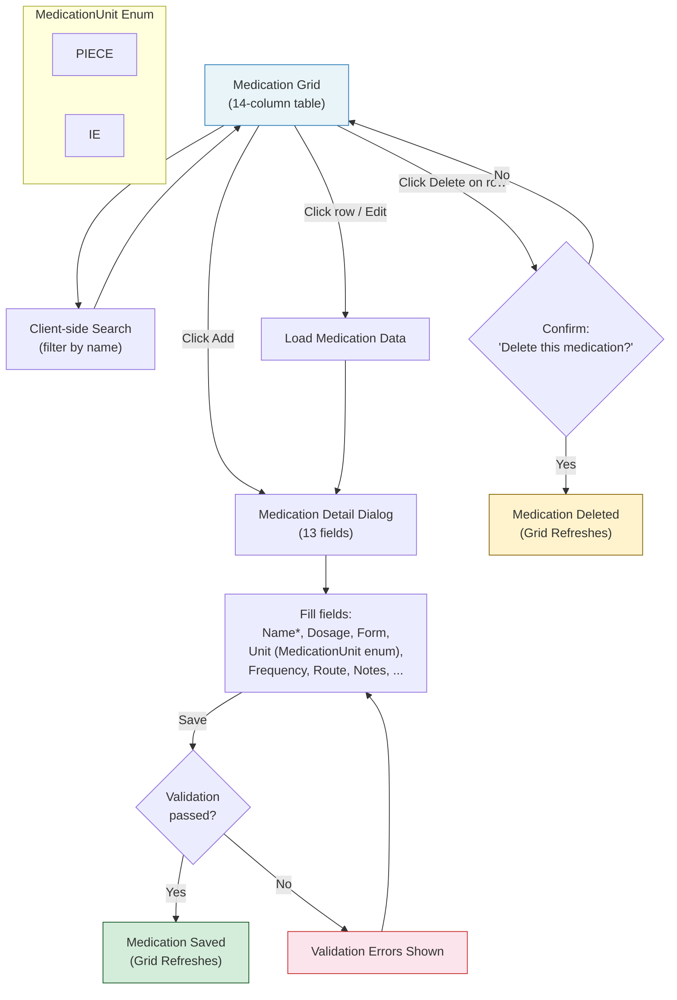
```mermaid
flowchart TD
    A["Medication Grid<br>(14-column table)"] --> B["Client-side Search<br>(filter by name)"]
    B --> A

    A -->|"Click Add"| C["Medication Detail Dialog<br>(13 fields)"]
    A -->|"Click row / Edit"| D["Load Medication Data"]
    D --> C

    C --> C1["Fill fields:<br>Name*, Dosage, Form,<br>Unit (MedicationUnit enum),<br>Frequency, Route, Notes, ..."]
    C1 -->|"Save"| E{"Validation<br>passed?"}
    E -->|"Yes"| F["Medication Saved<br>(Grid Refreshes)"]
    E -->|"No"| G["Validation Errors Shown"]
    G --> C1

    A -->|"Click Delete on row"| H{"Confirm:<br>'Delete this medication?'"}
    H -->|"Yes"| I["Medication Deleted<br>(Grid Refreshes)"]
    H -->|"No"| A

    subgraph "MedicationUnit Enum"
        U1["PIECE"]
        U2["IE"]
    end

    style A fill:#e8f4f8,stroke:#2c7bb6
    style F fill:#d4edda,stroke:#155724
    style I fill:#fff3cd,stroke:#856404
    style G fill:#fce4ec,stroke:#c62828
```

**Key observations:**

- The grid has **14 columns** — typical for a data-heavy CRUD list. Horizontal scroll expected.
- The detail dialog exposes **13 fields** for comprehensive medication data entry.
- The **MedicationUnit enum** constrains the unit field to `PIECE` or `IE` — this is a select/radio, not free text.
- Search is **client-side only** — the full medication list is loaded and filtered in the browser.
- Standard Add/Edit/Delete pattern with confirmation on delete.

---

## Area 6: Patient Data Management Flow

### Context

Patient Data management allows staff to maintain patient records with file attachments. Patients are identified by their bookNumber, which serves as the primary cross-entity link across appointments and consultations.

**Who uses it:** Administrative and clinical staff managing patient records.

**Entry point:** User navigates to the Patient Data list view.

**Exit points:** Patient record created, updated, or deleted; files uploaded or downloaded.

---

### 6.1 Patient Data Management — Flowchart

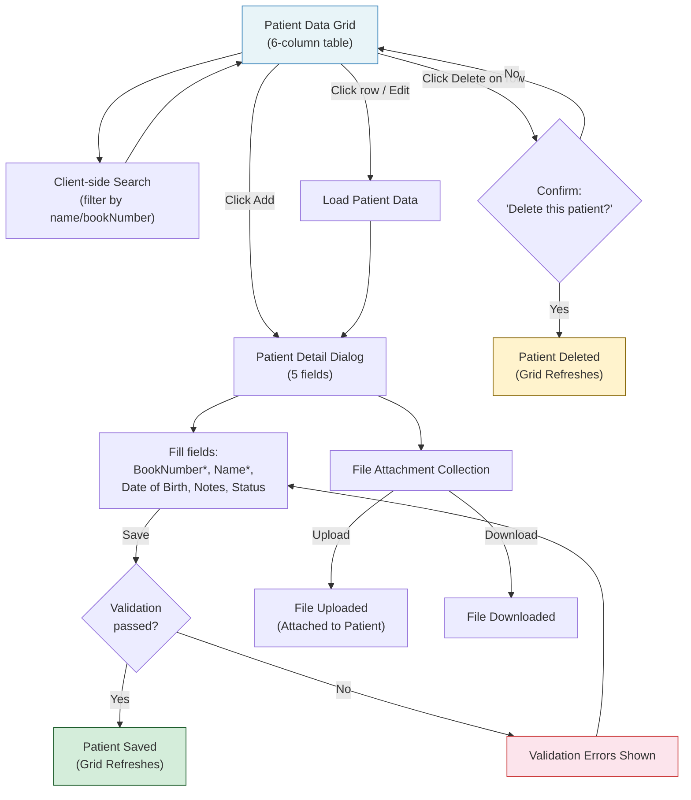
```mermaid
flowchart TD
    A["Patient Data Grid<br>(6-column table)"] --> B["Client-side Search<br>(filter by name/bookNumber)"]
    B --> A

    A -->|"Click Add"| C["Patient Detail Dialog<br>(5 fields)"]
    A -->|"Click row / Edit"| D["Load Patient Data"]
    D --> C

    C --> C1["Fill fields:<br>BookNumber*, Name*,<br>Date of Birth, Notes, Status"]
    C1 -->|"Save"| E{"Validation<br>passed?"}
    E -->|"Yes"| F["Patient Saved<br>(Grid Refreshes)"]
    E -->|"No"| G["Validation Errors Shown"]
    G --> C1

    C --> H["File Attachment Collection"]
    H -->|"Upload"| I["File Uploaded<br>(Attached to Patient)"]
    H -->|"Download"| J["File Downloaded"]

    A -->|"Click Delete on row"| K{"Confirm:<br>'Delete this patient?'"}
    K -->|"Yes"| L["Patient Deleted<br>(Grid Refreshes)"]
    K -->|"No"| A

    style A fill:#e8f4f8,stroke:#2c7bb6
    style F fill:#d4edda,stroke:#155724
    style L fill:#fff3cd,stroke:#856404
    style G fill:#fce4ec,stroke:#c62828
```

**Key observations:**

- The grid has **6 columns** — a compact patient summary view.
- The detail dialog has **5 fields** plus a **file attachment collection** for document management.
- Patients are added primarily by **bookNumber**, which is the cross-entity identifier linking to appointments and consultations.
- File attachments support **upload and download** operations directly from the detail view.
- Search is **client-side** — filtering by name or bookNumber.

---

## Area 7: Treatment List & Category Flow

### Context

The Treatment module provides two sub-views: a **MonthTable calendar grid** for viewing scheduled treatments across a calendar month, and a **Treatment Category** CRUD for managing treatment classification. Critically, treatments themselves **cannot be created** from this view — the MonthTable is a **read-only calendar** that reuses the shared appointment detail panel for viewing.

**Who uses it:** Clinical staff reviewing treatment schedules; administrators managing treatment categories.

**Entry point:** User navigates to the Treatment List (MonthTable) or Treatment Category view.

**Exit points:** Treatment detail viewed via shared appointment panel; category created, updated, or deleted.

---

### 7.1 Treatment MonthTable & Category — Flowchart

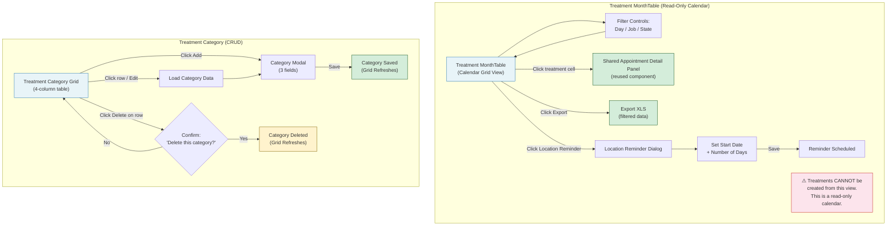
```mermaid
flowchart TD
    subgraph "Treatment MonthTable (Read-Only Calendar)"
        MT_A["Treatment MonthTable<br>(Calendar Grid View)"] --> MT_B["Filter Controls:<br>Day / Job / State"]
        MT_B --> MT_A

        MT_A -->|"Click treatment cell"| MT_C["Shared Appointment Detail Panel<br>(reused component)"]

        MT_A -->|"Click Export"| MT_D["Export XLS<br>(filtered data)"]

        MT_A -->|"Click Location Reminder"| MT_E["Location Reminder Dialog"]
        MT_E --> MT_E1["Set Start Date<br>+ Number of Days"]
        MT_E1 -->|"Save"| MT_E2["Reminder Scheduled"]

        MT_NOTE["⚠ Treatments CANNOT be<br>created from this view.<br>This is a read-only calendar."]
    end

    subgraph "Treatment Category (CRUD)"
        TC_A["Treatment Category Grid<br>(4-column table)"] -->|"Click Add"| TC_B["Category Modal<br>(3 fields)"]
        TC_A -->|"Click row / Edit"| TC_C["Load Category Data"]
        TC_C --> TC_B

        TC_B -->|"Save"| TC_D["Category Saved<br>(Grid Refreshes)"]

        TC_A -->|"Click Delete on row"| TC_E{"Confirm:<br>'Delete this category?'"}
        TC_E -->|"Yes"| TC_F["Category Deleted<br>(Grid Refreshes)"]
        TC_E -->|"No"| TC_A
    end

    style MT_A fill:#e8f4f8,stroke:#2c7bb6
    style MT_C fill:#d4edda,stroke:#155724
    style MT_D fill:#d4edda,stroke:#155724
    style MT_NOTE fill:#fce4ec,stroke:#c62828
    style TC_A fill:#e8f4f8,stroke:#2c7bb6
    style TC_D fill:#d4edda,stroke:#155724
    style TC_F fill:#fff3cd,stroke:#856404
```

**Key observations:**

- The **MonthTable** is strictly a **read-only calendar view** — it does NOT support treatment creation. Treatments are created through treatment plans (see Area 8).
- Clicking a treatment cell opens the **shared appointment detail panel**, which is reused across multiple views for consistency.
- The MonthTable supports **filtering by day, job, and state** to narrow down the visible schedule.
- **Export XLS** generates a spreadsheet of the currently filtered calendar data.
- The **Location Reminder** dialog allows scheduling location-based reminders with a start date and number of days.
- **Treatment Category** is a simple 4-column grid with 3-field CRUD modal — standard admin pattern.

---

## Area 8: Treatment Plan Lifecycle

### Context

Treatment plans follow a 12-state lifecycle that governs which actions are available at each phase. The state machine has a happy path (PREPARED → CLOSED), a cancellation branch (CANCELED → CANCELED_CLOSED), a storno branch (STORNO → STORNO_CLOSED), and a PAUSED state that can interrupt any active state.

**Who uses it:** Clinical staff and administrators managing treatment plan progression.

**Trigger:** Treatment plan state changes are triggered by user actions (Start, Cancel, Storno, Pause, Resume, Close) gated by the current state.

---

### 8.1 Treatment Plan Lifecycle — State Diagram

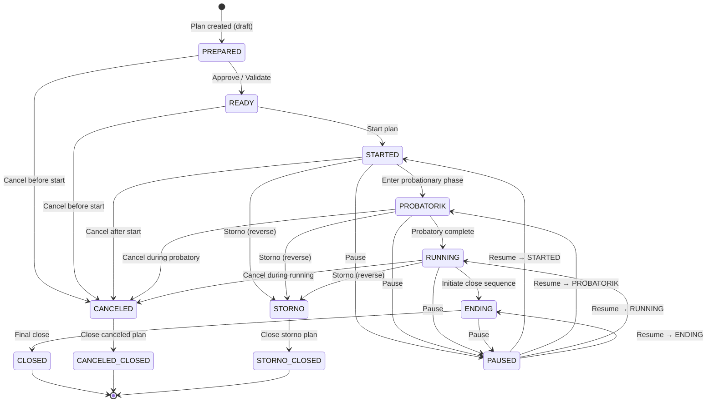
```mermaid
stateDiagram-v2
    [*] --> PREPARED: Plan created (draft)

    PREPARED --> READY: Approve / Validate
    READY --> STARTED: Start plan
    STARTED --> PROBATORIK: Enter probationary phase
    PROBATORIK --> RUNNING: Probatory complete
    RUNNING --> ENDING: Initiate close sequence
    ENDING --> CLOSED: Final close

    %% Cancellation branch
    PREPARED --> CANCELED: Cancel before start
    READY --> CANCELED: Cancel before start
    STARTED --> CANCELED: Cancel after start
    PROBATORIK --> CANCELED: Cancel during probatory
    RUNNING --> CANCELED: Cancel during running
    CANCELED --> CANCELED_CLOSED: Close canceled plan

    %% Storno branch
    STARTED --> STORNO: Storno (reverse)
    PROBATORIK --> STORNO: Storno (reverse)
    RUNNING --> STORNO: Storno (reverse)
    STORNO --> STORNO_CLOSED: Close storno plan

    %% Pause can interrupt any active state
    STARTED --> PAUSED: Pause
    PROBATORIK --> PAUSED: Pause
    RUNNING --> PAUSED: Pause
    ENDING --> PAUSED: Pause
    PAUSED --> STARTED: Resume → STARTED
    PAUSED --> PROBATORIK: Resume → PROBATORIK
    PAUSED --> RUNNING: Resume → RUNNING
    PAUSED --> ENDING: Resume → ENDING

    CLOSED --> [*]
    CANCELED_CLOSED --> [*]
    STORNO_CLOSED --> [*]
```

**State transition notes:**

- **Happy path**: PREPARED → READY → STARTED → PROBATORIK → RUNNING → ENDING → CLOSED. This is the full lifecycle from draft to completion.
- **CANCELED** can be reached from any pre-close active state (PREPARED through RUNNING). It represents an intentional cancellation before the plan completes.
- **STORNO** can be reached from STARTED, PROBATORIK, or RUNNING. It represents a reversal/correction of a plan that was already in progress.
- **PAUSED** can interrupt STARTED, PROBATORIK, RUNNING, or ENDING. When resumed, the plan returns to the state it was in before being paused.
- **Terminal states**: CLOSED, CANCELED_CLOSED, and STORNO_CLOSED are all end states with no further transitions.
- The current state **gates all available UI actions** — e.g., Start is only available in READY, Storno is only available in active states (STARTED/PROBATORIK/RUNNING).

---

## Area 9: Treatment Plan Create & Edit Sequence

### Context

Creating and editing a treatment plan is a multi-step process involving a large form (20+ fields), expert scheduling via a week calendar, and a 3-column edit layout with positions and file attachments. The plan starts as a draft (PREPARED) and can be started to trigger async appointment generation.

**Who uses it:** Administrators and clinical staff creating or modifying treatment plans.

**Entry point:** User clicks "Create Treatment Plan" or opens an existing plan for editing.

**Exit points:** Treatment plan saved in draft or started with appointments generated.

---

### 9.1 Treatment Plan Create & Edit — Sequence Diagram

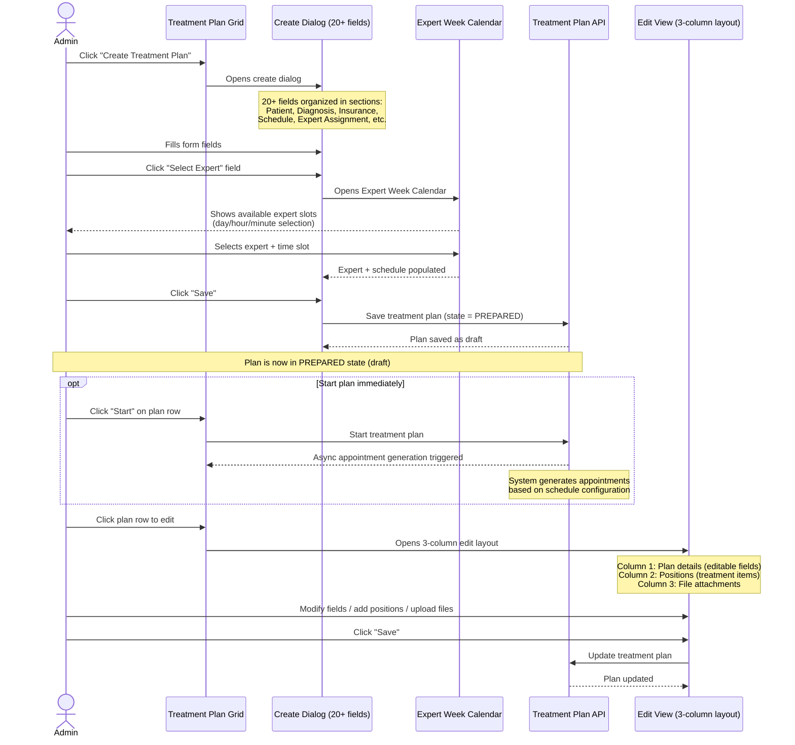
```mermaid
sequenceDiagram
    actor Admin
    participant Grid as Treatment Plan Grid
    participant CreateDlg as Create Dialog (20+ fields)
    participant WeekCal as Expert Week Calendar
    participant API as Treatment Plan API
    participant EditView as Edit View (3-column layout)

    Admin->>Grid: Click "Create Treatment Plan"
    Grid->>CreateDlg: Opens create dialog

    Note over CreateDlg: 20+ fields organized in sections:<br/>Patient, Diagnosis, Insurance,<br/>Schedule, Expert Assignment, etc.

    Admin->>CreateDlg: Fills form fields

    Admin->>CreateDlg: Click "Select Expert" field
    CreateDlg->>WeekCal: Opens Expert Week Calendar
    WeekCal-->>Admin: Shows available expert slots<br/>(day/hour/minute selection)
    Admin->>WeekCal: Selects expert + time slot
    WeekCal-->>CreateDlg: Expert + schedule populated

    Admin->>CreateDlg: Click "Save"
    CreateDlg->>API: Save treatment plan (state = PREPARED)
    API-->>CreateDlg: Plan saved as draft

    Note over Admin, API: Plan is now in PREPARED state (draft)

    opt Start plan immediately
        Admin->>Grid: Click "Start" on plan row
        Grid->>API: Start treatment plan
        API-->>Grid: Async appointment generation triggered

        Note over API: System generates appointments<br/>based on schedule configuration
    end

    Admin->>Grid: Click plan row to edit
    Grid->>EditView: Opens 3-column edit layout

    Note over EditView: Column 1: Plan details (editable fields)<br/>Column 2: Positions (treatment items)<br/>Column 3: File attachments

    Admin->>EditView: Modify fields / add positions / upload files
    Admin->>EditView: Click "Save"
    EditView->>API: Update treatment plan
    API-->>EditView: Plan updated
```

**Interaction highlights:**

- The **create dialog** has **20+ fields** organized into logical sections. This is one of the most complex forms in the system.
- **Expert selection** uses a **week calendar** component that provides bidirectional sync — selecting an expert populates day/hour/minute fields, and vice versa.
- **Save** creates the plan in **PREPARED (draft)** state. The plan is not active until explicitly started.
- **Start** triggers **async appointment generation** based on the schedule configuration. This is a background process.
- The **edit view** uses a **3-column layout**: plan details, positions (treatment items), and file attachments. This provides a comprehensive overview of the plan.
- The expert week calendar provides **bidirectional sync** with the day/hour/minute fields on the create/edit form.

---

## Area 10: Warning / Allergy CRUD Flow

### Context

The Warning module manages clinical warnings and allergies for patients. Warnings are categorized by a WarningType enum and are displayed across the system via shared WarningTypeBadge components in consultation review and view screens.

**Who uses it:** Clinical staff managing patient safety information.

**Entry point:** User navigates to the Warning list view.

**Exit points:** Warning record created, updated, or deleted; badge displayed in related views.

---

### 10.1 Warning / Allergy CRUD — Flowchart

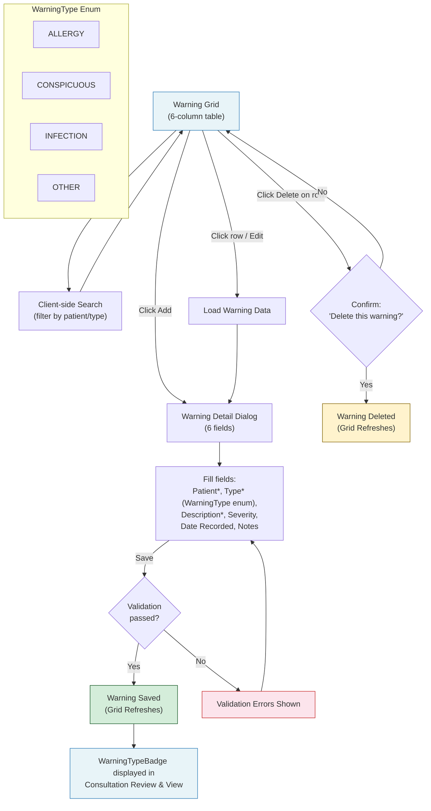
```mermaid
flowchart TD
    A["Warning Grid<br>(6-column table)"] --> B["Client-side Search<br>(filter by patient/type)"]
    B --> A

    A -->|"Click Add"| C["Warning Detail Dialog<br>(6 fields)"]
    A -->|"Click row / Edit"| D["Load Warning Data"]
    D --> C

    C --> C1["Fill fields:<br>Patient*, Type* (WarningType enum),<br>Description*, Severity,<br>Date Recorded, Notes"]
    C1 -->|"Save"| E{"Validation<br>passed?"}
    E -->|"Yes"| F["Warning Saved<br>(Grid Refreshes)"]
    E -->|"No"| G["Validation Errors Shown"]
    G --> C1

    A -->|"Click Delete on row"| H{"Confirm:<br>'Delete this warning?'"}
    H -->|"Yes"| I["Warning Deleted<br>(Grid Refreshes)"]
    H -->|"No"| A

    subgraph "WarningType Enum"
        WT1["ALLERGY"]
        WT2["CONSPICUOUS"]
        WT3["INFECTION"]
        WT4["OTHER"]
    end

    F --> J["WarningTypeBadge displayed in<br>Consultation Review & View"]

    style A fill:#e8f4f8,stroke:#2c7bb6
    style F fill:#d4edda,stroke:#155724
    style I fill:#fff3cd,stroke:#856404
    style G fill:#fce4ec,stroke:#c62828
    style J fill:#e8f4f8,stroke:#2c7bb6
```

**Key observations:**

- The grid has **6 columns** for a concise warning summary.
- The detail dialog has **6 fields** including the **WarningType enum** which constrains type to `ALLERGY`, `CONSPICUOUS`, `INFECTION`, or `OTHER`.
- Warnings are surfaced across the system via a **shared WarningTypeBadge** component displayed in consultation review and view screens.
- Standard CRUD pattern with client-side search and delete confirmation.

---

## Area 11: Appointment Patient Tab Flow

### Context

Within the appointment detail view, the Patient tab provides a focused interface for managing patients associated with an appointment. Patients are added by bookNumber, can be sorted within the collection, and have file attachment support. The tab also displays a read-only list of related treatments.

**Who uses it:** Clinical staff managing patient assignments within an appointment.

**Entry point:** User opens the Patient tab within an appointment detail view.

**Exit points:** Patients added, edited, or removed from the appointment; files managed.

---

### 11.1 Appointment Patient Tab — Flowchart

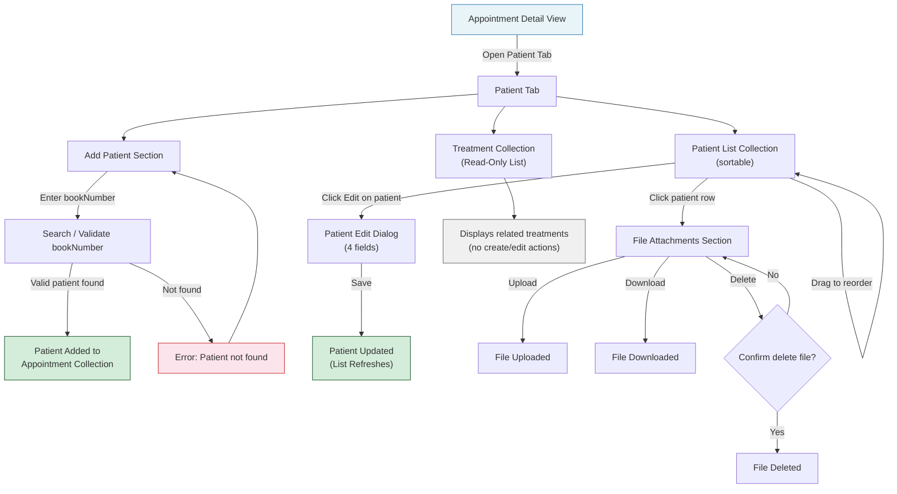
```mermaid
flowchart TD
    A["Appointment Detail View"] -->|"Open Patient Tab"| B["Patient Tab"]

    B --> C["Add Patient Section"]
    C -->|"Enter bookNumber"| D["Search / Validate bookNumber"]
    D -->|"Valid patient found"| E["Patient Added to<br>Appointment Collection"]
    D -->|"Not found"| F["Error: Patient not found"]
    F --> C

    B --> G["Patient List Collection<br>(sortable)"]
    G -->|"Drag to reorder"| G
    G -->|"Click Edit on patient"| H["Patient Edit Dialog<br>(4 fields)"]
    H -->|"Save"| I["Patient Updated<br>(List Refreshes)"]

    G -->|"Click patient row"| J["File Attachments Section"]
    J -->|"Upload"| K["File Uploaded"]
    J -->|"Download"| L["File Downloaded"]
    J -->|"Delete"| M{"Confirm delete file?"}
    M -->|"Yes"| N["File Deleted"]
    M -->|"No"| J

    B --> O["Treatment Collection<br>(Read-Only List)"]
    O --> P["Displays related treatments<br>(no create/edit actions)"]

    style A fill:#e8f4f8,stroke:#2c7bb6
    style E fill:#d4edda,stroke:#155724
    style I fill:#d4edda,stroke:#155724
    style F fill:#fce4ec,stroke:#c62828
    style P fill:#f0f0f0,stroke:#666
```

**Key observations:**

- Patients are added by **bookNumber** — the same cross-entity identifier used throughout the system.
- The **patient list collection is sortable** — users can drag to reorder patients within the appointment.
- The **edit dialog** has **4 fields** for inline patient record adjustments.
- **File attachments** support full CRUD: upload, download, and delete with confirmation.
- The **treatment collection** is strictly **read-only** — treatments are managed through treatment plans (Area 8), not from the appointment patient tab.

---

## Interdependencies Summary

| Factor | Affects | How |
|---|---|---|
| **Appointment location** | Wizard routing | Determines which of the 3 wizard paths the user enters (Location Wizard, BasisWeb Wizard, Consultation Wizard) |
| **Location patientDataType** | Wizard routing + type filtering | `EXTERNAL_BASISWEB` routes to BasisWeb; `EXTERNAL` enables EXTERNAL consultation type |
| **Appointment state** | BasisWeb routing | `LOCKEDIN` state bypasses BasisWeb wizard even for EXTERNAL_BASISWEB locations |
| **Appointment patients list** | Step 1 behavior | Non-empty list shows patient dropdown; empty list skips to manual book number |
| **Job capability flags** | Step 3 type options | `consultationStandard`, `consultationOnboarding`, `consultationIncarceration`, etc. control which types appear |
| **Job defaultConsultation** | Step 3 pre-selection | Sets the initially selected consultation type |
| **Location booknumberMask** | Step 2 input mask | Dynamic input mask applied to the book number field |
| **COUNCIL appointment type** | Step 1 special behavior | Patient selection auto-fills and locks location field |
| **Appointment type** | Summarize dialog title | APPOINTMENT → "Appointment", SHIFT/COUNCIL → "Shift" |
| **External location + control active** | Summarize vs End | External locations with active control show Summarize; others show End Appointment |
| **Job remoteCode (psych)** | QM visibility | Hides equipment ratings and referral question for psychiatric jobs |
| **Consultation type (EXTERNAL)** | QM referral question | Hides the referral probability question |
| **Equipment rating values (5-6)** | Comment requirement | Poor equipment ratings trigger mandatory feedback textarea |
| **Saved QM equipment values** | Equipment section visibility | Ratings > 0 auto-expand the equipment section |
| **Previous retrieval date** | Incarceration warning | Shows danger alert when the record was already retrieved |
| **Zip code auto-lookup** | Address form | Auto-fills state and city after zip code entry |
| **QM questionnaire embed** | Summarize + End dialogs | Both dialogs include the same QM form; `filterQm()` adjusts it based on context |
| **Template mode flag** | Consultation Details behavior | Templates open Consultation Details with `template=true`, enabling template-specific fields |
| **Treatment state** | Available actions | Create/Edit/Start/Storno/Cancel gated by state machine (12-state lifecycle) |
| **History mode** | UI actions | `?history=true` hides create and apply-plan buttons |
| **Expert week calendar** | Treatment scheduling | Bidirectional sync with day/hour/minute fields on treatment plan create/edit |
| **Warning type** | Consultation views | Shared WarningTypeBadge displayed in consultation review/view |
| **Patient bookNumber** | Cross-entity | Links patient data across appointments, consultations, and treatment plans |

---

## Wireframe Screenshots

### Area 1: Consultation Start — Wizard & Location

#### W7: Location Wizard (Single-Step)
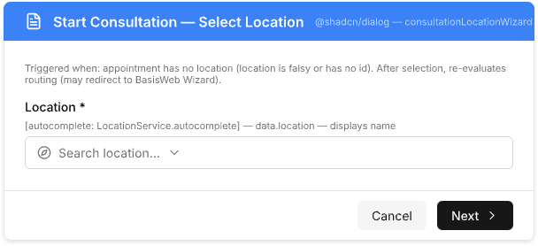

#### W5: Consultation Wizard — Step 1 (Patient Select)
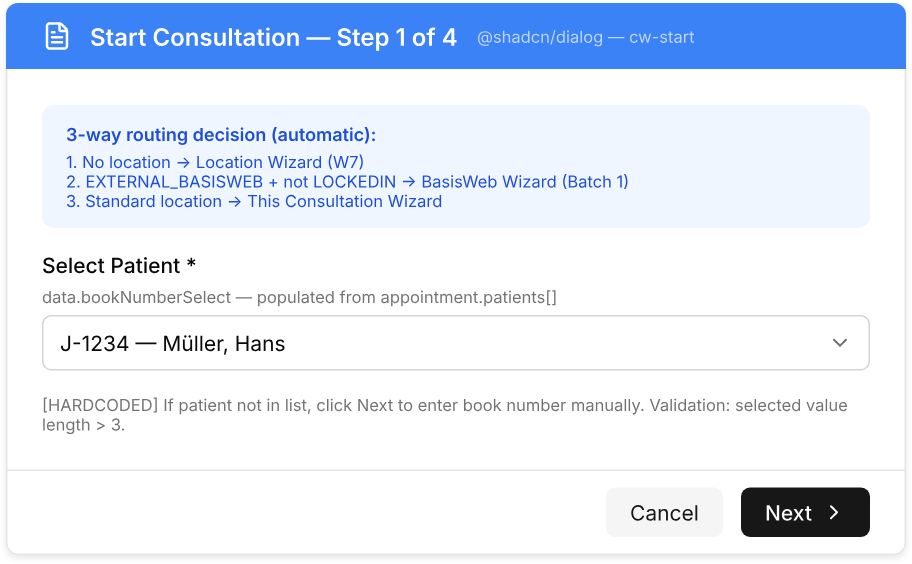

#### W5: Consultation Wizard — Step 2 (Book Number)
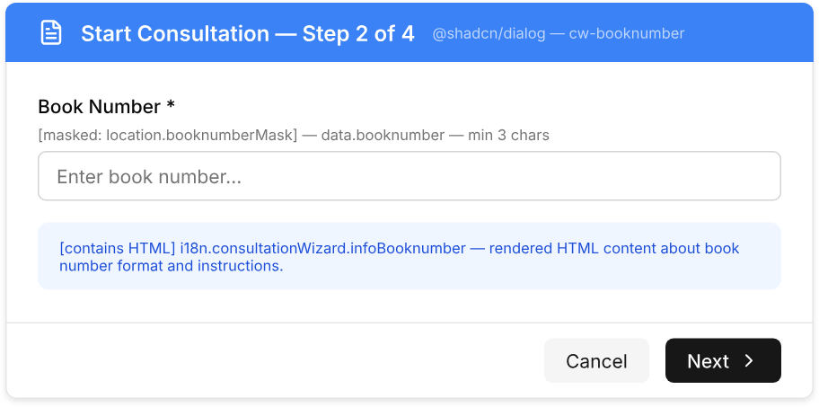

#### W5: Consultation Wizard — Step 3 (Consultation Type)
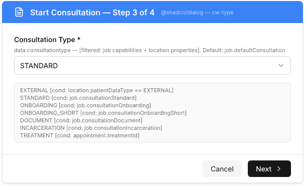

#### W5: Consultation Wizard — Step 4 (Summary & Confirm)
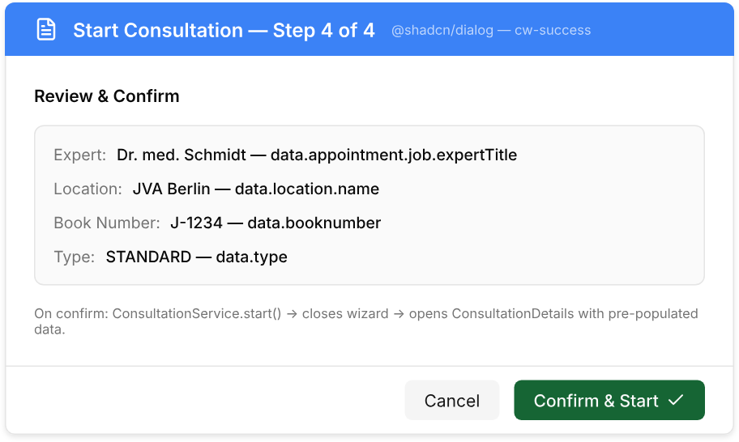

---

### Area 2: Appointment Summarization & End

#### W11: Summarize Appointment (1000px)
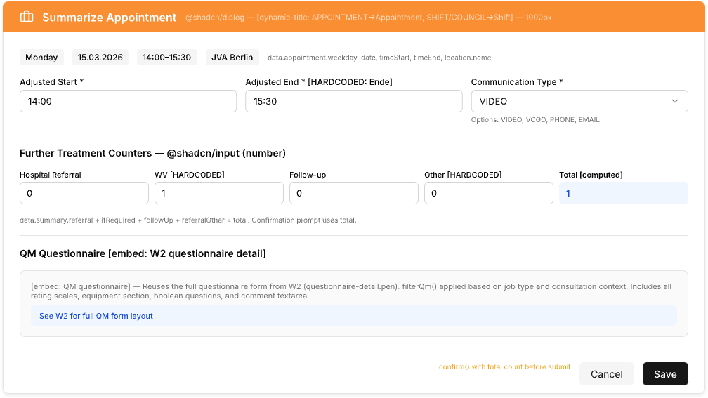

#### W13b: End Appointment (900px)
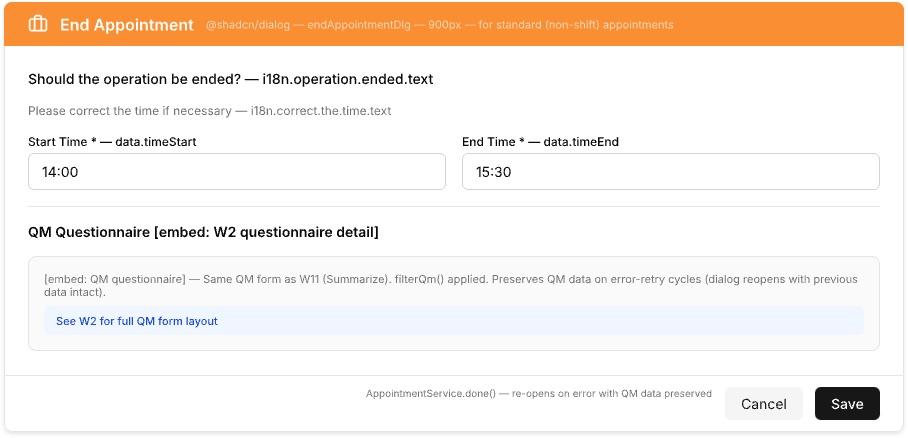

---

### Area 3: Incarceration Retrieval

#### W12-A: Incarceration Check Dialog
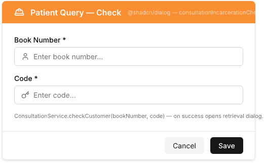

#### W12-B: Incarceration Retrieval Dialog
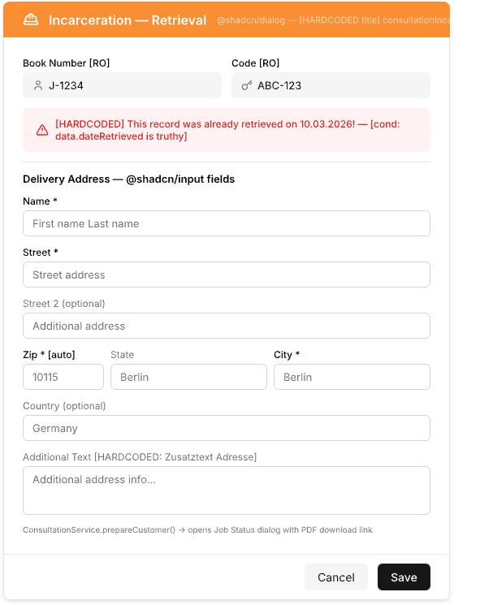

---

### Area 4: Consultation Template Management

#### W9-A: Template List Panel (400px)
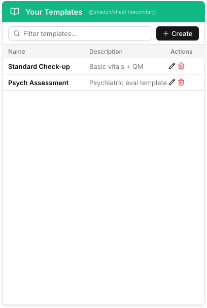

#### W9-B: Create Template Dialog
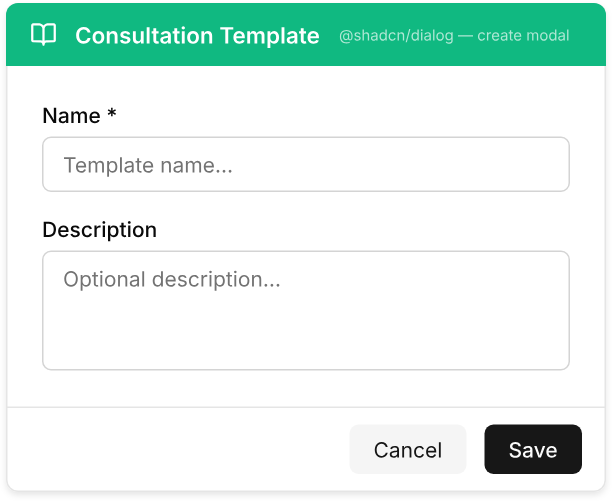

---

### Questionnaire Module

#### W1: Questionnaire List (1440px Full Page)
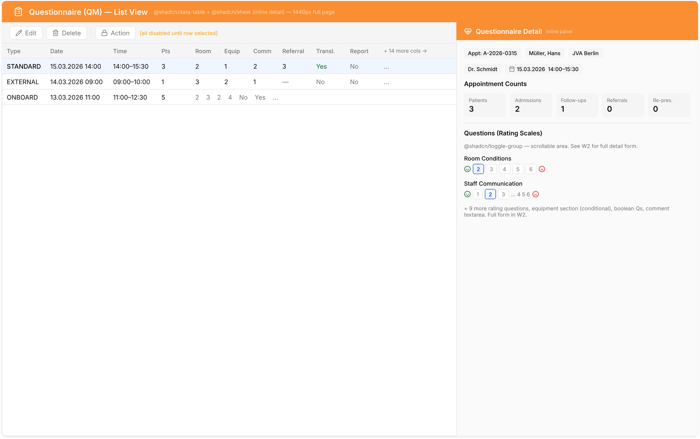

#### W2: Questionnaire Detail (800px Form)
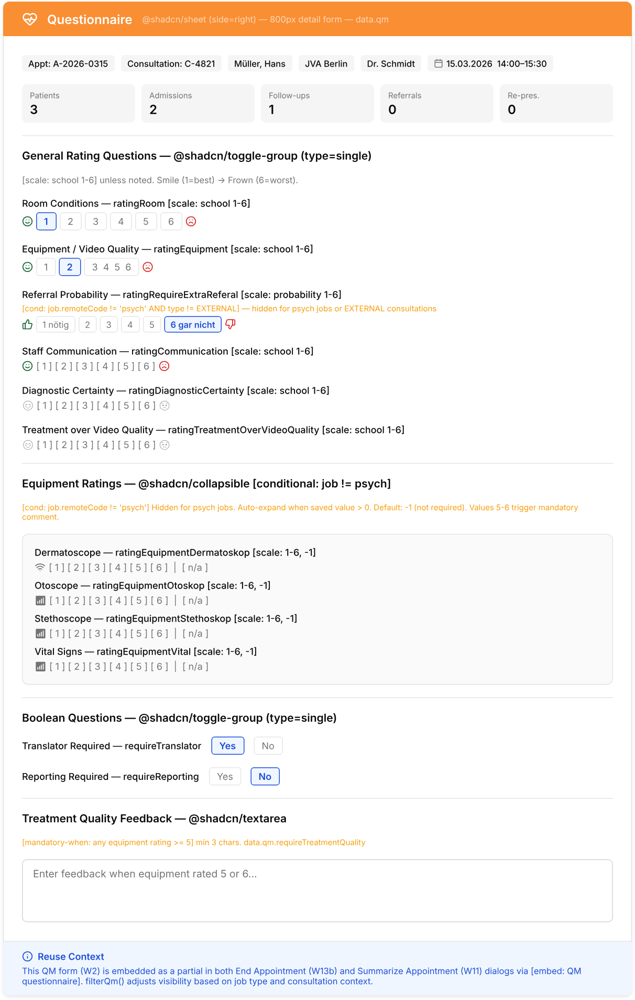

---

### Area 5: Medication CRUD

#### W21: Medication Grid (1440px Full Page)
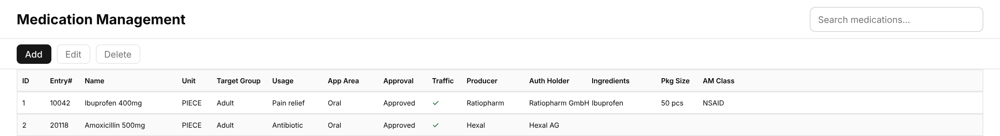

1440px full-page view with 14-column medication grid, search bar, and Add/Edit/Delete toolbar.

#### W21b: Medication Detail (600px Dialog)
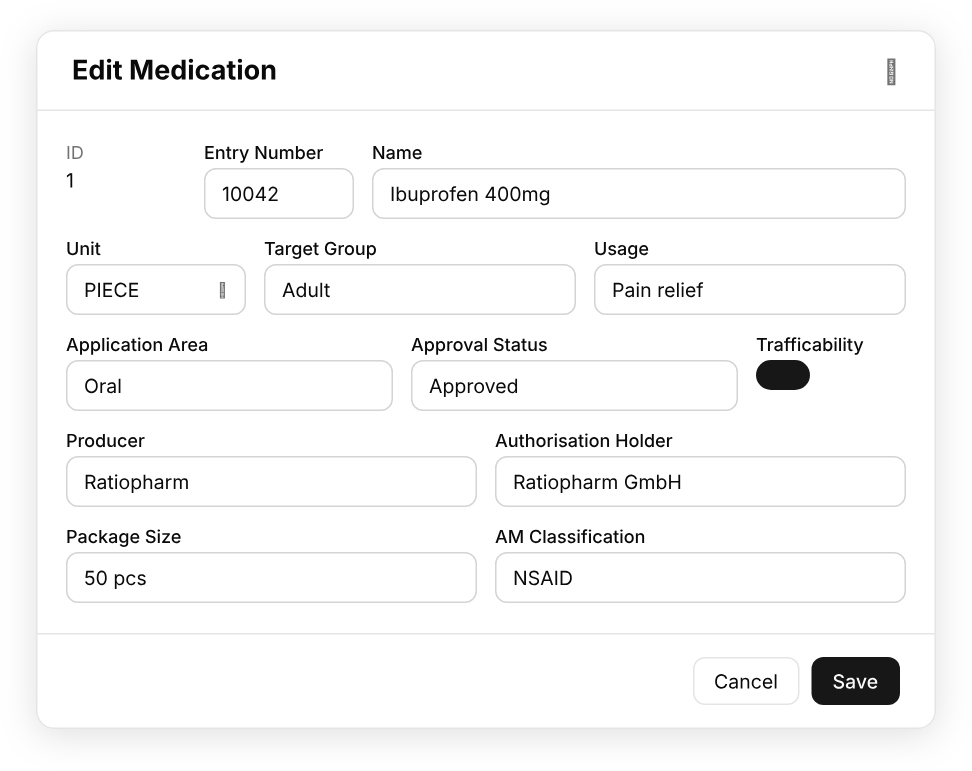

600px dialog with 13 fields in rows: ID, entryNumber, name, unit select (MedicationUnit enum: PIECE/IE), targetGroup, usage, appArea, approval, trafficability switch, producer, authHolder, pkgSize, amClass.

---

### Area 6: Patient Data Management

#### W22: Patient Data Grid (1440px Full Page)
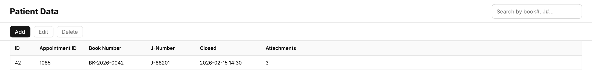

1440px full-page view with 6-column patient data grid and client-side search.

#### W22b: Patient Data Detail (600px Dialog)
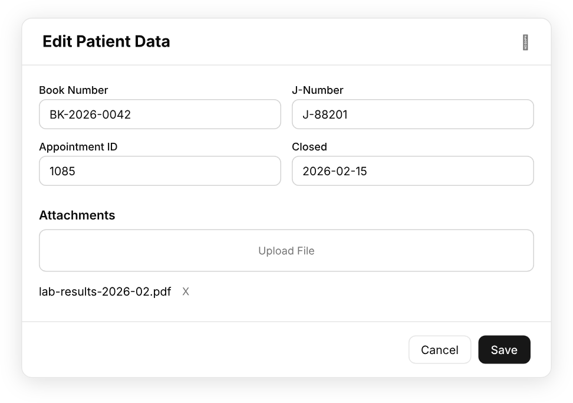

600px dialog with 5 fields (bookNumber, jNumber, appointmentId, closed date) plus file attachments section.

---

### Area 7: Treatment List & Category

#### W23a: Treatment MonthTable (1440px Calendar)
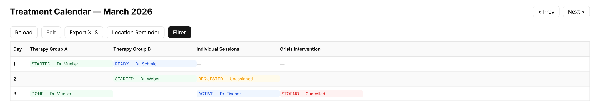

1440px calendar grid with days as rows, jobs as columns, and state-colored treatment entries. Filter controls for day/job/state. Export XLS button. Location Reminder dialog (start date + days). Read-only — treatments cannot be created from this view. Clicking a cell opens the shared appointment detail panel.

#### W23b: Treatment Category (600px Dialog)
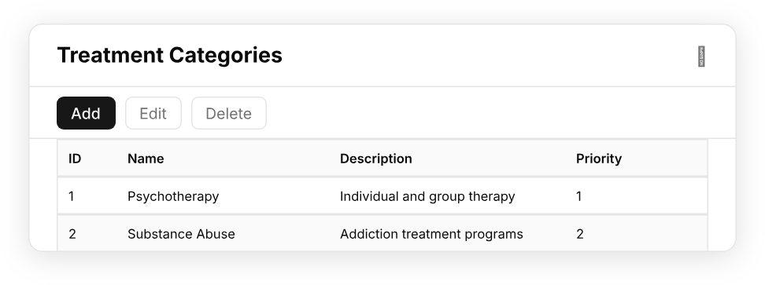

600px dialog with 4-column grid (id, name, description, prio) and Add/Edit/Delete toolbar. Simple administrative category management.

---

### Area 8–9: Treatment Plan Management

#### W24a: Treatment Plan Grid (1440px Full Page)
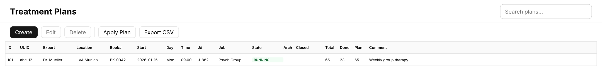

1440px view with 17-column grid, TreatmentState badges, and Create/Edit/Delete/Apply Plan/Export CSV toolbar. Actions gated by the 12-state lifecycle (PREPARED → CLOSED, CANCELED, STORNO branches). History mode toggle hides create/apply-plan buttons.

#### W24b: Treatment Plan Create (1100px Dialog)
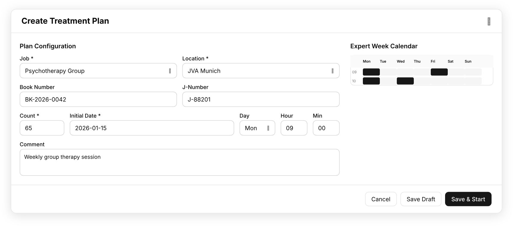

1100px 2-column dialog: left column contains plan config fields (patient, diagnosis, insurance, schedule, expert assignment), right column contains expert week calendar grid with bidirectional day/hour/minute sync. Save creates plan in PREPARED (draft) state.

---

### Area 10: Warning / Allergy CRUD

#### W25: Warning Grid (1440px Full Page)
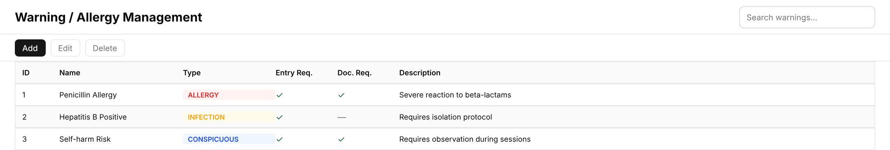

1440px view with 6-column grid, WarningType badges (ALLERGY/INFECTION/CONSPICUOUS), and search bar.

#### W25b: Warning Detail (600px Dialog)
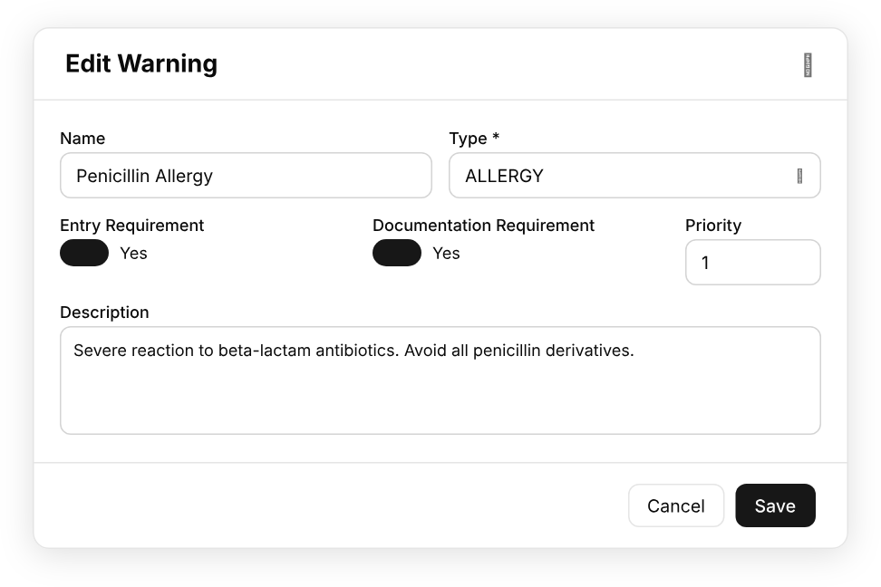

600px dialog with 6 fields: name, type select (WarningType enum), entryReq switch, docReq switch, priority, and description textarea.

---

### Area 11: Appointment Patient Tab

#### W20: Appointment Details Patient Tab (1000px Dialog)
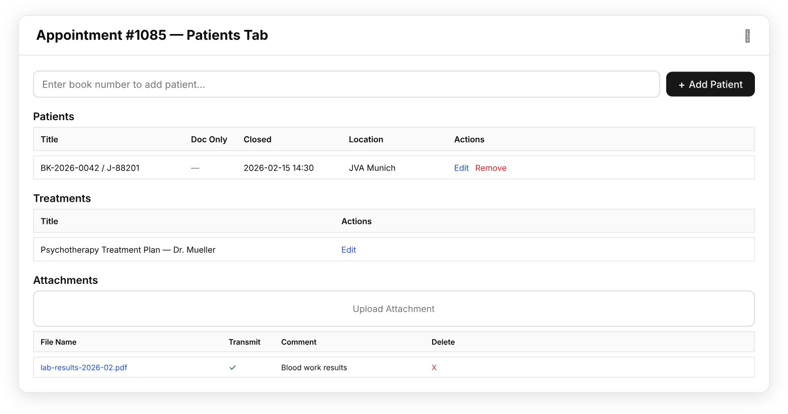

1000px dialog showing patient add input, patients collection table (5 columns), treatments collection (2 columns), and attachments section with upload/download/transmit/delete actions.

---

### Annotations

Design annotations extracted from wireframe `.pen` files. These capture behavioral details, conditional logic, and implementation notes that supplement the workflow diagrams above.

#### Questionnaire Module

| Wireframe | Annotation | Note |
|:---|:---|:---|
| questionnaire-list.pen | Grid Note | 24 total columns — showing representative subset. Horizontal scroll for overflow. |
