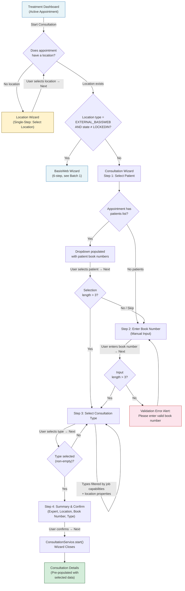
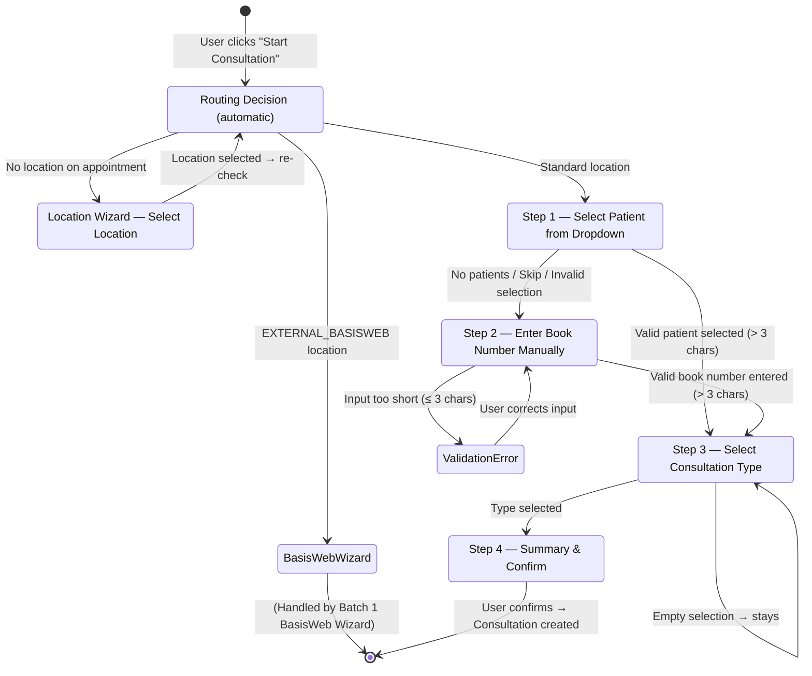
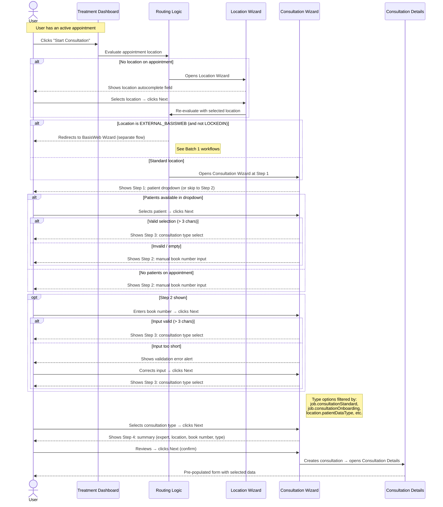
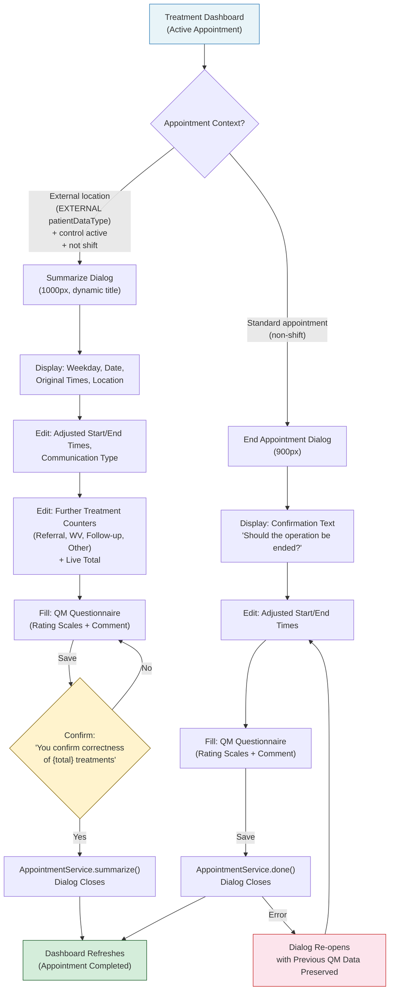
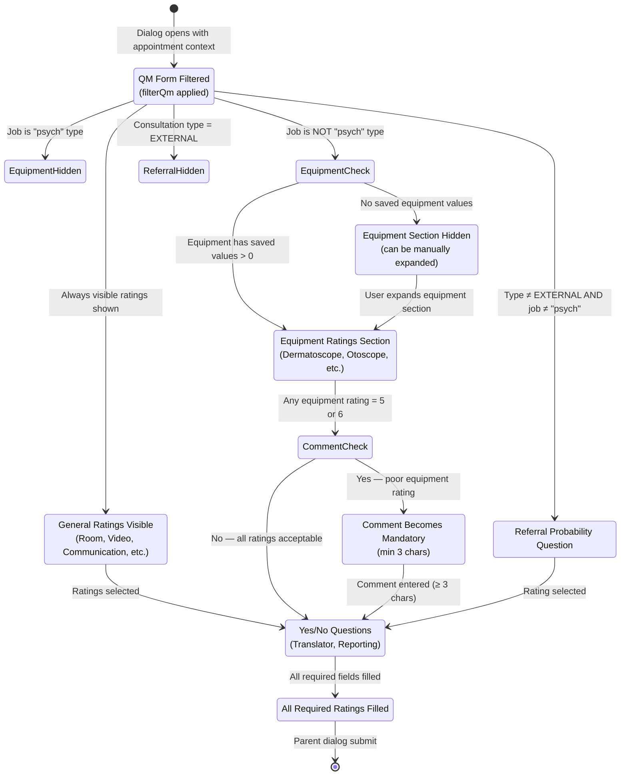
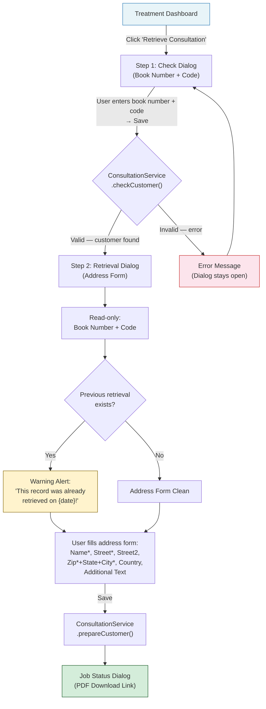
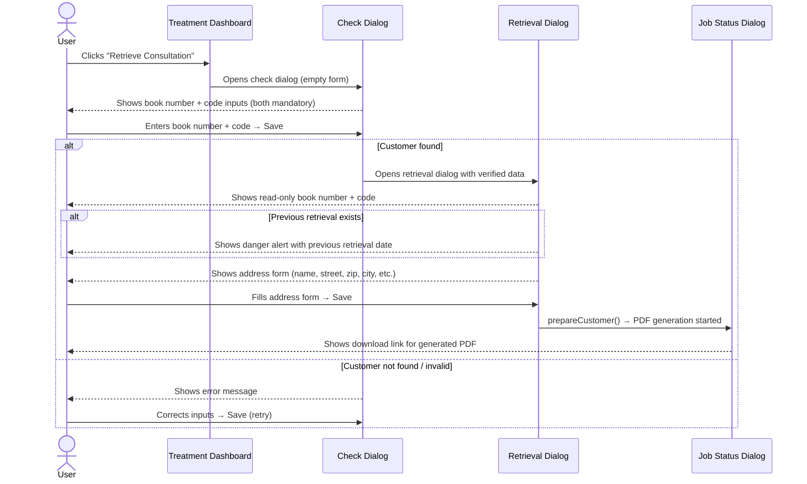
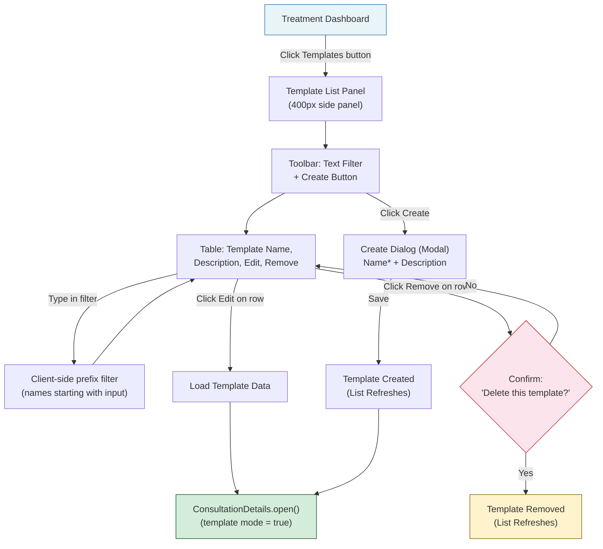

# Treatment Domain -- User Workflows

This document describes the user experience and decision flows for the Treatment domain: Questionnaire (QM) completion, Consultation Start (wizard + routing), Appointment Summarization, and Incarceration retrieval. All diagrams represent the journey from the user's perspective, not internal system architecture.

---

## Area 1: Consultation Start — Wizard Routing & Patient Selection

### Context

When a clinical staff member wants to start a new consultation for an active appointment, the system must determine the correct wizard path based on the appointment's location configuration. This is a 3-way routing decision that the user does not directly control — the system evaluates it automatically and presents the appropriate wizard.

**Who uses it:** Clinical staff members (nurses, therapists, doctors) working from the treatment dashboard within an active appointment.

**Entry point:** User clicks "Start Consultation" on an active appointment from the treatment dashboard.

**Exit points:** The wizard closes and hands off to the Consultation Details form, with the selected patient, book number, consultation type, and location pre-populated.

---

### 1.1 Consultation Start — Routing Flowchart

This diagram shows the 3-way routing decision and the full consultation wizard flow from the user's perspective.

**Key observations:**

- The 3-way routing is fully automatic: the user sees only the wizard path that applies to their appointment's configuration.
- The **Location Wizard** is a recursive entry point — once the user selects a location, the routing check repeats with the new location.
- The **BasisWeb Wizard** (Batch 1) is an entirely separate flow for external patient data retrieval; it is NOT part of this consultation wizard.
- The patient dropdown in Step 1 is pre-populated from the appointment's patient list. If the list is empty, the user skips directly to manual book number entry.
- **COUNCIL appointment type** has special behavior: selecting a patient auto-fills and locks the location from the patient's associated location data.

---

### 1.2 Consultation Wizard — State Diagram

This diagram models the wizard states and transitions as experienced by the user.

**State transition notes:**

- **RoutingCheck** is an automatic decision state — the user never sees it as a screen; they see the result (one of three wizard paths).
- **LocationWizard** loops back to RoutingCheck because the location selection may change the routing outcome.
- **SelectPatient** and **EnterBookNumber** are the two patient identification paths. They converge at **SelectType**.
- **SelectType** dynamically filters its options based on the user's job capabilities. Not all 7 consultation types are available to every user.
- **ReviewSummary** is the terminal confirmation state before the consultation is created.

---

### 1.3 Consultation Wizard — Sequence Diagram

This diagram shows the user-system interaction during the consultation wizard, including the routing decision.

**Interaction highlights:**

- The routing decision is invisible to the user — they click one button and the system determines the path.
- Step 3 (type selection) is the critical filtering point: the available options depend on the user's job entity and the appointment's location properties. This means two users with different jobs may see different type options for the same appointment.
- The wizard accumulates state across steps (`appointment`, `location`, `job`, `booknumber`, `type`) and submits everything at once in Step 4.
- After submission, the wizard closes and `ConsultationDetails.open(data)` is called, seamlessly transitioning the user to the full consultation form.

---

## Area 2: Appointment Summarization & End Appointment

### Context

When a clinical staff member finishes working on an appointment, they use one of two dialogs depending on the appointment context:

- **Summarize Appointment** — used for external-location appointments. A comprehensive dialog capturing adjusted times, communication type, further treatment counters, and a QM questionnaire.
- **End Appointment** — used for standard (non-shift) appointments. A simpler dialog confirming end with adjusted times and a QM questionnaire.

Both dialogs embed the same QM questionnaire form, making quality management data collection an integral part of the appointment closure flow.

**Who uses it:** Clinical staff members completing an appointment.

**Entry point:** User clicks "Summarize" or "End Appointment" on an active appointment from the treatment dashboard.

**Exit points:** Dashboard refreshes with the appointment marked as completed, or dialog re-opens on error.

---

### 2.1 Summarize / End Appointment — Flowchart

**Key observations:**

- The **Summarize** dialog has a dynamic title that changes based on appointment type: "Appointment" for APPOINTMENT, "Shift" for SHIFT or COUNCIL.
- The further treatment counters (referral, WV, follow-up, referral-other) have a **live computed total** that updates as the user types. This total is shown in the confirmation prompt.
- The confirmation prompt for Summarize includes a HARDCODED German legal text about data correctness and administrative-only subsequent changes.
- The **End Appointment** dialog preserves QM data across error-retry cycles — if the save fails, the dialog reopens with the user's previously entered questionnaire data intact.
- Both dialogs apply `filterQm()` before displaying the QM section, which adjusts visible rating questions based on job type and consultation context.

---

### 2.2 QM Questionnaire Completion — State Diagram

This diagram models the QM questionnaire sub-flow that is embedded in both the Summarize and End Appointment dialogs.

**State transition notes:**

- **FilterApplied** runs automatically when the dialog opens. It evaluates job type and consultation type to determine which questions are visible.
- **Equipment ratings** are hidden by default and only auto-expand when they have saved values > 0. For psych-type jobs, they are permanently hidden.
- The **referral probability question** is hidden under two conditions: EXTERNAL consultation type OR psych job type (it carries both `qmphysical` and `qmexternal` CSS classes).
- **Comment mandatory trigger** is dynamic: rating any equipment item at 5 ("poor") or 6 ("inadequate") immediately makes the feedback textarea required with a minimum of 3 characters.

---

## Area 3: Incarceration Consultation Retrieval

### Context

The incarceration retrieval flow allows staff to look up and retrieve medical examination data for incarcerated individuals. It is a two-step process: first verify the book number and code, then fill in the target person's address for document delivery.

**Who uses it:** Clinical staff with access to the "Retrieve Consultation" menu item on the treatment dashboard.

**Entry point:** User clicks "Retrieve Consultation" (`#retrieveConsultationMenuBtn`) on the treatment dashboard.

**Exit points:** A PDF document is generated and available for download via the Job Status dialog.

---

### 3.1 Incarceration Retrieval — Flowchart

**Key observations:**

- This is a strictly sequential two-step flow: the check dialog must succeed before the retrieval dialog opens.
- The retrieval dialog shows the verified book number and code as **read-only** fields, preventing accidental modification after verification.
- The **previous retrieval warning** is a dangerous-red alert that appears when the same record has been retrieved before, including the exact date. This is a safeguard against duplicate retrievals.
- The zip code field has a `searchZipCode` class that triggers auto-lookup for state and city, reducing manual data entry.
- The final output is a PDF document available through the standard Job Status dialog (async generation pattern).

---

### 3.2 Incarceration Retrieval — Sequence Diagram

---

## Area 4: Consultation Template Management

### Context

Consultation templates allow clinical staff to save and reuse pre-configured consultation structures. Templates are managed through a list panel accessible from the treatment dashboard, with options to create, edit, and delete templates.

**Who uses it:** Clinical staff (experts) who frequently create similar consultation types.

**Entry point:** User clicks the "Templates" button on the treatment dashboard.

**Exit points:** User opens a template in Consultation Details (for editing), or closes the template panel.

---

### 4.1 Consultation Template — Flowchart

**Key observations:**

- The template list is a **side panel** (400px, secondary target), not a modal dialog. It coexists with the main dashboard view.
- The text filter is **client-side only** using prefix matching (`name.toLowerCase().startsWith(value)`). No server-side search is needed.
- Both **Create** and **Edit** actions end by opening Consultation Details in template mode. The difference is that Create first saves a blank template, while Edit loads an existing one.
- The **Remove** action requires explicit confirmation before deletion. After removal, the list refreshes automatically.

---

## Interdependencies Summary

| Factor | Affects | How |
|---|---|---|
| **Appointment location** | Wizard routing | Determines which of the 3 wizard paths the user enters (Location Wizard, BasisWeb Wizard, Consultation Wizard) |
| **Location patientDataType** | Wizard routing + type filtering | `EXTERNAL_BASISWEB` routes to BasisWeb; `EXTERNAL` enables EXTERNAL consultation type |
| **Appointment state** | BasisWeb routing | `LOCKEDIN` state bypasses BasisWeb wizard even for EXTERNAL_BASISWEB locations |
| **Appointment patients list** | Step 1 behavior | Non-empty list shows patient dropdown; empty list skips to manual book number |
| **Job capability flags** | Step 3 type options | `consultationStandard`, `consultationOnboarding`, `consultationIncarceration`, etc. control which types appear |
| **Job defaultConsultation** | Step 3 pre-selection | Sets the initially selected consultation type |
| **Location booknumberMask** | Step 2 input mask | Dynamic input mask applied to the book number field |
| **COUNCIL appointment type** | Step 1 special behavior | Patient selection auto-fills and locks location field |
| **Appointment type** | Summarize dialog title | APPOINTMENT → "Appointment", SHIFT/COUNCIL → "Shift" |
| **External location + control active** | Summarize vs End | External locations with active control show Summarize; others show End Appointment |
| **Job remoteCode (psych)** | QM visibility | Hides equipment ratings and referral question for psychiatric jobs |
| **Consultation type (EXTERNAL)** | QM referral question | Hides the referral probability question |
| **Equipment rating values (5-6)** | Comment requirement | Poor equipment ratings trigger mandatory feedback textarea |
| **Saved QM equipment values** | Equipment section visibility | Ratings > 0 auto-expand the equipment section |
| **Previous retrieval date** | Incarceration warning | Shows danger alert when the record was already retrieved |
| **Zip code auto-lookup** | Address form | Auto-fills state and city after zip code entry |
| **QM questionnaire embed** | Summarize + End dialogs | Both dialogs include the same QM form; `filterQm()` adjusts it based on context |
| **Template mode flag** | Consultation Details behavior | Templates open Consultation Details with `template=true`, enabling template-specific fields |

---

## Wireframe Screenshots

### Area 1: Consultation Start — Wizard & Location

#### W7: Location Wizard (Single-Step)

#### W5: Consultation Wizard — Step 1 (Patient Select)

#### W5: Consultation Wizard — Step 2 (Book Number)

#### W5: Consultation Wizard — Step 3 (Consultation Type)

#### W5: Consultation Wizard — Step 4 (Summary & Confirm)

---

### Area 2: Appointment Summarization & End

#### W11: Summarize Appointment (1000px)

#### W13b: End Appointment (900px)

---

### Area 3: Incarceration Retrieval

#### W12-A: Incarceration Check Dialog

#### W12-B: Incarceration Retrieval Dialog

---

### Area 4: Consultation Template Management

#### W9-A: Template List Panel (400px)

#### W9-B: Create Template Dialog

---

### Questionnaire Module

#### W1: Questionnaire List (1440px Full Page)

#### W2: Questionnaire Detail (800px Form)

