---
---

# User Management -- User Workflows

This document describes the user experience and decision flows for the User Management domain. All diagrams represent the journey from the user's perspective, not internal system architecture.

---

## Context

The User Management domain covers staff profile management, expert search, availability scheduling, onboarding, and administrative user operations. It is used by two primary roles:

- **Employees** (EMPLOYEE authority): Can view and edit their own profile (personal data, business data, addresses, education), change their password, and create a digital signature.
- **Administrators** (ADMIN / USERS_UPDATE authority): Can manage all staff profiles, access admin-only tabs (documents, products, availability scheduling), search experts, manage appointment assignments, trigger onboarding, reset passwords, and create invoices.

The profile form is the densest form in the application (1014 lines, 8 tabs, 60+ fields) and is shared between the personal profile page and the staff management list's inline detail panel.

---

## 1. Staff Onboarding Journey

This diagram shows the high-level flow when an administrator onboards a new staff member, from account creation through to full operational readiness.

**Who uses it:** Administrators (ADMIN_INTERN, ADMIN)
**Entry point:** Administrator clicks "Add" on Staff List toolbar
**Exit points:** Staff member is fully onboarded and active, or onboarding is paused/incomplete

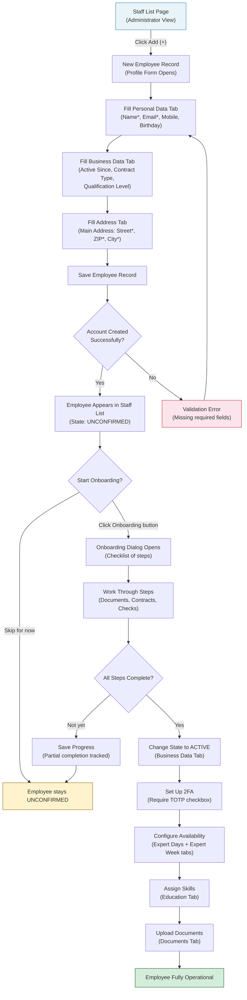
```mermaid
flowchart TD
    A["Staff List Page<br>(Administrator View)"] -->|"Click Add (+)"| B["New Employee Record<br>(Profile Form Opens)"]

    B --> C["Fill Personal Data Tab<br>(Name*, Email*, Mobile, Birthday)"]
    C --> D["Fill Business Data Tab<br>(Active Since, Contract Type,<br>Qualification Level)"]
    D --> E["Fill Address Tab<br>(Main Address: Street*, ZIP*, City*)"]
    E --> F["Save Employee Record"]

    F --> G{"Account Created<br>Successfully?"}
    G -->|"Yes"| H["Employee Appears in Staff List<br>(State: UNCONFIRMED)"]
    G -->|"No"| I["Validation Error<br>(Missing required fields)"]
    I --> C

    H --> J{"Start Onboarding?"}
    J -->|"Click Onboarding button"| K["Onboarding Dialog Opens<br>(Checklist of steps)"]
    J -->|"Skip for now"| L["Employee stays UNCONFIRMED"]

    K --> M["Work Through Steps<br>(Documents, Contracts, Checks)"]
    M --> N{"All Steps Complete?"}
    N -->|"Yes"| O["Change State to ACTIVE<br>(Business Data Tab)"]
    N -->|"Not yet"| P["Save Progress<br>(Partial completion tracked)"]
    P --> L

    O --> Q["Set Up 2FA<br>(Require TOTP checkbox)"]
    Q --> R["Configure Availability<br>(Expert Days + Expert Week tabs)"]
    R --> S["Assign Skills<br>(Education Tab)"]
    S --> T["Upload Documents<br>(Documents Tab)"]
    T --> U["Employee Fully Operational"]

    style A fill:#e8f4f8,stroke:#2c7bb6
    style U fill:#d4edda,stroke:#155724
    style I fill:#fce4ec,stroke:#c62828
    style L fill:#fff3cd,stroke:#856404
```

**Key observations:**

- The onboarding process is non-linear -- administrators can complete steps in any order and save partial progress.
- The profile form's 8 tabs map to distinct onboarding phases: identity (Personal), employment (Business), location (Address), qualifications (Education), compliance (Documents), billing (Products), and scheduling (Expert Days/Week).
- State transitions (UNCONFIRMED -> ACTIVE) are manual via the Business Data tab's state dropdown.
- 2FA enforcement is a separate admin decision made via the `requireTotp` checkbox.

---

## 2. Profile Editing State Diagram

This diagram models the states a staff profile editing session can be in, from the user's perspective.

**Who uses it:** Both employees (own profile) and administrators (any profile)

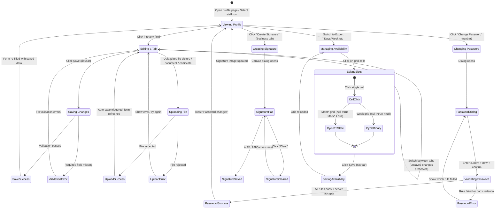
```mermaid
stateDiagram-v2
    [*] --> ViewingProfile: Open profile page / Select staff row

    ViewingProfile: Viewing Profile
    EditingTab: Editing a Tab
    SavingProfile: Saving Changes
    UploadingFile: Uploading File
    ChangingPassword: Changing Password
    CreatingSignature: Creating Signature
    ManagingAvailability: Managing Availability

    ViewingProfile --> EditingTab: Click into any field
    ViewingProfile --> ChangingPassword: Click "Change Password" (navbar)
    ViewingProfile --> CreatingSignature: Click "Create Signature" (Business tab)
    ViewingProfile --> ManagingAvailability: Switch to Expert Days/Week tab

    EditingTab --> EditingTab: Switch between tabs (unsaved changes preserved)
    EditingTab --> SavingProfile: Click Save (navbar)
    EditingTab --> UploadingFile: Upload profile picture / document / certificate

    SavingProfile --> SaveSuccess: Validation passes
    SavingProfile --> ValidationError: Required field missing
    SaveSuccess --> ViewingProfile: Form re-filled with saved data

    state SaveSuccess <<choice>>
    state ValidationError <<choice>>

    ValidationError --> EditingTab: Fix validation errors

    UploadingFile --> UploadSuccess: File accepted
    UploadingFile --> UploadError: File rejected
    UploadSuccess --> EditingTab: Auto-save triggered, form refreshed

    state UploadSuccess <<choice>>
    state UploadError <<choice>>

    UploadError --> EditingTab: Show error, try again

    ChangingPassword --> PasswordDialog: Dialog opens
    PasswordDialog --> ValidatingPassword: Enter current + new + confirm
    ValidatingPassword --> PasswordSuccess: All rules pass + server accepts
    ValidatingPassword --> PasswordError: Rule failed or bad credential

    state PasswordSuccess <<choice>>
    state PasswordError <<choice>>

    PasswordSuccess --> ViewingProfile: Toast "Password changed"
    PasswordError --> PasswordDialog: Show which rule failed

    CreatingSignature --> SignaturePad: Canvas dialog opens
    SignaturePad --> SignatureSaved: Click "Sign"
    SignaturePad --> SignatureCleared: Click "Clear"

    state SignatureSaved <<choice>>

    SignatureCleared --> SignaturePad: Canvas reset
    SignatureSaved --> ViewingProfile: Signature image updated

    ManagingAvailability --> EditingSlots: Click on grid cells
    EditingSlots --> SavingAvailability: Click Save (navbar)
    SavingAvailability --> ManagingAvailability: Grid reloaded

    state EditingSlots {
        [*] --> CellClick: Click single cell
        CellClick --> CycleTriState: Month grid (null->true->false->null)
        CellClick --> CycleBinary: Week grid (null->true->null)
        CycleTriState --> [*]
        CycleBinary --> [*]
    }
```

---

## 3. 2FA Setup Experience

This diagram shows the TOTP two-factor authentication setup flow from the user's perspective.

**Who uses it:** Any user whose account has `requireTotp = true`, or users who voluntarily set up 2FA
**Entry point:** User navigates to Security page (`/admin/userSecurity.html`)
**Exit points:** 2FA successfully activated, or user leaves without completing setup

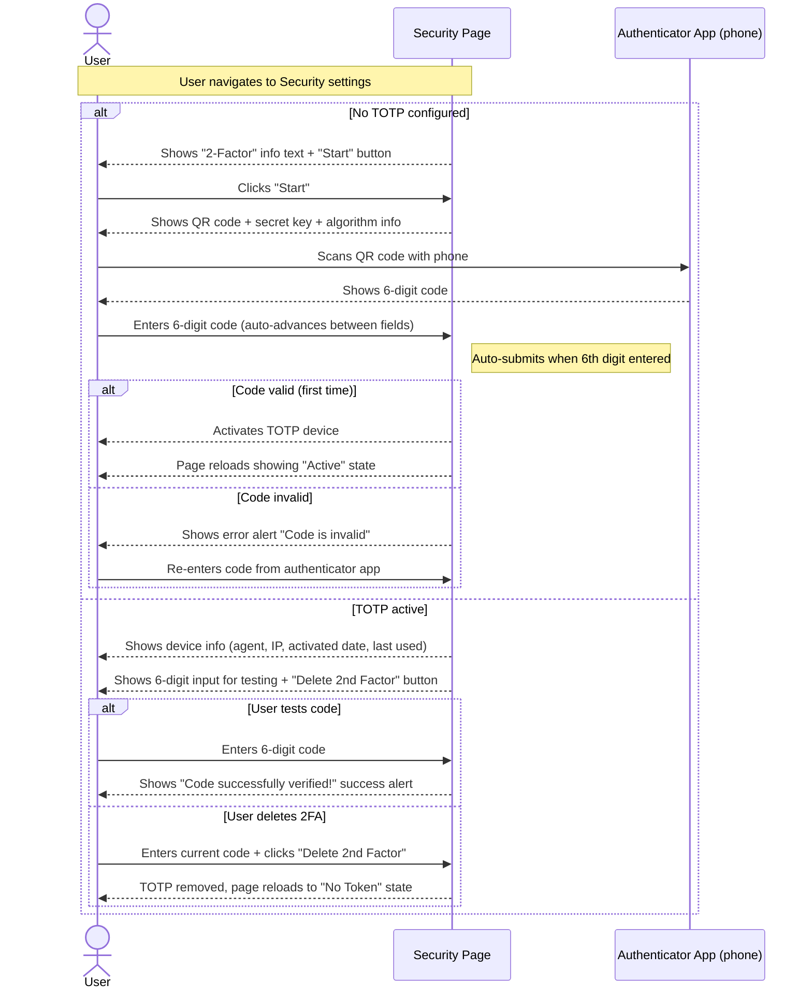
```mermaid
sequenceDiagram
    actor User
    participant SecurityPage as Security Page
    participant AuthApp as Authenticator App (phone)

    Note over User, SecurityPage: User navigates to Security settings

    alt No TOTP configured
        SecurityPage-->>User: Shows "2-Factor" info text + "Start" button
        User->>SecurityPage: Clicks "Start"
        SecurityPage-->>User: Shows QR code + secret key + algorithm info

        User->>AuthApp: Scans QR code with phone
        AuthApp-->>User: Shows 6-digit code

        User->>SecurityPage: Enters 6-digit code (auto-advances between fields)
        Note right of SecurityPage: Auto-submits when 6th digit entered

        alt Code valid (first time)
            SecurityPage-->>User: Activates TOTP device
            SecurityPage-->>User: Page reloads showing "Active" state
        else Code invalid
            SecurityPage-->>User: Shows error alert "Code is invalid"
            User->>SecurityPage: Re-enters code from authenticator app
        end

    else TOTP active
        SecurityPage-->>User: Shows device info (agent, IP, activated date, last used)
        SecurityPage-->>User: Shows 6-digit input for testing + "Delete 2nd Factor" button

        alt User tests code
            User->>SecurityPage: Enters 6-digit code
            SecurityPage-->>User: Shows "Code successfully verified!" success alert
        else User deletes 2FA
            User->>SecurityPage: Enters current code + clicks "Delete 2nd Factor"
            SecurityPage-->>User: TOTP removed, page reloads to "No Token" state
        end
    end
```

**Key observations:**

- The 6-digit split input has specialized UX: auto-focus advancement, paste distribution, backspace navigation, and auto-submit on the 6th digit.
- The QR code is server-generated (`/get/UserService/showToken`) and the secret is displayed in plaintext for manual entry.
- There is no confirmation dialog before deleting 2FA -- this should be addressed in the rebuild.
- The "Generate New Secret" button in the pending state regenerates the QR code (invalidates previous scans).

---

## 4. Expert Search and Assignment Decision Flow

This diagram shows how an administrator finds and assigns experts to appointments.

**Who uses it:** Administrators with USERS_UPDATE authority
**Entry point:** Staff List page -- "Expert Test Search" button or "Appointment Requests" button
**Exit points:** Expert found and navigated to, or assignment accepted/rejected

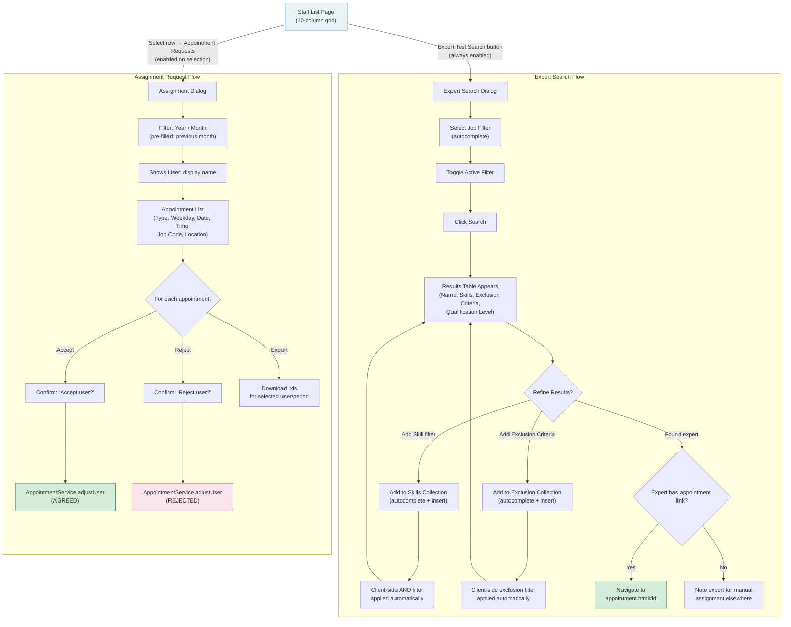
```mermaid
flowchart TD
    A["Staff List Page<br>(10-column grid)"] -->|"Expert Test Search button<br>(always enabled)"| B["Expert Search Dialog"]
    A -->|"Select row → Appointment Requests<br>(enabled on selection)"| C["Assignment Dialog"]

    subgraph "Expert Search Flow"
        B --> D["Select Job Filter<br>(autocomplete)"]
        D --> E["Toggle Active Filter"]
        E --> F["Click Search"]
        F --> G["Results Table Appears<br>(Name, Skills, Exclusion Criteria,<br>Qualification Level)"]

        G --> H{"Refine Results?"}
        H -->|"Add Skill filter"| I["Add to Skills Collection<br>(autocomplete + insert)"]
        I --> J["Client-side AND filter<br>applied automatically"]
        J --> G

        H -->|"Add Exclusion Criteria"| K["Add to Exclusion Collection<br>(autocomplete + insert)"]
        K --> L["Client-side exclusion filter<br>applied automatically"]
        L --> G

        H -->|"Found expert"| M{"Expert has appointment link?"}
        M -->|"Yes"| N["Navigate to<br>appointment.html#id"]
        M -->|"No"| O["Note expert for manual<br>assignment elsewhere"]
    end

    subgraph "Assignment Request Flow"
        C --> P["Filter: Year / Month<br>(pre-filled: previous month)"]
        P --> Q["Shows User: display name"]
        Q --> R["Appointment List<br>(Type, Weekday, Date, Time,<br>Job Code, Location)"]

        R --> S{"For each appointment:"}
        S -->|"Accept"| T["Confirm: 'Accept user?'"]
        T --> U["AppointmentService.adjustUser<br>(AGREED)"]
        S -->|"Reject"| V["Confirm: 'Reject user?'"]
        V --> W["AppointmentService.adjustUser<br>(REJECTED)"]
        S -->|"Export"| X["Download .xls<br>for selected user/period"]
    end

    style A fill:#e8f4f8,stroke:#2c7bb6
    style N fill:#d4edda,stroke:#155724
    style U fill:#d4edda,stroke:#155724
    style W fill:#fce4ec,stroke:#c62828
```

---

## 5. Expert Availability Management

This diagram shows how an administrator manages an expert's monthly and weekly availability schedule.

**Who uses it:** Administrators (ADMIN) via profile form's Expert Days / Expert Week tabs
**Entry point:** Select staff member -> open profile -> switch to Expert Days or Expert Week tab
**Exit points:** Availability saved

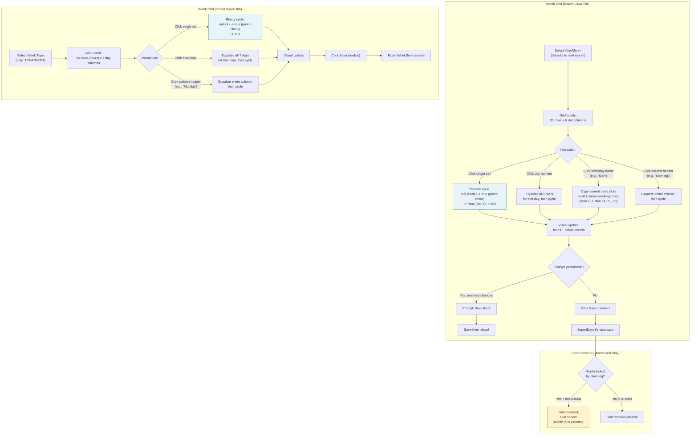
```mermaid
flowchart TD
    subgraph "Month Grid (Expert Days Tab)"
        A1["Select Year/Month<br>(defaults to next month)"] --> A2["Grid Loads:<br>31 rows x 6 slot columns"]
        A2 --> A3{"Interaction:"}

        A3 -->|"Click single cell"| A4["Tri-state cycle:<br>null (circle) -> true (green check)<br>-> false (red X) -> null"]
        A3 -->|"Click day number"| A5["Equalize all 6 slots<br>for that day, then cycle"]
        A3 -->|"Click weekday name<br>(e.g., 'Mon')"| A6["Copy current day's slots<br>to ALL same-weekday rows<br>(Mon 7 -> Mon 14, 21, 28)"]
        A3 -->|"Click column header<br>(e.g., 'Morning')"| A7["Equalize entire column,<br>then cycle"]

        A4 & A5 & A6 & A7 --> A8["Visual update:<br>Icons + colors refresh"]

        A8 --> A9{"Change year/month?"}
        A9 -->|"Yes, unsaved changes"| A10["Prompt: Save first?"]
        A10 --> A11["Save then reload"]
        A9 -->|"No"| A12["Click Save (navbar)"]
        A12 --> A13["ExpertDaysService.save"]
    end

    subgraph "Week Grid (Expert Week Tab)"
        B1["Select Week Type<br>(only: TREATMENT)"] --> B2["Grid Loads:<br>24 rows (hours) x 7 day columns"]
        B2 --> B3{"Interaction:"}

        B3 -->|"Click single cell"| B4["Binary cycle:<br>null (X) -> true (green check)<br>-> null"]
        B3 -->|"Click hour label"| B5["Equalize all 7 days<br>for that hour, then cycle"]
        B3 -->|"Click column header<br>(e.g., 'Monday')"| B6["Equalize entire column,<br>then cycle"]

        B4 & B5 & B6 --> B7["Visual update"]
        B7 --> B8["Click Save (navbar)"]
        B8 --> B9["ExpertWeekService.save"]
    end

    subgraph "Lock Behavior (Month Grid Only)"
        A13 --> L1{"Month locked<br>by planning?"}
        L1 -->|"Yes + not ADMIN"| L2["Grid disabled,<br>alert shown:<br>'Month is in planning'"]
        L1 -->|"No or ADMIN"| L3["Grid remains editable"]
    end

    style A4 fill:#e8f4f8,stroke:#2c7bb6
    style B4 fill:#e8f4f8,stroke:#2c7bb6
    style L2 fill:#fff3cd,stroke:#856404
```

**Key observations:**

- The month grid has a tri-state cycle (null/available/unavailable) while the week grid only has binary (null/available).
- The "copy to same weekday" interaction (clicking weekday name) is a powerful bulk-edit that copies one day's configuration to all matching weekdays in the month.
- Month availability can be locked when the planning department has already used it for scheduling. Only ADMIN users can override the lock.
- Appointment overlay icons appear in the month grid showing existing bookings -- they are read-only indicators with deep-link navigation.
- Known bug in legacy: Sunday data mapping between server (`slotsSo`) and UI (`slotsSu`) is broken.

---

## 6. Password Change Flow

**Who uses it:** Any authenticated user
**Entry point:** Click "Change Password" button in profile navbar
**Exit point:** Password successfully changed, or user cancels

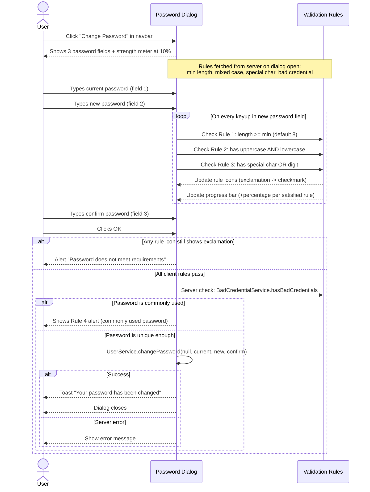
```mermaid
sequenceDiagram
    actor User
    participant Dialog as Password Dialog
    participant Rules as Validation Rules

    User->>Dialog: Click "Change Password" in navbar
    Dialog-->>User: Shows 3 password fields + strength meter at 10%

    Note over Dialog, Rules: Rules fetched from server on dialog open:<br/>min length, mixed case, special char, bad credential

    User->>Dialog: Types current password (field 1)
    User->>Dialog: Types new password (field 2)

    loop On every keyup in new password field
        Dialog->>Rules: Check Rule 1: length >= min (default 8)
        Dialog->>Rules: Check Rule 2: has uppercase AND lowercase
        Dialog->>Rules: Check Rule 3: has special char OR digit
        Rules-->>Dialog: Update rule icons (exclamation -> checkmark)
        Rules-->>Dialog: Update progress bar (+percentage per satisfied rule)
    end

    User->>Dialog: Types confirm password (field 3)
    User->>Dialog: Clicks OK

    alt Any rule icon still shows exclamation
        Dialog-->>User: Alert "Password does not meet requirements"
    else All client rules pass
        Dialog->>Rules: Server check: BadCredentialService.hasBadCredentials
        alt Password is commonly used
            Dialog-->>User: Shows Rule 4 alert (commonly used password)
        else Password is unique enough
            Dialog->>Dialog: UserService.changePassword(null, current, new, confirm)
            alt Success
                Dialog-->>User: Toast "Your password has been changed"
                Dialog-->>User: Dialog closes
            else Server error
                Dialog-->>User: Show error message
            end
        end
    end
```

---

## 7. Admin User Management Flow

This diagram shows the administrator's user management workflow: browsing the user list, viewing/editing user details in a side panel, and triggering administrative actions (password reset, API key management).

**Who uses it:** Administrators (ADMIN / USERS_UPDATE authority)
**Entry point:** Admin sidebar → User Management page
**Exit points:** User details saved, password sent/changed, or API key created/revoked

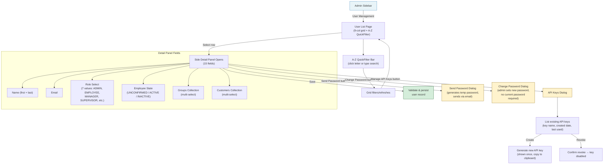
```mermaid
flowchart TD
    A["Admin Sidebar"] -->|"User Management"| B["User List Page<br>(9-col grid + A-Z QuickFilter)"]

    B --> C["A-Z QuickFilter Bar<br>(click letter or type search)"]
    C --> D["Grid filters/refreshes"]
    D --> B

    B -->|"Select row"| E["Side Detail Panel Opens<br>(15 fields)"]

    subgraph "Detail Panel Fields"
        E --> F1["Name (first + last)"]
        E --> F2["Email"]
        E --> F3["Role Select<br>(7 values: ADMIN, EMPLOYEE,<br>MANAGER, SUPERVISOR, etc.)"]
        E --> F4["Employee State<br>(UNCONFIRMED / ACTIVE / INACTIVE)"]
        E --> F5["Groups Collection<br>(multi-select)"]
        E --> F6["Customers Collection<br>(multi-select)"]
    end

    E -->|"Save"| G["Validate & persist<br>user record"]

    E -->|"Send Password button"| H["Send Password Dialog<br>(generates temp password,<br>sends via email)"]
    E -->|"Change Password button"| I["Change Password Dialog<br>(admin sets new password,<br>no current password required)"]
    E -->|"Manage API Keys button"| J["API Keys Dialog"]

    J --> K["List existing API keys<br>(key name, created date, last used)"]
    K -->|"Create"| L["Generate new API key<br>(shown once, copy to clipboard)"]
    K -->|"Revoke"| M["Confirm revoke → key disabled"]

    style A fill:#e8f4f8,stroke:#2c7bb6
    style G fill:#d4edda,stroke:#155724
    style H fill:#fff3cd,stroke:#856404
    style I fill:#fff3cd,stroke:#856404
    style J fill:#fff3cd,stroke:#856404
```

**Key observations:**

- The 9-column grid provides a dense overview with quick letter-based filtering for large user bases.
- The side detail panel keeps the list visible while editing, enabling rapid multi-user edits.
- Role assignment directly controls which groups and customers can be assigned to the user.
- API key management is a separate dialog to isolate sensitive credential operations.
- "Send Password" generates a temporary credential and emails it; "Change Password" is an immediate admin override.

---

## 8. TOTP 2FA Setup Flow (State Machine)

This diagram models the three states of TOTP device configuration from the admin/user perspective, showing transitions between no token, pending activation, and active states.

**Who uses it:** Users setting up 2FA, administrators managing security
**Entry point:** Security settings page or admin user detail
**Exit points:** TOTP device active, or setup abandoned/reset

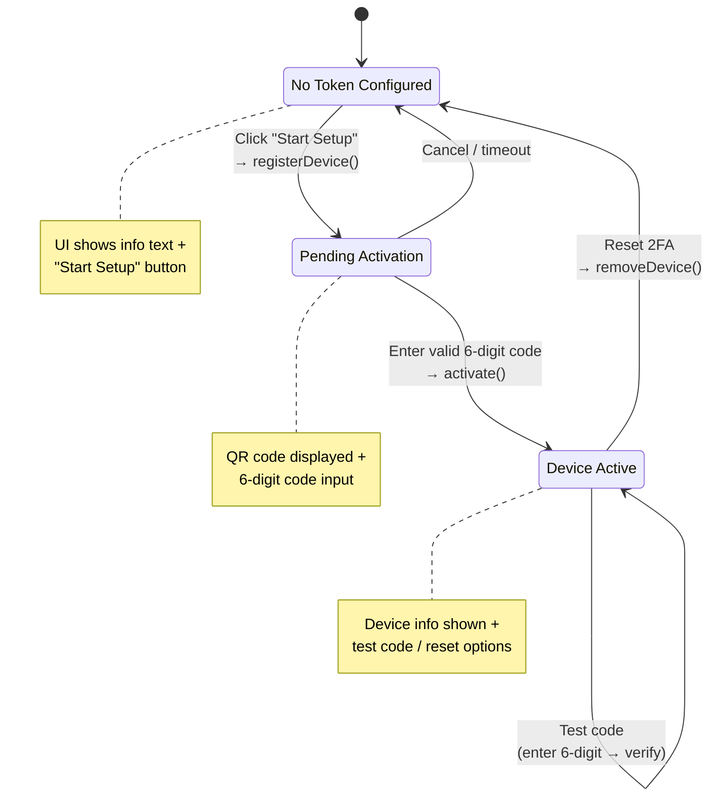
```mermaid
stateDiagram-v2
    [*] --> NoToken

    NoToken: No Token Configured
    note right of NoToken
        UI shows info text +
        "Start Setup" button
    end note

    Pending: Pending Activation
    note right of Pending
        QR code displayed +
        6-digit code input
    end note

    Active: Device Active
    note right of Active
        Device info shown +
        test code / reset options
    end note

    NoToken --> Pending: Click "Start Setup"<br>→ registerDevice()

    Pending --> Active: Enter valid 6-digit code<br>→ activate()
    Pending --> NoToken: Cancel / timeout

    Active --> Active: Test code<br>(enter 6-digit → verify)
    Active --> NoToken: Reset 2FA<br>→ removeDevice()
```

**Key observations:**

- `registerDevice()` generates the TOTP secret and returns the QR code URI for the authenticator app.
- The Pending state shows both the QR code (for scanning) and the secret key (for manual entry).
- `activate()` validates the first 6-digit code to confirm the authenticator app is correctly configured.
- Active state displays device metadata: user agent, IP address, activation date, last used timestamp.
- "Reset 2FA" transitions back to NoToken, requiring full re-enrollment — there is no "pause" state.

---

## 9. Group Management Tree Flow

This diagram shows the group management interface with its tree-based navigation (roles as parents, groups as children) and the group editing panel.

**Who uses it:** Administrators (ADMIN authority)
**Entry point:** Admin sidebar → Group Management
**Exit points:** Group created/edited/deleted

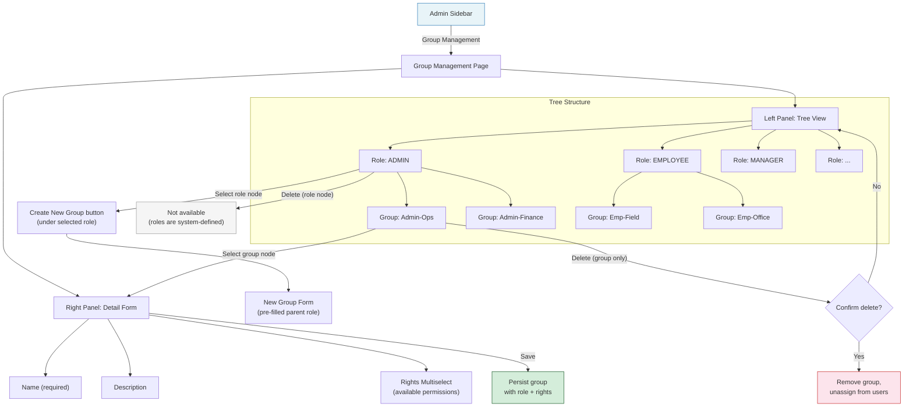
```mermaid
flowchart TD
    A["Admin Sidebar"] -->|"Group Management"| B["Group Management Page"]

    B --> C["Left Panel: Tree View"]
    B --> D["Right Panel: Detail Form"]

    subgraph "Tree Structure"
        C --> R1["Role: ADMIN"]
        C --> R2["Role: EMPLOYEE"]
        C --> R3["Role: MANAGER"]
        C --> R4["Role: ..."]

        R1 --> G1["Group: Admin-Ops"]
        R1 --> G2["Group: Admin-Finance"]
        R2 --> G3["Group: Emp-Field"]
        R2 --> G4["Group: Emp-Office"]
    end

    R1 -->|"Select role node"| E["Create New Group button<br>(under selected role)"]
    E --> F["New Group Form<br>(pre-filled parent role)"]

    G1 -->|"Select group node"| D
    D --> D1["Name (required)"]
    D --> D2["Description"]
    D --> D3["Rights Multiselect<br>(available permissions)"]

    D -->|"Save"| H["Persist group<br>with role + rights"]

    G1 -->|"Delete (group only)"| I{"Confirm delete?"}
    I -->|"Yes"| J["Remove group,<br>unassign from users"]
    I -->|"No"| C

    R1 -->|"Delete (role node)"| K["Not available<br>(roles are system-defined)"]

    style A fill:#e8f4f8,stroke:#2c7bb6
    style H fill:#d4edda,stroke:#155724
    style J fill:#fce4ec,stroke:#c62828
    style K fill:#f5f5f5,stroke:#999
```

**Key observations:**

- The tree structure uses roles as immutable parent nodes and groups as mutable children.
- Delete is only available on group nodes — role nodes are system-defined and cannot be removed.
- The rights multiselect controls per-group feature permissions; these propagate to all users assigned to the group.
- Creating a new group requires selecting a parent role first, which pre-fills the role association.

---

## 10. Skill CRUD Flow

This diagram shows the simple CRUD workflow for managing skills (used in expert search and employee qualifications).

**Who uses it:** Administrators (ADMIN authority)
**Entry point:** Admin sidebar → Skills page
**Exit points:** Skill created/edited/deleted

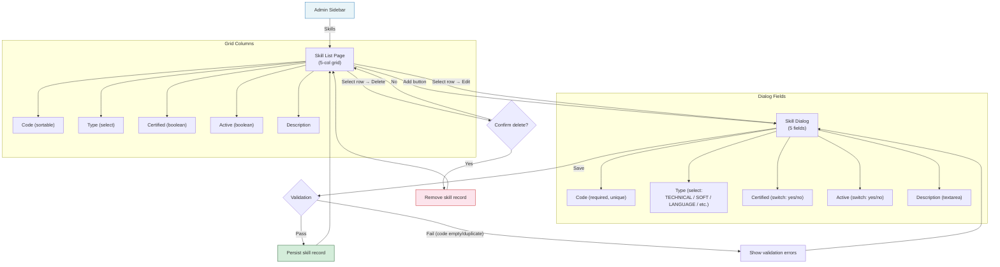
```mermaid
flowchart TD
    A["Admin Sidebar"] -->|"Skills"| B["Skill List Page<br>(5-col grid)"]

    subgraph "Grid Columns"
        B --> COL1["Code (sortable)"]
        B --> COL2["Type (select)"]
        B --> COL3["Certified (boolean)"]
        B --> COL4["Active (boolean)"]
        B --> COL5["Description"]
    end

    B -->|"Add button"| C["Skill Dialog<br>(5 fields)"]
    B -->|"Select row → Edit"| C

    subgraph "Dialog Fields"
        C --> F1["Code (required, unique)"]
        C --> F2["Type (select:<br>TECHNICAL / SOFT / LANGUAGE / etc.)"]
        C --> F3["Certified (switch: yes/no)"]
        C --> F4["Active (switch: yes/no)"]
        C --> F5["Description (textarea)"]
    end

    C -->|"Save"| D{"Validation"}
    D -->|"Pass"| E["Persist skill record"]
    D -->|"Fail (code empty/duplicate)"| F["Show validation errors"]
    F --> C

    B -->|"Select row → Delete"| G{"Confirm delete?"}
    G -->|"Yes"| H["Remove skill record"]
    G -->|"No"| B

    E --> B
    H --> B

    style A fill:#e8f4f8,stroke:#2c7bb6
    style E fill:#d4edda,stroke:#155724
    style H fill:#fce4ec,stroke:#c62828
```

**Key observations:**

- Skills follow a standard CRUD pattern with no complex dependencies.
- The "Certified" switch indicates whether the skill requires formal certification verification.
- The "Active" switch allows soft-deletion — inactive skills remain in the database but are excluded from expert search filters.
- Code must be unique across all skills; it serves as the business identifier.

---

## 11. Onboarding Flow

This diagram shows the onboarding workflow for employees, customers, and locations — from grid selection through step-based checklist completion.

**Who uses it:** Administrators (ADMIN authority)
**Entry point:** Admin sidebar → Onboarding (Employee / Customer / Location)
**Exit points:** Onboarding steps completed, or progress saved for later

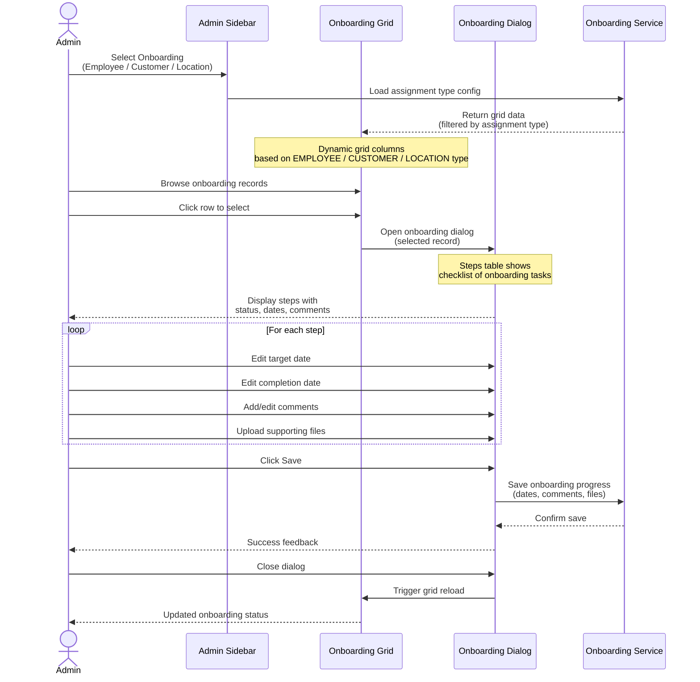
```mermaid
sequenceDiagram
    actor Admin
    participant Sidebar as Admin Sidebar
    participant Grid as Onboarding Grid
    participant Dialog as Onboarding Dialog
    participant API as Onboarding Service

    Admin->>Sidebar: Select Onboarding<br>(Employee / Customer / Location)
    Sidebar->>API: Load assignment type config
    API-->>Grid: Return grid data<br>(filtered by assignment type)

    Note over Grid: Dynamic grid columns<br>based on EMPLOYEE / CUSTOMER / LOCATION type

    Admin->>Grid: Browse onboarding records
    Admin->>Grid: Click row to select

    Grid->>Dialog: Open onboarding dialog<br>(selected record)

    Note over Dialog: Steps table shows<br>checklist of onboarding tasks

    Dialog-->>Admin: Display steps with<br>status, dates, comments

    loop For each step
        Admin->>Dialog: Edit target date
        Admin->>Dialog: Edit completion date
        Admin->>Dialog: Add/edit comments
        Admin->>Dialog: Upload supporting files
    end

    Admin->>Dialog: Click Save
    Dialog->>API: Save onboarding progress<br>(dates, comments, files)
    API-->>Dialog: Confirm save
    Dialog-->>Admin: Success feedback

    Admin->>Dialog: Close dialog
    Dialog->>Grid: Trigger grid reload
    Grid-->>Admin: Updated onboarding status
```

**Key observations:**

- The assignment type (EMPLOYEE / CUSTOMER / LOCATION) determines both the grid columns and the available onboarding steps.
- Each onboarding record has a checklist of steps; steps can be completed in any order.
- File uploads attach supporting documents (contracts, ID copies, certifications) to individual steps.
- The grid reloads after dialog close to reflect updated completion status.
- Access roles are determined by the assignment type — employee onboarding may require different permissions than customer onboarding.

---

## 12. User Video History Flow

This diagram shows the video history management workflow for tracking user training video consumption (part of the Academy/learning module).

**Who uses it:** Administrators (ADMIN authority), Employees (viewing own history)
**Entry point:** User profile → Video History tab, or Admin → Video History page
**Exit points:** Video history entry created/edited, or video played

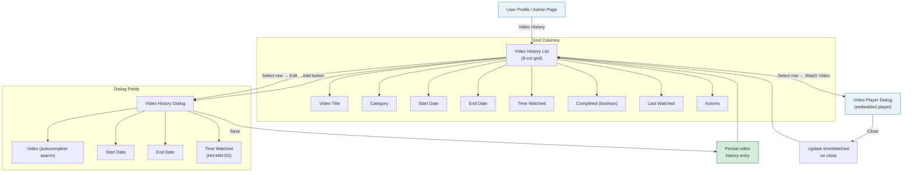
```mermaid
flowchart TD
    A["User Profile / Admin Page"] -->|"Video History"| B["Video History List<br>(8-col grid)"]

    subgraph "Grid Columns"
        B --> COL1["Video Title"]
        B --> COL2["Category"]
        B --> COL3["Start Date"]
        B --> COL4["End Date"]
        B --> COL5["Time Watched"]
        B --> COL6["Completed (boolean)"]
        B --> COL7["Last Watched"]
        B --> COL8["Actions"]
    end

    B -->|"Add button"| C["Video History Dialog"]
    B -->|"Select row → Edit"| C

    subgraph "Dialog Fields"
        C --> F1["Video (autocomplete search)"]
        C --> F2["Start Date"]
        C --> F3["End Date"]
        C --> F4["Time Watched<br>(HH:MM:SS)"]
    end

    C -->|"Save"| D["Persist video<br>history entry"]
    D --> B

    B -->|"Select row → Watch Video"| E["Video Player Dialog<br>(embedded player)"]
    E -->|"Close"| F["Update timeWatched<br>on close"]
    F --> B

    style A fill:#e8f4f8,stroke:#2c7bb6
    style D fill:#d4edda,stroke:#155724
    style E fill:#e8f4f8,stroke:#2c7bb6
```

**Key observations:**

- The video autocomplete searches the video library and links the history entry to a specific video record.
- `timeWatched` is tracked both manually (dialog entry) and automatically (player close event).
- Video watch tracking feeds into Academy category completion indicators — cumulative time per category.
- The "Watch Video" button opens an embedded player dialog rather than navigating away from the list.

---

## 13. Work Hour Templates Flow

This diagram shows the simple CRUD workflow for managing work hour templates (predefined hour configurations for scheduling).

**Who uses it:** Administrators (ADMIN authority)
**Entry point:** Admin sidebar → Work Hour Templates
**Exit points:** Template created/edited/deleted

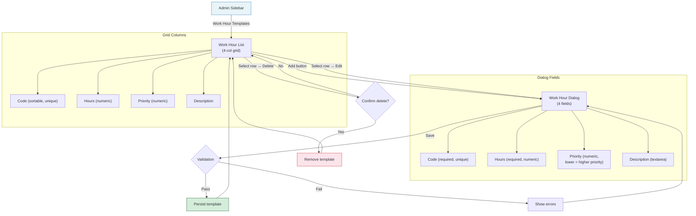
```mermaid
flowchart TD
    A["Admin Sidebar"] -->|"Work Hour Templates"| B["Work Hour List<br>(4-col grid)"]

    subgraph "Grid Columns"
        B --> COL1["Code (sortable, unique)"]
        B --> COL2["Hours (numeric)"]
        B --> COL3["Priority (numeric)"]
        B --> COL4["Description"]
    end

    B -->|"Add button"| C["Work Hour Dialog<br>(4 fields)"]
    B -->|"Select row → Edit"| C

    subgraph "Dialog Fields"
        C --> F1["Code (required, unique)"]
        C --> F2["Hours (required, numeric)"]
        C --> F3["Priority (numeric,<br>lower = higher priority)"]
        C --> F4["Description (textarea)"]
    end

    C -->|"Save"| D{"Validation"}
    D -->|"Pass"| E["Persist template"]
    D -->|"Fail"| F["Show errors"]
    F --> C

    B -->|"Select row → Delete"| G{"Confirm delete?"}
    G -->|"Yes"| H["Remove template"]
    G -->|"No"| B

    E --> B
    H --> B

    style A fill:#e8f4f8,stroke:#2c7bb6
    style E fill:#d4edda,stroke:#155724
    style H fill:#fce4ec,stroke:#c62828
```

**Key observations:**

- Work hour templates follow a standard CRUD pattern identical to skills management.
- Code must be unique and serves as the business identifier for scheduling references.
- Hours is the core value — represents the standard hours for this template type.
- Priority determines template ordering when multiple templates apply; lower values take precedence.

---

## Interdependencies Summary

| Factor | Affects | How |
|:---|:---|:---|
| **User role (EMPLOYEE vs ADMIN)** | Profile form visibility | EMPLOYEE sees 4 tabs; ADMIN sees 8 tabs + inline admin sections within employee tabs |
| **USERS_UPDATE authority** | Staff list write access | Controls whether inline detail panel allows editing |
| **isAnEmployee flag** | Address validation | Street, ZIP, City become mandatory for employee profiles |
| **Employee state** | Operational status | UNCONFIRMED users cannot be scheduled; ACTIVE users appear in availability grids; INACTIVE users are excluded from expert search |
| **requireTotp flag** | Login flow | When true, user must complete TOTP setup before next login |
| **Month locked status** | Availability editing | Locked months (in planning) disable the Expert Days grid for non-ADMIN users |
| **Qualification level** | Expert search results | Shown in search results table, used for filtering |
| **Skills** | Expert search filtering | Skills collection drives AND-logic client-side filtering of search results |
| **Exclusion criteria** | Expert search filtering | Exclusion criteria collection drives AND-logic exclusion of results |
| **Context (personal vs staff)** | Profile form behavior | Personal page: user edits own profile, no delete/onboarding. Staff page: admin edits any profile, full toolbar. |
| **Platform (personal vs admin)** | Password dialog variant | Personal page shows current+new+confirm. Admin page (not in scope) shows new+confirm only (resets for any user). |
| **User role (7 values)** | Admin user access | Determines which groups/customers can be assigned to a user in the admin detail panel |
| **TOTP state (NoToken/Pending/Active)** | Login flow | Active TOTP enforces 2FA on login; Pending state blocks until activation completes |
| **Group rights** | Feature access | Rights multiselect in group management controls per-group permissions for all assigned users |
| **Onboarding assignment type** | View routing | EMPLOYEE / CUSTOMER / LOCATION determines grid data, available steps, and access roles |
| **Video watch tracking** | Academy progress | timeWatched per video feeds into category completion indicators and learning dashboards |

---

## Wireframe Screenshots

### W1: Profile Form — Tab Overview

Shows the 8-tab layout: 4 employee-visible tabs (white) and 4 admin-only tabs (orange highlight). Save and Change Password buttons in the navbar. Form content renders in the tab content area below.

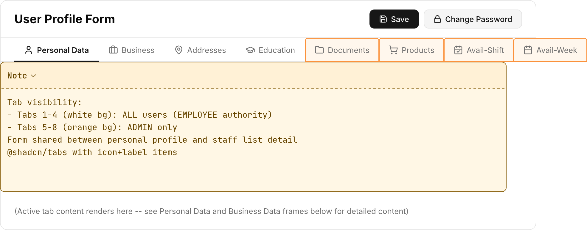

**Annotations:**

- **note1:** Tab visibility: Tabs 1-4 (white bg): ALL users (EMPLOYEE authority). Tabs 5-8 (orange bg): ADMIN-only (USERS_CREATE authority). Tab click loads tab content via separate forms.

### W1: Profile Form — Personal Data Tab (Employee View)

Left column: profile picture with upload and rotate. Right column: personal information fields (salutation, title, first name*, last name*, mobile, birthday, email*). Securebox data section with check button. Notification checkbox.

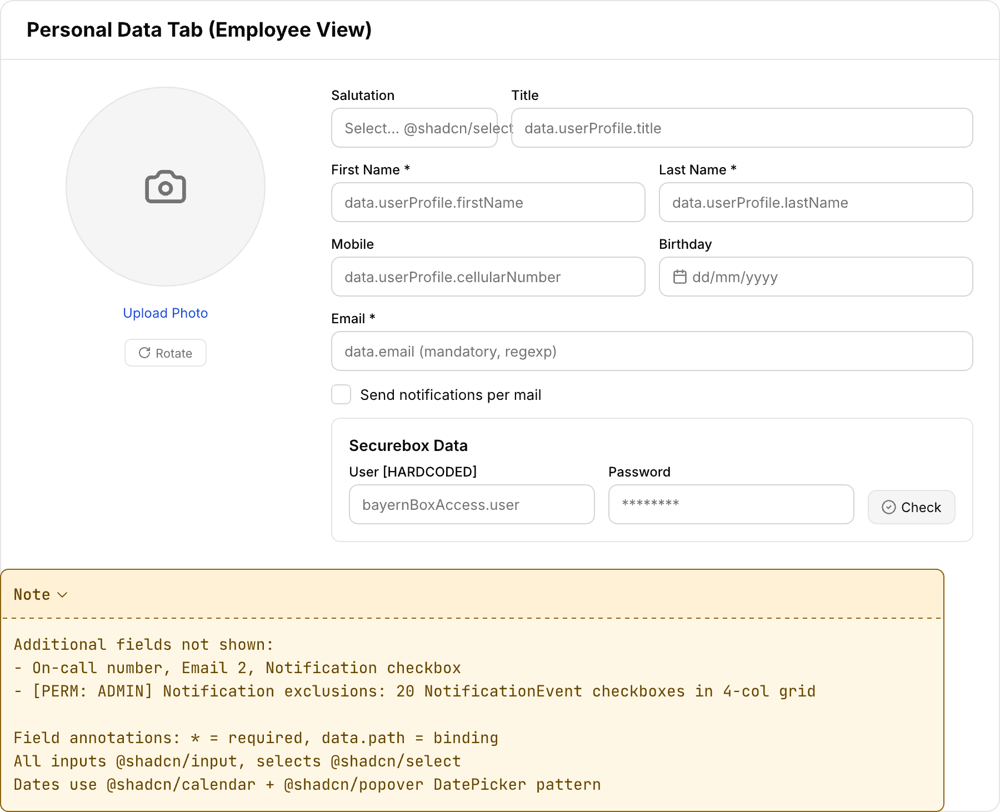

**Annotations:**

- **note2:** Additional fields not shown: On-call number, Email 2, Notification checkbox. [PERM: ADMIN] Notification frequency select only visible to admins.

### W1: Profile Form — Business Data Tab (Admin View)

Two-column layout. Left: dates & status with admin-only section (GKTO, Konto, EFN, employee state, inactive dates, TOTP). Contractual relations and SIP accounts collections. Right: financial data (UID, IBAN), signature upload with create/upload buttons.

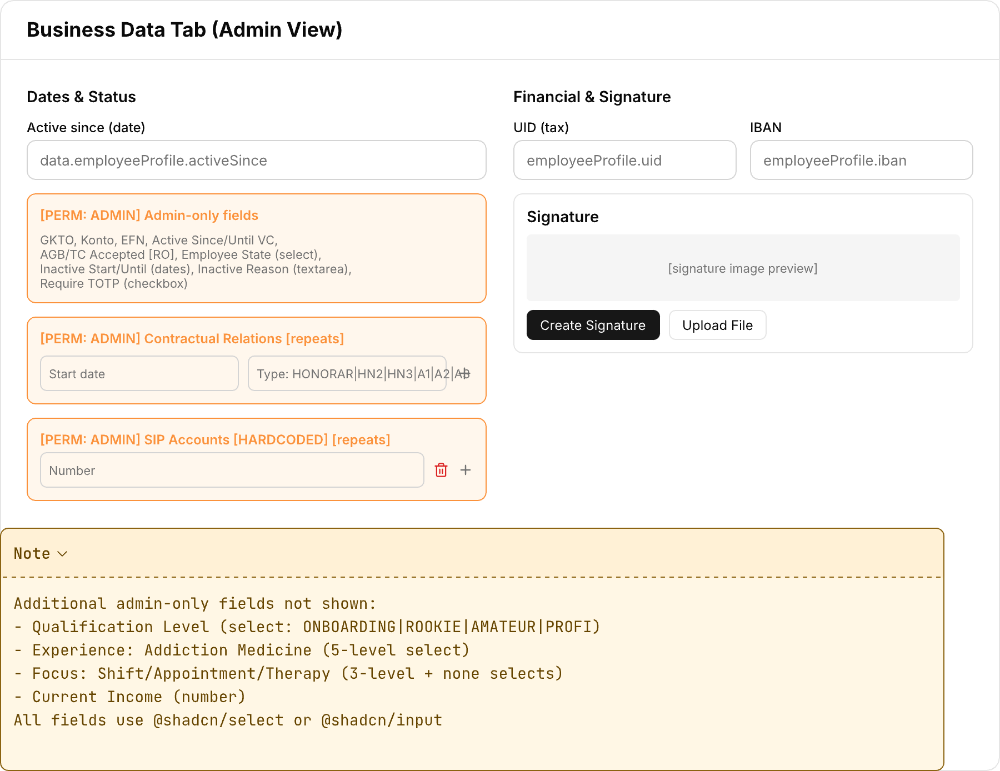

**Annotations:**

- **note3:** Additional admin-only fields not shown: Qualification Level (select: ONBOARDING|ROOKIE|AMATEUR|PROFESSIONAL|EXPERT), Employment Type (select: FULL|PART|CONTRACT), Contract dates.

### W2: Staff List

Full page view with toolbar (9 buttons: Add, Edit, Onboarding, Assignments, Password, Delete, Export, Expert Search, Invoice). A-Z quick filter bar with search input. 10-column grid: firstName, lastName, state, shift, appointment, therapy, lastReminder, 2FA, enabled. Row 1 shows selected state (blue highlight).

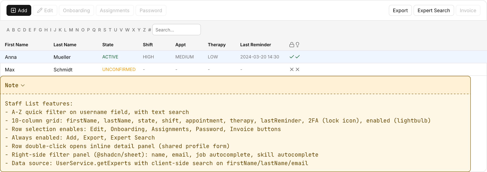

**Annotations:**

- **snote:** Staff List features: A-Z quick filter on username field with text search. 10-column grid: firstName, lastName, username, email, employeeType, active, locked, admin, shift, group. Column formatters: boolean→checkmark, employeeType→colored badge.

### W3: Expert Search Dialog

Job autocomplete filter with active toggle. Skills and Exclusion Criteria insert-and-delete collections with chip display. Results table with name, skills (nested), exclusion criteria (nested), qualification level columns. Search and Cancel buttons.

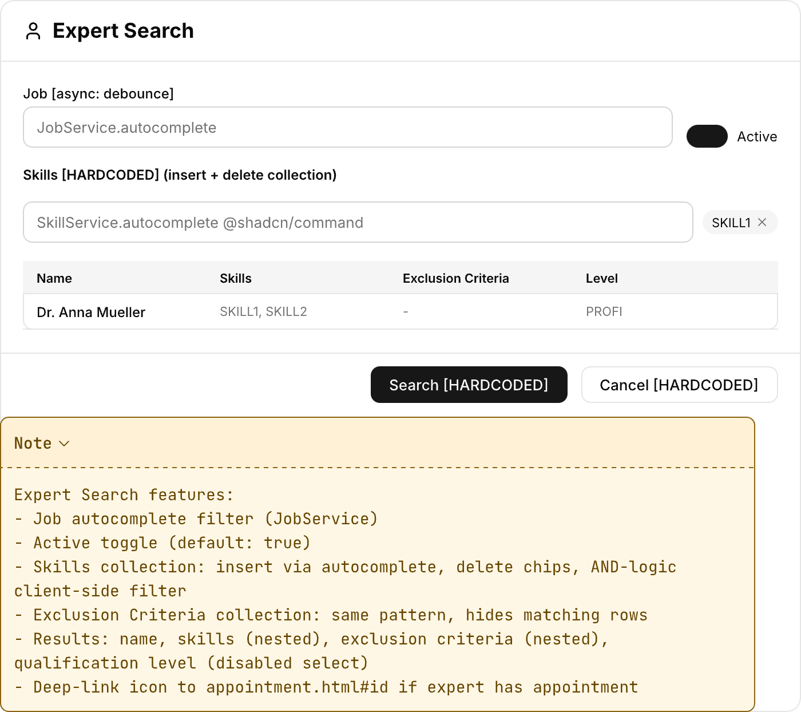

**Annotations:**

- **esnote:** Expert Search features: Job autocomplete filter (JobService). Active toggle (default: true). Skill autocomplete filter. 5-column results: displayName, email, phone, skills, action buttons. Click 'Select' → returns expert to calling form.

### W4: Assignment Dialog

Year/Month filter (pre-filled with previous month), read-only user display name, export download icon. Appointment rows showing type, weekday, date, time, job code, location. Accept (green) and Reject (red) action buttons per row.

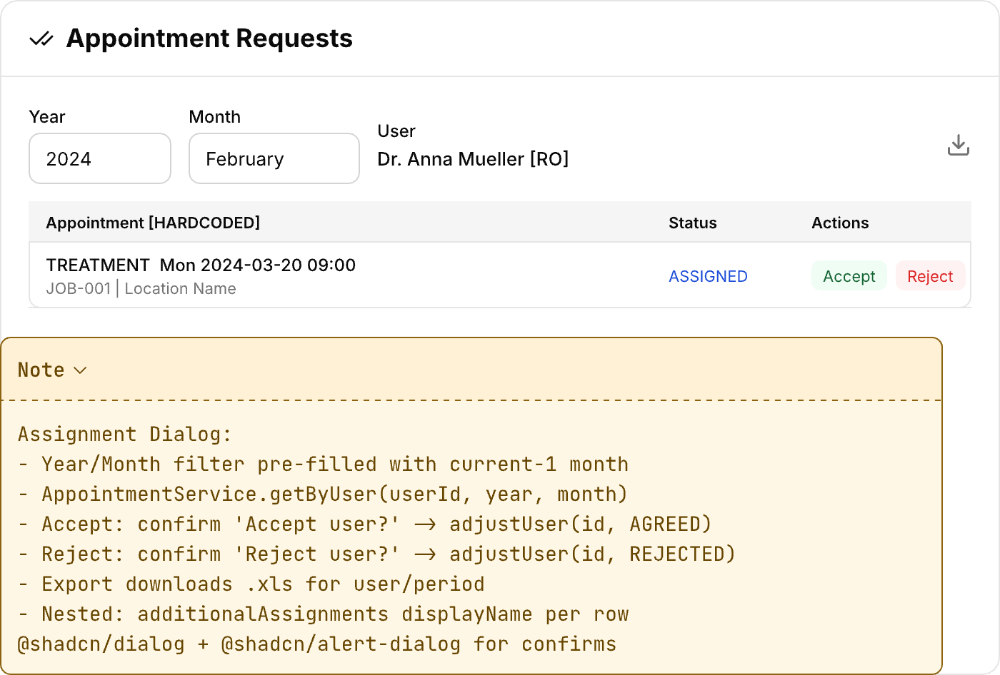

**Annotations:**

- **anote:** Assignment Dialog: Year/Month filter pre-filled with current-1 month. AppointmentService.getByUser(userId, year, month). 7-column grid: date, job, location, from, to, state, payment. State formatter: colored badge.

### W5: Password Change Dialog

Three password fields with show/hide eye toggles. Progress bar strength meter (10% danger to 100% success). Four validation rules with real-time icon toggling (exclamation = not met, checkmark = met). Rule 4 (bad credential) is server-only on submit.

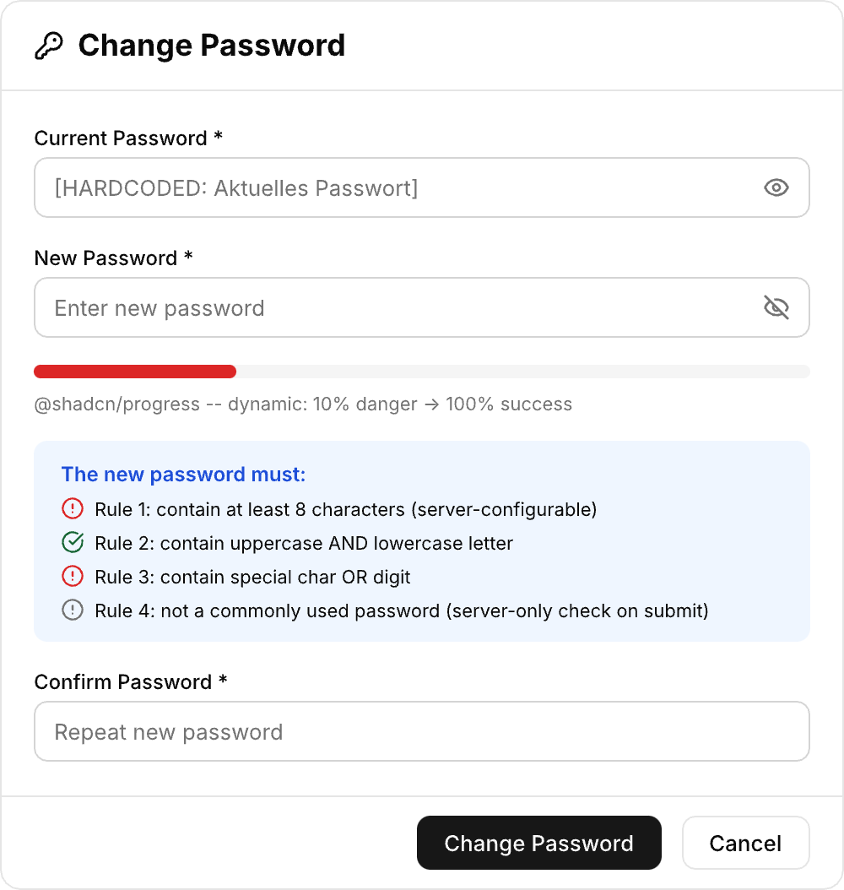

**Annotations:**

- No annotations extracted from wireframe.

### W6: Signature Pad Dialog

HTML5 Canvas area with decorative signing line and "Sign above" text. Sign button (submits base64 to server) and Clear button (resets canvas). Dimension hint for PNG/JPG format.

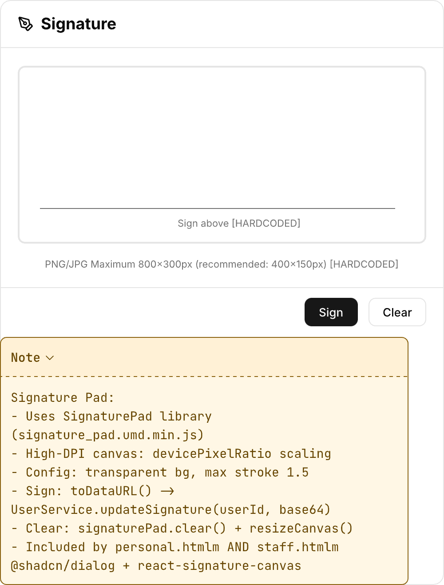

**Annotations:**

- **snote:** Signature Pad: Uses SignaturePad library (signature_pad.umd.min.js). High-DPI canvas: devicePixelRatio scaling. Save as PNG base64 → UserService.saveSignature(userId, data). Clear button resets canvas. 400×200 canvas size.

### W7: Expert Availability — Month Grid

Year/month selectors. 31 rows x 6 slot columns (3 shift + 2 appointment + 1 treatment). Tri-state cell icons: circle (null), green check (available), red X (unavailable). Weekend rows highlighted yellow. Summary counters for weekday/weekend.

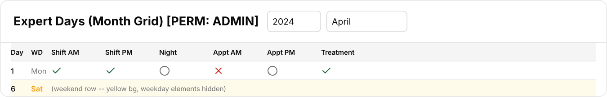

**Annotations:**

- **mnote:** Month Grid (Expert Days): 31 rows (days) × 6 slot columns (3 shift + 2 appointment + 1 treatment). Toggle cells to set availability per day/slot. Lock icon on months that are closed. Holiday marker on public holidays. ExpertDaysService.save(userId, year, month, data).

### W7: Expert Availability — Week Grid

Week type selector (TREATMENT only). 24 rows (hours) x 7 day columns (Mon-Sun). Binary state cell icons: X (null/off), green check (available). Column headers are clickable for bulk equalize.

**Annotations:**

- **wnote:** Week Grid (Expert Week): 24 rows (hours 01:00-24:00) × 7 day columns (Mon-Sun). Binary state cells: available/unavailable toggle. WeekType select (A/B/C pattern). ExpertWeekService.save(userId, weekType, data).

### W14: User Stats Dialog

Date picker input. Stats collection table with icon-labeled columns: department name, available (calendar icon), booked (briefcase icon), holiday (palm tree icon — note: holiday column has no data binding in legacy).

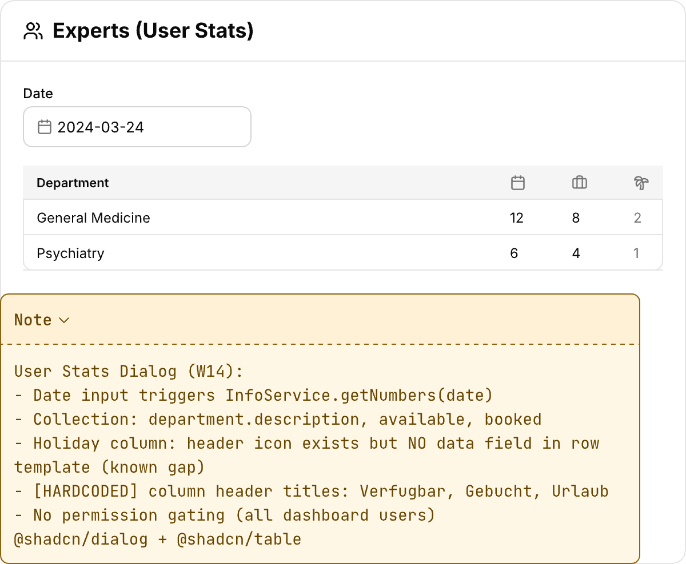

**Annotations:**

- **usnote:** User Stats Dialog (W14): Date input triggers InfoService.getNumbers(date). Collection: departments with staff counts per employee type. Summary row: totals.

### W26: User Management List

1440px page with 9-column grid, A-Z QuickFilter bar, and 6-button toolbar (Add, Edit, Delete, Send Password, Change Password, API Keys).

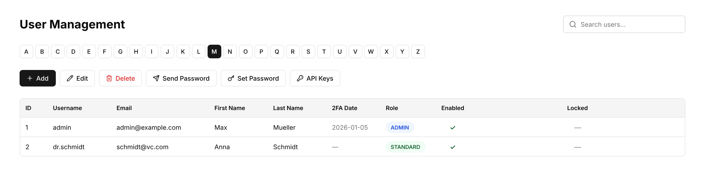

### W26b: User Detail Panel

400px side panel with username, email, and name fields. Role select (7 values), groups and customers multi-select collections.

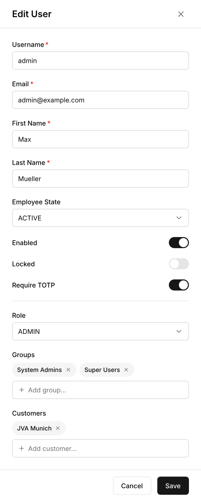

### W27: TOTP Security

600px dialog with QR code placeholder, secret key display, 6-digit code input with auto-advance, and verify/activate buttons.

### W28: Group Management

800px dialog with left tree panel (roles as parents → groups as children) and right detail panel (name, description, rights multiselect).

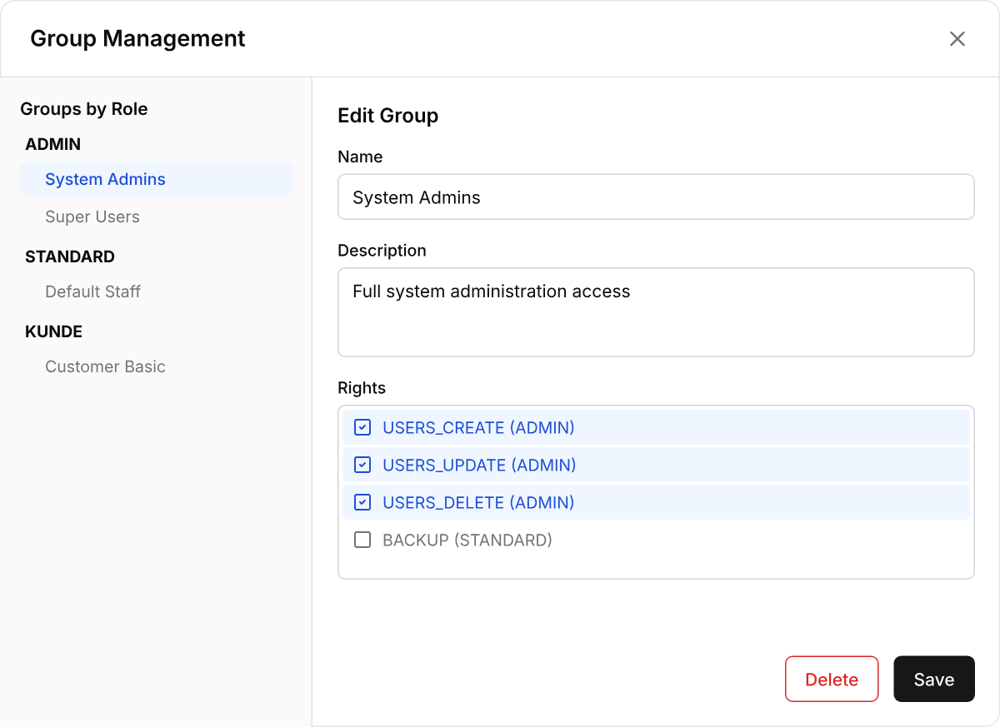

### W29: Skill List

1440px page with 5-column grid (code, type, certified, active, description) and type badges.

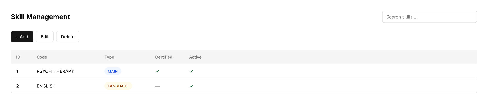

### W29b: Skill Detail

600px dialog with code input, type select, certified/active switches, and description textarea.

### W30: Onboarding Grid

1440px page with 3 tabs (Employee, Customer, Location). Dynamic resource grid with checkmark completion indicators.

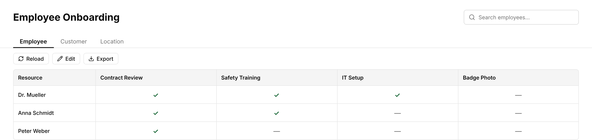

### W30b: Onboarding Dialog

1000px dialog with steps table (dates, comments, file upload) and progress counter.

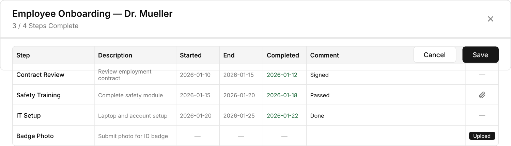

### W31: Video History List

1440px page with 8-column grid (title, category, start/end dates, timeWatched, completed, lastWatched, actions).

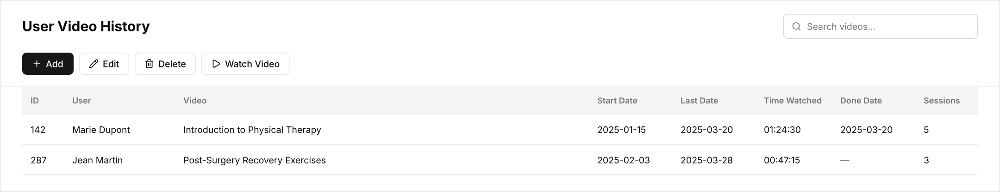

### W31b: Video History Detail

600px dialog with video combobox search, date fields, and timeWatched input.

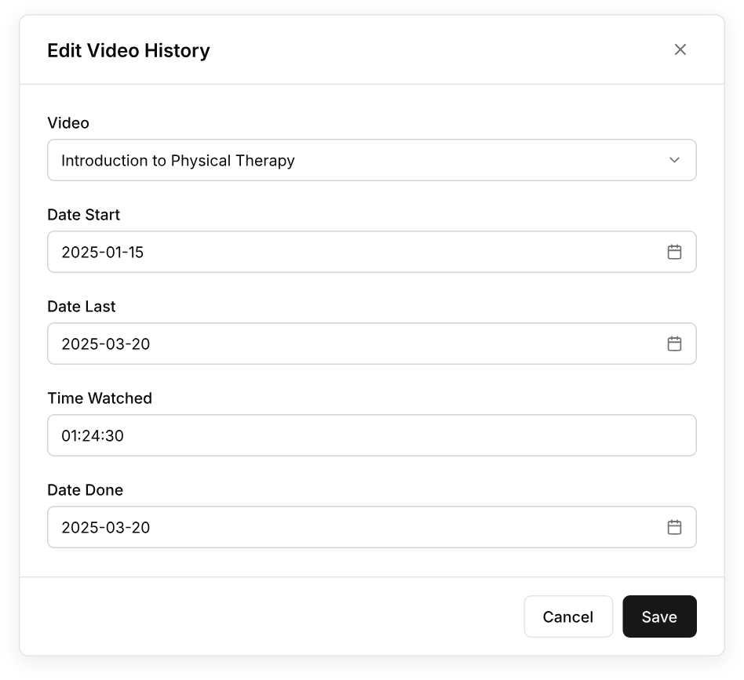

### W32: Work Hour List

1440px page with 4-column grid (code, hours, priority, description).

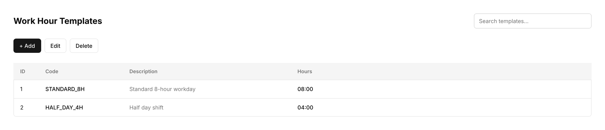

### W32b: Work Hour Detail

600px dialog with code input, hours numeric field, priority, and description textarea.

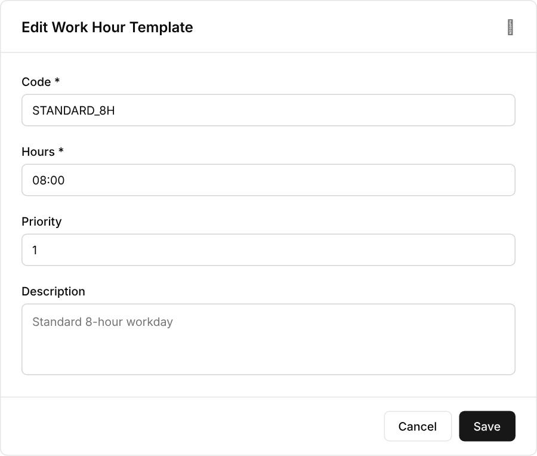
