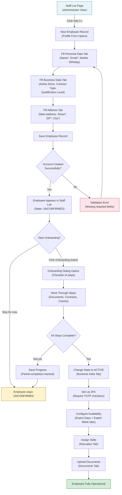
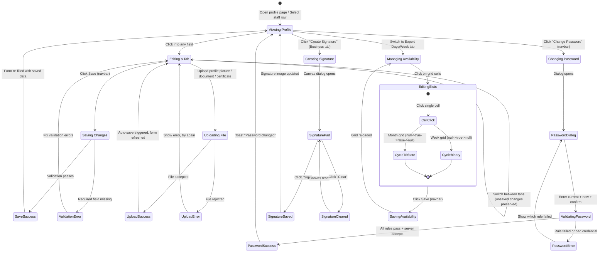
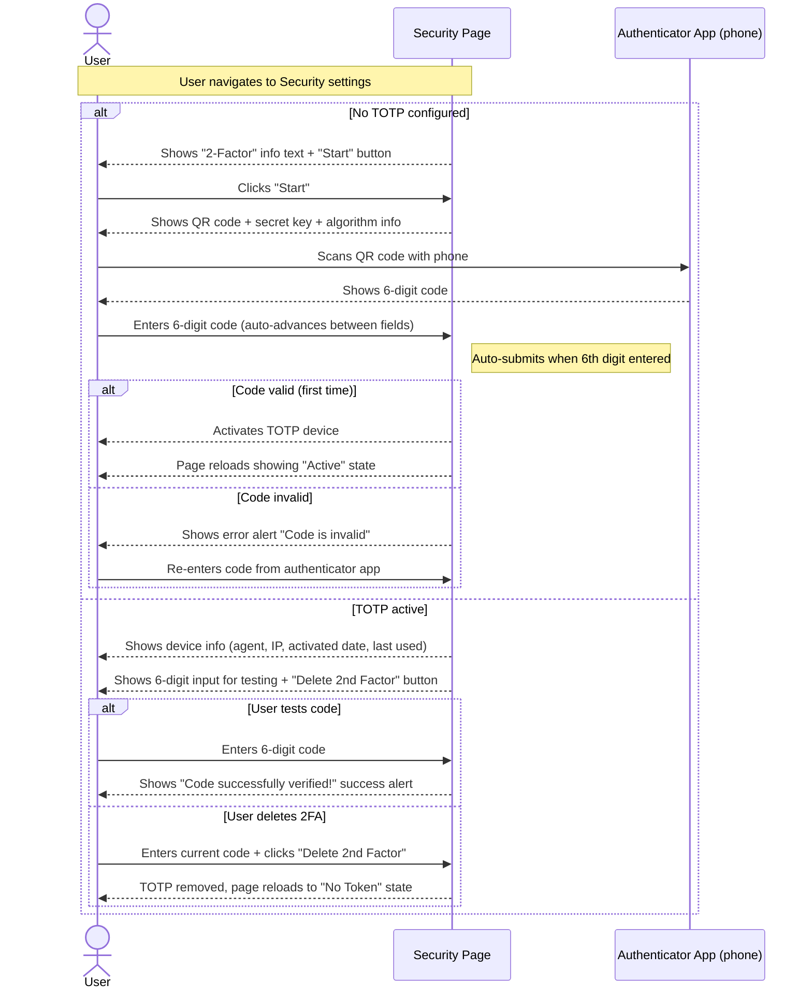
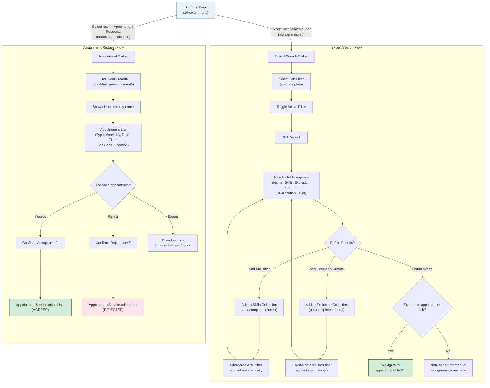
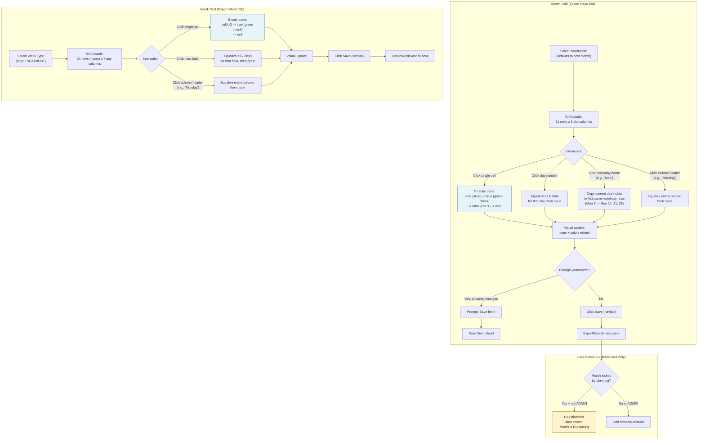
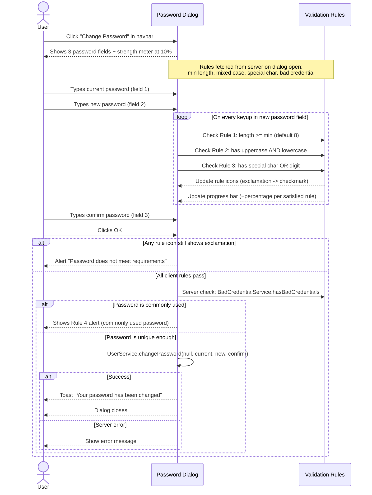

# User Management -- User Workflows

This document describes the user experience and decision flows for the User Management domain. All diagrams represent the journey from the user's perspective, not internal system architecture.

---

## Context

The User Management domain covers staff profile management, expert search, availability scheduling, onboarding, and administrative user operations. It is used by two primary roles:

- **Employees** (EMPLOYEE authority): Can view and edit their own profile (personal data, business data, addresses, education), change their password, and create a digital signature.
- **Administrators** (ADMIN / USERS_UPDATE authority): Can manage all staff profiles, access admin-only tabs (documents, products, availability scheduling), search experts, manage appointment assignments, trigger onboarding, reset passwords, and create invoices.

The profile form is the densest form in the application (1014 lines, 8 tabs, 60+ fields) and is shared between the personal profile page and the staff management list's inline detail panel.

---

## 1. Staff Onboarding Journey

This diagram shows the high-level flow when an administrator onboards a new staff member, from account creation through to full operational readiness.

**Who uses it:** Administrators (ADMIN_INTERN, ADMIN)
**Entry point:** Administrator clicks "Add" on Staff List toolbar
**Exit points:** Staff member is fully onboarded and active, or onboarding is paused/incomplete

**Key observations:**

- The onboarding process is non-linear -- administrators can complete steps in any order and save partial progress.
- The profile form's 8 tabs map to distinct onboarding phases: identity (Personal), employment (Business), location (Address), qualifications (Education), compliance (Documents), billing (Products), and scheduling (Expert Days/Week).
- State transitions (UNCONFIRMED -> ACTIVE) are manual via the Business Data tab's state dropdown.
- 2FA enforcement is a separate admin decision made via the `requireTotp` checkbox.

---

## 2. Profile Editing State Diagram

This diagram models the states a staff profile editing session can be in, from the user's perspective.

**Who uses it:** Both employees (own profile) and administrators (any profile)

---

## 3. 2FA Setup Experience

This diagram shows the TOTP two-factor authentication setup flow from the user's perspective.

**Who uses it:** Any user whose account has `requireTotp = true`, or users who voluntarily set up 2FA
**Entry point:** User navigates to Security page (`/admin/userSecurity.html`)
**Exit points:** 2FA successfully activated, or user leaves without completing setup

**Key observations:**

- The 6-digit split input has specialized UX: auto-focus advancement, paste distribution, backspace navigation, and auto-submit on the 6th digit.
- The QR code is server-generated (`/get/UserService/showToken`) and the secret is displayed in plaintext for manual entry.
- There is no confirmation dialog before deleting 2FA -- this should be addressed in the rebuild.
- The "Generate New Secret" button in the pending state regenerates the QR code (invalidates previous scans).

---

## 4. Expert Search and Assignment Decision Flow

This diagram shows how an administrator finds and assigns experts to appointments.

**Who uses it:** Administrators with USERS_UPDATE authority
**Entry point:** Staff List page -- "Expert Test Search" button or "Appointment Requests" button
**Exit points:** Expert found and navigated to, or assignment accepted/rejected

---

## 5. Expert Availability Management

This diagram shows how an administrator manages an expert's monthly and weekly availability schedule.

**Who uses it:** Administrators (ADMIN) via profile form's Expert Days / Expert Week tabs
**Entry point:** Select staff member -> open profile -> switch to Expert Days or Expert Week tab
**Exit points:** Availability saved

**Key observations:**

- The month grid has a tri-state cycle (null/available/unavailable) while the week grid only has binary (null/available).
- The "copy to same weekday" interaction (clicking weekday name) is a powerful bulk-edit that copies one day's configuration to all matching weekdays in the month.
- Month availability can be locked when the planning department has already used it for scheduling. Only ADMIN users can override the lock.
- Appointment overlay icons appear in the month grid showing existing bookings -- they are read-only indicators with deep-link navigation.
- Known bug in legacy: Sunday data mapping between server (`slotsSo`) and UI (`slotsSu`) is broken.

---

## 6. Password Change Flow

**Who uses it:** Any authenticated user
**Entry point:** Click "Change Password" button in profile navbar
**Exit point:** Password successfully changed, or user cancels

---

## Interdependencies Summary

| Factor | Affects | How |
|:---|:---|:---|
| **User role (EMPLOYEE vs ADMIN)** | Profile form visibility | EMPLOYEE sees 4 tabs; ADMIN sees 8 tabs + inline admin sections within employee tabs |
| **USERS_UPDATE authority** | Staff list write access | Controls whether inline detail panel allows editing |
| **isAnEmployee flag** | Address validation | Street, ZIP, City become mandatory for employee profiles |
| **Employee state** | Operational status | UNCONFIRMED users cannot be scheduled; ACTIVE users appear in availability grids; INACTIVE users are excluded from expert search |
| **requireTotp flag** | Login flow | When true, user must complete TOTP setup before next login |
| **Month locked status** | Availability editing | Locked months (in planning) disable the Expert Days grid for non-ADMIN users |
| **Qualification level** | Expert search results | Shown in search results table, used for filtering |
| **Skills** | Expert search filtering | Skills collection drives AND-logic client-side filtering of search results |
| **Exclusion criteria** | Expert search filtering | Exclusion criteria collection drives AND-logic exclusion of results |
| **Context (personal vs staff)** | Profile form behavior | Personal page: user edits own profile, no delete/onboarding. Staff page: admin edits any profile, full toolbar. |
| **Platform (personal vs admin)** | Password dialog variant | Personal page shows current+new+confirm. Admin page (not in scope) shows new+confirm only (resets for any user). |

---

## Wireframe Screenshots

### W1: Profile Form — Tab Overview

Shows the 8-tab layout: 4 employee-visible tabs (white) and 4 admin-only tabs (orange highlight). Save and Change Password buttons in the navbar. Form content renders in the tab content area below.

### W1: Profile Form — Personal Data Tab (Employee View)

Left column: profile picture with upload and rotate. Right column: personal information fields (salutation, title, first name*, last name*, mobile, birthday, email*). Securebox data section with check button. Notification checkbox.

### W1: Profile Form — Business Data Tab (Admin View)

Two-column layout. Left: dates & status with admin-only section (GKTO, Konto, EFN, employee state, inactive dates, TOTP). Contractual relations and SIP accounts collections. Right: financial data (UID, IBAN), signature upload with create/upload buttons.

### W2: Staff List

Full page view with toolbar (9 buttons: Add, Edit, Onboarding, Assignments, Password, Delete, Export, Expert Search, Invoice). A-Z quick filter bar with search input. 10-column grid: firstName, lastName, state, shift, appointment, therapy, lastReminder, 2FA, enabled. Row 1 shows selected state (blue highlight).

### W3: Expert Search Dialog

Job autocomplete filter with active toggle. Skills and Exclusion Criteria insert-and-delete collections with chip display. Results table with name, skills (nested), exclusion criteria (nested), qualification level columns. Search and Cancel buttons.

### W4: Assignment Dialog

Year/Month filter (pre-filled with previous month), read-only user display name, export download icon. Appointment rows showing type, weekday, date, time, job code, location. Accept (green) and Reject (red) action buttons per row.

### W5: Password Change Dialog

Three password fields with show/hide eye toggles. Progress bar strength meter (10% danger to 100% success). Four validation rules with real-time icon toggling (exclamation = not met, checkmark = met). Rule 4 (bad credential) is server-only on submit.

### W6: Signature Pad Dialog

HTML5 Canvas area with decorative signing line and "Sign above" text. Sign button (submits base64 to server) and Clear button (resets canvas). Dimension hint for PNG/JPG format.

### W7: Expert Availability — Month Grid

Year/month selectors. 31 rows x 6 slot columns (3 shift + 2 appointment + 1 treatment). Tri-state cell icons: circle (null), green check (available), red X (unavailable). Weekend rows highlighted yellow. Summary counters for weekday/weekend.

### W7: Expert Availability — Week Grid

Week type selector (TREATMENT only). 24 rows (hours) x 7 day columns (Mon-Sun). Binary state cell icons: X (null/off), green check (available). Column headers are clickable for bulk equalize.

### W14: User Stats Dialog

Date picker input. Stats collection table with icon-labeled columns: department name, available (calendar icon), booked (briefcase icon), holiday (palm tree icon — note: holiday column has no data binding in legacy).

